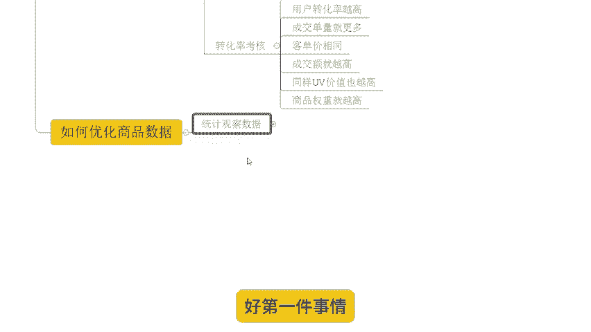
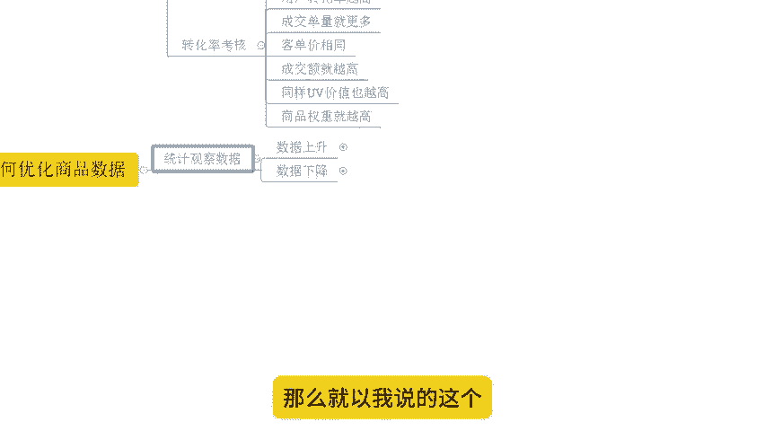
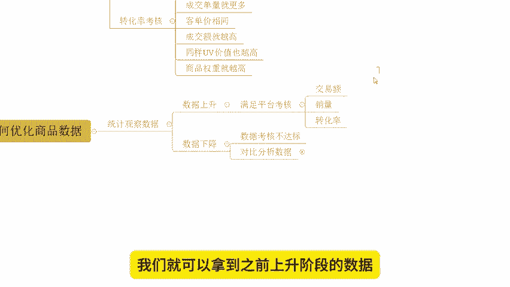

# 【拼多多运营】2024目前最新的拼多多开店新手教程！每天30分钟，零基础电商运营快速起店，实现日销千单！ - P10：10 先后开店商品数据维护注意事项 - 拼多多-运营 - BV1812mY6EFh

hello，大家好，我是西楼。今天给大家分享的内容呢是我们拼多多新手日销签单报单实操玩法中的商品数据维护注意事项的内容啊。众所周知啊。打江山容易啊，做江山难啊，对吧？那我们做店铺也一样的啊，做爆款容易。

但是你能够维持稳定，同样的也很难啊。那么在分享今天的数据维护内容之前呢，拿过矩啊，先给大家看一下近期跟着实他小伙伴的店铺数据，好不好？

可以看到像这个店铺呢，原本访客呢是零啊，是一个纯新店。那么对于新店操作呢，其实就是一个打江上的过程，对不对？那我们通过产品分析市场分析、竞争分析完成产品定位，做好市场策划，做好我们视觉策划之后。

不断的来操作优化上品的排名啊，可以看到整体数据量增长非常快速啊，从最早的零访客呢，到后面一天访客呢是9000多将解1万啊。那么一天的订单呢是1200多单啊，转化率呢13。27%非常不错。

还有像这个店铺啊。同样的也是一个新店啊，最早您访客没有数据的那从最开始呢到后期一天的访客呢做到了2万多，一天订单是3000多单，3600多单啊。那么转化率呢15。09%也是非常不错的对吧？

那么这些都是打江山啊，那我们来看看守江山啊，那怎么守。像这个店铺原本呢访客在3000多啊，原来访客是在3000多啊。那整个店铺呢。陷入了一个瓶颈，对吧？没有办法再突破了。

甚至说整体数据呢还有呈现一些下降的趋势。那怎么办呢？OK的在这种情况之下呢，我们就需要来进行所谓的首江山的操作，也就是我们的数据维护，对吧？我们需要针对到我们店铺和商品的各项数据进行分析。

找出我们数据提升不上去的一些问题，对？最终呢我们锁定的产品数据提升缓慢，陷入瓶颈的原因转化问题。那么O针对到转化呢进行不断的优化对吧？针对到我们产品的布局SQ布局啊，营销的策划等等啊，那优化之后呢。

整体的排名呢也是不断的在提升的。因为我们数据变化对吧？到后期呢一天访客呢做到了1401天的订单是2100多单转化率14。67啊，都非常不错的好吧那么这些店铺呢也都是通过自然流的方式来操作的。

这里我说一下啊，如果说你想知道如何通过自然流来测店铺来打造爆款的话，建议可以仔细观看我分享视频，好吧。

那么对于我们店铺运营的话啊，有很多的新手小白呢会遇到很多的困难啊，这个是很正常的事情。因为毕竟是一个陌生领域嘛，对吧？如果说店铺操作面有问题啊，有需要资料的呢，OK的，可以找我啊。有时间的话呢。

我也可以带着大家一起去实操做店啊。就像这些小伙伴一样的，一起能够得到更好的方法，能够完成店铺操作，得到更好的数据，好不好？😊。

那么对于我们店铺的数据维护注意事项这边的话，首先我们要搞清楚就是商品数据对我们群众的影响是哪些。

了解清楚这些东西之后，okK那我们后面呢就可以针对性的进行优化了啊。来看一看。首先第一个商品排名。

商品排名啊，这个东西呢是非常非常重要的一个东西，对吧？我们都知道啊，它的考核内容呢是我们的商品数据。

那么这个数据考核呢，从我们曝光开始，一直到成交，甚至到售后的各种数据，都是属于我们上面排名考核的内容。如果说你在这期间你的各种数据存在问题表现不好，那么你就会被淘汰。比如说你的曝光有了。

但是你呢没有点击啊，但是你呢没有转化。好，别论就会判定你获取到了很多曝光之后，没有产生价值，于是乎会限制你的曝光，会把这部分曝光给到另外的表现更好的商家。所以说在这个情况之下呢，排名就会受到影响。

那么再一个呢就是我们的点击率的考核啊，点击率考核这个东西呢其实道理就很简单了，对吧？就是我们刚讲到的那点击率越高，那平台会认为说我们产品呢用户喜爱度就越高，后续呢也会给到更多推荐权重啊。

同时呢我们商品数据考核中呢，如果说我们的曝光相同，点击率越高的话，那么我们的访客也越多，成交概率也就越高。我们的商品权重也就越高啊，同时呢在销量考核上面呢，okK了。我们的销量考核呢包含了多个维度。

包括了我们的单量。😊。

成交额UV价值单量里面呢又包含了我们更多的数据啊，比如说我们出单量啊，这是最直接的考核数据，对不对？那销量越多呢，那么在我们整个的平台来看，也就代表着我们的市场认可度越高，市场体量也就越大啊。

那么同时呢我们产品的这个受众群体啊，它会对我们产品更加喜欢啊，或者是我们的市场需求会更高，从而呢得到更多推荐。

再呢就是我们的交易额对吧？成交额啊，那成交额呢是除了销量合额之外呢，另外一个非常重要的一个数据。如果说平台只考核我们的销量，对吧？就会导致一个问题，就是低价的永远是比高价的有优势。所以说在考核过程中呢。

除了销量，它还会考核交易额。那么针对经性的进行这个排名的综合计算，对吧？你既要有不错的销量又要有不错的交易额。那如果说你的销量没有别人高。但是你的交易额比人高的话。

那么也会在某一个啊考核上你是更加优秀的，从而带来更好的排名，对不对？那同时呢成交额里面还包含到我们的客单价的考核，那相同产品呢对吧？客单价越高，那我们认为产品的产出也就越大，啊产品的这个价值也就越大。

那可能带来的数据呢也会更好。当然呢前提条件是转化率相同啊，那再一个呢就是我们的UV价值，对吧？销售的考核呢是包含了很多维度嘛？刚刚也说过的吧？UV价值也是其中一个啊。

那么UV价值呢及我们的商品销这个交易额相同的情况之下啊啊那么。😊。

我们的排名也要进行区分对吧？销量跟这个交易额都相同啊，那它要区分呢？怎么区分呢？那访客越少，我们的交易额相同的话，那我们的UV价值也就越高。UV就是我们的访客量啊访问量啊。所以这种情况之下呢。

平台就可以通过UV价值来判断我们的流量利用率啊，那么流量利用率越高的UV价值越高。那么你的排名就可以很考前所以说那我们想要去达成到更好的产品的排名UV价值也是必须要去维护的一个东西啊。

最后呢就是我们的转化率考核呢转化率考核的话，这个东西跟我们的点击率差不多，对吧？相同的访客进店相同数据的访客进店。那么转化率越高的话，成交的单量也就越多。客单价相同的情况之下呢。

我们的成交额就越UV价值也就越高。那么我们的商品权重也就越高。所以说它的考核呢其实在很多时候呢是相互关联的啊。那么有了这些考核的这个数据之后，我们就可以知道。

我们要去经营店铺，要去维护数据，通过哪些方式去下手了啊。OK来我们来看一看啊，如何来优化我们的上面数据。好，第一件事情呢就是观察统计数据啊，那么就以我说的这个啊这个店铺为为例啊。

它原本的访客呢也就啊3000多啊3000出头啊，那么通过这个店铺数据分析呢，我们可以关注到它的点击情况转化情况啊，用户的一个UV价值等等这些数据对吧？那它在什么时候上升的又是因为什么数据下降的。

那么在这个阶段的数据变化什么样子，我们可以进行统计统计完成之后呢，我们就可以知道哪些数据达到什么样的一个数据情况，我们的排名会上升，我们的访客会上升，哪些数据下降下降到什么样的程度，我们的数据可以下降。

那我们就努力维护到这个数据呢？一直处于可以保证我们整个店铺访客上升的一个状态。

啊，那么我们展开来说一说啊，举个例子。

数据上升对吧？那么数据上升呢一定是我们的各项数据满足平台考核。比如说我们产品的。

Yeah。这个。

交易额啊，我们产品的销量。我们产品的转化率对吧？等等。那么数据上升的时候，这些数据分别的增长幅度是多少，他们的数据量是多少，我们记录下来。那么再到对应的呈现出下降的一个阶段的时候。

那么我们可以认为是当前我们店铺的各项数据指标已经没有办法达成平台考核标准啊，导致我们数据下降。所以这个时候呢我们就可以拿到之前上升阶段的数据作为参考来进行对比分析啊，怎么个对比分析呢？

比如说我们在数据下降前几天，我们就针对单品的这些数据统计下来之后来进行分析，对吧？那么对比一下它的转化率，它的成交额，它的客单价它的优惠价值，店铺评分商品评分活动情况。

同行的一些呃活动情况等等这些东西的对比，对吧？如果说是内部原因，我们自己的转化问题。那么我们就要想办法去优化我们的转化率。如果是我们的交易额不够。

我们要想办法提升我们的交易额。如果是UV价值低了，那我们要想办法去提高我们的客单价来促进UV价值的增长。如果说是我们店铺呢受到了评分的影响，那我们要想办法去引导更多的好评，完成提升。

🎼如果是受到节日活动的影响，O那么这个可能是大盘波动啊，属于正常现象。但如果是受到同行提报活动，导致我们产品流失流量啊，那么这个情况下呢，我们就要积极的去做出对应的一些活动策划来进行面对。

来守住我们的江山好吧O啊，那么以上呢就是我们商品数据维护的注意事项的内容啊。那么这个内容呢相对来说可能会更加的复杂更加的一些呃难以操作一点啊。那如果大家在操作过程中呢。

哪里不清楚的呢欢迎大家跟我交流沟通啊，需要资料的啊，也可以找我好吧？还是那句话，如果说你自己呢不具备运营能力，想要做好店铺的话，也可以像这些小伙伴一样呢找我一起跟着实操，对吧？

那我也可以带着你一起有到更加完整的操作方法，更加细节的操作方式来帮助店铺呢得到更好的一个结果，好吧？O那么今天的视频呢就到这里，我们下次再见，拜拜。

