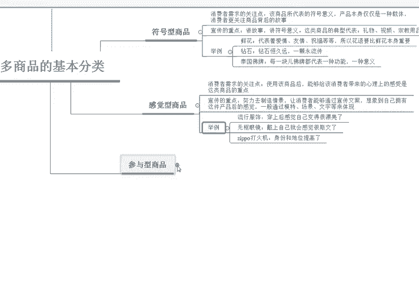

# 【拼多多运营】2024目前最新的拼多多开店新手教程！每天30分钟，零基础电商运营快速起店，实现日销千单！ - P11：11 拼多多商品基本分类技巧 - 拼多多-运营 - BV1812mY6EFh

各位同学大家好，欢迎大家来到我的拼多多基础系列课程。接下来将由我巨黄教育的西楼老师带你们了解一下呃，一个新手操作拼多多所需要学习的内容。那么我们的课程呢总共分为整体的26节。

那么我们今天要学习的呢是拼多多的呃基础的商品分类。

在拼多多里面呢，基础的商品分类总共分为四大类。首先第一个是功能性的商品。第二个是符号型的商品。第三个是感觉型的商品。第四个是参与型的商品。那么分别拿这四种不同类型的商品都有哪些特性呢啊。

那么啊我们接下来就来详细的看一下。首先第一个功能性的商品。功能性的商品呢，消费者的一个需求关注点是这个商品能不能比竞争对手更快更好、更加有效的具备某一个方面的功能啊，我们在进行推广的过程中。

所需要重点去跟进的就是我们的产品能不能比竞品更好更快更有效啊，举一个比较简单的例子啊，比如说我们平时在使用的洗衣机啊，洗衣机的功能呢可以更快更好更有效的把衣服洗的更更加的干净。

那电冰箱可以更加快速的冷冻保鲜或者是冷藏。那保温杯它可以实现一个长久保温，类似于这样的商品都属于一个功能性的商品。

那么第二种商品类型呢叫做符号型的商品。符号型的商品呢，它有一个比较明显的特点。消费者背后的一个关注呢，就是说这个商品所代表的。

比较抽象化的一个意义。产品本身仅仅是一种载体，消费者更加关注商品背后的一个故事。所以说我们在呃宣传这一类产产品的时候啊，重点要去讲故事，讲符号背后的意义。这类商品的典型代表呢。

就比如说啊礼物还有视频或者是宗教用品等等啊，比如说。

鲜花代表着爱情或者友情或者是祝福。所以说我们在推广鲜花类的产品的时候，花语往往要比鲜花本身更加的重要啊。那又比如说我们的钻石啊，钻石代表着爱情啊，钻石恒久远，一颗永流传啊，那泰国的这些佛牌啊。

每一块呢都是佛牌代表着一种功能，一种意义，所以说它的议价空间会非常的高。那么第三种呢是感觉型的一个商品。

感觉型的商品呢，消费者需求的关注点呢是使用了这个商品之后，能够给消费者带来心理上的感受，是这类商品的一个重点啊。我们在宣传的时候呢，需要努力的去制造一些情景。

让消费者能够通过宣传的文案想象到自己拥有这一类的商品之后呢，呃它会有一个得到什么样的一个好处，或者是他们的一个感觉。一般情况下通过模特或者是场景或者是文字来进行体现。啊，比如啊我们在呃购买衣服的时候。

就喜欢去看这个模特穿在身上是什么样的一个效果，或者是我们无框的这些眼镜，戴上之后自己就会感觉比较斯文啊，或者是zippo打打火机身份的地位啊，都相对来说会更加的提高。那么这种呢就叫做感觉型的商品。

一般情况下都适用于品牌。那么最后一种呢叫做参与型商品，参与型商品呢就呃字面的意思就是说要让消费者。

参与进来，消费者更加关注的点呢是能够参与其中，并且获取到一定的乐趣啊。比如说我们宣传的重点呢，就是重点要突出消费者正在参与其中的场景啊，举个例子。

比如KTV那KTV呢它的这种商品呢就是属于服务欢畅的一个体验呢非常的重要。至于唱的啊消费者唱的好还是不好，那就不是我们所应该关心的事了啊，消费者呢他他们也不会去关心他们只是玩嗨了就可以啊。

那又或者说我们在呃飞猪上购买的一些旅游券啊，体验的仅仅只是旅游的过程中啊，我们所带来的一些经历啊，或者是拓展训练啊，仅仅只是为了经历那么以上呢就是在拼多多商品分类中啊。

所分类的啊总共的四大类仓啊四大类的这个商品啊，第一类功能性。第二类符号型。第三种啊感觉型，第四种参与型。那么你的产品到。

你是属于哪一种类型呢？

有想要了解更多拼多多干货内容的小伙伴，可以直接私信我。

