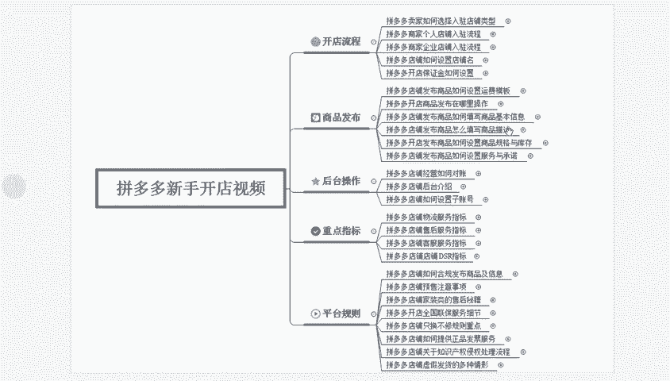
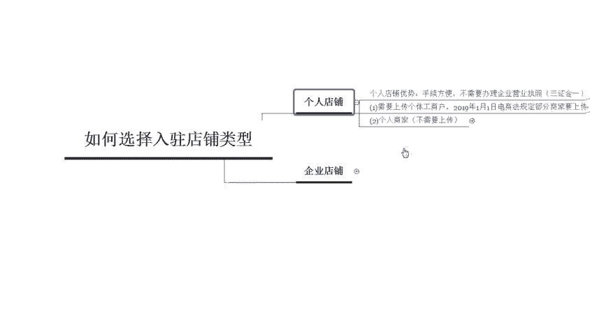
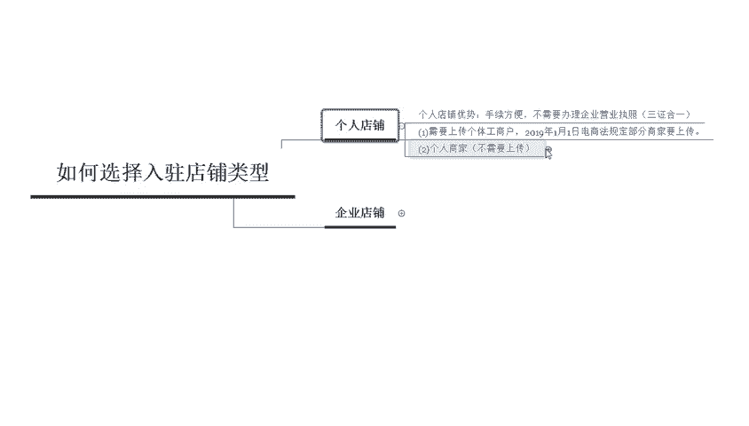
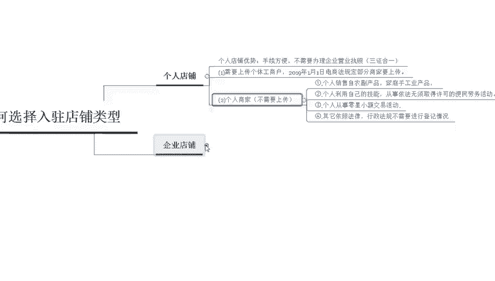
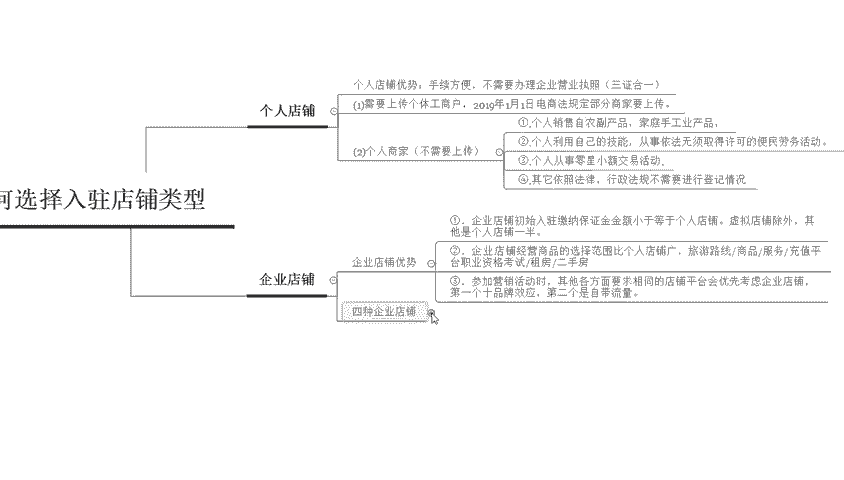
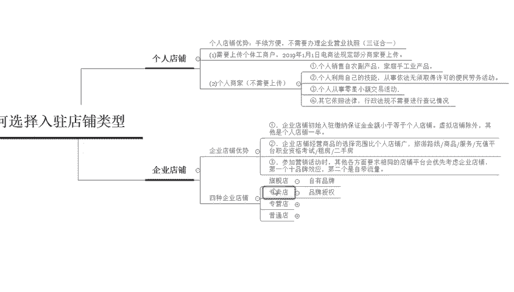
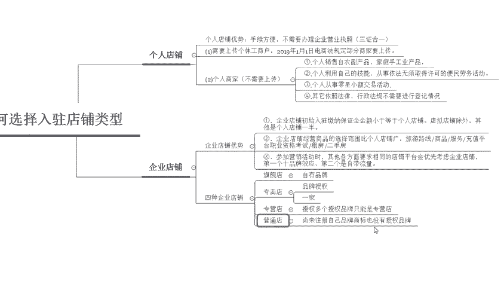
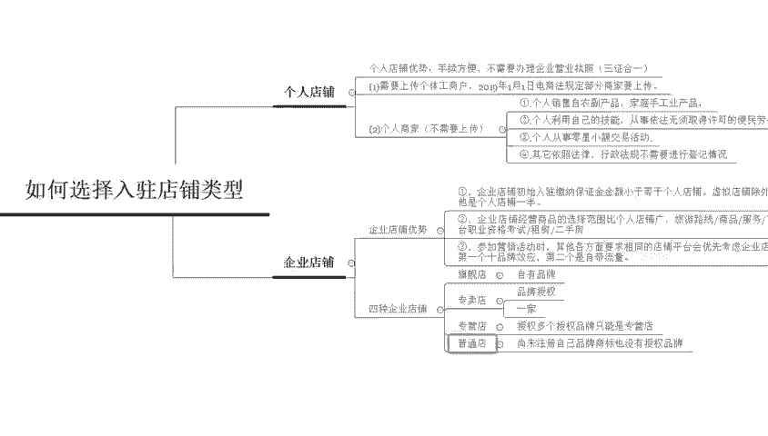

# 【拼多多运营】2024目前最新的拼多多开店新手教程！每天30分钟，零基础电商运营快速起店，实现日销千单！ - P12：12 拼多多开店入驻店铺类型 - 拼多多-运营 - BV1812mY6EFh

hello，各位小伙伴们，大家好啊。首先欢迎大家来到我的拼多多系列课堂啊，最近有很多的新手在问我不知道应该怎么样去接触拼多多啊，那么就由我去黄教育的西楼老师啊，那么今天带大家来认识一下拼多多的基础。

那么我们总体要学习的课程内容呢，总共有2十六节。那么今天给大家带来的课程内容呢是拼多多卖家如何来选择入驻的店铺类型。

在拼多多里面呢分为个人店铺和企业店铺两种类型。那么个人店铺呢，它的优势手续比较方便，不需要办理一些营业执照。比如说我们可能会需要上传三证合一的一些证件照啊，但是现在呢有一些呃比较特殊的个人店铺呢。

也是需要上传的。比如说啊需要上传这个个体工商户啊，这个条例呢是从19年的1月1号，电商法规定的部分商家要需要上传。那么有一些商家不需要上传，都针对于哪些类目是不需要上传这个营业执照的呢？

首先第一个个人销售的。

农副产品或者家庭手工产品是不需要营业执照的。第二个是个人利用自己的技能从事或者依法无无需获得许可的这些呃产品也是不需要的。那么第三个呢是个人从事的零星的小额交易活动，也是不需要这个营业执照的啊。

那么第四个呢是依照其他的法律行政法规，不需要登记的情况。那么这四种情况呢是不需要上传营业执照的。所以相对来说大部分的个人店铺呢啊手续，相对来说都比较方便。那么如何来入驻企业店铺呢。

企业店铺呢它有比较明显的一个优势。

企业店铺初始的一个入住缴纳的保证金呢是要比个人店铺更小的。大部分的个人店铺呢都需要达到啊2000或者5000啊，一般情况下都是2000左右啊，但是企业店铺呢只需要1000啊，虚拟店铺除外。

其余的都是个人店铺的一半。那么企业店铺经营。第二个优势呢是经营的一个范围比个人店铺比较广啊，旅游线路或者是商品服务啊，充值平台或者是租房和二手房都必须要是企业店铺。那么第三种呢是参加营销活动的时候。

其他各方面的要求都是等同于店铺平台会优先考虑企业店铺。所以说第一个啊是品牌的这个效应。第二个是企业店铺会自带流量。那么企业店铺呢又分为四种类型啊，分别是旗舰店、专卖店、专营店和普通的企业店铺。

那么旗舰店呢指的就是我们有自己的自有品牌的。那么专卖店呢是指啊我们有特定的这个品牌授权的，而且是只有一家品牌。

啊，一家品牌。啊，那么专营店呢是多家品牌授权的，只能是专营店来进行呃操作啊，那么普通店铺呢就是上没有自己的品牌商标，也没有授权品牌的啊，叫做普通的企业店铺。那么以上呢就是我们对于拼多多啊。

如何来选择店铺类型的一些基础的认识。那大家学到了吗？啊，感谢大家。

你不用一遍就是一定要还。我会定期分享更多的干货内容，私信我，有福利大礼包零球。

