# 【拼多多运营】2024目前最新的拼多多开店新手教程！每天30分钟，零基础电商运营快速起店，实现日销千单！ - P13：13 新手开店如何正确认识拼多多 - 拼多多-运营 - BV1812mY6EFh

各位同学大家好，欢迎大家来到我的拼多多基础系列课程。接下来将由我巨黄教育的西楼老师带领你们了解一下一个新手在操作拼多多时候所需要操作的内容啊，那么我们的课程呢总共分为26节。

那么今天我们要学习的呢是拼多多的一些基础认识。

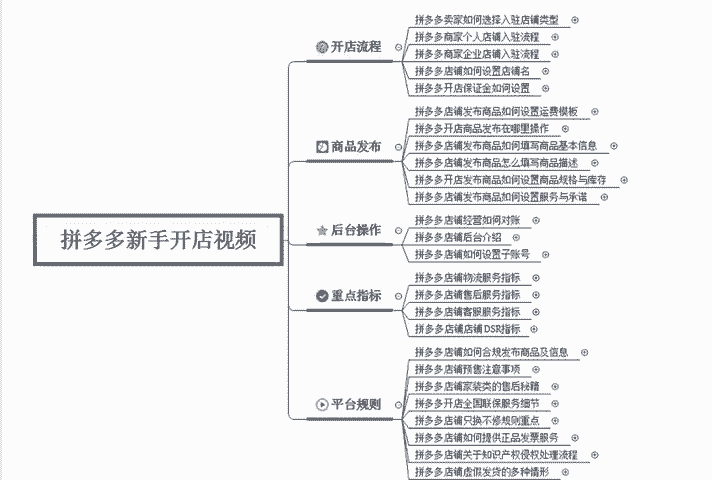

啊，今天我先来大家正确的了解一下拼多多啊，很多人呢对于拼多多是拼多多呃，对于这个拼多多的了解呢是有一定的误区的啊。那么拼多多首先你要先知道在拼多多上卖货，你要卖给哪些人。

所以我们第一步要定位的就是拼多多的人群属性。

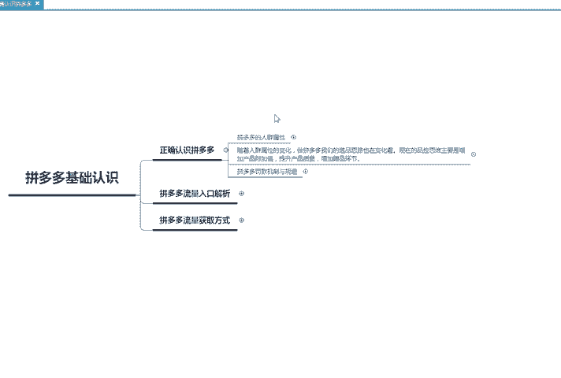

那么并其实在做拼多多的时候呢，并不是所有的产品都适用于拼多多的。像比如说一些高价的产品，像一些啊比较名牌的一些呃家具啊，这种产品呢是不太符合于拼多多的啊，因为拼多多在18年之前呢。

拼多多主要的一个属性人群呢都是来源于四五线城市的，或者是城乡结合部的这些人群，消费能力相对来说都会比较低。虽然现在拼多多的一个市场有上有这个上浮啊，很多的这个二线城市也开始来拼多多去进行购物。

但是说它整体的一个消费情况还是说比较差的。它主要针对的一个人群呢是第一个啊从未网购的人群。第二个人群属性呢大部分都集中于四五线城市，或者是城乡结合部的人群。第3个，他们的消费能力都比较低，都特别的差啊。

第四个，年龄层相对来说啊比较偏高啊，也就是我们所说的中国大妈，可能买的都买在拼。多多上购物会比较多。那么随着拼多多不断的一个发展呢，现在拼多多的一个人群属性呢慢慢的跟淘宝其中的一部分人群相重合了啊。

就是说呃现在的这个人群呢有一定情况的一些转变啊，现在呢啊主要的转变呢，在以下四点。第一个有网购经验和用户大量流入啊，淘系的一些用户啊，或者是折800的一些低价平台的这些用户呢。

导致我们平台的这个售后急剧增加。你们可以发现你118年的时候做这个拼多多和19年做拼多多和2020年做拼多多完全不是一样的概念。我们的售后服务呢越来呃售后的这些问题呢越来越多。

那么第二个呢是一二线城市的一些用户的啊流入。同样的消费能力并不是太不高的啊，有有可能有一些呃消费者呢，它都是属于四五线城市。但是说在这个一二线城市里面去打工。啊，所以说他们的审美呢相对来说比。

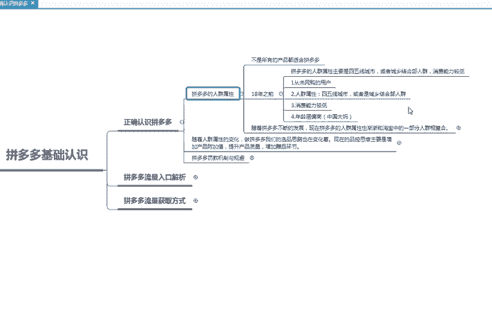

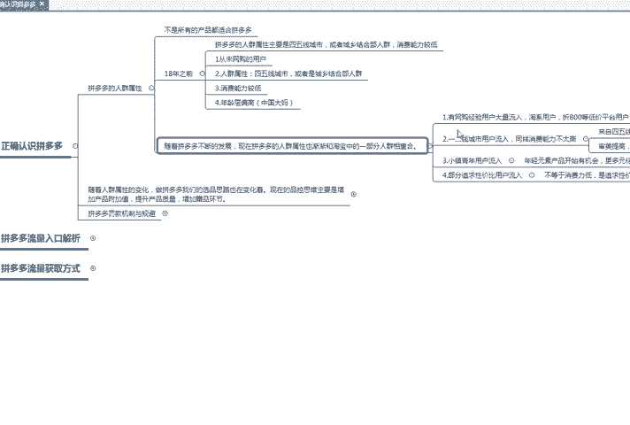

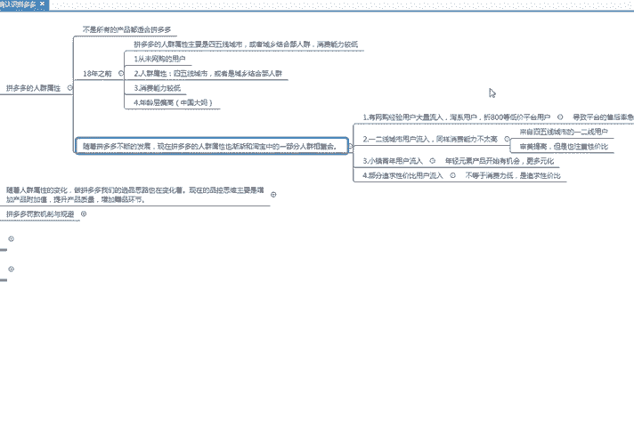

较高啊，但是呢同时也比较注重于性价比。这个就是我们高价产品或者是终端价格产品的一些机会。也就是说你现在做拼多多是有非常大的机会的那么第三个呢是小镇青年的这些用户流入啊。

年轻化的一些元素的产品呢慢慢的开始有机会更加的多元化，会有更多的展现。那第四部分的人群呢是部分追求性价比的用户开始流入，不等于消费能力低。他们要求的是性价比。只要这个产品，我觉得在购买的时候觉得值。

那么。我就会去买账啊，他们追求的是性价比，而不是一味的低价了。所以说现在整体拼多多运营上面的一些结构呢，并不是说啊你的产品足够低价或者是你的产品啊非常高价啊，都适用于拼多多啊，这些是不现实的。

拼多多里面最应该注重的是性价比。所以说随着人群属性的一些变化呢，我们做拼多多的选品思路也在变化的。现在的一个品控思维呢，主要是增加产品的附加值，提高产品的质量，增加我们的赠品环节。

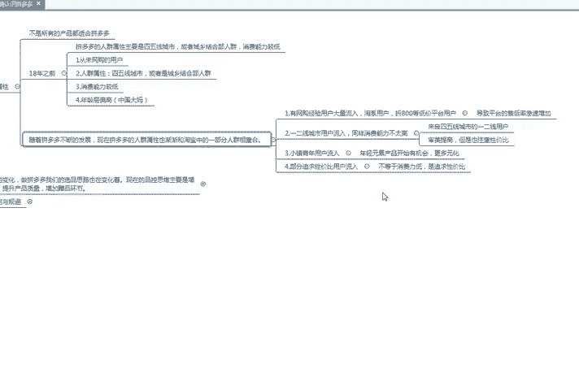

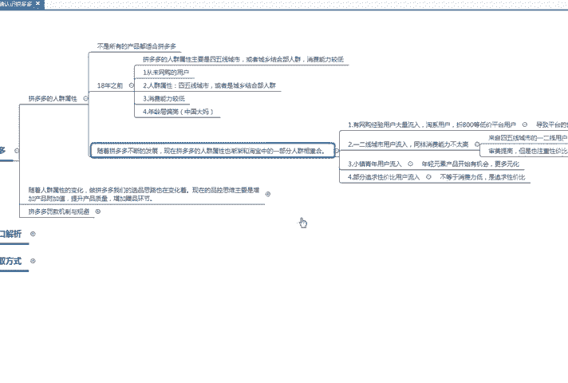

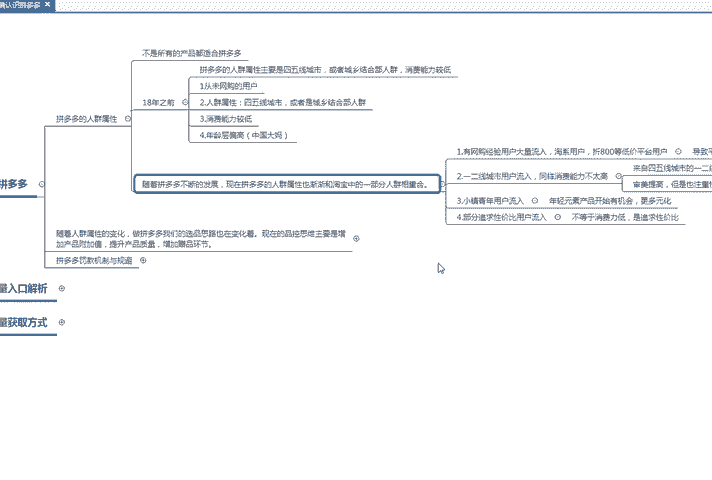

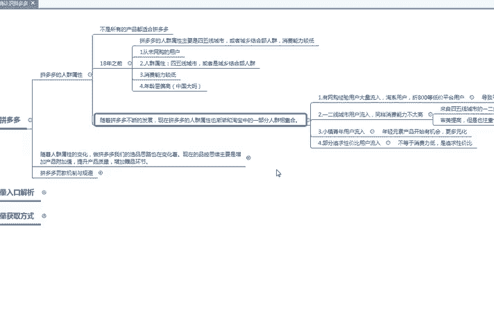

啊，比如我们在选择新品的时候啊，提如何来提升产品的一个品质呢？第一个啊，小二会进行抽检。竟然抽检的一个产品呢，就是你的店铺里面动态评分低于4。3的啊，有可能有一些新手还不太了解什么是动态评分。

那么在之后的课程里面，我会给大家详细的讲到什么叫做拼多多的售后和拼多多的动态评分。那么第二个啊DSR比较低，也就是动态评分比较低的店铺会直接被屏蔽。那么动态评分比较高的商品，也就是我们第三个点啊。

动态评分比较高的商品在活动和资源位都更加具有优势。那么第四个点，平台对于呃对于这个新品的一些啊品质竞价啊，鼓励提升品质啊，不再盲目的去做低价。所以说我们现在中高端的产品，也是会有很多的一个展现量的。

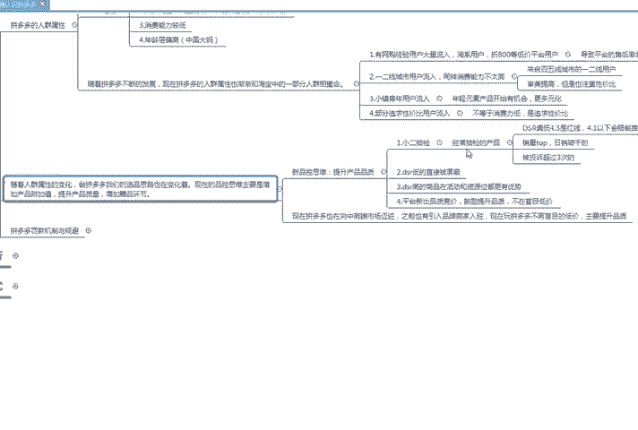

啊，那么现在的一个拼多多呢也在向中高端的一个市场迈进。之前呢也有一些品牌商家入驻。所以说现在玩拼多多不再是盲目的低价，主要以提升品质为主啊，那么呃以上呢就是对于拼多多最正确的一个认识。那么你学到了吗？

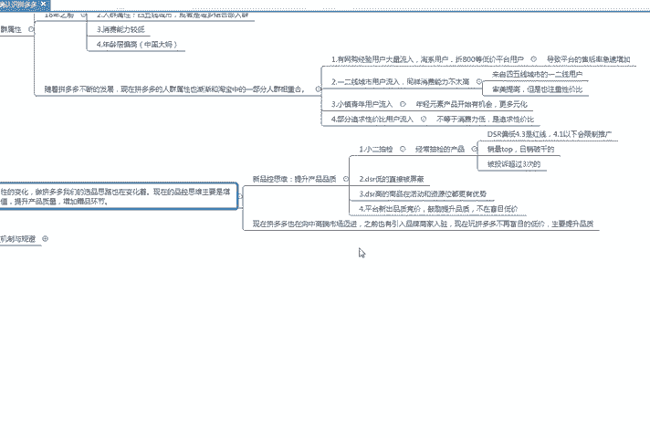

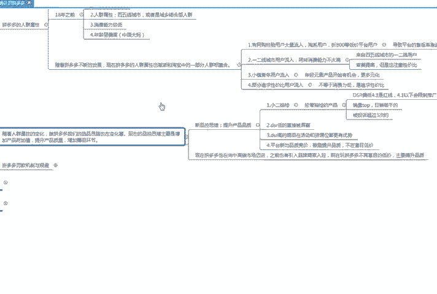

关注我啊，学习更多的这个拼多多知识啊，想要了解更多拼多多的干货的啊，可以直接私信我。

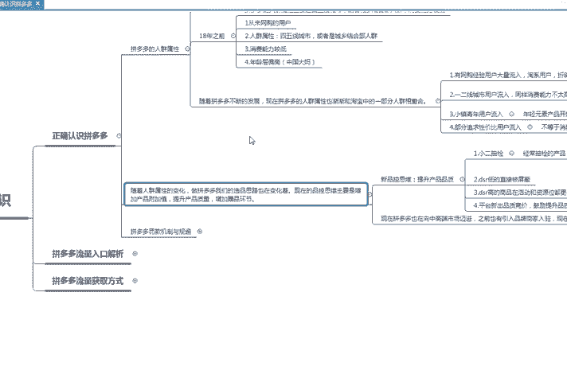