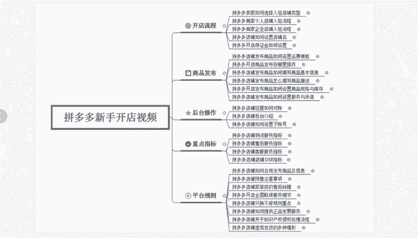
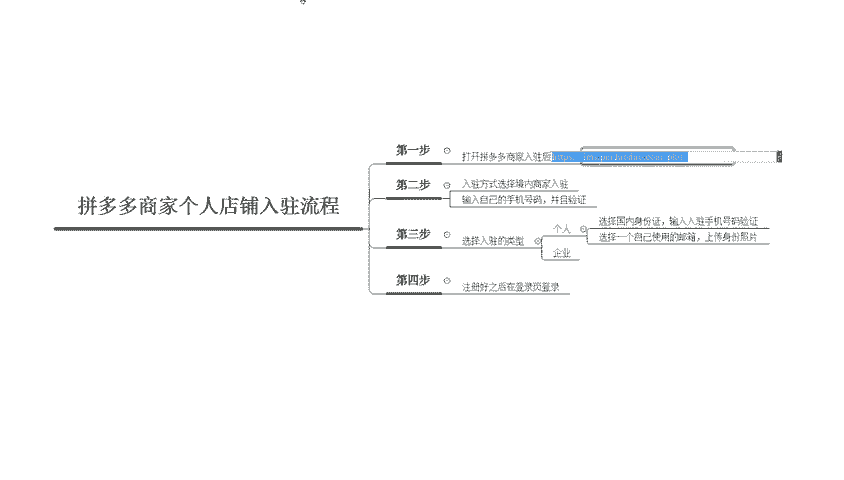
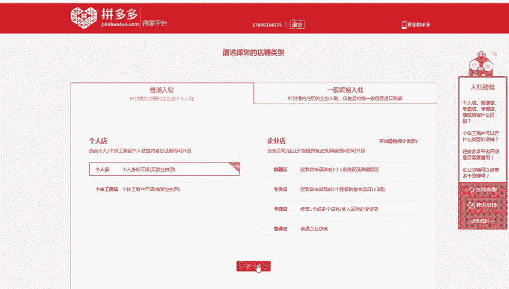
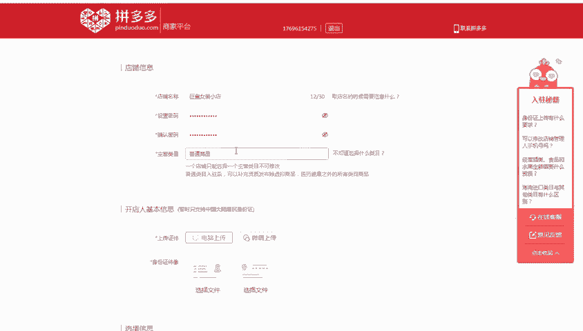
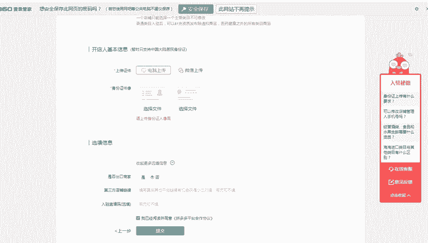
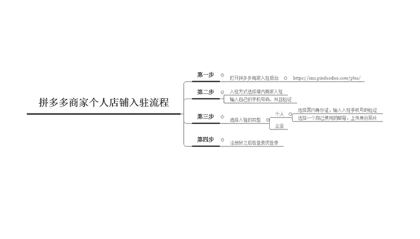

# 【拼多多运营】2024目前最新的拼多多开店新手教程！每天30分钟，零基础电商运营快速起店，实现日销千单！ - P14：14 拼多多个人店铺入驻流程 - 拼多多-运营 - BV1812mY6EFh

hello，各位小伙伴们，大家好啊。首先欢迎大家来到我的拼多多系列课堂啊，很多新手呢因为之前跟我反映不知道应该怎么样去接触拼多多啊。

那么呃我们的课程呢啊今天主要带大家来认识一下拼多多商家个人店铺的一个入驻流程啊，我是巨黄教育的西楼老师。我们的课程总共是分为二十6节的啊，那么我们今天呢就先来认识一下最基础的如何来开店。

首先第一步呢，我们需要打开拼多多的一个商家入驻后台，那么就是这一个链接啊，那如果说有的小伙伴不知道去哪里找这个链接的话，你直接在百度里面搜索也可以。

那么打开这个链接之后呢，大家就会进入到这个页面。这个页面呢需要填写一个手机号码，那么大家填写自己的手机号码就可以了。那么输入手机号码进入之后啊，填写完手机号码，点击0元入住。

进入后台呢就是这样的一个页面。我们可以选择普通入住或者是一般贸易入驻。普通入驻呢就是适用于我们个人在开店的时候呃，我们大部分人呢是没有这个个体工商的这个营业执照的。我们只需要开这个个人店就可以了。

点击这个个人店，点击下一步。

那么这个呢就进入到了我们第二个步骤。那第二个步骤呢是需要你选择一个你的店铺名称，也就是说你的店铺名字叫什么？比如说我们随便起1个123456啊，设置的这个密码。密码呢随便设置一个。

我们的这个店铺名称呢不能出现企业或者是旗舰店的性质。那么我们就直接呃填写一个女装小店123。呃，或者是。巨皇女装小店。那么这个密码呢必须要有大写和小写。呃，主营的类目。

如果说你不知道选什么样的一个类目的话，你可以先随便选一个。因为我们在后期呢是会有一次的修改类目的一个机会啊。当然记记住只有一次啊，我们先选择这个普通的一个商品那后面所需要的一些信息呢是开店人的基本信息。

所以说我们需要上传自己的一个身份证件啊，然后最后填选我们的一个基础的一些信息啊。我们一般情况下都是不需要出口的，所以选择呃，是否为出口商家选择否就可以啊。第三部第三方店铺的这个链接，也暂时先不需要填。

后期我们可以自己来进行填写啊，入选的邀请码也可以不填，直接点击同意，然后进行提交。

那么以上呢就是我们在注册店铺的时候所需要操作的一些内容。

那么整体的步骤呢总共就是这四步，第一步打开链接。第二步输入我们选择的这个商家入驻的一个类型，填选自己的手机号啊。第三步，选择自己呃开店的一个类型，并且上传我们的身份证啊，身份证的一些证件啊。

那第四步注册好之后，直接在后台去进行登录就可以。那么。相信很多的小伙伴都已经知道怎么样来啊开通拼多多的商家店了啊，那么我会定期的在这里更新更多的一些干货内容，私信我会有福利大礼包零球。

