# 【拼多多运营】2024目前最新的拼多多开店新手教程！每天30分钟，零基础电商运营快速起店，实现日销千单！ - P15：15 拼多多企业店铺入驻流程 - 拼多多-运营 - BV1812mY6EFh

hello，各位小伙伴们，大家好啊，首先欢迎大家来到我的拼多多系列课堂啊，因为之前呢我们已经讲过了啊两节的一个课程。那么今天就由我巨皇教育的西楼老师带大家认识一下拼多多的第三节课程。

拼多多商家企业店铺入驻的一些流程啊，那么我们总体的一个课程呢是二十六节。那么今天呢是第三节。好，首先呢在拼多多的上呃企业店铺入驻的时候呢，说我们先需要了解的是企业入驻到底需要哪些材料。

那么首先呢它需要企业的法定代表人和我们店铺的管理人的身份证呃身份证的这个原证件照。也就是说我们身份证的正反面照片啊，然后这个企业的这个法人和管理人可以是同一个人啊。

那么第二个我们所需要的材料呢是不同的店铺所需要的材料是不一样的。因为企拼多多里面的企业店铺呢是分为四种类型的啊，第一种呢是叫做这个旗舰店。那么旗舰店呢所需要的一个资料呢，除了这个品牌的一个授权书啊。

这个旗舰店里面呢有非常多的类型的这个品牌。如果说你是这个自由品牌。那么你的授权书是不需要的。那么其他的三样，像这个企业的三证，还有质检报告，还有这个商标啊，以及开户证明，也就是我们的对公账户啊。

都是有需要的。那如果说你开的旗舰店呢是经营一个授权品牌旗舰店的话，那么四个证件全部都是需要的。那么如果说你开的是卖场类型的这个品牌的旗舰店。

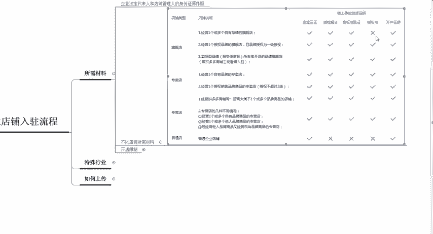

那么同样也是四个呃证件，全部都是需要的啊。那么另外一个就是专卖店。凡是你在开专卖店的时候，就是说这四个证件啊全部都是有需要的啊，专卖店以及专营店啊，大家注意了啊，企业的三证以及质检报告。

还有商标的注册证以及授权书，还有开户证明啊，在专卖店和专营店全部都是需要的。旗舰店如果说你自己是自由品牌，那么不需要授权书。那么如果大家开通的是啊普通的企业店铺，就是说没有自己的一个授权品牌的。

只是仅仅很普通的一个商贸的旗舰呃商贸的这个企业店啊，那么O啊，我们就只需要企业的一个三证，还有一个开户证明，其他的什么东西都不需要了。

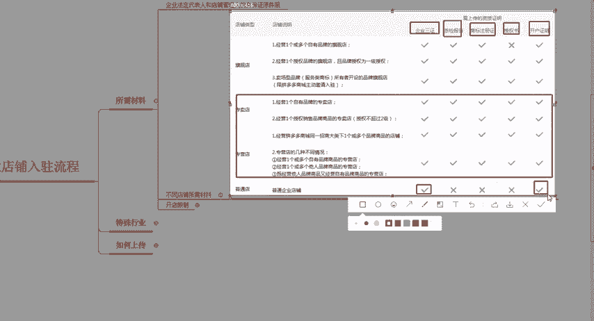

好，这个呢就是我们所需要的一些材料啊，如何来进行呃。啊，如何来进行这个区分啊，那么在开店的时候呢，其实也是有一些限制的啊，其实也是有一些限制。并不是说在拼多多里面你可以无限制的开店啊。

同一个企业店铺里面就是说你的这个营业执照下面呢，你可以开设5家普通的这个店铺啊，也就是我们普通的这这个企业店可以开5家啊，那么另外像上面的这三种旗舰店专卖店和专营店，同时也可以同时开5家啊。

当然并不是说每一种开5家啊，每一种开5家呢就是15个店了，是旗舰店专卖店和专营店加起来，总共5家，然后再加上普通店的5家，总共是10家店铺啊，那这个呢就是我们企业入驻的时候所需要的一些材料啊。

那么第二个部分呢，我们来了解一下啊，有一些在拼多多里面的一些特殊行业啊，特殊行业呢所需要的不同的一些啊材料，应该怎么样去区分啊。那么首先第一个呢比较特殊的就是书籍类目啊，书籍类目呢是需要有这个。

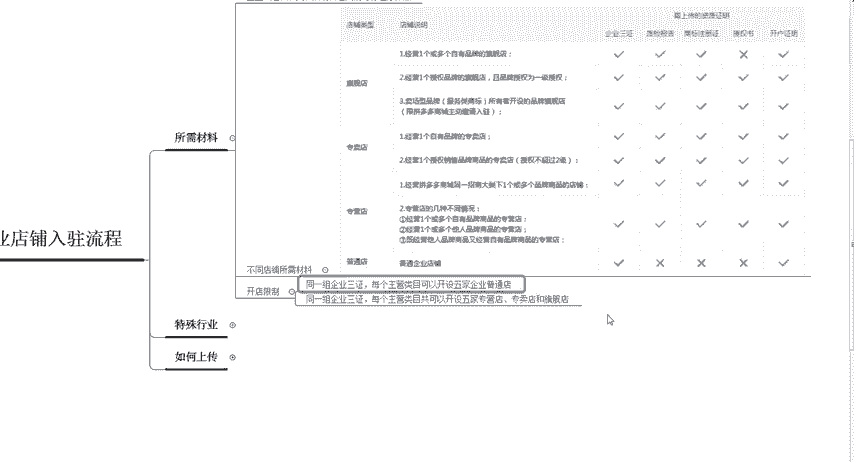

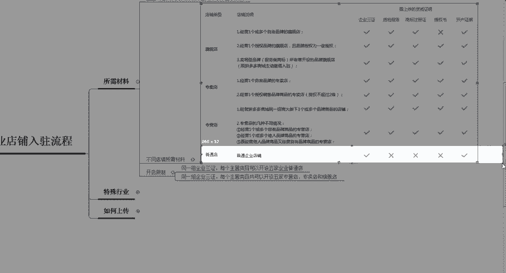

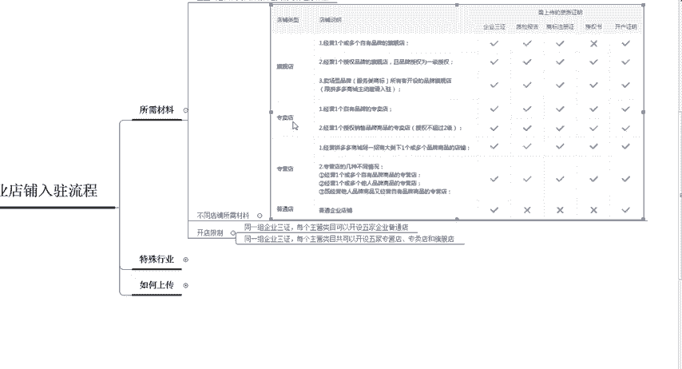

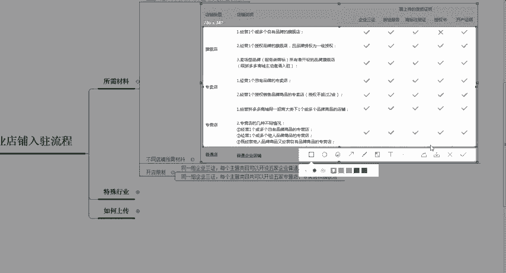

啊，商品提交这个营业执照和出版和出版物许可的呃许可证，然后呢去进行备案啊，需要在店铺的后台去进行提交。稍后呢我会告诉你们在哪里去进行提交。那么如果你是卖书籍的啊，你要做这个个人店。

那么需要你有个体的一个工商营业呃工商个体工商户的一个营业执照啊，还有这个出版物的许可证啊，如果是企业的话，那么需要你提供这个呃入住的企业对应的一个出版物的许可证啊，所以说书籍类目相对来说是比较麻烦的啊。

那么最麻烦的一类是什么呢？是这个虚拟类目在虚拟类目入住的时候啊，像手机卡或者是一些点券充值，手机话费充值等等这之类的啊，都是属于虚拟类目。那虚拟类目呢需要上传的东西就比比较多了啊。

那这个呢在店铺的后台也可以找到啊，关于这个点呢，我就不一一介绍了。那么大家可以把这一张图截下来啊。因为呃其实有很多的人是嗯不太愿意去做这种。虚拟类目的啊，所以说直接大家把这张图片啊，然后截图保存就可以。

那么接下来呢我们重点来说一下啊，第三个部分啊，第三个部分如何来上传这些营业执照啊，如何来上传这些营业执照。那么我们在创建店铺的时候啊，像这个基础的一些店铺信息啊，比如说我们普通的这个企业店啊。

会有一个商号啊，举个比较比较简单的例子。比如说深圳巨环贸易有限公司。那么我们的商号呢，就是巨黄啊，相当于是你的品牌名啊。那么如果是你的专营店的话，那么就是企业的这个商号加上类目，还有加上专营店啊。

起名呢可以叫巨皇女装啊专营店啊，企业的3号呢就是巨黄。然后类目呢是女装啊，最后加专营店三个字啊，那么专卖店呢也是一样的，品牌的名称加上你企业的商号。因为专卖店是呃需要其他的商其他的这个品牌来进行授权的。

所以说比如说我们是卖雀巢咖啡的。那么我们就可以写雀巢巨皇专卖店啊，那么如果大家做的是旗舰店啊，想要入驻旗舰店的话，那就是品牌名，加上这个类目，当然这个类目要不要都无所谓啊，然后最后加上旗舰店三个字。

那么最后得出来呢，就是巨皇旗舰店或者是巨皇女装旗舰店啊，类似于这样的一个起名，这个呢是在呃创建店铺的时候啊，那么就会让你去进行选择的。那么呃我们前面所提到的这些证件到底在哪里上传呢？啊。

首先啊我们啊看一下整体的一个上传操作啊，三证的一个上传注册店铺的时候，直接就会让你去进行填写啊，注册企业店。哭的时候。然后呢这个开户证明呢，也是在注册店铺的时候，直接就需要你填写的啊。

那么最重要的呢就是质检报告，还有商品啊商标的这个上传，还有这个授权书啊，到底应该在哪里呃上传呢啊，首先我们需要打开这个如果你入驻成功了之后，你已经是普通的企呃企业店了。那么你在这个店铺的后台。

在店铺的后台，你直接找到店铺信息啊，店铺后台这边找到店铺啊，找到店铺信息，直接点击进入之后呢，会有一个啊品品牌商标的一个上传的选项。啊，比如我们的品牌资质啊，然后你可以点击新增商标啊，如果你自有。

你是属于这个自有商标的那也就是说我们旗舰店可能是自有的一个商标，那么你就需要商上传这个商标的一些注册号。然后这个商标的这个注册证明，在你注册商标的时候呢，给到你的证书里面全部都是有的。

你直接填写就可以啊，直接填写就可以。然后这边呢有对应的一个事例啊。那么下去之后呢，大家可以详细的去看一下到底是应该怎么样去传的。

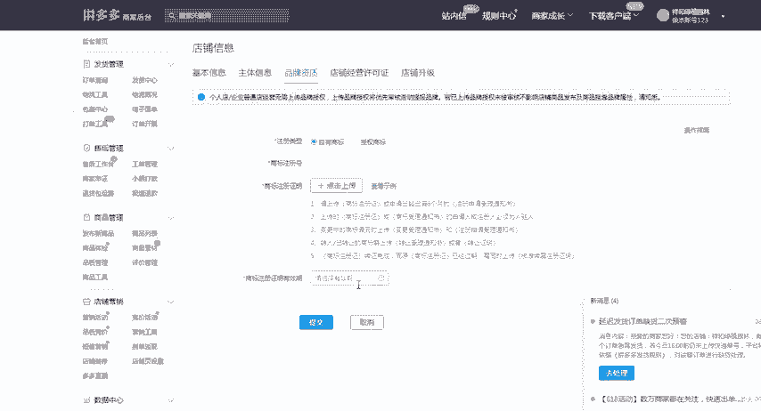

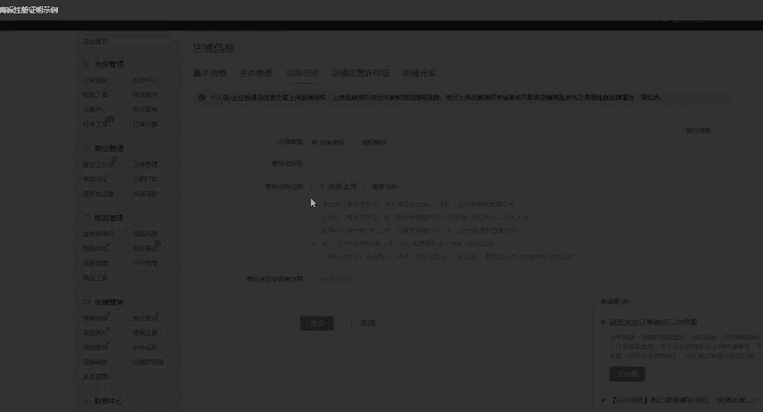

好，那么第二个呢是我们店铺经营的许可证啊，也就是我们的证件照啊。比如说啊食品类的啊食品类的，那么你就需要添加这个食品经营许可证啊，还有这个医药的出版物的啊，就是类似于我们做这个书籍的啊。

都是需要对应的一个经营许可证的啊，像这个呃虚拟商品啊，虚拟商品就需要有这个呃商务局的一个预付卡的一个备案啊，大闸蟹呢也是需要这个备份的啊。所以说有很多的类目啊，像这些特殊的类目啊。

那么都需要对应的一个啊证件啊，对应的一个证件。

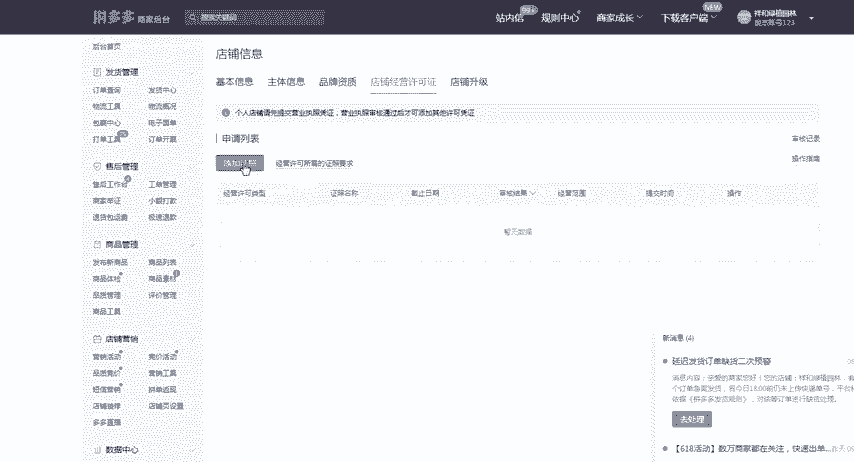

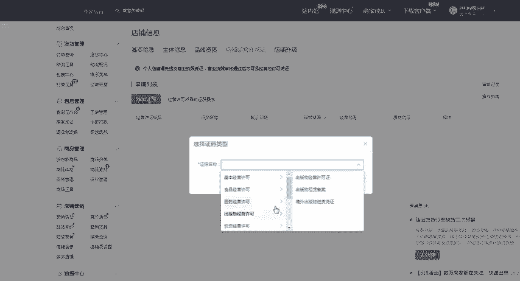

好，那最后一个呢就是类似于这个店铺升级了哈，店铺升级。如果说你个人间想要升级成企业店铺的话，那么你点击啊点击这个店铺升级，然后点击升级店铺啊，然后会有一份这个申请书啊。

然后点击确认之后上传你的法人证明就可以了啊。上传你的法人证明，然后最后会让你填写一些你的一些基础资料。啊，那么以上呢就是我们在入驻企业店铺的时候啊，拼多多商家入驻企业店铺的时候呢。

所需要注意的一些事项啊，包括我们的所需要的材料，应该怎么样去上传，还有一些特殊类目啊，都需要哪些证件啊，那么呃你们有没有学到呢啊，那如果说有同学还是不知道怎么样去啊入驻这个企业店铺的。

那么也可以直接私信我啊，而且呢我会定期的分享更多的一些干货内容啊，私信我，而且有这个福利大礼包领取哦。

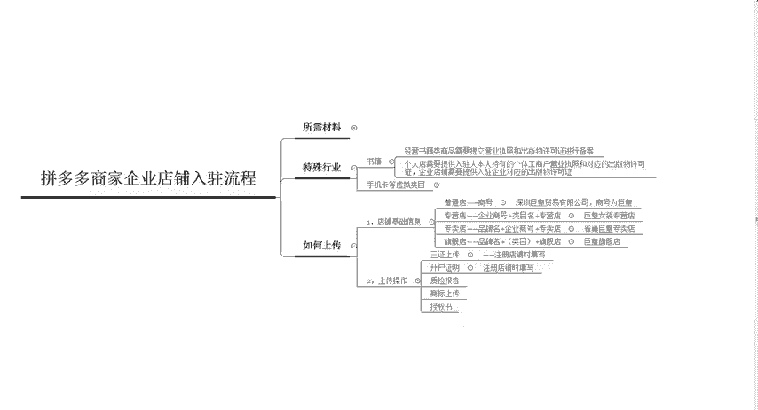