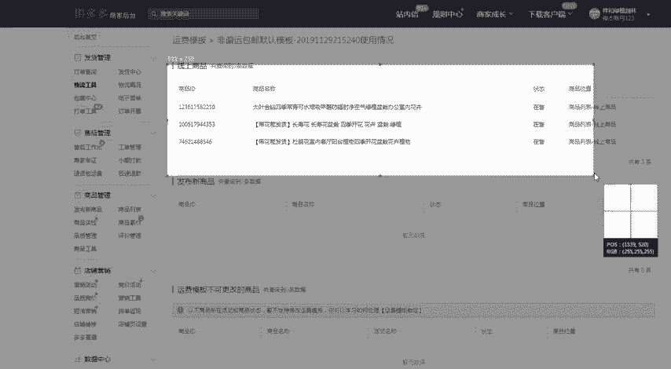
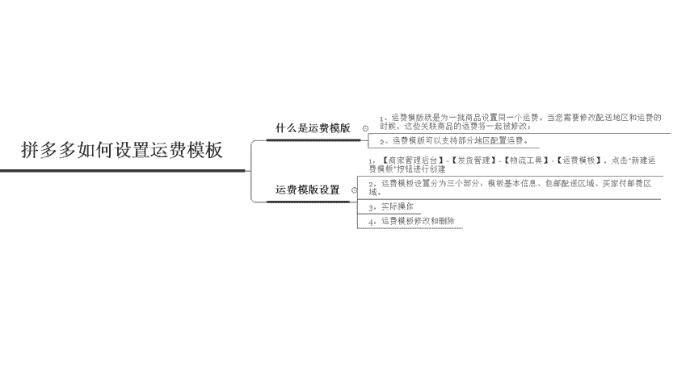

# 【拼多多运营】2024目前最新的拼多多开店新手教程！每天30分钟，零基础电商运营快速起店，实现日销千单！ - P16：16 拼多多新手开店设置运费模板 - 拼多多-运营 - BV1812mY6EFh

hello各位小伙伴们，大家好。首先欢迎大家来到我的拼多多系列课堂啊。前面的课程呢已经带大家认识了很多拼多多的一些内容。那么今天还是由我巨黄教育的西楼老师啊，带大家认识一下拼多多的另外一个基础啊。

我们的拼多多应该如何来设置运费模板。首先我们先来了解一下到底什么是运费模板啊，其实运费模板呢就是在呃一批商品啊，给同一批的这个商品呢设置同一个运费啊，当你需要修改配送地区或者是运费的时候。

那么这些关联的呃商品的运费啊，将一起被修改。那么第二个呢是运费模板可以支持部分地区的一个啊配送运费啊，那么我们的一个运费模板到底是在哪里去进行设置呢？设置的一个路径呢是在商家管理后台。

然后有一个发货管理物流工具，点击这个运费模板啊，然后新建就可以了啊。物流的一个模板呢是分为三个部分，基本信息，还有这个配送的区域啊，以及付邮费的区域啊。那么我们来实际操作一下啊。

首先我们需要打开店铺的一个后台。在店铺后台这个发货管理的页面啊，在左上角的位置，发货管理的页面呢，大家可以直接找到物流工具。然后点击物流工具进入之后，大家所看到的页面呢就是这个页面。

然后左上角点击新建运费模板。那这个模板的一个名称呢啊大家可以自己随意去填啊，但是呢不能超过50个字啊，不能超过50个字。啊，比如是。测试模板啊测试模板。然后发货的一个地址呢，我们可以自己来选填啊。

自己来选填我们的地址是哪里。那么你就真实的去填写哪里模板的类型呢，直接选择自定义模板就可以了啊，然后包配包邮配送的一个区域啊，比如说像一些啊香港和台湾啊，一般情况下默认的呢都是被勾选掉的啊。

如果说你可以往香港和台湾去配送的话，那么你就打勾啊，哪哪个地方可以配送，那么哪个地方你就直接打勾啊。那么呃这个点设置完之后，如果说你有这个顺丰包邮，那顺丰包邮在这个拼多多里面是有一定的加权的啊。

如果说你有这个顺丰啊，可以邮顺丰，那么你可以直接点击使用顺丰包邮，如果没有的话，就不要点了啊，然后第三个区域呢是买家付邮费的一个区域啊。比如在香港和台湾啊，如果说有香港的台湾想要去买你的产品的话。

那是不是你就不卖呃，是不是就不卖给人家呢。啊，这个也不一定啊，只要他愿意付邮费，那么我们还是可以给他邮的啊。比如说我们可以填写在一件以内，也就是说他买一件产品，然后可以付需要付14块钱的一个价格。

当然你也可以调高一点，比是说调成20啊，每增加一件呢增加运费20元啊，那么你可以自由来进行填写啊，你可以自由来进行填写。然后呢，指定包邮的一个件数啊，比如说他购物的购买的一个产品呢数量比较多啊。

比如说我买了5件或者是买了10件，买了3件那买够3件之后，然后给它设置一个包邮，那这些都可以由我们自己来进行定义啊，由我们自己来进行定义。那么不配送的这个区域呢啊，比如说啊像澳门啊。

我们就呃全部都不配送啊，或者是你把这个香港和台湾也添加进去，也可以啊，包括像有一些啊新疆还有青海，还有这个云南西藏啊，像有一些地区你没有办法去配送的话，那么你也可以。在上面勾选掉之后啊。

把这个打勾取消掉之后，下面就会自动匹配出来，需要花多少钱的邮费，然后去进行配送。那么设置完成之后呢，你直接点击提交就可就可以了啊。点击提交之后啊。

那么大家可以看到在这个位置呢就出现了一个测试模板的这个呃。

选项啊选项。如果说你不想要这个啊，然后你可以把它删除啊，你可以把它删除。那么啊使用的一个情况啊，就是说你要绑定哪些商品啊，在你发布宝贝的时候呢，那么你就可以直接呃选择对应的一个模板啊。

那么我们来看一下啊，比如说点击发布这个新的一个商品啊，我们随便来选一个，比如说数码家电。然后发布商品的时候呢，在下面会让你选择对应的一个啊运费模板，看到没有？我们点击这个测试模板啊，点击这个测试模板。

然后呃你选择了对应这个模板之后，然后在后台的一个位置啊，这边就会显示对应的一个使用情况，哪一些宝贝使用了你的这个模板啊，看到没有？商品ID三个链接，使用了这个模板。

所以说啊物流的一个工具呢设置来说还是比较简单的啊。那么大家现在学会了呢啊，学会了吗？啊，如果说大家还有不理解的啊，或者是不明白怎么样去操作的。那么可以私信我啊，以后呢我也会定期的啊更新一些啊分享啊。

更新分享一些干货内容啊，那么私信我呢，也有这个福利大礼包领取。

