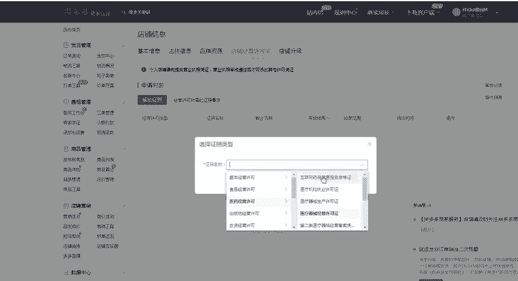

# 【拼多多运营】2024目前最新的拼多多开店新手教程！每天30分钟，零基础电商运营快速起店，实现日销千单！ - P17：17 拼多多发布商品填写商品基本信息 - 拼多多-运营 - BV1812mY6EFh

hello，各位朋友们，大家好啊，首先欢迎大家来到我的拼多多系列课堂。那么前面的课程呢已经带大家认识了非常多的拼多多的一些基础内容啊，那么我们已经操作到了如何来呃发布宝贝啊。

所以说今天的这节课程呢给大家来讲解一下，在发布宝贝的时候，如何来呃填写商品的一些基本信息啊，我们首先呢要了解到的是四个基本点啊，那首先第一个我们产品的主营类目到底应该怎么样来进行选择。

其实在拼多多发布的产品的时候呢，每个商家的入驻的时候都会有让你选择这个店铺的主营类目。如果说你的主营类目一旦确认了之后，那么你所发布的商品必须是在这个主营类目以下的啊，就是说你想要做女装。

那么你店铺的一个主营类目啊，我给大家举一个例子啊，那么当你的店铺选择对了选择了对应的一个主营类目之后呢，然后在主营类目这边啊，店铺信息里面会显示一个主营类目啊，大家可以看到。

那么现在这个店铺呢是家居生活类型的这个主营类目啊，那么每一个淘宝店铺啊，每一个这个拼多多店铺呢里面都会有呃一次修改这个主营类目的一个机会啊，所以说啊主营类目一旦确定好之后，那么我们发布商品的时候啊。

直接在哪里发布商品呢，在左侧的这个位置，有一个商品管理，点击发布新商品。那么在发布新商品的时候呢，我。

我们所需要选择的这个一级类目的一个名称，必须要是家居生活的。好，这个呢就是呃我们在实际操作过程中，大家所需要注意的东西啊。因为主营类目查看的一个地址呢是在这个商家后台，就是刚才给大家演示的一个地方。

在这个商家的这个店铺信息里面去进行查找。那么尤其是企业店铺在发布的这个商品呢，必须是在自己的企业营业执照的一个经营范围之内的啊，如果说你发布了之外的啊，可能会导致发布不了，或者是呃被限制流量。

那么呃还有一些比较特殊的店铺啊，也就是接下来要给大家讲的第二点，我们海淘的这个店铺。那海淘店铺在选择呃商家入驻的时候呢，需要选择主营类目是非海淘进口。

那么商家呢就只能卖这个国内的商品和进口的一些呃商品啊，就是说需要是在这个国内发货的啊。那么如果说非海淘商家店铺在发布商品的时候呢，要注意音标中不要出现海淘的一个字样。就是说你标题里面或。

者是你的呃主图或者详情页啊，最好就不要出现这个海淘。那么并且发布的时候呢，你必须选择普通商品和国内发货的一个进口商品啊，那么具体应该操作的时候，应该呃，到底来注意哪些呢？我们一起来看一下。

比如那现在这个类目呢是家居生活，然后选啊我随意选择一个类目。比如说鲜花速递，然后有一个呃花卉啊花卉。然后呢，我点击这个花卉，点击确认发布商品。那么这个呢就是非常正确的一个商品分类的一个选择。

那如果说你的商品分类没有选择。对，会导致在拼多多里面获取不到对应的类目流量。因为在拼多多里面，其实这个类目分配的流量是非常非常多的啊，非常非常多的啊。

那么下一节课呢我会详细的给大家讲解这个在发布的时候呢，这里面的属性都应该怎么样来填写。那么进入到这个发布页面之后呢，有一些特殊类目啊，有一些特殊类目呢。

跟我看到的我跟我们现在看到的这个页面还是不太一样的。所以说这就是我今天要给大家分享的第三个点啊，特殊商品在售卖的时候呢，需要上传特殊的一个啊资质证明啊，那这个资质证明呢需要在你的店铺后台啊。

在你商家的这个后台，然后点击店铺信息点击店铺信息之后呢，然后这边有一个店铺经营许可啊，这边你可以直接添加这个证啊证件。比如说你卖食品的，那么你需要有食品经营证啊。

然后医药的需要有这个医疗器械的这个生产许可证啊，那么这个东西呢在前面的课程已经给大家详细的分解过了啊，我这边就不再过多的去对促啊。那么呃第四个呢是选择商品的一级二级和三级以及四级类目啊。

就是我们在呃选择对应的一个类目的时候啊，发布宝贝的时候，鲜花速递就是我们的一级类目。然后这个是二级类目啊，然后呢是。

级类目和4级类目啊，所以说每一个类目下呢都会有一个细分啊，如果说你发现呃在操作过程中呢，搜索的一个展示页推荐的类目是商家选择呃是商家在这个选择主营类目下的。如果说不是主营类目下的这个明细分类啊。

就不会出现。就是说会把你的商品给屏蔽掉啊，所以说上架宝贝的时候，一定要选择好对应的类目啊，那么第二个呢是必须是主营类目下的子类目啊，主营类目下的子类目。因为有一些类目它是属于一些交叉的。比如说这个包包。

那么有这个儿童背包和这个女性所使用的这个包包啊，那么你如果说放在不同的一个类目下，那么所带来的流量效果是不一样的啊，或者是它会直接给你屏蔽掉啊，那么第三个呢是推荐的一二三级分类下会有相似的分类啊。

所以说在选择的时候呢啊要选择正确啊，要选择正确。那么以上呢就是我们在发布宝贝的时候啊，如何来填写商。品的一些基本信息啊，这个点呢是如何来选择对应的一个类目。那么大家呃还有没有不清楚的啊？

如果说啊大家有不理解的地方，那么可以直接私信我啊。我呢也会定期的分享一些更多的干货内容，私信我啊，也会有更多的啊福利大礼包零球。

