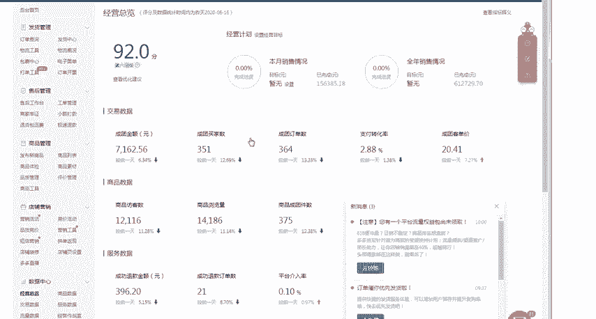
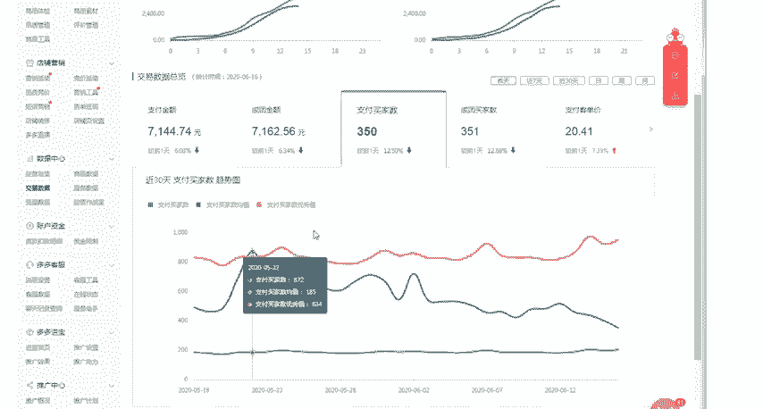

# 【拼多多运营】2024目前最新的拼多多开店新手教程！每天30分钟，零基础电商运营快速起店，实现日销千单！ - P18：18 拼多多新店如何破零钓大鱼 - 拼多多-运营 - BV1812mY6EFh

hello，各位小伙伴们们，大家好啊。首先欢迎大家来到我的拼多多系列课堂啊。那么今天啊将由我巨黄教育的西楼老师带大家认识一下拼多多如何来破零。啊，然后呢如何来用运用这个破零的一些方式呢放长线钓大鱼啊。

那么很多的人呢呃在新店铺操作的一个过程中呢，我们的新店铺没有销量，也就没有评价。所以说在前期操作的过程中呢，我们肯定是需要先给我们的产品带来一定的一个销量。那么平台呢呃又因为平呃没有销量呢。

平台是没有办法给予我们商品的一些流量扶持的。那么我们呢就需要自己去做一下这个销量和评价。那么我们其实在拼多多里面做销量的一个方法，非常的简单，我们只需要一个呃不同类型的一个账号啊，比如说这个QQ号啊。

微信号或者是拼多多的这个APP的一些账号。然后。

去进行购买，直接去进行下单就可以了。那如果是这个新店没有销量的情况下，我们就需要花费一些呃更多的一些广告费用啊。那么可以和这个快递谈一下，然后呢买一些比较好的赠品啊，比如说。

找一些鞋子啊或者是袜子比较便宜一点的，然后找身边的一些亲戚朋友们啊，然后去进行下单。在你的店铺里面下单完成之后呢，一定要发真实的一个快递。以物流的形式发送给他们啊，拼多多在查这个刷单的时候呢。

查的是比较厉害的。在这里面一定要提醒大家，最好不要用网上的一些虚拟单号啊，很容易被查啊，目前为止呢啊发真实快递是没有太大的一个问题的那这边呢也给大家一个呃做基础销量的一个方式。

那如果说你不想花费太多的一个资金或者是呃不想去找对应的一个赠品的话，可以直接找老师，我们这边呢会有这个比较可靠的一些呃做销量的一些资源啊。

保障在操作的时候呢啊不会被抓安全性呢比这个市面上的一些资源呢要更加的可靠啊。如果说呃也不会存在说什么诈骗啊退款之类的啊，我们这边是有这个担保。的啊，然后第二个呢是我们在操作店铺的一个过程中。

如何来放长线钓大鱼呢？啊，所谓的钓鱼就是在操作的时候，你要多多的利用拼单啊，当在拼多多过程操作的一个过程中呢，就是呃使操作的时候呢，直接去进行拼单来进行呃拼单完成之后呢。

然后就放在那里等待真实的买家过来拼单。那这里的钓鱼的鱼饵呢，也就是说啊上面所说的一个真实订单的地址，还有物流信息啊，使用这个真实的地址和物流信息，确保可以钓鱼成功。那么我们就需要发货啊。

所以说大家看到拼多多很多的宝贝呢都是说很多的人都在等待拼单啊，这种呢其实就是钓鱼的一种方式。当然我们这样的一个动作呢，有利有弊，有利的话，可以形成这个拼团，然后来给我们带来比较大的一个销售和利润啊。

所以说大家在操作的时候呢，一定要注意一个度。那如果说有一些很多的单不成功。那么我们就。需要自己来想办法让这些订单呢拼团成功啊，以上呢是我在操作店铺过程中的一些实际经验和经历啊。

那如果说按照这样基本的一个流程啊，每天大概几十单是没有问题的。如果说成千300单啊，那就没有办法去这样进行操作了啊，那么目前我的这个店铺呢是呃操作的一个小店铺啊。

现在已经达到了每天大概500多单的一个效果，就是使用这样的一个方式来进行操作的。

啊，我们看一下经营总览啊，看一下经营总览啊，整体呢啊因为最近是活动的一些影响，所以说只有300单啊，那正常情况下呢都是在500单到800单左右的啊，那这个支付的一个买家数啊，700单到800单左右啊。

所以说呃有任何的店铺操作上面的问题呢，老师都是实实实际际操作过来的啊，有这个很强的一些实操经验的。所以说你想要开一家挣钱的店铺呢，其实并不难难的是你们啊怎么样去运营，怎么样把这个数据量啊。

慢慢的给做起来。所以说我自我推荐一下，我刚好专业啊，你也刚好需要啊，可以直接来找我。那么我也会定期的在这里面分享更多的拼多多一些拼多多的一些干货内容。那么现在私信我，还有拼多多的福利大礼包领取啊。

那么今天给大家分享的课程呢，到这里就结束了，感谢大家的观看，再见。

