# 【拼多多运营】2024目前最新的拼多多开店新手教程！每天30分钟，零基础电商运营快速起店，实现日销千单！ - P19：19 拼多多基础标签之退货包运费 - 拼多多-运营 - BV1812mY6EFh

hello，各位朋友们，大家好。首先欢迎大家来到我的拼多多系列课堂啊，那么今天由我巨黄教育的希罗老师带大家来认识一下拼多多的基础标签啊，其实在拼多多的基础标签里面呢，重点包含三个方面啊。

第一个是退货包运费。第二个是极速退款。第三个是极速发货啊。那么今天先带啊先带大家来认识一下什么叫做退货包运费啊，以及他能给我们的店铺带来一些什么样的一个东西。

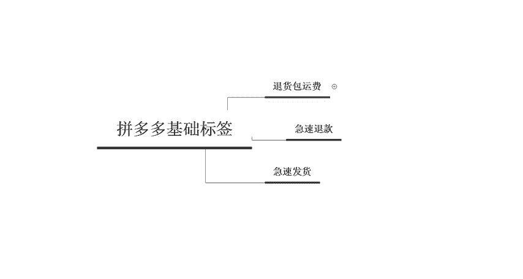

首先我们先来认识一下什么叫做退货包运费。其实就是说商家在购买这个退货包运费的一个服务之后呢，啊在服务保障期内啊正常销售符合条件的一些订单平台呢都会赠送对应的一个退货包运费的一个服务啊。

比如说客户在你的呃店铺购买了产品，他在确认收货之前完成退货啊。然后平台经过核实后啊，平台将会给这个顾客补贴。由于退货产生的一些呃单层的这个运费，运费的补贴标准呢。

按照两地多家快递公司的一个最低手动标准来确定啊，就是说他退还的一个金额呢是不固定的。

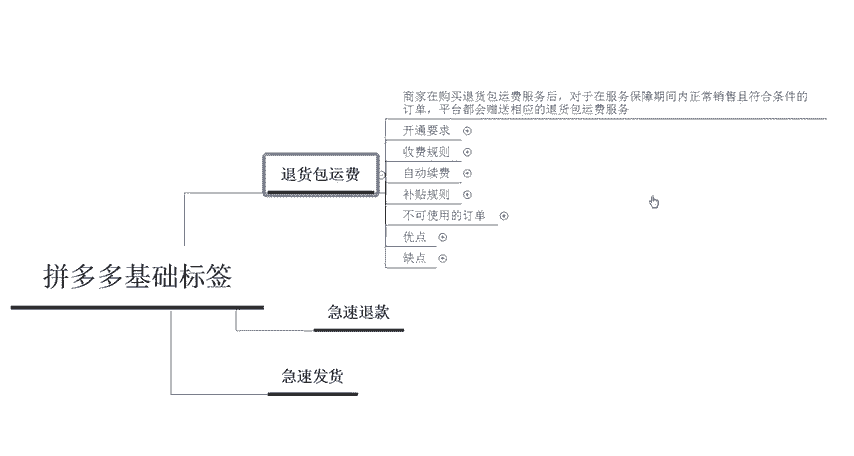

那么它到底是呃需要达到什么样的一个条件可以开通呢？啊，主要有4个方面的一个考核啊。第一个呢是呃店铺7天内支付的一个订单必须要大于15单啊，那这个基本上大部分的店铺都可以满足啊。

第二个呢是店铺90天的一个支付订单量大于100单啊。如果说90天卖不出100单的话，在拼多多里面其实就就算是很差的店铺了。所以说大部分的一个店铺呢，也都是可以满足的啊。

第三个呢是店铺近90天的一个退货退款率小于等于30%那如果说你的店铺退货退款的这个退货退款率呢已经高出20%了。那说明你这个你店铺的这个产品呢还是说有问题的。

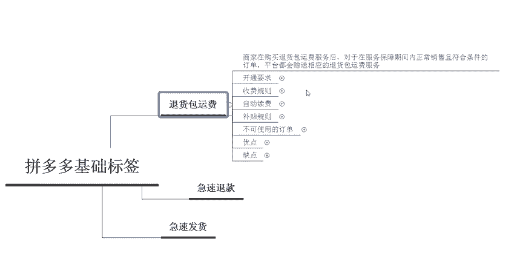

第四个呢是店铺啊，未被其他的一些因素限制。比如说你店铺的一些呃违规啊，或者是售假呀呃，导致你店铺被查啊，不要有这样的一个问题，那么基本上都是可以开通的。

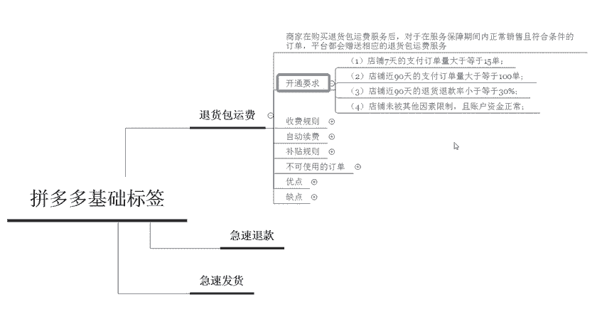

那么第三个点呢，我们来了解一下这个退货包运费的一个收费的规则啊，其实它是按照周来收费的。就是说每一周啊每一个星期它都会收取固定的一些呃服务费。因为不同的一个服务呢，周支付的一个服务金额可能是不一样的啊。

而且这个东西跟你店铺的一个退款率也是有相关性的。如果说你店铺里面的退款率比较高，那么收取的服务费可能就会更高一些啊，就是说你开通了之后呢，它每周会有一个自动续费啊，就是说在每周的周四啊。

周四的零点到周四的中午12点呃，12点，这期间啊，它就会直接自动续费。

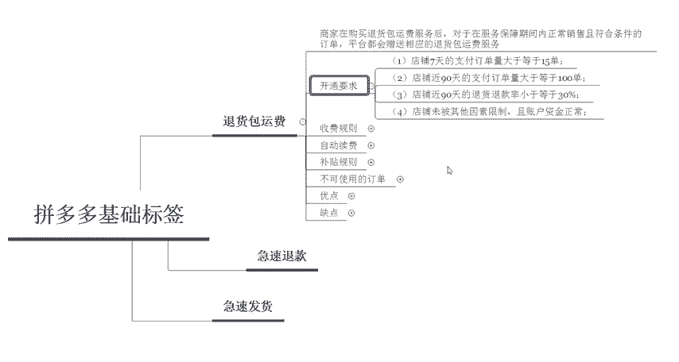

那么有的同学就会问啊，这个东西到底是怎么样来进行补贴呢？是不是每一个订单我都需要补这么多钱啊呃，这个是不对的啊，是也。

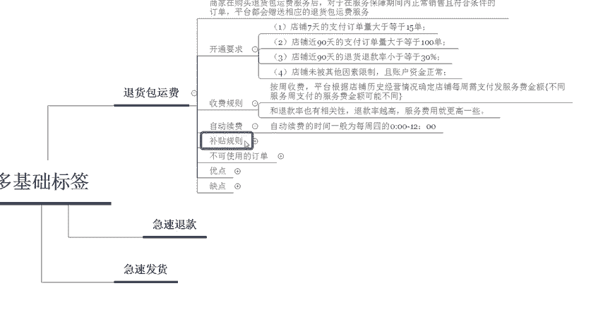

他真实的一个在赠送这个退货包运费的一个订单呢，如果说在确认收货之前发生退货是。啊，并且这个退货退款完成了啊，没有异常情形的平台才会给这个用户补贴啊，最高呢也不会超过这个25块钱。

所以说这个点呢大家不需要担心啊，大家不需要担心，所以说呃最多也就是25块钱而已。那么呃有一些订单呢也是没有办法去使用这个补贴规则的。比如说啊抽奖活动的一些订单和一和一些一级分类的虚拟商品啊。

或者是大家电。因为大家电还有商业办公的这些家居、住宅家居呃，全屋定制。那类似于这样的一个产品呢，它都是属于呃大件啊，是直接走物流的，所以说它是不会包你的这个补贴的啊，不会包补贴的。那么开通了这个之后。

能给我们店铺带来什么样的一个好处呢？也就是说它到底有什么样的一个优点呢。

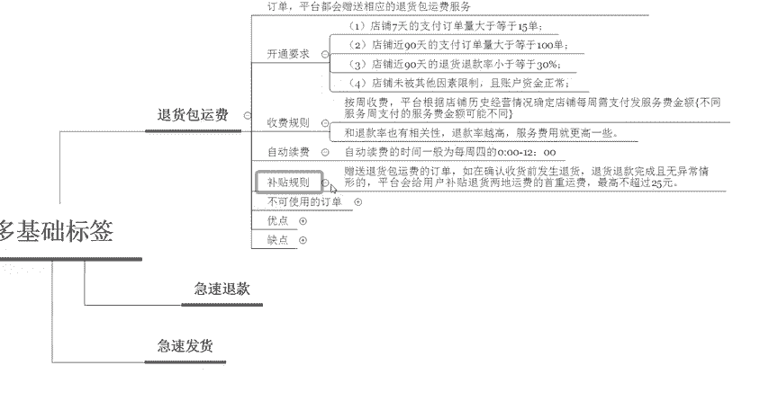

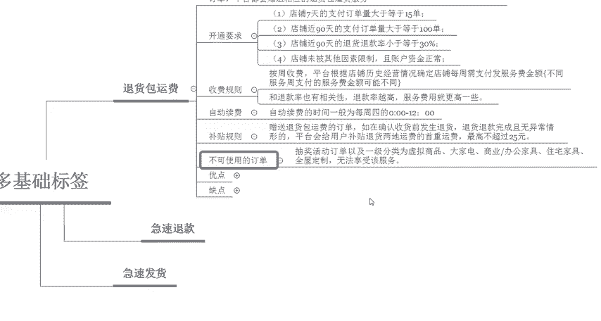

主要有4个点。第一个减少运费的一个争议和介入率，纠纷率会降低。啊。如果说呃在拼哥里面你为了这几块钱啊而跟这个客户产生了纠纷，导致这个客服介入啊会对于你的店铺来说会有比较大的一个影响啊。

那如果说他你店铺里面开通了这个东西之后啊，客户比较纠结于这个退货啊，那么啊你可以直接跟他说平台会有补贴啊，所以说对于店铺来说还是比较好的那第二个呢是可以增加我们的搜索权重。因为呃成功申请之后啊。

成功申请这个标签之后呢，店铺的一个商品将会在呃增加这个搜索权重。那么第三个点呢是在标题处会有独特的一个标签，增加转化率啊，因为我们做好售后服务呢，可以提高转化率啊，以及粉丝的一些呃用户的一些粘性。

还有用户的一些呃信赖度。那么最后一个呢就是可以提高我们商品的一个点击率啊，消费者看到这个东西，他肯定会呃多去点。那么同时它也有缺点。但是这个缺点呢其实啊对于大部分店铺来说呃没有太大的一个影响。

就是说如果你产品质量本身不行的话，店铺可能会导致退款的用户增多啊，但是说啊在一定基础上呢，也会增加这个退款的一个用户啊，那如果说你的产品本身质量就不行。那你做店铺或者是做生意啊，它也做不长久。

所以说这个点呢，其实大家可以忽略掉啊。那么以上呢就是我们关于这个拼多多基础标签里面退货包运费的一个呃内容和一些啊基础的一些认识啊，那大家现在都已经了解了吗？

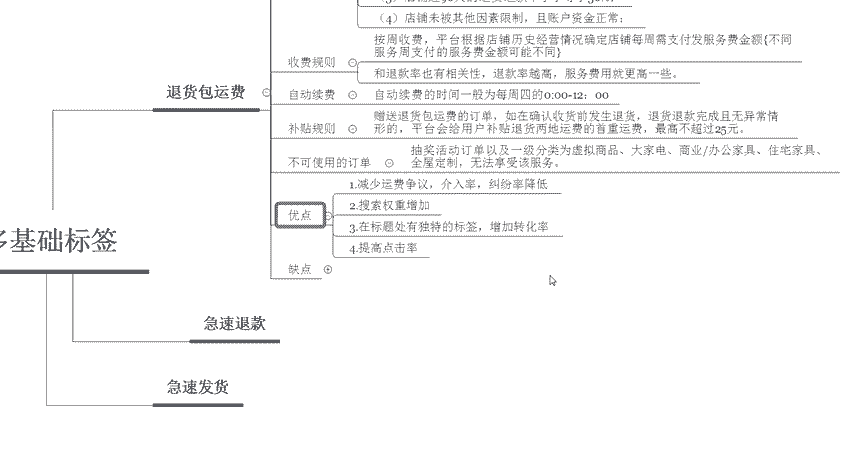

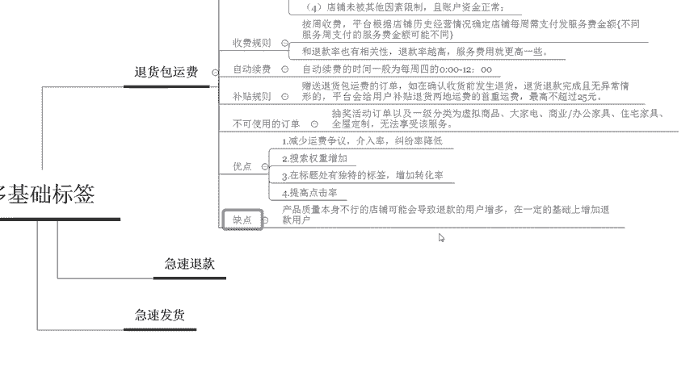

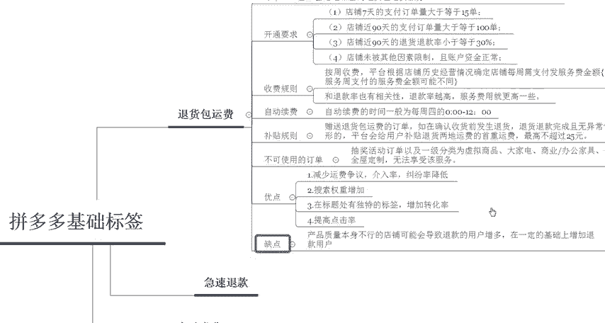

那后期呢我也会定期的在这个平台呢分享更多的一些拼多多干货的一些内容啊。那么现在大家私信我啊，可以领取福利大礼包啊。那今天给大家分享的一个课程呢到这里就结束啊，感谢大家的观看，再见。

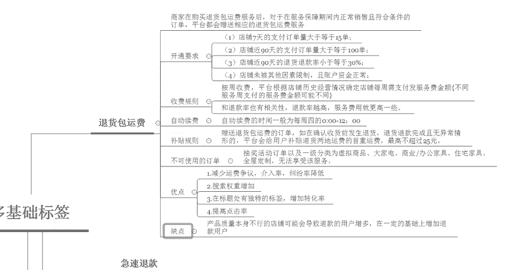