# 【拼多多运营】2024目前最新的拼多多开店新手教程！每天30分钟，零基础电商运营快速起店，实现日销千单！ - P20：20 拼多多店铺如何设置店铺名 - 拼多多-运营 - BV1812mY6EFh

hello，各位小伙伴们，大家好啊，我是巨黄教育的西楼。那首先感谢大家来到我的拼多多系列的课堂啊，那么前面的课堂呢带大家认识了一些啊拼多多的一些基础内容。那么今天我们所要学习的一个内容呢？

还是拼多多店铺啊，如何来设置店铺名也是拼多多基础里面的。那么现在呢就由我来给大家呃看一下拼多多到底应该怎么样选择一个比较好的一个店铺名。

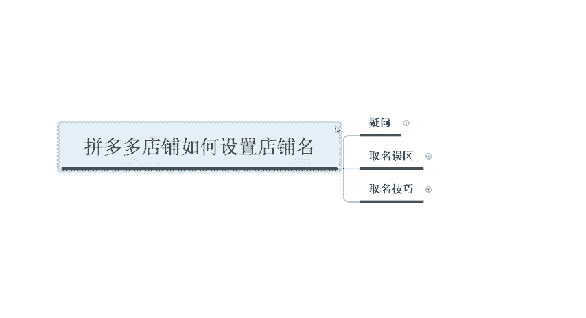

那么你们在操作店铺的过程中，是不是会有这样的一些呃疑虑或者是疑问啊。那么呃到底什么样的这个店铺名称呢？才会让人印象深刻。什么样的店铺名呢更容易让人记住什么样的店铺名才可以做的高大上啊。

所以说很多的一些新手或者是小白。那么你们在做店铺的时候呢，把这个东西想的非常的一个刻意啊，但是说这里面呢也会有一些误区存在啊。那么我们在做这个店铺的时候，选名字的时候，到底有哪些误区。

你们是没有注意到位的呢。

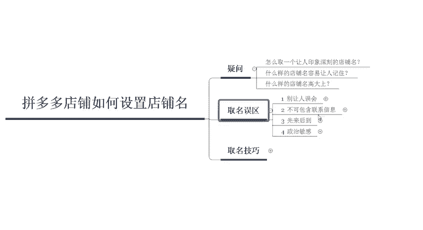

首先第一个啊不要让别人误会啊，指的是什么意思呢？不要去夸大宣传，不要使用一些极限词。比如说呃湖南第一蜡啊，什么四呃四川成都啊，第一美啊，这类类似于这种的啊，不要出现这种极限词啊，第一或者是最好啊。

那么第二个呢是个人店铺不可以使用官方的命名。比如说你个人店铺不能使用旗舰店或者企业店或者是专营店啊，这样的一个词语啊，那么呃第三个呢是未经拼多多许可，不可使用相关的标识啊，比如说呃像一些。

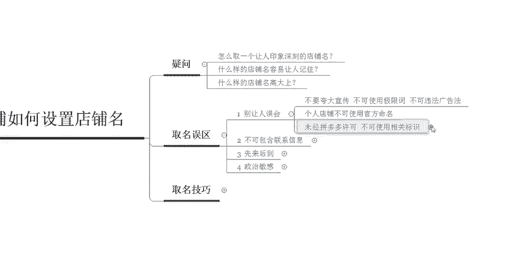

店铺名称里面的一些标识呢呃比如说拼多多特许，拼多多授权或者是有其他类似含义的一些内容啊，都是没有办法去进行使用的啊，不要让消费者会误会你的一个呃店铺。那么这个是第一个大家所需要注意的人。

那么第二个呢是最好不要呃不可以包含这个联系信息。就是说我们的标题里面呢不能出现你的QQ号、手机号或者是微信号啊等等这一类的啊，电子邮箱二维码或者是你的呃呃网址啊。

这些东西都是不能出现在你的店铺名称里面的。

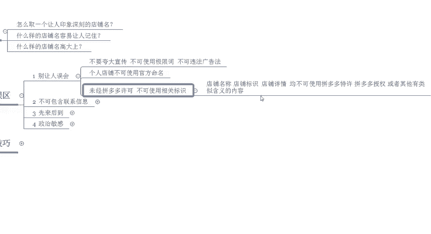

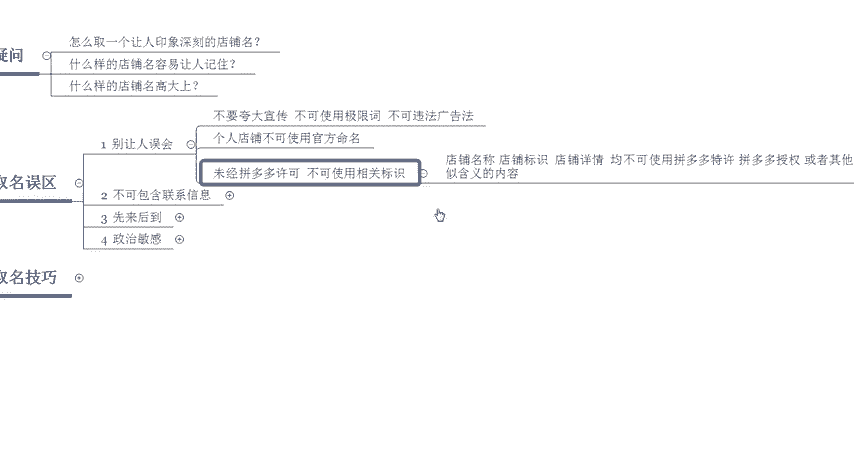

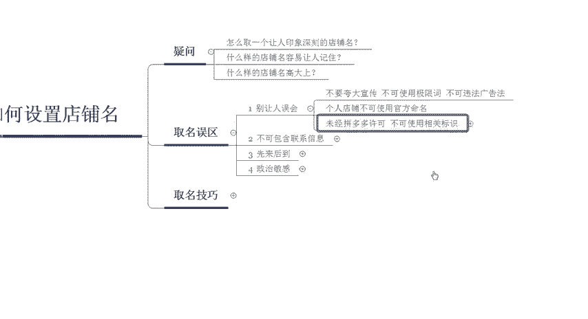

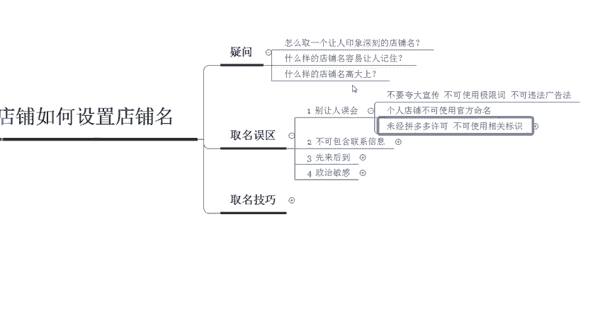

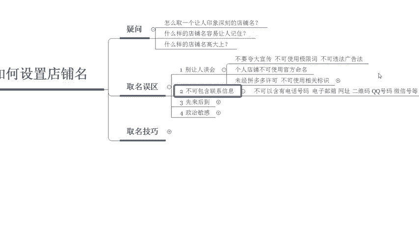

那么第三个呢是要注意这个先来后到的一个顺序啊，不得于已经通过审核的店铺名称重复啊。也就是说同行已经使用了这样的一个店铺名的时候呢，那么你就没有办法再去进行注册了啊，那么最后一个呢是政治敏感的一些词汇。

不能出现在呃这个店铺里面啊，包括但不限于国家领导人的姓名，政党名称或者是啊政党的机关名称啊，比如说你你做了一个店呢，叫这叫什么啊杭州司法院机关啊，那类似于这种的啊，那你肯定是不能用的。

所以说在取名字的时候啊，但大部分的人也不会说呃去想使用这样的名字啊，除非一些呃脑子比较奇怪或者是比较灵活的啊，也也是很正常的啊。现在你们这些小年轻啊，都习惯搞这些花里胡哨的东西。

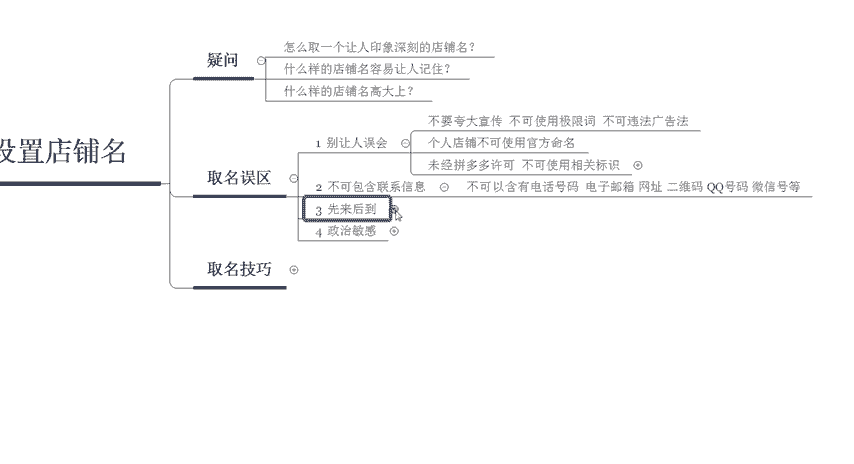

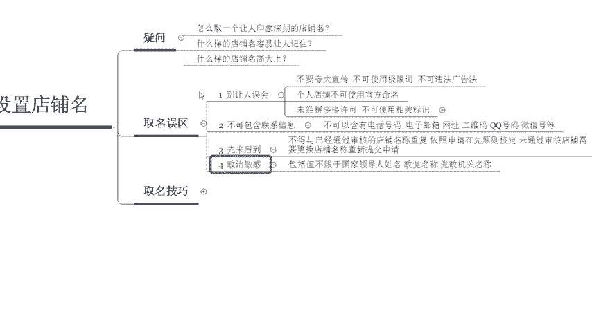

好，那这个呢就是我们在拼多多设置店铺名称的时候，取名的一些误区啊，四个误区大家要记下来啊。那么我们在取名的时候，到底有哪些技巧可以把我们的名字取得比较呃好一点啊，或者是更容易让这个系统抓取呢啊。

我们一起来看一下啊。首先第一个通过店铺的名称呢，你直接就可以看出你的主营产品的。比如说巨黄女装格啊，或者是呃反映你经营的一些特色的啊经营者的一些特色。比如说啊某某某大码女装。

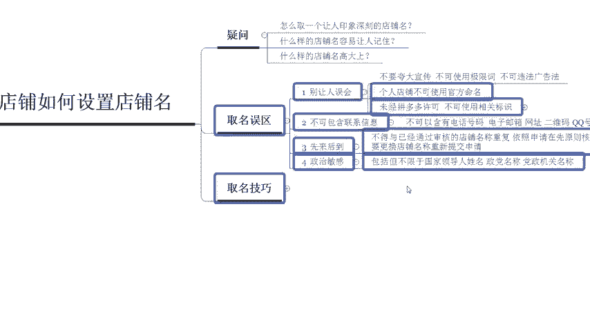

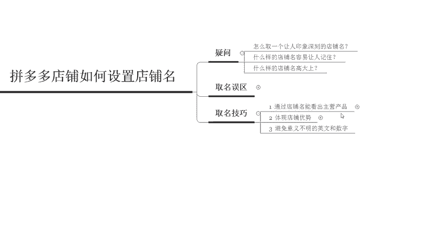

啊，我来给大家举个例子啊，某某某啊。大码女装，那么一下子就可以看出来你的店铺呢啊店铺呢是做这个大码女装的，或者是某某韩版风尚啊，这个服饰啊，那这种呢也是属于呃非常清晰的啊，非常清晰的啊。

那第二个呢是反映主营产品的优良品质啊啊，这个怎么来理解呢？啊比如说啊有一些卖食品的啊，蒙古的这个牛肉干，你加上蒙古这两个地域词啊，那么就说明啊蒙古嘛那边的这个牛肉干一般情况下都是品质比较好的啊。

所以说你可以去添加啊，那么最后一个呢是使顾客容易识别的一个店铺经营范围啊，比如说我们添加了这个女装那女装呢相对来说就比较泛。那这个女装呢你就可以改成啊大码T恤啊，相对来说就更加的精准了啊。

大码T恤就更加的精准啊，这是第一个点，我们的取名技巧的时候要注意的点。那第二个呢是可以直接体现出店铺的优势。

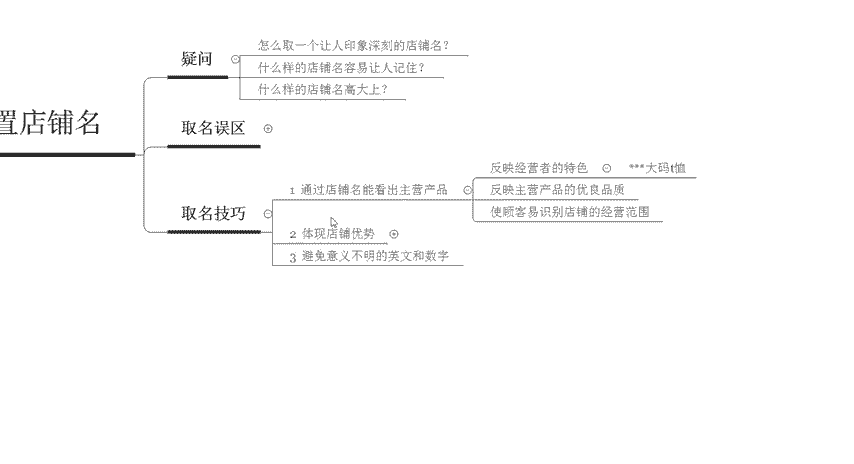

比如说我们的产品呢是正品宝藏或者是官方授权店铺啊，某某旗舰店。当然这个是使用于企业店的啊，那么像其他的呢，你可以写这个原创或者是定制。那么这个是个人店里面可以去进行使用的啊。

还有像这个场地刚才给大家举啊举个例子啊，蒙古的内蒙古的牛肉干啊，或者内蒙古的这个奶酪店啊，或者阳澄湖大闸蟹的某某某店啊，或者说如果说你是做的这个海淘店铺的话啊，开店性质为海淘店的话。

那么你可以写啊某某海外店。比如说啊巨黄海外店啊，那这种呢是可以体现出你店铺的一个优势的啊那么最后一个呢是避免意义不明的英文和数字啊啊，就比如说你的呃做了一个品牌叫YS啊YS这个品牌。

那本身呢啊举个例子啊，这个YS呢没有多少人搜索，也不会有多少人知道这个牌子。那你盲目的去用这个牌子来给你的店铺命名，其实是呃不太好的啊，其实是不太好的。因为消费者根本不知道你起这个YS到底是啥意思。啊。

所以说呢呃其实在取店铺名称的时候呢，还是说有一些细节啊，大家要注意的啊，尤其是针对于小白啊，那这一节课程呢相对来说会比较简单啊。那么如果说大家想要了解更多的干货内容呢，可以持续关注我啊。

我会定期的分享更多的一些干货内容啊。那么呃你也可以直接私信我啊，然后呢找我领取这个福利大礼包。

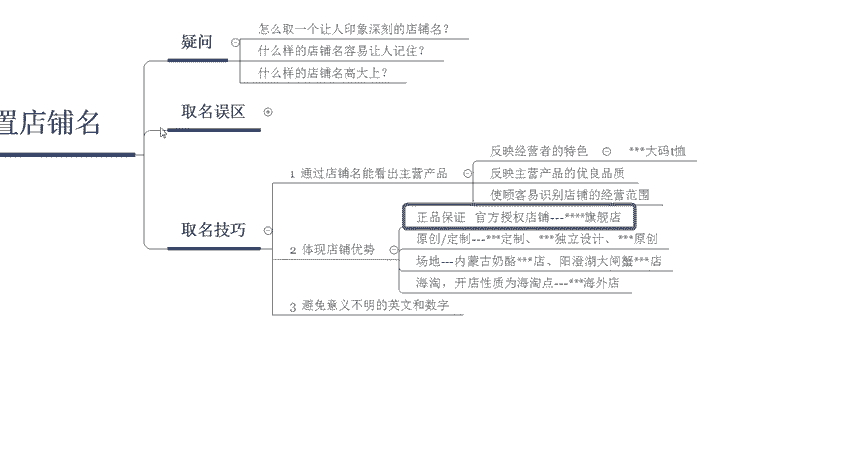

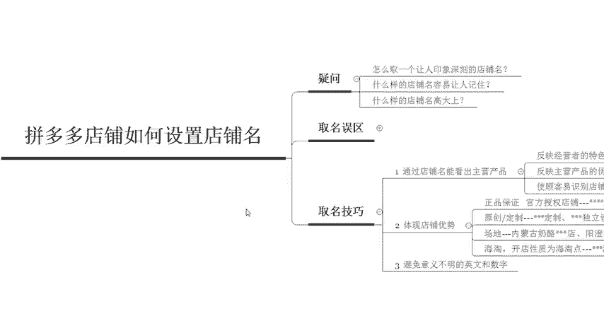

啊，好，那么今天的课程到这里就结束了，感谢大家的观看，再见。

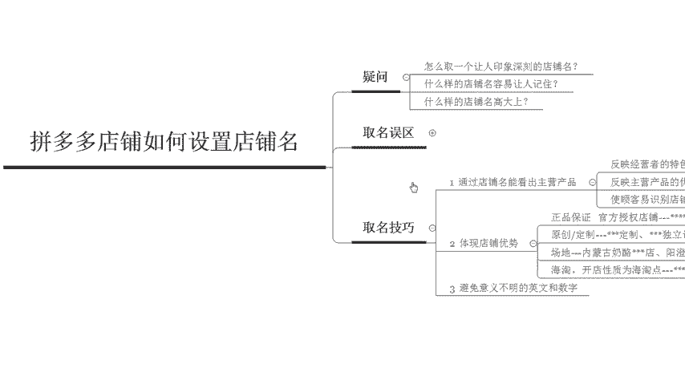