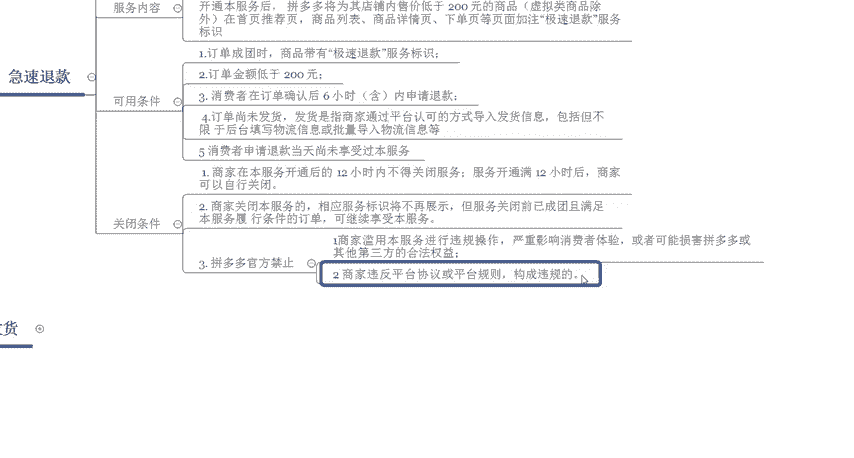

# 【拼多多运营】2024目前最新的拼多多开店新手教程！每天30分钟，零基础电商运营快速起店，实现日销千单！ - P21：21 拼多多基础标签之急速退款 - 拼多多-运营 - BV1812mY6EFh

hello，各位小伙伴们，大家好，欢迎大家来到巨皇教育西楼老师的拼多多系列课堂啊，那么今天由我来带大家认识一下拼多多基础标签中的极速退款啊。详细的来了解一下极速退款能给我们的店铺带来什么样的一个好处。

那么上一节课程呢，我们啊重点分享了退货包运费的一个内容。那么今天我们先来了解一下。

首先我们来了解一下什么是极速退款。也就是说它的一个定义到底是怎么样来进行定义的。在官方里面呢呃就是说消费者在拼单6个小时以内待发货的一个状态下。如果说他们提交申请这个退款呢呃相当于是秒退啊。

但是这个呢是只针对于非虚拟类的啊，并且金额小于200元的一个商品订单。在成团6小时内，商家还没有发货，买家申请仅退款啊，是享受这个极速退款的一个权益的。

所以说开通了之后呢，对于呃消费者来说呢，是一个非常好的一个地方啊。那么对于我们商家来说呢，也可以省去非常多的一个呃后期可后期的一些呃精力。那么它主要服务的一个内容呢啊也比较简单啊也比较简单。

就是说啊商家为特定的一个商品呢呃这些消费者提供了一些退款的一些增值服务。比如说开通这个服务之后呢，拼多多将会在店铺内啊选择这种售价低于200块钱的一个商品啊，虚拟商品除外呃，在首页的啊推荐推荐页。

还有这个商品的列表，商品的详情页，还有下单页就会注明极速退款的一个服务标识啊，那么在这样的情况下，消费者呢，如果看到这个服务标识，他们的一个呃。

转化率啊相对来说就会更高一些啊，那么这个东西是不是说所有的店铺都可以开呢？它也是有一些有一定的这个可用条件的啊。比如说呃买家在购买这个订单之后，订单成团完成之后，商品必须要带有极速退款的服务标识。

那么这个订单呢才可以去呃实现这个极速退款的一个服务。那么第二个呢是商品的一个订单金额呢，必须是要低于200块钱的啊，如果高于200。

那么这种商品呢是没有办法享受这个极速退款的一个权益的那么第三个呢是消费者必须在呃订单确认后6个小时内申请退款。如果说超过6个小时，那么也是没有办法享受极速退款的一个服务的啊。

那么第四个呢是订单必须要是未发货的状态。比如说你已经发货了，或者是你的物流信息呢已经呃上传到这个店铺的一个后台里面了。那那么像这种情况呢啊就没有办法再申请这。

个享受这个极速退款的一个服务。那么第五个呢是消费者申请退款当天啊，必须是呃没有享受过这个服务的。也就是说一天以内他只能享受一次啊。所以说这个点呢是呃针对于呃极速退款的一些限制的条件。

那么如果说呃你不想开通这个业务，或者是你开通了这个极速退款之后，想把它关闭掉，那应该怎么样去关闭呢呃，也是有条件的啊。首先第一个商家在这个服务开通之后呢，12个小时以内是没有办法关闭的。

所以说必须要开通12个小时以上。然后呢，你才可以去后台去自行关闭。那么第二个呢是呃如果说啊你想要关闭这个服务啊，相应的一个服务的一些标识，就不再展现了。像这个商品的一些呃首页啊。

还有这个推荐页啊都不会展示这个极速退款的一个标识。但是说如果说你服务关闭前已经满足成团的这些呃客户，那么他们也是会继续享受这个服务的啊。比如说呃现在呢是上午的11点，那么你开通了这个服务。

那么有一个客户呢在。

呃，今天上午的11点到晚上的11点呃，这期间内下单的，那么他们都是可以享受到这个极速推款的一个服务的啊。那么你11点之后关闭啊，那么你也是需要给他们享受这个极速推款服务的。那么第三个点呢。

关闭的条件呢就是嗯拼多多官方给到了你一些限制。比如说你的店铺里面啊有了违规啊，那也是没有办法去呃实现开通这个服务的。

比如说商家滥用这个服务呢进行违规的一些操作，严重影响这个消费者的一些体验，或者是可能损害这个拼多多或者第三方渠道的一些合法权益。那这样的情况下，他会全面禁止。也就是说你这个店铺以后就再也开通不了了。

那么第二个呢是商家违反平台的一个呃协议或者平台的一个规则啊，就是相当于是扣分或者是罚款。那这样的情况下，也会永久的去限制你开通这个极速退款的一个服务。好。

那么以上呢就是我们在拼多多里面关于极速退款服务里面的一些啊基础的认识。那如果说大家还有任何不理解的地方，可以直接私信老师啊，那希罗老师呢呃也会定期的在。

这个平台里面呢分分享更多的一些拼多多干货的一些内容啊，并且现在私信我有拼多多的干货大礼包零穷啊，那么今天的课程呢啊到这里就结束了，感谢大家的观看，再见。

