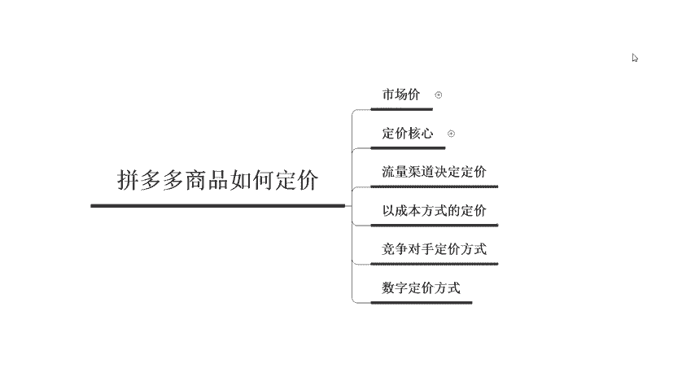
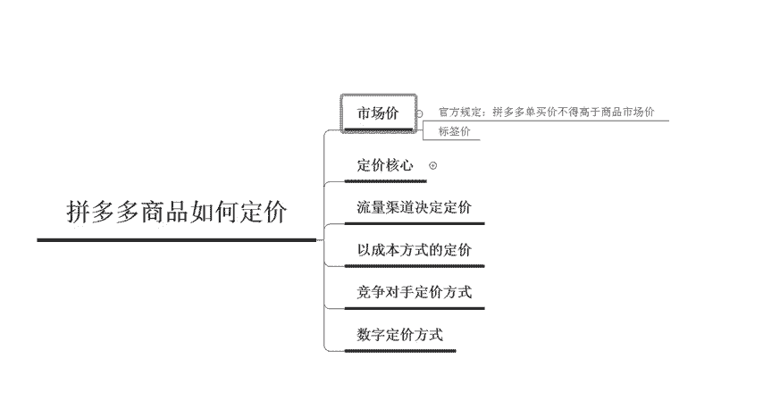
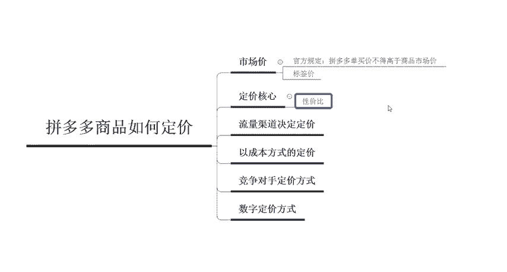
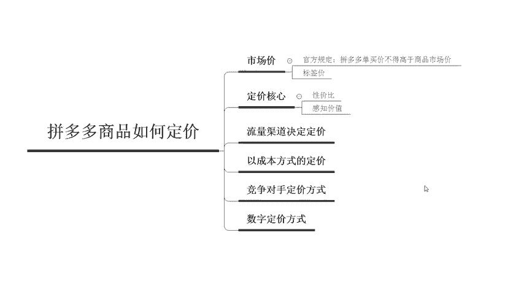
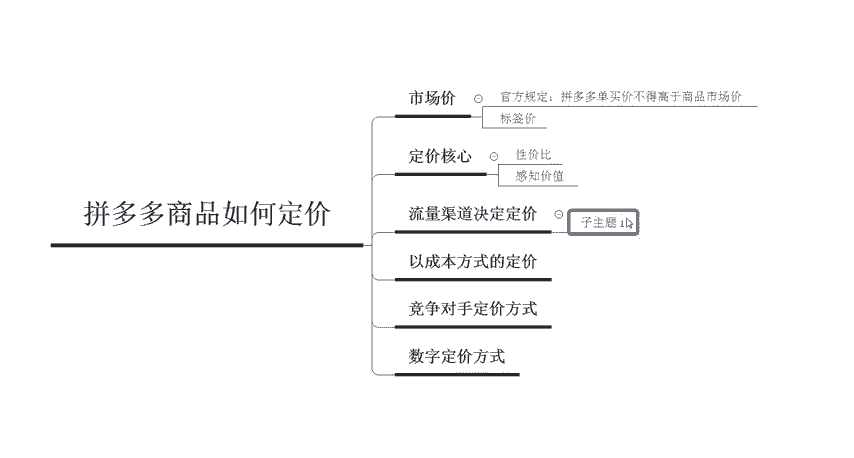
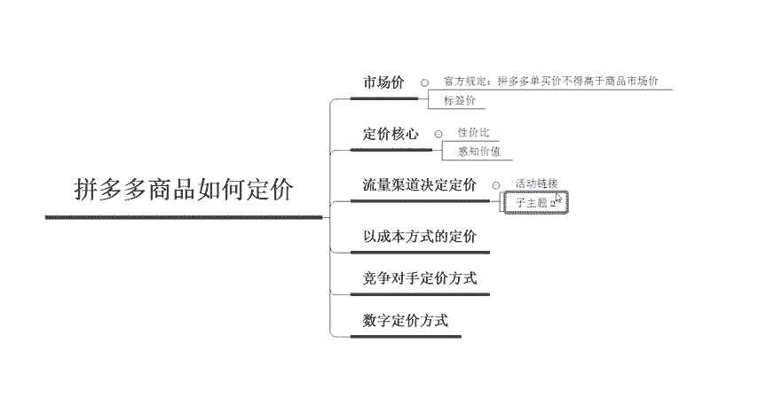
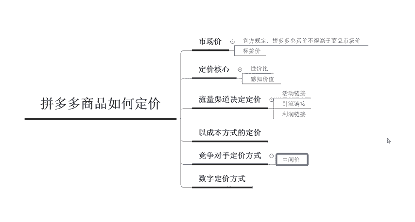

# 【拼多多运营】2024目前最新的拼多多开店新手教程！每天30分钟，零基础电商运营快速起店，实现日销千单！ - P22：22 拼多多开店商品巧妙定价 - 拼多多-运营 - BV1812mY6EFh

hello各位小伙伴们，大家好啊，欢迎来到我的拼多多系列课堂啊，我是巨黄教育的西楼。那么上一节课程呢，我们了解到了拼多多在发布宝贝的时候，如何来写作一个黄金标题。那么写好标题在发布的时候呢。

我们还需要有填写一个非常重要的东西，就是拼多多商品的定价。那么今天我们就来了一聊拼多多商品如何来进行定价啊，那么在这里面呢，我给大家列举了几个定价的一个方式。我稍后会给大家详细的每一个都呃讲解到。

首先我们先来了解一下，在拼多多里面有一个东西呢叫做市场价。我们先来了解一下市场价是个什么东西啊，官方的一个规定呢，我们拼多多单买的一个价格呢不得高于呃商品的一个市场价啊。

比如说我们团购的一个价格呢是79啊，单买的价格呢是99。那么市场价呢，你就可以设置为这个199或者299等等啊，但是说大家呢也可。

可以把这个市场价理解为是标签价啊，对应于这个淘宝里面呢，就相当于是淘宝的一口价啊。那么这个呢是呃对应于拼多多里面市场价格的一个认识。那么我们在定价的时候呢，其实有很多的呃商家朋友们在私信问我啊。

商家应该怎么样来定价，定的太低，觉得没有利润，定的太高了，发现这个产品又卖不动。所以说其实定价呢没有那么复杂啊，但是说。

有很多的商家朋友们没有深入的了解平台的一些玩法，还有这个啊对商品，或者是对于宝贝的一个定位啊。所以说这一句话呢可以理解为是产品价格其实是以买家的一个感知价值为基础的。所以说我们呃总结一句话呢。

就是产品的一个性价比有没有达到消费者的一个呃认知的一个需求点啊。如果说他觉得你的产品值这个价格，那他肯定就会去进行购买。所以说我们在定价的时候呢，是以买家的感知价价值为基础的啊。

一定要记住这一个非常核心的词。

感知价值。然后呢，我们呃刚才呢讲到啊，刚才呃刚才呢为什么会聊到这个平台的一些玩法啊，对于我们每个商家来说，我们要的是什么呢？一定是流量。所以说我们必须要先了解平台的流量都是分布到哪里了。然后呢。

我们才可以根据不同的流量渠道。你想要做哪一个流量渠道，那么对应的一个定价肯定也是不一样的。呃，在拼多多里面主站的一个流量呢基本上分为自然流量活动流量和推广流量，还有站外流量这几个部分。

那么现在呢拼多多是以做店铺为主，而不是说要像以前的那种做一个一呃一两个链接的这种时代了。所以说现在的流量成本呢，相对来说比之前是要高一些的。我们商品的一些质量，还有买家的呃卖家的一些服务呢。

这些基础都是需要提升的。所以说我们在开店前的一个商品定价呢，就要考虑到商品的一些定位啊，还有啊商品的这个。

质量啊或者是商品整体的一个风格呀，想要针对这个人群到底是啊年轻化还是老龄化啊，日风格呢是偏日系还是说呃韩系还是说国潮考虑到这些因素的同时呢啊再根据平台的流量分布。对于店铺的一个链接啊。

比如说我们后期呢可能会需要做活动或者是引流啊或者是这个利润啊，所以说我们在分布这个不同的商品的时候呢，对应的这个渠道也是不一样的啊，所以说定价这方面呢还是要重新的来审视一下啊，重新的来审视一下啊。

比如说在拼多多里面呢分为三个部分啊，分为三个部分。第一个是做活动的这个链接啊，活动链接我们那个定价相对来说肯定就会偏低一些。然后呢，还有这个引流链接啊，引流的个链接，应该怎么样去定价。

然后利润的这个链接应该怎么样去定价。所以说这三个部分呢要。

每一个啊产品都要对于这个消费人群啊，他们的一个消费能力呢进行把控，来实际的定出这个价格。那么我们定价的时候，到底应该怎么样去定呢？啊，常规的一个定价方式呢，主要就是下面给大家介绍的这三种。

第一个呢就是以成本为方式的一个定价。这种一般适用于厂家啊，比如说我自己有这个工厂我的袜子呢非常便宜啊，两毛钱或者是两分钱啊，一双这个成本，以低价跑量为主。长呃这个成本呢是超低的啊。

就是成本价加上快递加上包装啊，那么就是它整个呃整个这个流水里面的成本，然后再加上你的利润啊，就等于你要定价的一个客单价了。那这个呢是以成本定价的一个方式。那么第二个呃定价的一个方式呢。

就是看你的竞争对手到底是怎么样玩的。这样的玩法呢就是紧跟对手的一个定价策略设置相对应的一个产品价格。比如说前期是。需要我们商家对于竞争对手呢有一定的一个了解呃了解或者是研究啊。

比如我们呃同行排名前20名的这个同行啊，对于他们的一个客单价活动价，还有规格的一些设置，还有优惠力度等等呢啊，总结出来做成一个表格。然后呢，我们选取一个中间价来设置为我们的一个呃初期的一个定价啊。

中间价。因为价格超低的这种啊价格超低的这种一般情况下都是上了活动。那价格超高的这种呢可能呃又不太好卖出去。所以说我们定一个中间价啊。然后最后一个呢就是数字定价方式啊，这种呢比较符合大众心理的一个数据。

所以说我们在设置价格的时候呢，一般情况下都不会设置成这个100或者是200这样的啊，买家比较喜欢的就是998866啊，类似于这样的一个数字定价法。所以说相同的这个10元的产品呢，如果说你卖9。9块。

那呃整体的这个转化率就会更高一些。所以说以上呢就是我们在定价的时候呢，所常用的三种方式啊，以及我们在定价的时候，需要先根据哪些因素来决定于我们产品的一个价格啊。

那么各位小伙伴对于这个拼多多的一个商品如何定价到底有没有清楚的了解了呢？啊，如果大家有这个任何的问题啊，欢迎大家在评论区留言或者是直接私信我。那么现在找我呢，还有对应的啊拼多多的福利大礼包呃。

可以领取啊。那今天给大家的一个分享呢到这里就结束了啊，欢迎大家啊随时私信骚扰我啊，大家再见。

