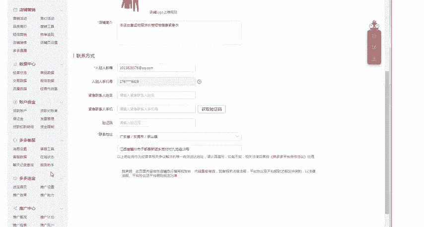
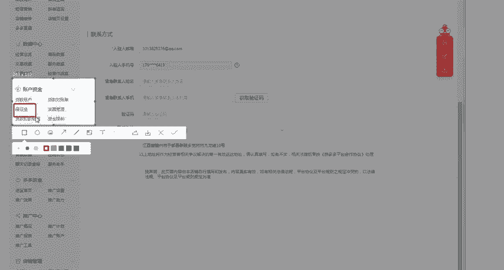
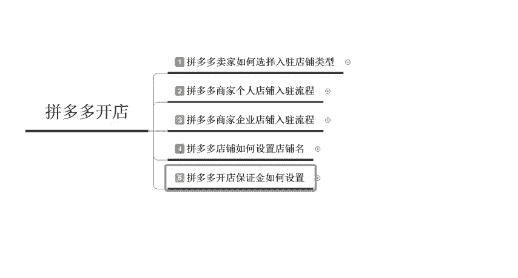

# 【拼多多运营】2024目前最新的拼多多开店新手教程！每天30分钟，零基础电商运营快速起店，实现日销千单！ - P23：23 拼多多开店保证金设置模板 - 拼多多-运营 - BV1812mY6EFh

电商无止境学海苦车兜。hello大家好，我是巨黄教育的西楼。欢迎大家来到我的拼多多系列课堂。那么今天给大家分享的一个内容呢啊叫做拼多多开店如何来设置保证金，也是我们拼多多开店基础系列中的第五节，呃。

也是我们拼多多基础里面的最后一节啊，拼多多开店如何来设置这个保证金。其实在拼多多里面呢呃他的保证金呢其实是分为两种的。第一种呢是店铺的一个保证金。第二种呢是活动的保证金。

大部分的呃同学呢可能会了解更多一点呢是店铺的一个保证金啊，所以说呢我们先来了解一下什么叫做拼多多的一个保证金。拼多多它的一个保证金呢分为两种，店铺保证金和活动保证金。这个呢是呃为什么要交这个保证金呢？

是为了防止一些不良商家出现违规的一些情况，给我们保付呃，给我们的这个消费者呢形成一种保护的一种方式。比如说呃你在这边购买了这个产品啊，你发现这个产品是假货或者是呃有这个产品的质量问题，你想要退货。

那在这样的情况下，如果有一些不良的商家，他拒绝给你退货。那在这样的情况下呢，呃你就可以直接申请呃客服介入客服介入之后呢，就会从他店铺里面的保证金扣除一部分钱，然后退还给消费者。

所以说这个呢也是呃为了保障消费者的一个呃。环节啊，那么店铺保证金呢是开店者的一个承诺，也是对消费者的一个保障。啊，你开店呢就需要缴纳这个保证金，然后把这个钱呃，相当于是放在这个平台里面。

让平台去进行保管。如果说呃因为平台呢它不会像银行一样，用这笔钱去放贷啊，或者是投资赚钱。所以说啊你放这个保证金呢，也是没有利息的啊。但是说如果你没有出现违规啊，在申请退店的时候呢。

你可以直接把这个保证金给退出来啊，保证金的这个余额呢会直接啊退还到你的提现账户里面，按照你充值的原路会进行退回。所以说啊这个钱呢其实是你开店啊，必须要交啊，但是说啊它只是一笔不可移动的一个资金啊。

当你不想开店的时候，你随时可以退出来啊，那这个呢就是保证金的一个定义啊，那么我们再来了解一下什么叫做店铺的这个保证金啊，店铺的保证金呢呃说为什么要缴纳这个店铺的这个保证金呢？有的同学可能会有疑问啊。

平台不是鼓励这个0元入住嘛啊，0元入住是你入住的时。不需要交这个会费啊，就相当于是不需要交这个会员费。但是呢你在平台经营过程中呢，会有一定的一个限制。所有想要做的一个店铺，想不管你做大啊，还是说做小。

都是必须要缴纳保证金的。如果说你不缴纳保证金的话啊，会有一一系列的一个限制啊，比如说你没有办法新建推广计划啊，比如说你像开这个直通车，你没有办法开。那么也无法去发布虚拟商品以及其他的一些额外啊。

需要这个额外保证金的一些商品。因为呃个人店铺的这个保证金呢需要2000元。但是虚拟类目呢，可能就需要更多一些。如果说你店铺的啊可用资金是小于300块钱的时候，那么你成团的一个订单总额呢。

就不能超过2500。所以说也会啊对于你店铺里面呢会有一定的一个限制啊，你会发现有的时候呢有很多的客户呢，他们想拼团的时候呢，啊没有办法成团啊，所以说这个点也是非常尴尬的啊，然后。

第四个呢就是成团的订单呢不会超过100单啊，在这样的情况下就会限制你每天最多也就是能卖100单啊。那么第五个呢就是提现的一个次数呢，不能超过3次啊，所以说这个是比较烦的啊，你卖了钱之后啊。

然后不能提现啊。第六个呢是店铺罚款的一个处罚呢，不能超过两次，超过两次以上它就会直接封店。啊，这是第六个。第七个呢是店铺的处罚不能超过10次。店铺的店铺的处罚和这个第六点的店铺的罚款处罚可是不一样的啊。

罚款的时候呢，它是直接会罚钱啊，然后店铺的一个处罚呢？比如说你会出现一些虚假发货呀，或者是其他一些违背承诺呀，类似于这样的一个处罚啊，但是它不能超过10次啊。一旦你的违规限制呢达到了这样的一个标准。

或者是达到了这样的一个界限的时候呢，它就会对你的店铺做出处罚，要么是一级限制，要么是二级限制，或者是更为恐怖的，就是三级限制。三级限制直接就相当于是分店了啊。好。

那这个呢就是我们为什么要缴纳这个保证金啊，为什么要缴纳保证金。如果说你不缴纳保证金，那么会怎么样呢啊。就是刚才所给大家讲到的7个点啊，我在这边总结一下啊。第一个呢是贷款提现的一个功能会受限。

第二个呢是商品发布，还有销售以及店铺经营的相关功能呢，全部都是受限制呢，你只能使用很小的一部分啊，那么最最为核心的呢是没有办法使用店铺营销也没有办法使用店铺推广。你在做店的一个过程中。

你店铺肯定是需要推广的。如果你不缴纳保证金是没有办法去进行推广的。那么缴纳保证金的一个方式呢啊，也非常的简单啊，我们就来看一下怎么样去缴纳保证金啊。

去你的啊商家后台打开商家后台之后呢啊我实际来给大家看一下啊。好，点击直接进入到商家后台。在最下方的位置呢有一个店铺信息。在店铺信息。这里面呢你可以看到你店铺里面呃所有的一些呃内容啊。

你店铺是呃开店是用的什么样的一个logo啊，或者是店铺的一个最主要的一些介绍。那么这个呢就是你店铺里面的一些基础信息。那么有很多的小伙伴们呢就习惯性的来这个店铺信息里面去找对应的一个保证金。

但其实不是这样的啊，就是说你们有一个误区啊，我们的保证金缴纳呢不是在这个里面去查找的。我们想要缴纳保证金，应该点击你店铺里面的资金账户。就是最下方的这个位置啊，最下方的这个位置呢，这边有一个账户资金啊。

在账户资金这边呢有一个对应的一个保证金。然后呢，你点击保证金进入之后呢，你就可以啊，需要你绑定银行卡。如果说你没有绑定银行卡的话，需要你。

呃，绑定一下这个银行卡，然后呢点击充值就可以了啊。如果说你要上活动的话，后期你也是在同样的一个位置去缴纳对应的一个活动保证金。那这边呃所需要缴纳的一个保证金呢，也是啊有对应的一个介绍啊。

A档的一个活动呢是5000B档的呢是1万C档的呢是5万啊，活动商品的一个额度呢，分别是一个两个和无限制啊，比如说我们像一些竞价呀，还有品质招标呀，还有秒杀断码清仓，以及这个啊很多的这些活动呢。

都是需要缴纳保证金的。好，那么以上呢就是我们在缴纳保证金的时候的这个后台啊。那么我们到底需要缴纳多少的一个保证金呢？个人店铺，你在操作的时候呢，需要缴纳2000左右啊，但是说有一些特殊类型的店铺。

比如说虚拟商品，那么企业店铺呢就需要缴纳1万，然后个人店铺呢也是1万啊，像企业店铺呢这个正常情况下基础的一个保证金呢，企业店铺要比个人店铺更少一些。因为企业它本身是有这个保障的啊。

企业你的公司肯定是跑不了的那你个人呢随时随时就可以退店。所以说个人在啊缴纳保证金的时候呢，是2000元。然后企业缴纳保证金是1000元啊，一些特殊类目啊是啊不一样的。比如说虚拟类目还有一些像其他的啊。

比如说店铺呢如果是你经营的是二手的或者是数码的油烟机啊或者是汽车等产品，这些产品的这些店铺呢，你缴纳这个保证金呢，除了缴纳这个保证金以外，还要缴纳5万块钱的特殊店铺的一个保证金啊，要记住啊。如果说你做。

或是这种类目。那么你缴纳的保证金可能会更多一些。那如果说你做的是宠物礼品卡啊，这些商品细则呢需要缴纳1万左右的一个保证金啊，特殊类型店铺的一个保证金。所以说不同类型的一个店铺呢。

你缴纳的一个保证金也是不一样的。好，那这是啊第四个问题需要缴纳多少保证金的一个问题。那么我们继续再看第五个问题啊，店铺保证金会调整吗？啊，这个调整的一个呃是会进行调整的啊。

平台呢每个月会根据于你店铺上个月的经营情况，会对你的啊店铺保证金做出调整啊，如果说你的销售额啊是大于这个50万了。那么你保证金呢就需要达到这个1万啊。如果说你的这个销售额比较少的话。

那么你的保证金相对来说也就比较少啊，那这是一个标准点啊，这是一个标准点，所以说保证金呢，它是随时会变动的啊，根据你根据于你每一个月啊，实际的一个销售额来定的那最后一个呢就是保证金啊。

店铺的保证金会不会被扣除啊。如果说你在合规经营的情况下，它不会扣除你的保证金。那如果说你违规了啊，或者是违法了，或者是这个啊购买了消费者的产品不给人家。退款啊类似于这样的啊商家自行自身的一个行为呢。

对于平台造成了一一定的损失。那么平台呢也会扣除你的保证金。所以说这个保证金啊啊对于呃商家来说啊，它其实是保障啊，但是说也是一个督促的一个起到督促的一个作用啊，那最后一个呢就是活动的一个保证金啊。

再给大家讲一下这个活动的保证金。就是活动的这个保证金呢，类似于我们参加活动的一个押金。不同的活动呢，对于这个活动的保证金也是不一样的啊，比如说像这个秒杀，我们就需要交5000左右的一个保证金。

那么我我们为什么要交这个保证金呢，这个呢其实跟这个店铺保证金是一样的啊，为了防止商家出现这个违规的一个情况，你上了活动了之后，你不想卖货，或者是把货这个下架删除了。

那这样的情况下就会扣除你一定的一个保证金啊，保证金呢，但是说啊这个东西可以不交啊，这个不会影响你正常的一个经营。但是说如果你不交这个保证金的话，你就。没有办法去呃上活动。

那么到底每一个活动都需要交多少的一个活动保证金呢？啊，这个里面呢刚才其实也给大家看过了，直接在店铺后台里面我们可以看到。啊，点击这里A档、B档、C档啊。

分别不同的一个档位所需要缴纳的一个保证金也是不同的。好，那这是这一个点啊。那第三个问题呢，就是活动保证金啊，应该怎么样缴纳缴纳的一个方式和后台啊，同样也是在这里直接点击充值就OK了啊。

最后一个呢就是我们的一个活动保证金，为什么会被扣除啊。你如果你在活动过程中呢出现违规的一个情节，那么平台呢会根据于你违规的一个情况来扣除你的一个保证金。比如说啊你答应给消费者的一个优惠券没有给到。

那这样的情况下，平台呢就会把你的保证金扣除，然后给到消费者赔付。那最后一个呢就是我们活动保证金什么时候能取出来？活动结束之后啊，充值保证金之后呢，平台将会这个风控。然后呢啊活动结束之后15天啊。

15天之后啊，活动结束的15天之后，比如说今天是这个7月1号。那么啊后期你如果说啊你今天这个活动结束了，那么你在7月16号的时候，可以把这个啊活动的保证金取出好。

那么以上呢就是我们的拼多多开店里面的第五个啊第五节课啊，我们拼多多开店的这个保证金如何来进行设置以及相关的一些信息啊，那么后期呢我也会分享更多的拼多多干货的一个内容。如果说大家想要学习。

或者是对于拼多多不懂的地方，可以直接私信我，或者是在评论区给我留言啊，还是一句话啊，电商无止学海苦子兜啊，我是巨皇教育的西楼，感谢大家的观看，再见。

