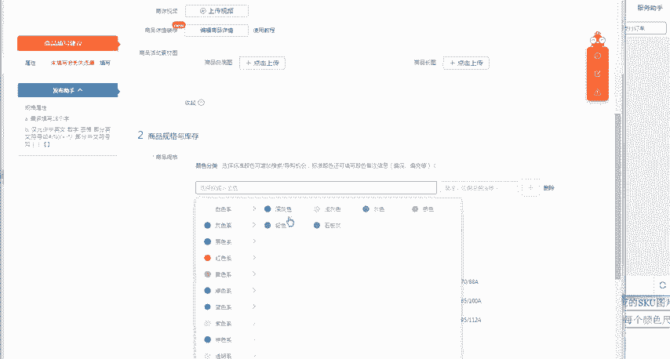
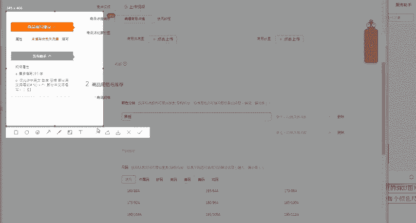
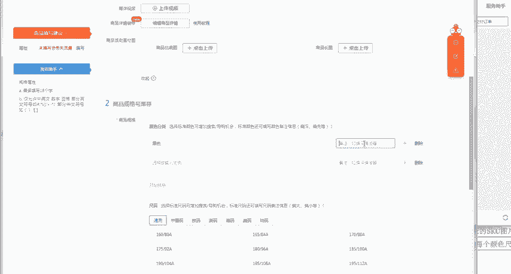
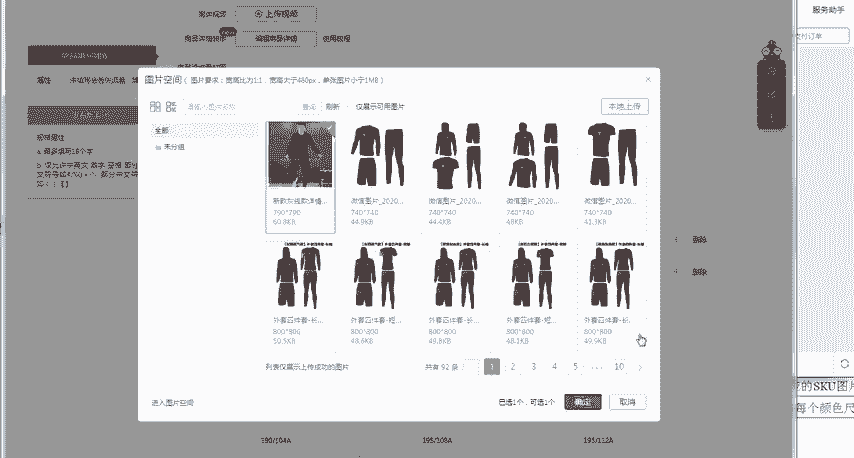
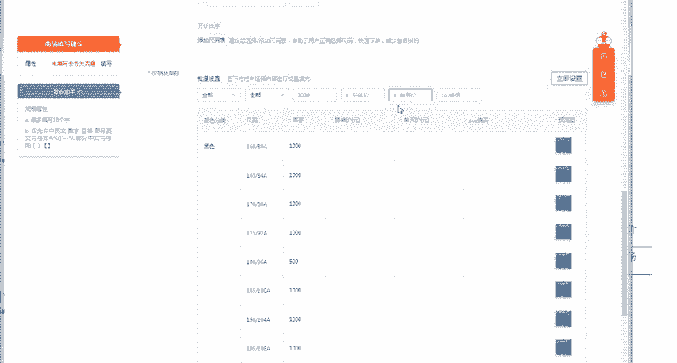
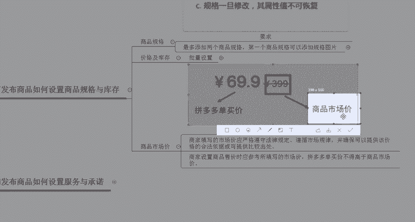
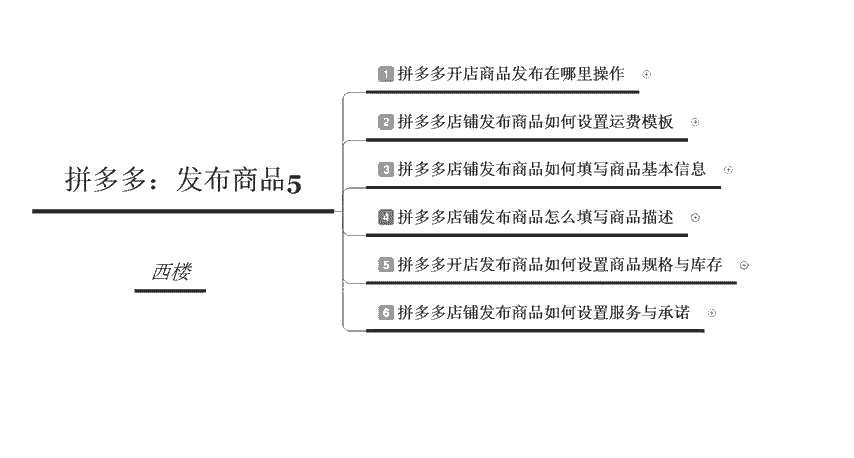

# 【拼多多运营】2024目前最新的拼多多开店新手教程！每天30分钟，零基础电商运营快速起店，实现日销千单！ - P24：24 拼多多设置商品规格和库存 - 拼多多-运营 - BV1812mY6EFh

电商无止境学海苦舟舟。hello大家好，我是巨黄教易的西楼。欢迎大家来到我的拼多多系列课堂啊，今天给大家分享的一个内容是拼多多发布商品系列中的第五节课程。拼多多发布商品的时候。

如何来设置商品的规格和库存啊，因为有很多的中小卖家可能刚刚开始接触拼多多并不太会去呃如何啊，并不知道应该如何去选择商品的一个规格和填写商品的一个库存。那么接下来我们就去后台详细的去看一下。

应该怎么样来调整我们商品的一个规格以及库存。首先呢我们先来认识一下什么叫做商品的一个规格啊。它商品的一个规格呢是呃有一定的一个要求的。我们添加规格的时候呢啊拥有多种属性的同价格。

同一商品需要设置为同一个价格，不同的一个规格啊，这个是什么意思呢？就是说你的商品呢属性是一样的啊，价格也是一样的。那么呃你。如果是同一种商品的话，那么你需要设置成两种不同的一个规格。

就是说需要填写两次啊。那么如果说同一个商品呢，不同规格呢是没有啊，是不能分开这个去上架商品的，不然的话会被判定为重复铺货啊，那它判定重复铺货的一个标准是什么呢？就是你在发布宝贝的时候所填写的属性。

不能是完全一致的啊。如果完全啊是这个完全一致的，它可能就会给你判定为重复铺货。比如说我们的一件T恤。T恤的这个属性材质全部都是一模一样的啊。

但是说你叉L的号码和这个2叉L的号码分别啊单独上了这个一条链接。也就是两条链接它就会判断为你为重复铺货啊。然后第三个所需需要注意的点呢，就是规格。一旦修改了之后，其他的属性值是没有办法去进行恢复的。

所以说我们在这个操作的时候呢，最多可以添加两个商品的一个规格。第一个商品规格呢可以添加规格的一个图片。那具体的一个呃比如说我们从这个男装为例啊，我们在填写的时候呢。

呃比如说它这个规格呢最多填写18个汉字，然后中间呢不能添加特殊符号啊，比如说我们可以选择的对应的一个颜色啊，包括我们选择的这个尺码啊，也就是颜色和尺码，我们可以自己来进行啊挑选。好。

那么这个呢就是我们在添加规格的时候的一些啊所需要注意的一个事项。那么接下来我们去后台啊去详细的看一下啊，我们找。一个服装类目啊。好，我们点击后台之后呢，我们需要进入到发布商品的一个页面。

比如点击发布新商品。进入之后呢，我们选择对应的一级类目啊，比如说服饰鞋包啊，服饰箱包。啊，流行的这个男装啊，选择男装。比如说我们选择这个衬衫啊，然后点击确定发布该类目。

然后我们在填写这个实际的规格的时候呢，其实是在下面的这个位置啊，商品的规格与库存。那么我们可以自己去添加颜色。比如说我们产品的呢是黑色的，那么你就可以选择黑色啊，然后在左侧的这个位置呢。

会有发布助手提醒啊，会有发布助手提醒你有哪些点是需要注意的啊，是需要注意的。然后呢，这个是我们填写的这个颜色的一个分类。比如说我们后面呢还可以写一些备注啊，写一些备注。

比如说我们备注里面这个颜色偏深或者是颜色偏浅等等。

并且我们同时是可以上传SKU的图片的。也就是说消费者在点击这个SKU的时候呢，他所看到你的产品呢就是这张图啊。比如说我点击了这个黑色，然后点击呃所看到的一个位置呢，就是这张图片。

然后下面第二个规格呢叫做尺码，我们可以选择通用的一个尺码。比如说这所有的尺码呢，我们全部都是有的啊。

然后呢，我们就可以全部把它打勾啊，同时。把这个尺码填写好了之后，那么我们的商品规格就填写完整了。那么下面呢叫做填写商品的价格以及库存啊，我们先来了解一下什么叫做商品的价格和这个库存。

在设置商品价格和库存的时候呢，我们是需要批量去进行设置的。在设置的时候呢，你可以直接在最上方的位置啊，就是我们这个位置，比如说我们的库存呢，全部都是100件啊，或者是1000件啊。

全部都是100件或者是1000件，你直接点击立即设置，下面就会自动匹配所有的规格类型呢，全部都是1000件。那总总库存呢，就是这个9000。因为我们有9个规格。好。

那么最后一个呢是我们的一个啊填写的一个价格。如果说啊你针对于不同的这个SKU，它的够一个库存是不一样的。那么O你可以在这里面去进行修改。比如说这个库存呢，我们只有500件，那么O你就可以单独去进行修改。

那么最后一个呢。叫做这个拼多多的一个价格上面的一个设置啊，拼多多市场的一个价格呢是呃分别有这个拼单价和单买价这两个价格，并且还有一个市场价。市场价，你可以把它理解为是一口价，市场价永远都是最高的啊。

市场价永远都是最高的。然后呢，市场价是大于单买价，然后再大于这个呃拼单价的。所以说我们在设置的时候呢，你要根据于你售价啊，销售的时候应该参考呃所填写的这个市场价啊。

然后拼多多单买的这个价格呢不能高于市场价啊，所以我们拼单的一个价格呢，你可以填写。比如说59，然后单买的一个价格呢肯定是要比拼单要更贵啊，你可以选择69啊，然后最终啊在最下方的位置有一个商品的市场价。

比如说我们前面设置的这个单买价和拼团价是59。那你的市场价，如果说你设置为39的话啊，就是。

不可取的啊就是不可取的。所以说我们的商品市场价呢一定是最高的，你可以填写109。好，那么以上呢就是我们在实际操作的一个过程中呢啊，因为这个填写完之后呢，你需要点击一下，立即设置批量去进行设置。

比如说我们这边填写了这个39。好，看到了没有？第一行的SKU单买价必须要高于你的这个市场价才可以。所以说你填109是没有问题的。你只要高于这个69啊，就是没有问题的。好，那么把这个设置完之后呢。

我们下一步呢也就是下一节课要给大家讲到的这个服务与承诺啊，所以说今天这一节课程呢，就主要给大家讲一下这个啊发布商品的时候，如何来设置商品的个规格和库存啊，那么大家现在啊有没有学到一点呢？啊。

如果说大家有任何不理解的地方，或者是没有听明白的地方，可以直接私信老师，或者是在评论区留言。老师看到之后呢，都会一一去做回复。其实想要在拼多多里面做好它啊，是没有什么难度的，拼多多相对来说都比较简单啊。

所以说你要学习的是更多。多的一些基础的专业知识啊，那么你可以随时联系老师来进行学习啊，后期呢我也会定期分享更多的拼多多的干货内容啊，大家私信我呢，现在还可以领取拼多多的福利大礼包。好。

那么今天给大家的一个分享呢，到这里就结束了，感谢大家的观看，我是巨皇教育的西楼，再见。

