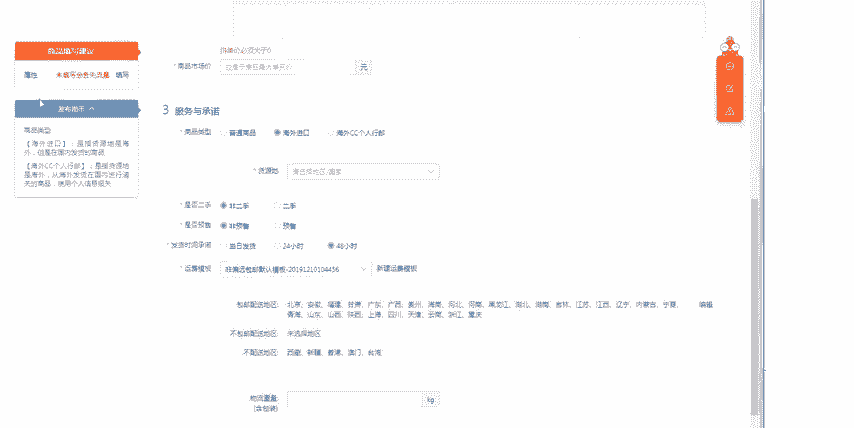
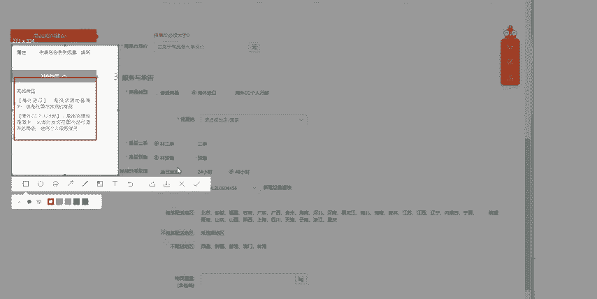
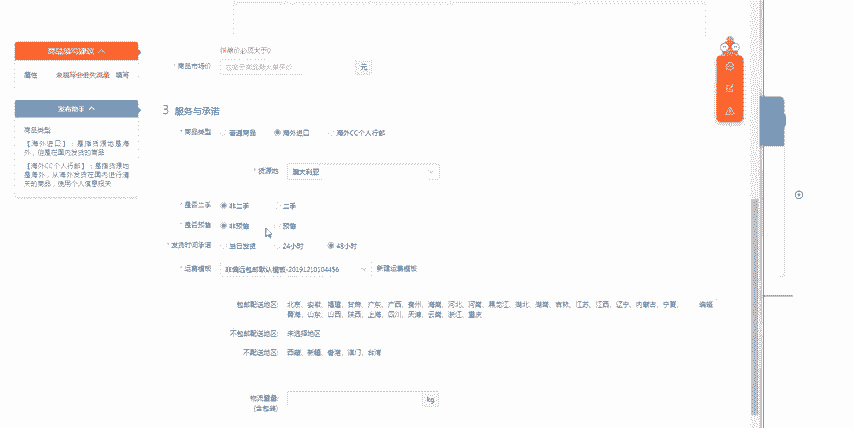
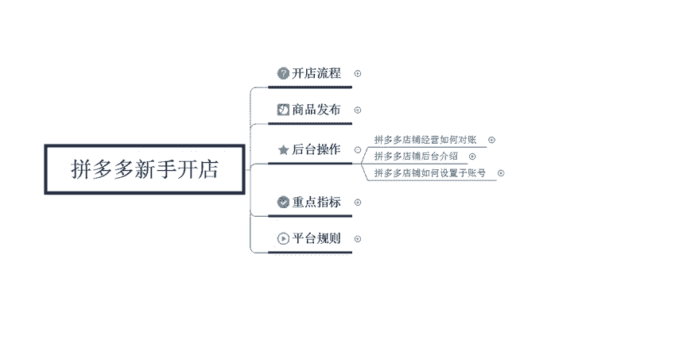

# 【拼多多运营】2024目前最新的拼多多开店新手教程！每天30分钟，零基础电商运营快速起店，实现日销千单！ - P25：25 拼多多发布宝贝服务与承诺设置 - 拼多多-运营 - BV1812mY6EFh

电商无止径学海苦多多。hello大家好，我是巨黄教育的西楼。欢迎大家来到我的拼多多干货分享的系列课堂。那么今天要给大家分享的内容呢是拼多多发布商品的最后一节课，也是第六节课程啊。

我们在拼多多店铺发布商品的时候，如何来设置商品的服务与承诺。因为很多的新手卖家可能对于这个拼多多呢了解并不是特别深入。在讲这个发布实际发布之前呢，我们啊我们要先了解的一个东西呢，叫做拼多多的商品类型。

拼多多的商品类型呢，它分为啊其实是分为商品啊，是分为这个三种的。你打开这个拼多多店铺的一个后台，我们点击发布商品之后呢，你可以看到具体的一个啊发布商品的实际的一个效果啊。我们现在来实际操作一下。

比如说点击发布一个新商品，随便先选择一个类目。好，数码家电啊，然后选择办公用品，办公用纸啊，传真纸。然后点击发布之后一直拉到最下面的一个位置。这边呢第三个部分有一个服务与承诺商品的一个类型呢分为三种啊。

普通的商品，海外的海外进口的商品，还有这个海外的CC个人行邮。海外CC个人行邮呢又包含两种，一种呢是直供的，一种是直邮的啊，一种是直供的，一种是直邮的。所以说我们在啊点击这个发布的一个过程中呢。

然后在左侧的这个位置呢，就会有对应的一个发布助手啊，这个发布助手呢会让你填写对应的一个相关的信息或者是我们所需要注意的一些点啊，要根据于呃后台的一个提示来进行填写。

比如说海外进口的和这个凡是海外的这个商品，我们都必须要选择对应海外的一个呃地区到底是哪里的？比如说我们的产品发货货源地呢是澳大利亚，我们就选择澳大利亚。那么第二个我们要了解的东西是什么呢？

是我们的商品是否是二手的，我们直接默认的，就选择是非二手就可以了啊，非二手就可以了。因为二手的商品呢其实在这个拼多多里面是不太好卖的啊，是不太好卖的。普通的商品呢是没有办法选择的啊。

建议大家就直接选择非二手来进。

嗯操作。好，那那个第三个点呢就是发货的时间和承诺。这个发货的时间和承诺呢有24小时和48小时两个类型。我们啊比如说你选择这个24小时发货呢，它会有对应的一个权重标签。

承诺这个16点之前的订单完成的一个订单呢，必须要在当日啊24点前去进行发货。所以说你如果说可以达到这样的条件的话，那么你就可以显示有急速发货的这个服务标签，它会直接展示在你商品的首页啊。

你就是呃商品的首页以及商品的详情页全部都会显示这个急速发货。对于我们的宝贝呢会有一定的一个权重加持，而且呢也会有比较好的一个转化率啊。消费者看到之后，它就会直接形成转化。那如果说你选择这个48小时呢。

那你就没有办法了啊，就没有对应的一个标签了啊，当日发货同样也是一样的啊，同样也是有这个呃。

有这个急速发货的一个服务标签的啊，当日和24小时都是OK的啊，48小时是没有的啊。这个点一定要记住。好，那这个呢就是第三个我们要了解的啊，发货的这个时间承诺。那第四个呢是是否预售。

我们的产品如果说是预售产品，那么你就要选择预售。如果说是非预售，那么就选择非预售，一般情况下，我们的产品都是属于非预售的一个产品。如果说大家是要做那一些比如说水果应季的一些水果。

它可能就是预售的一个产品。那么你在填写这个预售的时候呢，那么你要实际填写你到货的一个时间啊，必须要在承诺发货的一个期限内把对应的一个产品去发出去。比如说我们定时预售设置预售的一个时间。

需要在预售时间当天的这个呃当天结束之前完成发货，否则的话会被判违规。那么我们就需要填写对应的一个预售时间。比如说预售，我们是承诺在7月6号的时候去。进行发货。那么7月7号0点之前。

我们就必须要把货物给发出去啊。好，那么最后一个呢就叫做是这个运费模板的一个要求啊。运费模板呢你可以自自己去进行添加。那前面的时候呢，也给大家讲过这个运费模板是应该怎么样来去进行设置。当你设置好了之后呢。

然后你填写对应的一个运费模板就OK了啊，这个也是比较简单的，我们前面讲过了，我就不再多提。那呃下面一个呢叫做团购的一个要求。一般情况下，我建议大家选择两人团就可以了，便于成团促进转化。

当然你也可以去选择其他的这个啊，就是这边会有一个拼单的一个要求啊，拼单人数，选择两人就可以了。那么最后一个呢就是对应的一个承诺啊，7天无理由退货是必须要开的啊。然后这个假一赔十也是必须要开的啊。

这个默认的就OK了。我们把这些东西填写好之后，点击提交并上架，就可以正常的去进行发布宝贝了。好，那么以上呢就是我们在发布宝贝的时候的最后一步啊，从最基础的拼多多开店从哪里去找到发布商品的一个入口。

然后设置运费模板填写基本的信息，商品的描述，还有规格以及服务与承诺全部都给大家讲完了啊，所以说拼多多的这个发布商品系列的课程总共6节课，到这里就告一段落啊。那么后期如果说大家有任何不理解的。

或者是没有学明白的，可以直接私信老师，或者是在评论区留言。老师看到之后呢，都会一一的给大家做回复啊。那么后期呢我也会定期的在这个平台分享更多的一些拼多多干货的内容啊。那么下一个。

其呢可能给大家带来的一个内容呢是这个后台的基本的一些操作啊，比如说我们的一个如何对账啊，后台的一些基本介绍，还有设置子账号的一个啊具体的一个操作，总共三节课程啊，来带给大家。好。

那么今天给大家的一个分享呢，到这里就结束了。我是巨黄教育的西楼，感谢大家的观看，再见。

