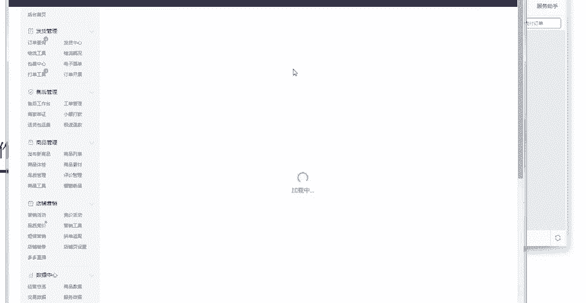

# 【拼多多运营】2024目前最新的拼多多开店新手教程！每天30分钟，零基础电商运营快速起店，实现日销千单！ - P26：26 拼多多新手开店对账操作 - 拼多多-运营 - BV1812mY6EFh

电商无止境学海苦浙斗。hello大家好，我是巨黄教育的西楼。欢迎大家来到我的拼多多系列课堂。那么今天要给大家开始新一期的一个系列课程啊，拼多多新手开店过程中，我们后台的一个操作啊。

后期的一个视频呢可能会有三节的一个课程。我们今天先来了解一下啊，今天第一天的一个呃课程内容，我们拼多多后台里面如何来找到我们店铺经营中对账的一个方式啊，以及我们对账的一个入口啊。

那么首先我们要了解这个东西的目的是什么呢？是因为我们需要知道我们的钱都到哪里去了啊。比如说你可能会遇到这样的情况，我的钱最近呢手头有点紧啊，怎么在店铺里面去进行提现。

那么你可以找到呃这个其实呢是非常简单的啊，你直接打开这个商家管理的一个后台，然后点击这个账户资金贷款账户，然后点击提现就可以了。审核过后呢，然后直接绑定到你的银行卡里面啊，可以提到你的银行卡里面。

每日呢只可以提现一次啊，一般最小的一个金额呢是100元，然后申请提现的一个时间呢，需要1到啊两个工作日的一个审核啊，然后审核之后呢，会在啊三个工作日内啊，到账啊，如果是有这个法定节假日或者是周末的话。

会有延迟啊，那么后呃这个呢就是具体的一个操作的一个路径啊。那么我们来呃具体的看一下后台是在哪里去进行操作的。首先我们打开一个店铺啊，然后找到店铺的一个后台。找到店铺后台之后呢，然后你在左侧的这个位置呢。

这里面呢是你所有的这个后台里面的可以使用到的一些工具。那么你直接找直接下拉，在这边找到一个账户资金，这边有一个贷款账户啊，然后你直接点击贷款账户就可以点击进入了。在这个贷款账户里面呢。

你可以看到你店铺里面总共可以使用的一个提现金额有多少元，然后你直接点击提现就可以了。然后这边呢会显示你提现中的一个金额有多少。比如说我们现在呢提现中的一个金额呢，有280元啊。

那么你在这这边呢还会有同时有有这个余额的一个记录啊，好，那这个呢就是我们实际在提现过程中所需要操作的一个后台的一个操作啊，那么呃第二个问题呢，是你要了解一下我们的店铺里面经营到底有赚到多少钱啊。

那么这个时候呢，你打开这个商家管理的后台，然后点击这个。

贷款对账单啊，然后在这个贷款对账单里面呢，我们可以直接查看明细，看一个月的看一年的啊，然后都是可以的。然后点击这个高级选项呢，也可以筛选不同的一个账单类型，如果说需要用表格的话，那么我们可以直接下载啊。

然后在这个费费用里面呢，它有不同的一个呃范围，比如说贷款的一个具体的一个情况，比如说我们到账的一个说明啊，快递物流签收啊，然后还有这个消费者主动确认收货之后自动签收啊，直接打款的一个一个金额到底有多少。

然后还有这个技术服务费啊。因为有一些店铺呢，它是有这个技术服务费的啊，技术服务费呢是之前的一个手续费，加上我们后面支付的一个服务费啊，然后由这个微信或者是支付宝啊，直接去进行充值的啊。

充值到平台平台收钱的一个手续费。那么最后一个呢就是对账的一个范围啊，跨度最长呢是查询时间呢是31天啊如果说啊最。多呢可以看这个50万条。也就是说啊如果说你订单卖的比较多的话。

你也只能看到啊最近期的这个50万左呃50万以内的一个账单。好，那么我们具体的来店铺后台来进行操作一下啊，打开我们店铺后台之后呢，然后找到对应的啊资金账户里面啊，然后这边有一个贷款对账单。点击进入之后呢。

然后这边呢你就可以看到啊每一笔的这个交易的支出，还有交易的一个收入啊。如果说你自己想要看这个一年的话，那么你就看这个点击月份啊，如果说你要看一个月的话，你就点击日啊，然后选择对应的一个日期啊。

比如说查询完成之后呢，你可以直接点击导出就可以下载为表格。好，那么这个呢就是我们在查看我们店铺经营可以赚到多少钱的一个具体的位置啊，那第三个部分呢是我们所需要交的一个钱啊，我们交的保证金是交到哪里了啊。

保证金呢它是分为这个几几种的。第一个呢是店铺的保证金。第二个呢是活动保证金。第三个呢还有营销保证金，保证金呢只有在创建这个限时免单，还有拼单返现，还有这些营销计划的时候呢，会使用到啊。

比如说在店铺后台我们经常会使用到的一个工具是什么呢？比如说营销工具。在设置这个营销工具的时候，拼多多里面都是需要你先进行。充值了保证金之后，你才可以创建对应的个呃订单。比如说我们创建这个拼台返现。

创建拼单返现返现的时候啊啊，这个我已经创建过了，我们重新换一个。比如说这个关注店铺的优惠券呀，或者是领券中心啊，你在设置的一个过程中呢，你点击这个创建你。比如说啊比如说我们呃操作的时候呃，更多操作。

比如说我们要现在要啊想要去这个修改返现的一个设置。比如我们需要这个呃满19返这个2块钱。那么活动的一个预算呢就是76啊，那这个活动这个预算，这76呢是需要你先进行充值的啊，是需要你先进行充值的。

那么我们可以在更多操作，这里这里呢点击前往充值，你需要先充值了这个对应的呃金额之后呢，然后才可以创建啊，把这个活动给创建成功。好，那么这个呢就是我们的一个营销保证金。那么我们再看一下活动保证金。

活动保证金呢是你在参加一些活动，比如说啊秒杀活动它就需要5000元的一个保证金啊，我们直接点击呃活动推广。

比如说点击这个营销活动，然后找到对应的秒杀活动。啊，我们直接搜索秒杀。好，我们在点击报名的时候呢，你在这边会有对应的一个活动要求，看到了没有？报名资质，然后点击查看原因。

报名需要先缴纳5000元的一个呃人民币的以上的这个保证金，那么就需要你去进行充值，然后你在这边点击充值，然后把对应的保证金充值进去就可以了。然后在上架这个活动的时候呢。

并不是说你交的这个并不是他的一个呃保护费。只是说交了之后，如果说你的店铺存在违规的一个情况，或者是需要给这个客户打款的一个情况下，它会直接扣除你的保证金啊。如果说你没有违规的情况下。

你的保证金是保持不动的啊，就一直会存在的啊。如果说到时候啊你不想上这个活动呢，你可以直接把它提现。

好，那这个呢就是这个活动保证金。最后一个呢就是店铺保证金是开店的时候，我们都必须要去呃这个充值的啊。我们个人店铺呢是2000元。然后企业店铺呢是1000元。那这个东西比较简单，我就不多提了。

那最后一个问题呢，就是我们的钱呢，在做这个订单的时候，我们为什么扣钱了，你们可以直接去看这个扣款的一个明细，那们扣款的明细呢主要也就是分为这三个部分。第一个是延迟发货，它会罚款。第二个呢是缺货啊。

它也会罚款。最后一个呢是小额打款的一个明细。我们通过也可以通过商品的1个ID还有扣款时间，还有订单编号啊，这些信息可以去进行查询啊，比如我们打开我们店铺的这个后台之后呢，同样还是在这个资金账户里面。

我们找到对应的贷款扣款明细啊，点击这里面之后呢，然后你就可以找找到对应的一个扣款的一个时间。比如说我们最近24小时内有没有扣款，对吧？对应的24小时内就没有货款。那最近30天呢也没有发生过扣款。

所以说说明你的店铺经营是比较正常的啊，缺货扣款是什么呢？啊，比如说你店铺里面有没有这个缺货导致的处罚啊，很明显在店铺里面是没有的啊。另外一个就是小额打款啊，小额打款啊，你需要给这个商家啊。

或者商家你需要给这个消费者去退一些差价的时候，那么你在客服的这个页面呢可以使用这个小额退款的一个功能。好，那么以上呢就是我们在新手在操作的一个过程中啊，如何来这个经营过程中如何来进行对账的一个操作啊。

我们店铺的一个后台所需要认识到的一些东西啊，那么以上呢也是今天要给大家分享的啊系列课里面的第一节啊。所以说其实说想要做好这个拼多段有很多的细节，大家也是需要去注意的啊。电商就是这样重在分享。

后期呢我也会分享更多的这个坐店的心得和经验给大家啊。那么今天呢给大家分享的一个内容呢，到这里就结束了啊。如果说大家有任何不理解的地方，或者是不明白的地方，可以直接私信我，或者是在评论区留言。

后期我也会定期分享更多的干货内容啊，我是巨皇教育的西楼，感谢大家的观看，再见。

