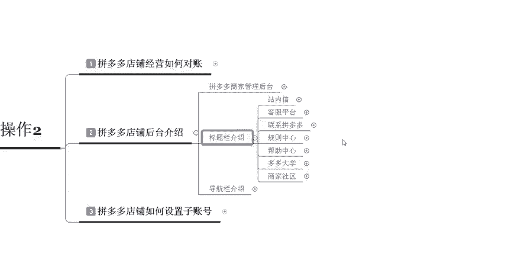

# 【拼多多运营】2024目前最新的拼多多开店新手教程！每天30分钟，零基础电商运营快速起店，实现日销千单！ - P27：27 拼多多开店后台操作 - 拼多多-运营 - BV1812mY6EFh

电商无止境学海苦舌兜。hello大家好，我是巨黄教育的西楼。欢迎大家来到我的拼多多系列的干货分享课堂啊，那么今天呢我们进入到拼多多开店后台操作的第二节课程。

我们呃先来认识一下拼多多的一个后台以及后台里面基本的一些介绍。啊，首先呢我们先打开一个拼多多的店铺。当打开店铺之后呢，在呃我们所看到的一个页面呢叫做聊天框。聊天框的左下角会有一个小房子的这个标志。

然后点击进入之后呢，就可以直接进入到我们的一个商家后台啊，进入到商家后台之后，我们所看到的一个就是后台的一个首页啊，也就是我们第一个要基础了解的拼多多商家管理的一个后台从哪里去进入。那么进入之后呢。

我们所看到的这个页面。比如说我们可以看到发货管理、售后管理，还有商品管理、店铺营销数据中心以及账户资金，还有多多客服，多多定宝推广中心，还有店铺管理，商家服务市场等等这几个呃不同的一个分类。

那么这个呢就叫就是这个呃商家的一个后台的一个中心。那么正。呃，我们映入眼帘。第一个的一个位置呢叫做我们今天成团的一个单数以及呃待签收的一个订单数，可以看到我们实际的一个经营情况啊。那么了解到这个之后呢。

我们再来介呃看一下这个标题栏的一个介绍。这个标题栏呢，是指的我们在商家后台正上方的位置啊，也就是大家所看到的这个位置啊，会有一个站内性规则中心，还有商家成长以及下载这个客户端啊。

那么我们重点在呃运营店铺的一个过程中所看的一个东西呢，叫做站内性。在这个站内信里面呢，它会呃非常多的一些这个通知啊，不管是呃关于这个呃平台给你所发的一些处罚，或者是或者是你的店铺里面呢。

会有一些呃不同的一些信息。比如说呃活动的一些邀请啊等等，都可以在这里面去进行找到啊。然后呢还有一些比较重要的一些通知。比如说规则的一些更。

新啊，对吧？比如说这个春节发货的一个规则或者十一假期啊，正常发货的一个通知。那这些东西呢是需要大家实时的去关注，实时的去了解的啊，那么我们经常所用到的呢，就是规则的更新以及资源推广里面的一个内容啊。

我们可以看到我们整体的啊哪一个产品的一个资源位呢会有对应的一个竞价，我们可以自己去进行调整啊，那么这个呢就是这个站内性。那站内性我们还要看的一个东西呢啊叫做规则中心。

也就是我们标题里面的第二个啊啊在这个规则中公规则中心里面呢会有非常多的一个嗯不断完善的一个内容。因为拼多多其实它现在对于规则上面管理的并不是特别的多。但是说管理的是非常的严格的啊，虽然少。

但是说比较严格。所以说这个规则大家一定要实时的去看在这个规则里面呢，你可以看到所有的一些招商规则运营规则，还有这个服务规则啊等等这些详细的一。

些解说。那么大家时时要去关注。比如说最近的这个拼多多技术服务费在7月2号的时候啊，7月2号也就是啊前天的时候呢，他发布了一条这么样的一个规则啊，那么会有对应的一个这个啊，比如说像有一些有一些类目呢。

它这个呃类目的一个服务费率呢就会变高或者是调低。那然这样的情况下，我们对于我们后期的一个店铺运营呢会呃有一些的这个影响。所以说我们需要实时关注啊，那么这个呢是这个啊规则中心啊。

那么还有一个我们经常会用到的一个东西呢，叫做多多大学。就是打开这个之后呢，我们在这个商家成长里面呢，我们可以找到这个多多大学。在这个多多大学里面，你可以啊其实像这里面的一个东西呢。

大家可以去看一下就OK了啊。因为这里面有一些非常多的一个基础。比如说像这个新手开店的时候啊，怎么样发布我会和一些所需要注意的啊，是大家平时交流或者是互动啊。

或者是这个学习一些呃比较简单的一些知识的一些地方啊，那么大家可以去了解一下啊，那最后一个呢就是商家社区。这个商家社区呢，你在这个呃同样也是在这个商家成长里面呢，你可以点到这个商家社区啊。

商家社区里面呢会有一些这个。

嗯，比较好的一些问答，还有一些热帖，或者说我们自己呢也可以去里面去发帖。比如说像这种收藏关注啊，你发了你的产品之后呢，会有一个对应的一个呃关注。那当你的这个关注数达到一定程度的时候呢。

那么你后期可能会去做一些运营啊，还有一些呃其他的官方的发的一些呃，比如说这边呢就有一个拼多多服务市场官方啊，那他发的一个新店运营必看的一些内容呢，大家可以去做了解。好，那这个呢就是标题栏的一个介绍。

那最后一个呢是导航栏的一个介绍。导航栏呢相对来说就涉及到的一个内容就比较多了。比如说我们发货售后，还有这个店铺营销数据工具。这里面呢每一对应的每一个工具呢都有不同的一个作用啊。

那如果说大家想要详细的去了解每一个点啊，所带来的一个具体的作用的话啊，大家可以直接啊在评论区给我留言或者是直接关注我啊，私信给我也是O的啊，也是O的啊。因为这一个呢其实我之前的时候呢有单独的给大家讲过。

比如说发布商品的时候啊，我们有讲过这个系列课程，发布商品的时候呢，应该注意哪些点啊，包括我们商品体检的时候，应该怎么样去进行操作看具体看哪些数据。那么这个呢就是呃一些细节上面的一些操作。

那如果说大家想要学习的话，可以直接私信我啊。那么今天呢给大家这个介绍的一个内容呢，大致就这么多啊，后期呢。如果说大家想要学习更多的干货内容，我也会在这个平台定期的去分享更多的拼多多干货内容啊。

大家可以随时关注我或者是私信我啊，包括你们想要学习的一个内容。比如说大家啊经常有这个朋友呢给我留言，想要学习这个啊多多的搜索推广啊，还有多多进榜啊，有问我有没有资源啊。那如果说你们也需要的话。

可以直接在评论区给我留言或者是私信我。好，那么今天给大家的一个内呃分享呢，到这里就结束了。感谢大家的观看啊，我是巨皇的教育的西楼啊，再见。

