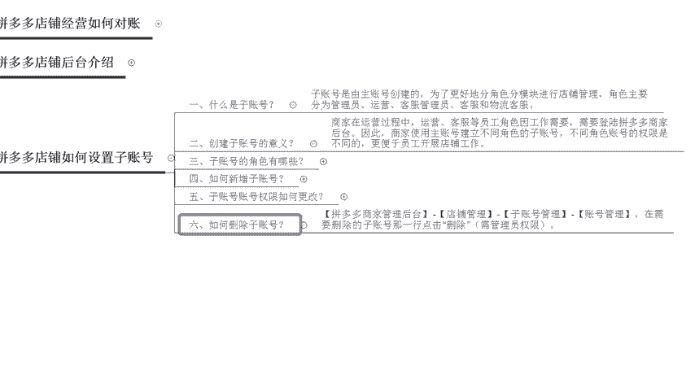
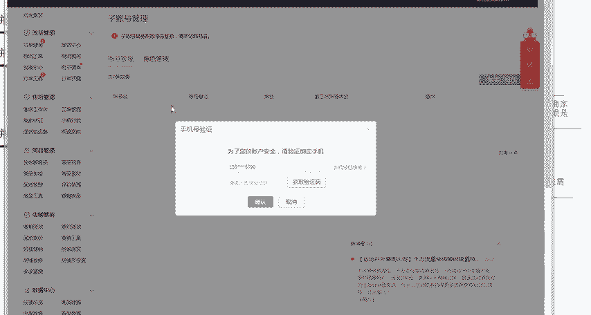
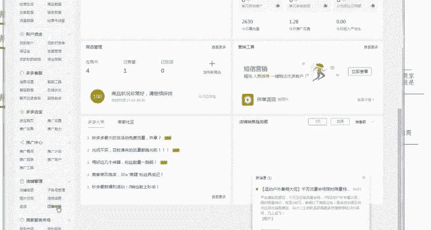
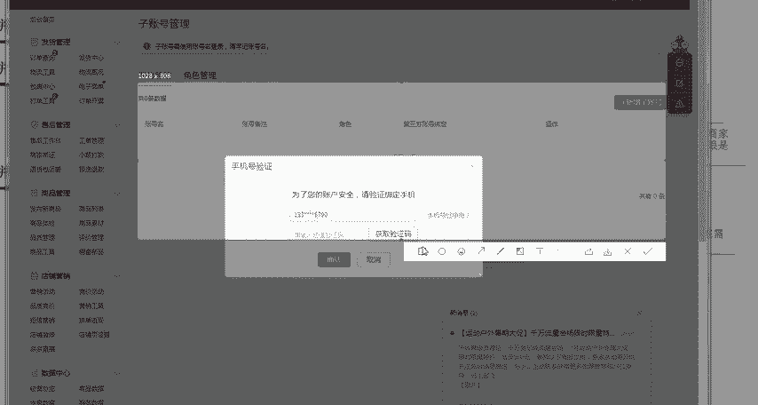
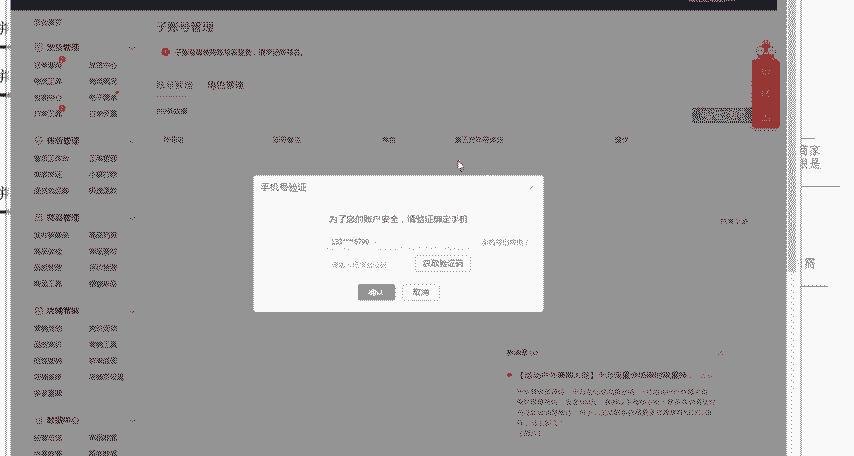
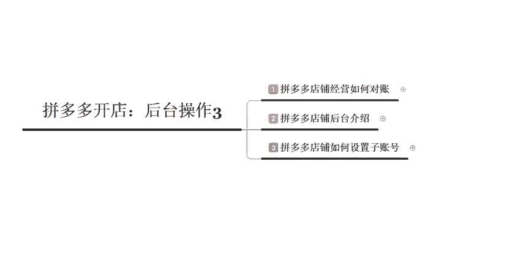

# 【拼多多运营】2024目前最新的拼多多开店新手教程！每天30分钟，零基础电商运营快速起店，实现日销千单！ - P28：28 拼多多店铺如何设置子账号 - 拼多多-运营 - BV1812mY6EFh

电商无止径学海苦多多。hello大家好，我是巨皇教育的西楼。欢迎大家来到我的拼多多系列课堂呃，拼多多开店后台操作系列第三节课程啊，我们今天呢主要来聊一聊拼多多店铺如何来设置这个子账号。啊。

因为在这个拼多多里面呢，它很多的这个呃有限制会比较多啊。比如说某一个手机呢在开子账号的时候呢，呃不管你有几家店铺，这一个手机呢只能绑定一个手机啊，只能绑定一个子账号啊。

所以说呢现在有很多的这个呃做店群的啊，就遭到了一些。比较大的一个呃相当于是挑战吧哈，这个子账号呢都开通不了啊。那么我们呢呃先来了解一下这个子账号是在后台的哪一个部分啊。

了解一下他现在呢到底有哪一些呃新的规则啊，首先呢我们来认识一下什么是这个子账号。子账号呢，其实就是由这个子账号创建的，然后给我们的店铺进行分类的一个呃这样的一个管理后台啊。

比如说你店铺里面呢有对应的一个员工，你的员工呢，可以分为这个运营，也可以分为客服。那么你就可以给不同的员工呢开一个不同的一个子账号啊，相当于是分管于你店铺里面不同的一个板块。

那运营呢他就可以查看你店铺的一个数据。那客服呢，只能查看你店铺里面的一些呃客户的一些聊天。比如说客户来询单了之后呢，你可以呃。不断的去回复客户啊，回回复这个客户，然后呢给他们去解决一些错误的问题啊。

所以说呃这个子账号整体的一个分类呢就是这个管理员运营，然后还有这个客服管理员以及客服和物流客服啊，后台的这个位置呢，我们在打开这个后台之后呢，然后在左下角的这个店铺管理里面，你可以找到对应的子账号管理。

好，我们直接打开这个后台，打开后台之后呢，然后呃需要用这个主店啊，打开之后呢，在左下角的位置，你可以找到对应的一个呃子账号创建的一个页面。啊，那么创建子账号到底有什么样的一个意义呢？

它对于我们呃商家运营的一个过程中呢，运营客服，还有不同的一个角色呢，他的一个工作需要。所以说你需要有呃不同的这个子账号给他开通不同的一个运营权限，便于这个员工可以开展店铺的一个工作。

那么子账号的这个角色呢，主要有以下几个类别啊，在这个角色管理里面，我们可以自己去进行调整。比如说我们这个管理员管理员呢是除了这个主账号之外，店铺权限最高的一个角色啊。

就是说这个店铺里面所有的权限你都可以去进行操作的啊，但是说有一些比较特殊一点的权限是没有的。比如说啊更换这个产品的一些主体信息啊，或者是你上传啊。跟这个产品相关的啊，跟店铺相关的一些。

比如说啊出账入账啊，这些都是需要主账号来进行操作的。管理员也是没有权限的啊，那运营呢就是拥有这个商品的上新，还有提报活动，还有订单的管理，还有客服咨询这些权限啊。

那么客服呢仅仅就是查看这个客服的一个工作状态，然后设置对应的一个离线消息，然后还有呃接收这个账号等这些权限啊，最差的那个这个权限呢，应该就是客服和这个物流客物流客服啊。

他仅仅只能查看我们呃买家的一个消息，然后处理买家的一个问题。然后物流客服呢是只能查看这个发货管理。所以说整体的呢在不应对于不同的一个角色的时候呢，我们所使用到的一个子账号的一个权限也是不一样的。

那么我们在新增子账号的时候，怎么样来进行新增了，我们需要打开我们店铺的一个后台，在子账号管理里面点击新增子账号。然后点击到这个页面之后呢，我们可以看到下面的这个位置啊。

就是说使用这个主账号设置好的这个子账号账号和密码。那么我们在输入子账号的时候呢，需要填写一个手机号。那这个手机号码呢是必须在拼多多里面没有呃没有在任何一家店铺里面去注册过的啊。

因为在拼多多里面一个手机号只能。开一个这个账号。那么我们账号的这个名称呢，请千万要记住，这个账号的名称并不是啊直接给到你的那一串数字，而是你自己手动添加的啊，比如说我们添加的这个账户名啊。

叫做这个教育123。那么你在登录的时候呢，就需要使用这个账户名啊，聚黄教育123来进行登录啊，所以说这个点一定要记住啊，一定要记住牢记这个账号名，子账号需要啊子账号呢需要使用这个账号名来进行登录啊。

给到你的什么啊PDD155啊，类似于这样的一个一串数字的，它并不是你登录的一个账号啊，那么最后一个这个新增子账号的时候呢，需要使用到这个主账号或者管理员绑定的个账号来进行短信验证。这个点呢。

也是需要注意的啊，没有这个手机的时候呢，你要是没有办法去创建这个子账号的啊。那么第五个呢是我们来了解一下这个子账号的一个权限，如何来进行更改。其实这个也比要。简单啊，只有这个主账号和管理员。

他可以对于我们的一个呃账号角色可以去进行修改啊，你直接点击到后台，然后点击这个更改子账号的一个角色啊，然后呢编辑子账号啊，点击这个账号管理编辑权限就OK了啊，就可以修改它的一个呃角色啊。

然后呢权限同时也是一样的啊。在修改之后，然后对应的个权限，后面去打击呃，点击这个打勾，然后就可以开通对应的一个权限。好，那么这个呢就是我们在更改这个子账号的时候呢，权限的一个修改的一个方式。

那最后一个呢就是删除子账号，删除子账号的时候呢，是需要使用到主账号或者管理员啊，然后在这个账号管理里面直接点击删除就OK了啊。那么接下来呢我们来实际的这个后台来操作一下啊。

到底应该怎么样去创建这个子账号。

好，我们打开一个后台啊，打开后台之后，在左下角的位置有一个店铺管理。店铺管理里面呢会有一个子账号管理。你点击子账号管理就可以进入到对应的一个页面啊，然后在这边呢需要你输入一个手机验证码，然后去进行验证。

验证完之后呢，对于对应的会有一个呃角色管理啊，会有一个角色管理，有一个账号管理和管理。当我们这个把角色管理和账号管理理清楚之后呢，这边就会显示出对应的一个账户名，还有账号的一个备注以及角色啊。

是否有绑定这个微信。那么我们在呃右侧的这个位置呢，就可以找到对应的一个呃删除或者是编辑权限的一个按钮。那如果说我们需要修改角色权限的话，就点击角色管理里面会有对应的一个呃角色管理的一个操作啊。

其实整体的一个操作呢，相对来说是比较简单的。那么大家现在有没有学会这个拼多多店铺如何来设置子账号呢，呃，后期呢。

我也会在平台里面去更新更多的呃拼多多的一些干货内容。那如果说大家有任何不理解，或者是想要学习其他干货的，可以直接私信我，或者是在评论区给我留言啊。今天给大家的一个啊内容分享啊，到这里就结束了啊。

请记住我，我是巨皇教育的西楼，感谢大家的观看，再见。

