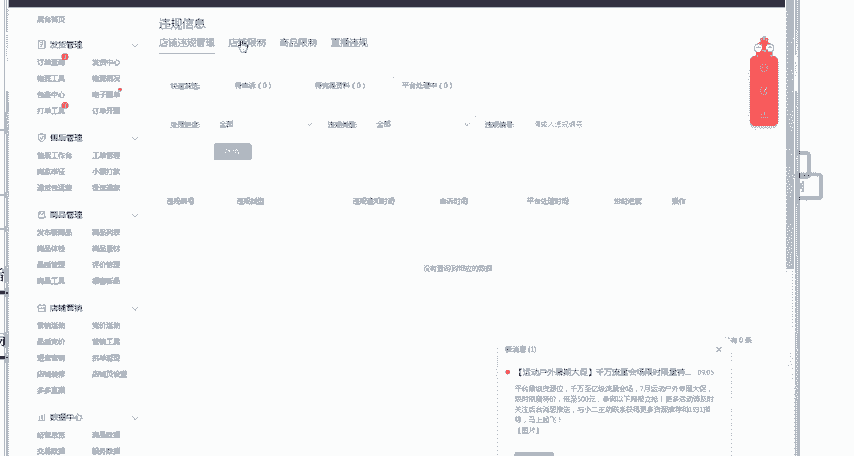
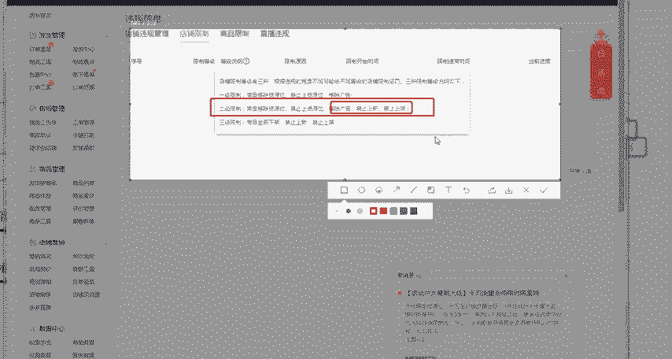
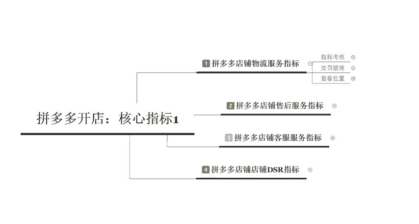

# 【拼多多运营】2024目前最新的拼多多开店新手教程！每天30分钟，零基础电商运营快速起店，实现日销千单！ - P29：29 拼多多核心指标之物流服务指标 - 拼多多-运营 - BV1812mY6EFh

电商无止境学海苦作周。hello大家好，我是巨皇教育的西楼。欢迎大家来到我的拼多多系列课堂。呃，那么今天我们来呃了解一下拼多多开店里面的核心指标的啊四节课程。我们今天呢是核心指标里面的啊第一节课程啊。

拼多多店铺的一个物流服务指标啊，有很多的小伙伴呢呃可能刚刚开始接触拼多多不太清楚。在拼多多里面其实对于拼多多里面店铺整体运营的一个节奏呢，它都会有对应的一个指标去进行考核啊。

那么作为核心的呢就是以下给大家列出来的啊，也会在后期分为四节课程啊，给大家分别去进行讲解。我们今天先来了解一下拼多多店铺的物流服务的一个指标啊。首先呢它指标的一个考核呢也是比较简单的啊。

他会考核这个物流服务异常的一个订单数，还有物流服务异常的一个订单率啊。所以从我们在操作的时候呢，如果说你发现你的物流呃突然间。变多了这个异常的这个订单数变呃增多，它的一个异常率呢增多。

这可能会导致你店铺里面呢呃所获取到的整体的一个推荐式的流量会变低。那么它重点考核的时候呢，是以什么样的一个标准呢？就是说近30天以内的一个虚假发货，还有物流时效，或者是发生了这个有效的物流投诉啊。

还有售后退款等这些原因与物流相关的一个或者说或者说和这个物流服务的DSR啊为一分这个订单来进行计数的。呃，如果说有一些地区呢，比如说像这个呃收件地为新疆地新疆地区的一个订单啊。如果说除去这个虚假发货外。

其余的订单数呢，它是不计入这个服务异常订单的啊，所以说呃如果大家在操作的一个过程中呢啊，像这个新疆西藏啊这些偏远一点的一个地区出现物流啊。延后啊或者是这个物流包裹出现问题啊。

它是不会被记入到这个异常订单里面的那这个物流服务的一个异常率到底是应该怎么样来理解呢？它指的是我们近30天的个物流异常率呢。

等于近30天的一个呃异常订单总数除以我们近30天内的一个呃物流异常订单乘以100，然后再加上这个近30天成团的一个订单数啊，就是说我们成团了多少订单，然后发出去多少多少的一个订单。那么我们呃把它。

除以啊这一个。定30天以内的一个物流服务的一个订呃异常订单。那这个东西到底在哪里看呢？我们直接打开我们店铺的一个后台。打开我们店铺后台之后呢，然后在这个包裹中心这一个位置。

我们可以看到啊有很多的这些包裹。比如说我们的包裹有没有揽收超时或者是派签超时或者是啊集简揽件超时，我们可以不呃去筛选对应的一个订单。比如说啊揽件超时的一个订单到底有哪些啊。

或者是这个派签超时的一个订单有哪些那如果说你直接这个查出来某一个订单是已经有了这样的一个状态的情况下，那么我们需要去及时的点击处理，这边呢有一个对应的一个处理状态。那么我们所需要的就需要点击已处理。

这样的话可以降低你的一个损失。啊，那么这个呢是重点考核的一个指标，大家把这个公式给记下来就OK了啊，那其实对于这个呃服物流服务的一个考核指标呢，会有一系列的一个处罚啊，比如说呃它处罚呢是。

主要分为两种的。第一种呢是两项指标都高于这个同行5倍的一个均值。那么这样的情况下呢，会给你的店铺啊，有这个二级限制，全店商品降权。那么第二个呢是呃如果说你的两线指标呢啊持续高于这个类目均值的这个5倍。

那么它会直接下资源位，然后禁止上资源位和降权限制。就是说如果说你这个物流出现了问题，而且比较严重的情况下，你全店的商品肯定是会被降权的。至于说你的店铺会不会呃被这个二级限制。

或者是下这个资源位或者禁止上资源位啊，就是看你具体违规的一个具体情况啊啊，千万不要以为这个呃这个规则啊，或者是限制这个二级限制啊呃没有什么啊，二级限制引来的一个后果是非常严重的，我们可以看一下。

你点击这个违规信息啊，点击违规信息之后呢，然后在这边会有一个店。

不限制大家可以看一下二级限制呢，它就直接是移除你的这个资源位，然后禁止上资源位。然后你广告也不能开，然后你的产品呢也不能上新，也不能上架，而且你全店的商品呢还会降权。

就相当于是你的店铺呢直接就变成了一个死店。

啊，所以说这个处罚是非常的严重的啊。那后期如果说大家在操作过程中也要注意这一个点。然后具体查看的一个位置呢，我们刚才呢已经讲过了，在我们店铺的一个后台找到对应的一个物流工具。

或者是物流概况或者是包裹中心都可以查看啊，那么这以上呢就是我们在拼多多店铺里面物流服务指标的一些具体的内容呢，包括他的指标考核，还有处罚的一些措施，以及我们查看的一个位置啊，所以说这个点呢。

大家千万要记住，在拼多多里面的规则是非常重要的。一旦你的店铺违规，面临的一个处罚是非常严重的啊，所以说啊在做店的一个过程中要注意这些细节啊，电商呢就是这样重在分享。

后期呢我也会把更多的一些拼多多开店的一些呃经验或者是心得来分享给大家啊。那么今天给大家分享的一个内容呢，到这里就结束了。感谢大家的观看啊，记住我是巨黄教育的西楼。有想要学习更多的干货内容呢。

可以直接呃在评论区留言或者是直接私信。啊，感谢大家的观看，再见。

