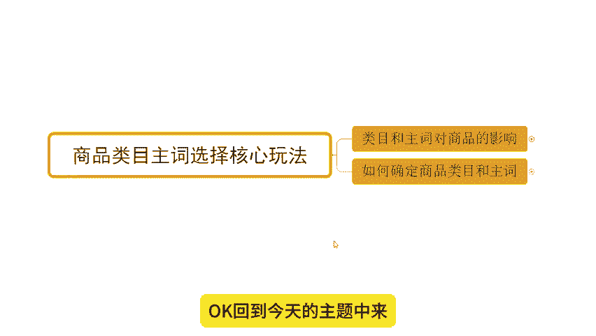
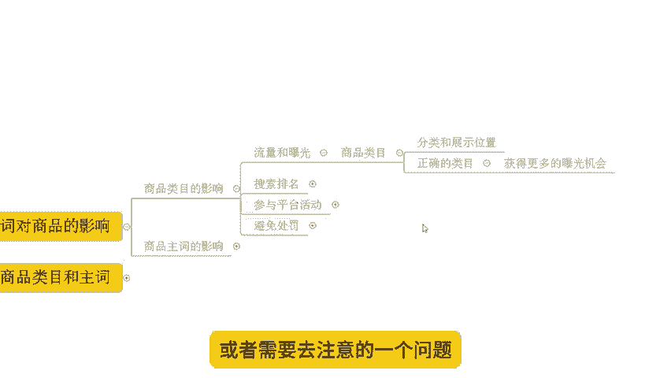
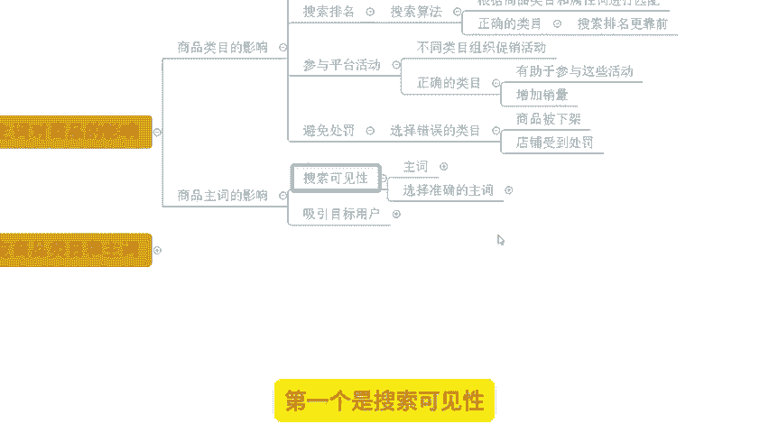
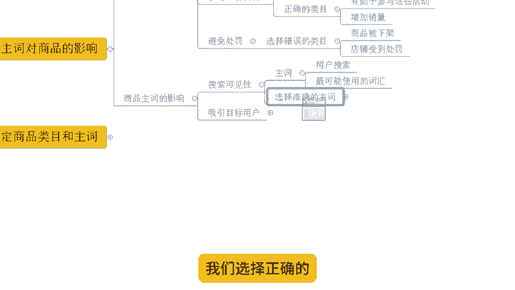

# 【拼多多运营】2024目前最新的拼多多开店新手教程！每天30分钟，零基础电商运营快速起店，实现日销千单！ - P2：02 拼多多商品类目主词选择核心玩法 - 拼多多-运营 - BV1812mY6EFh

hello，大家好，我是西楼。今天给大家分享的内容呢是我们拼多多新手日销签单报单实操玩法中的商品内部主持选择核心玩法。

在复养之前呢，先给大家看一下近期跟着时尚小伙伴的店铺数据，好吧。

可以看到啊，这个店铺呢原本是一个零访客的新店啊。那么从最早零访客开始呢，跟着实操，那么一步一步的完成我们产品的数据操作啊，得到一个数据提升。到后期的话一天访客呢做到了9000多啊，将近1万啊。

一天的订单呢是做到了1200多单，转化率呢13。27。那么客单价呢不是特别高啊，14。93块啊，但是也非常不错。那么像这个店铺呢，就是用到了我们今天要分享的这个玩法。

就是关于我们类目和主持的一个呃选择的核心玩法。那通过这个玩法呢，可以让我们产品获取到更高的流量上线，带来更好的推荐曝光是这样子的。

当然呢这个方式呢操作它也不是说仅仅只局限于我们一些这个纯新店或者是一些这个数据比较好的店铺不是的啊，其实在不同阶段呢，我们都可以用到这个玩法啊，可以看到像这些店铺。

那那么这个店铺呢也是一个有数据的店铺啊，早期的时候呢，访客做到了3000左右达到了一个瓶颈，没有办法突破。那更实操之后呢，也是有用到啊类目主持的一些核心选择玩法，进行了我们产品的关键词。

包括说商品内目的一优化调整。可以看到啊，优化之后呢，整个商品呢在后期一天的访客呢做到了100一天订单呢是2100多单啊，转化率14。67啊，客单价呢40多也都非常不错的。类似这种店铺呢。

有很多啊，可以看到对吧？像这个店铺啊，也是一个零访客的店铺，从最早没有数据，到后面一天3000多单，一天2万多访客，对吧？包括还有像这个店铺。

啊，2000多访客开始的到后期的话，一天也是10600的访客，一天1700多单，对吧？而这些店铺呢也都是通过自然流的方式来操作的啊。如果说你想要知道如何通过自然流来打造店铺爆款。

如何通过自然流来提升店铺数据，OK建议呢可以仔细观看我分享的视频，好吧。

那么店铺运营呢对于很多的新手小白来说呢，可能会有到很多的困难啊，这个是非常非常正常的事情。如果说你在店铺操作过程中有遇到问题啊，需要资料的呀，ok可以找我啊。那么有时间的话呢。

我也可以带着你一起实操做店啊，就像这些小伙伴一样呢，能够有到更好的方法。那我们店铺呢啊达到一个更高的水平，好不好？O回到今天的主题中来，今天我们分享内容呢是我们的商品内幕主持选择核心玩法。

那首先我们要搞清楚一个事情，就是内幕和主持对我们商品的影响有哪些好吧，一起来看一看。首先第一个商品内部的影响哈。商品内目呢你想分为几个方面啊，第一个呢就是关于我们流量和曝光啊，那么产品内部呢。

它会影响到我们商品的分类和展示位置啊，这个东西是不一样的。其实我们可以在我们的呃客户端我们可以看一看啊，在我们手机APP里面看一看。

对不对？其实我们如果说要选择某一个商品的话，我们可以搜索，也可以通过分类进行选择。那么在分类里面呢，我们可以看到不同的大类，不同子类目，对吧？而不同的子类目呢，它的展产品的展示是不一样的。

包括说我们平台推荐的一个分类也是不同的。所以在这种情况之下，如果说我们能够去选择一个正确的类目。其实呢我们就可以获得更多的曝光机会啊。我相信这个道理大家应该是懂的，就像我带着实操的小伙伴，对不对？

那我们能够选择到一个正确的类目之后呢，OK产品哪怕是新店新品，我们也能够去得到一个更多的推荐曝光，是不是？那么这个时候呢，在后期的增长速度，包括说后期的一个上线也会更高。好吧。

所以这是我们需要去克服或者需要去注意的一个问题。😊。

然后另外一点呢，它对于我们的搜索排名也是有非常大影响的。为什么这样讲呢？因为首先搜索算法啊，它呢是会根据我们商品的类目以及属性词进行一个匹配的啊。那么如果我们今天的这个产品搜索的关键词和我们的类目。

它不匹配。那么这个时候呢，你的展示的排名结果呢可能就会比较靠后啊，所以说你能够有到一个正确的类目选择呢，我们在搜索排名过程中呢也会更靠前。那从而呢也能达到更好的产品展示的效果啊，那同时另外一点呢。

还有就是我们可以参与到更多的平台活动啊，那么什么意思呢？不同的类目呢，它会组织不同的促销活动啊，那么正确的商品类目呢就可以有利于我们去提报这些活动，从而呢增加我们商品的销量。换句话说，你上错类目。

你的类目选择有问题，那么你可能报名活动都会受到限制啊。然而拼多多平台呢就是一个活。

有非常多的平台。那么如果说这些活动你没法去正常提报okK那么完犊子了，对吧？哎呀，你就直接就损失掉了一大部分的活动流量跟推荐曝光啊，得不偿失啊。那另外还有一点呢，就是正确的产品发布啊。

商品类目选择可以规避处罚。那么如果我们商品的类目选择错误啊。那么有可能啊注意会导致我们商品被下架，甚至店铺受到处罚啊，这是一个非常尴尬的事情啊，所以我们一定要选择正确类目去上传。😊。

OK那我们再来看一看我们商品主持的选择哈来商品主持呢，我们现在选择它的一个影响呢就主要是两个方面啊。第一个呢是搜索可见性啊，什么意思呢？首先主持啊这个东西呢是我们用户搜索最可能使用的词汇。

那么这个词呢是我们平台上可能当前这个产品呢，它的受众群体或者使用人群最多的，当然这个最多呢不光是我们的买家，我们的卖家也是一样的道理，对不对？所以说这个时候呢我们选择正确的啊一个准确的这个主持呢。

那么就可以提高我们的搜索可见度啊，那么如果说我们的主持群有问题，对吧？这个时那我卖的是衣服，你非得给我弄个裤子上去，对吧？别人搜裤子收益搜不到，对吧？你看到你是个衣服又不会典礼。

别人收衣服又收不到你那你说你能行吗？你肯定不行的，对不对？所以这是一个非常重要事情啊，就像我刚刚说的这些小伙伴一样的，他们也都是说能。😊。

够通过我们产品的呃这个类目的匹配，包括说我们商品的主持的一个确认是吧？完成产品前期的定位之后，真对性的进行策划来不断的操作的啊，包括像这些店铺啊，新店的这些小伙伴都是一样的，包括说一些这个老店铺啊。

老商家也都这么玩的啊，所以说这一点大家重点注意一下啊。那如果说你能够做了一个比较好的主持能够做到一个好的比较类目的话，OK的那起码来说你的产品初始曝光是不用担心的。那么这个时候呢。

你在后续能够有到很好的产品点击状态，包括说流量呈现能力没问题的话，那么放大数据，像我这个一样对吧？都是很容易的事情了啊，O。

再一个啊，我们来说一说关于我们主持方面的啊，他还可以去吸引我们的目标用户啊，这是一个非常重要的问题啊，就是准确的主持。注意啊，它是能够去吸引真正的这个兴趣用户的。

那么提高我们的点击率，还有转化率都是比较好的一个呃这个选择方式。就像我刚刚举的这个例子一样的，对吧？那用户呢他希望他买了一个产品呢是一个衣服。那我现在啊，我也是做衣服的。

但是呢用户呢希望它是这个衣服呢是长袖的是加厚的，哎，你是短袖，你不是加厚的对吧？你没有用到这样的一个呃相对于我们这个细分需求的一个主持呃，去很好的贴合我们的用户需求的话。

O那这个时候呢用户搜索出来之后呢，可能我们点击率可能我们转化率就会比较低一点啊，就这样子的会导致我们后期的操作呢会比较麻烦一点啊。那到底我们应该怎么去做呢？来如何确定商品的类幕和主持，可以看一下。好。

首先是内目选择类幕选择的话啊，那第一步呢我们要确认可选类目有哪些啊，那么怎么确认呢？来这里啊，我们可以在我们的发布新商品的页面啊，然后呢。

去搜索关键词啊，我把这个界面稍微的拖大一点，这个左个图片啊拖大一点啊。来在这个界面呢去输入关键词。比如说我产品是什么？我产品是苹果，我就搜苹果。我产品是这个连衣裙，我就搜连衣裙，我产品是这个剃须刀。

我就搜剃须刀，对吧？当我搜索完之后呢，平台会根据我们当前这个关键词呢来自动匹配出对应的一些产品的类目，供我们选择。当然我们可以直接在这边下面去选择这些细分的类目都是可以的啊。

那么这个时候我们就可以确认出来哪些是可以去供我们使用的，跟这个产品的关键词是比较匹配的。来给大家看一下啊，举个例子啊，举个例子，这里呢我搜了一个彩灯啊，这样的一个关键词，可以看到啊。

当我搜索彩灯的时候呢，O在这个下面呢框子里面就会弹出彩灯这个关键词所适配的类目有哪些。比如说第一个呢是我们的家居生活里面的节庆用品啊。然后呢呃装饰用品。

的这个灯串装饰灯啊，挂式灯笼啊，包括说我们的家纺家具家装里面的光源灯带，对吧？然后呢，还有我们的家居内灯饰啊，氛围灯啊，包括说我们的呃光源里面的LED灯板LED球这个球泡灯LED玉米灯LED灯杯啊。

LED飞离飞碟灯啊等等啊，都是我们可以去选择的。那么这个时候就有一个问题了，对吧？那这么多类目可以供我们选择，那我应该选择哪一个是我的最优类目呢？是不是？

OK啊，这里我说一下，其实没有什么最优类目啊，因为我们不同店铺，不同链接情况，不同产品，不同价格，它最终呈现出的状态是不同的啊。所以这种情况呢，我们要结合到我们的使用场景。

包括说我们的具体的一个价格情况来进行定位啊，定位之后呢，我们可以根据每个类目产品呢进行一个发布啊，那比如说我现在呢发布到灯串里面去。那么灯串里面呢，我们可以是以这个装饰啊装扮为主的啊，装饰装扮为主的啊。

那么节庆用品里面啊是这样子的那然后呢使用场景呢就是对应到一些节日啊，或者是一些这个呃庆典类的对吧？

那么进行一个主要的呃使用场景来作为一个营销。然后呢，对应的产品的内部呢进行发布，发布之后呢，来通过不同的价格发布之后来进行测试啊，找出数据表现反馈最好的。

那么可以多店铺多链接去完成这个动作。这个动作的目的呢是来测链接。因为不同的店铺不同的链接，它的反馈是不一样的啊。而我们现在呢做店铺呢，其实对于中小买家来说，你不要去想着做大爆款，我们就做小爆款。

那么测试出不同的细分的链接之后呢，我们对应的每一个店铺来做一个垂直的啊这个产品的运营啊，做一些小爆款出来就可以的，这样子会更好一点。相对来说成本可能会更省一点啊。O然后呢不同的链接发布之后呢。

根据结果来判断就可以了，对吧？是这样子的啊，那么每个店铺每个品类可能是不一样一样的啊，这里注意一下，然后再一个就是主持的确定啊，主持确定呢，首先第一个要根据产品特征，产品的特性进行选择，什么意思呢？

那不同地区的产品名称是不同的这一个点呢，可能很多小伙伴不是很理解啊，我们举个例子。呃，这个。棉衣啊，这个例子是我经常举的一个例子，棉衣啊。那棉衣呢可能很多地方呢都会叫他棉衣，但是有些地方可能会叫他棉袄。

有的地方可能叫棉服，对吧？那么它是有不同的名称的那这个不同名称呢，其实就是我们所需要去定位的不同主持，对应到不同地区，对应到不同地区的产品需求。那我们可以使用到不同的主持。

比如说呃我知道的北方地区啊比较多的地方呢会把棉服啊，这个棉衣啊称为棉服或者棉袄对吧？它会比较厚实啊，这个保暖性更好，要求更高，然后呢，这个防风性要更好，对吧？

如果说我们产品是符合这种特性的那我们可以用到棉袄或者棉服这样的一个词，包括棉衣去使用它啊，那么呃如果是南方地区可能我们更多就是款式没有那么的厚重，对吧？没有那么的呃这个保暖性那么强啊。

当然它不是说不要不要求保暖，只不过它没有那么厚啊，没有那么厚。所以说这种情况，这种款式我们可以使使用棉衣啊这种状态啊，这种关联词来进行使用它就O的啊，可能相对来说最终的一个用户的呃点击状态。

包括说售后的一个情况会更好一点。啊，这是一个。然后呢，不同产品是不同适合不同地区的。这个我刚刚其实通过这个例子也已经举举例说明了啊，这个我们就不去重点再去讲了啊。然后再来说一说。

根据我们市场的搜索进行选择啊，主持的确定呢，这个地方是有个非常重要点的，就是我们不同的关键词呢是有不同的数据的啊，这个是我们非常非常需要去留意的一个事情。当然这个东西呢。

可能在座的大部分小伙伴呢可能是没有办法去了解到这个事情的那目前呢在我们的这个。

基会商品里面啊。在机会商品的主界面呢，在右侧啊是有到一个消费者的热搜关键词词榜的榜单的啊。那么在榜单里面呢，我们可以去直接根据我们的实际产品或者是内部进行选择，选择出来一些搜索热度更高的词啊。

是进行选择是使用它，这是OK的。那么另外一方面呢，确认好主词之后，我们明确方向之后呢，也可以干嘛呢？通过我们的搜索下拉框。

🎼啊，来进行一个关键词选择。当然呢呃在目前啊在目前我刚刚说的这个词膀，热搜词膀呢，它没有说所有商家都能看得到啊，目前呢只是已经逐步的在对部分商家进行开放啊。我相信在很快一段时间里面，所有人都能看得到的。

所以大家可以重点去关注一下。好吧，那么当我们把这东西确定好之后，我们有了主营的类目选择，我们有了主持的选择O后续我们的经营呢就会更加的容易一点操作起来也会更加轻松，就像这些小伙伴一样。

能够去把店铺做的更好啊。那如果说你在店铺运营过程中就像我讲的有遇到什么不清楚的地方呢，或者是在这个店铺运营过程中，你需要说解决具体问题啊啊，需要资料的呀，都可以找我啊。当然呢有兴趣有时间的话。

那我也可以带着你一起去实操做店啊，就这些小伙伴一，我们一起能有更好的数据做的更好一点啊O那么今天的分享呢结束，我们下次见，各位拜拜。

