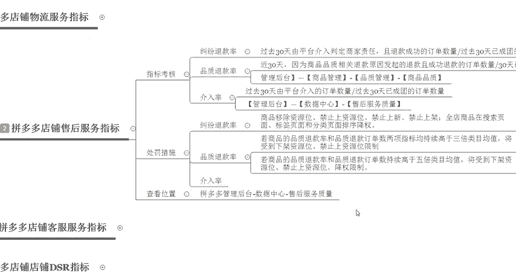

# 【拼多多运营】2024目前最新的拼多多开店新手教程！每天30分钟，零基础电商运营快速起店，实现日销千单！ - P30：30 拼多多店铺售后服务指标 - 拼多多-运营 - BV1812mY6EFh

电商无止境学海苦头舟。hello大家好，我是巨黄教育的西楼。欢迎大家来到我的拼多多系列课堂干货分享啊。那么今天给大家分享的内容呢是拼多多开店核心指标的第二节课程。我们拼多多的一个售后服务指标啊。

前几节课程呢我们已经呃讲解过了拼多多店铺的一个物流服务指标啊，那么相信大家已经学习到的一些呃，大家平时没有注意到的一些问题啊，最近呢也有很多的小伙伴私信找我啊，想要了解更新一部分的一个内容。

那么我们今天就来了解聊一聊拼多多店铺的一个售后服务指标到底有哪些啊，首先呢我们先来看一下它指标的一个考核啊，就是在所有的拼多多店铺里面呢，它有重点考核三个呃率啊，叫做。

纠纷退款率，一个叫做品质退款率。另外一个叫做介入率。那这三个指标具体指的是什么样的一个意思呢？纠纷退款率呢指的就是过去30天内，然后这个平台介入之后，然后判定为商家责任。比如说呃有一有一个客户啊。

他在你店铺里面呢购买了你的产品啊，想要去进行退款。但是退款呢，你这边呃商家拒绝了。那拒绝完成呃拒绝的时候呢，这个呃买家。

他们不认可啊，所以说造成了一个投诉。那这种呢就叫做纠纷退款率啊，如果平台介入了之后判定是我们的责任引起的。所以所以说呃会强制的把这个款项退还给客户，但是这一笔订单呢也会直接计入到退呃纠纷退款率里面。

对于我们的店铺后期的一个影响呢是比较大的。那么第二个呢叫做品质退款率啊，品质退款率呢是在这个商品品质相关的一个问题。比如说呃客户买了你的产品之后呢。

投诉你的产品质量不好或者是质量不合格或者是投诉你是假货。所以说这个品质退款率对于这个店铺来说是影响是非常重大的。因为在拼多多里面对于商品的一个管制啊要求是非常高的。

所以说这个点大家在操作的日常操作的过程中，尽量要避免这样的一个情况出现。呃，上架产品一定要选择赠品。如果说大家做的是品牌一定是必须要有品牌呃授权的。否则的话会被判定为售假罚款10万。

啊，那最后一个呢叫做介入率。这个介入率呢，就是过去30天内，凡是平台直接会进介入到的一个订单，就会直接计算入这个介入率啊，所以说后期我们的一个客服的一些维护，还有售后的一些问题。

都直接会影响到我们店铺的一个实际的一个操作啊，那么我们呃。

具体查看的一个位置在什么地方呢？在这个数据中心售后服务质量，还有这个商品管理里面，我们直接可以看店铺的后台来进行查找。

比如打开我们店铺的一个后台之后呢，然后再对应的一个位置。比如说现在这个商品管理这边有一个品质管理，我们就可以查看我们店铺商品具体的一个品质情况。

好，我们品质退款的单数呢近一个月以内呢是零单，所以说不会有对应的一个处罚或者是呃。限制啊，那这个呢就是品质管理里面所查看到的一个数据啊，这个呢叫做品质推款率。另外一个呢还有叫做介入率。

在这个管理后台数据中心啊，售后服务重量呃质量。

点击这个数据中心，然后对应的有一个服务数据，我们直接点击之后呢，进入到就可以看到我们的一个服务的一个质量了啊。在这里面呢，我们可以看到非常多的一个数据。比如说我们售后的服务商品的品质，还有物流服务。

这些呢全部都会啊直接计入到我们店铺的一个呃考核标准里面。比如说。

像店铺的这个活跃度，近30天这个活跃度是不达标的。所以说在这样的情况下，你店铺呢可能就会流失掉一部分的一个权重啊，包括售后服务里面自主退款里面也是不达标的啊。那在这样的情况下。

也会对于你的店铺会造成一些影响。那其他的呢也都是啊大家所需要去维护的一个点。好，那如果说啊出现了这样的问题，到底会怎么样去进行处罚呢？比如说我们退款纠纷率比较高的情况下，会直接移除掉你的资源位啊。

然后禁止你的商品上架，就相当于是你的店铺会直接被屏蔽掉。屏蔽了之后，你不能上活动，也不能上架宝贝，也不能发布宝费。你的商品呢也不会有任何的这个权重。所以说对于我们商品来说影响还是比较大的啊。

那品质退款率呢同样也是跟这个啊。

纠纷退款率是相差不多的啊，但是说它的一个呃限制呢会更加的严重啊，它直接会下降你店铺所有的资源位，然后禁止上资源位。然后还有对应的一个降权的一个限制。所以说呃处罚的时候呢，是相对来说比较狠的啊。

如果说介入率这个东西呢，它是不会引起处罚的啊。但是说介入率多了的话，你的品质退款率和呃纠纷退款率肯定也会自然而然的偏高。所以说能不出现售后问题，大量大家尽量的把售后问题给处理好啊。

那最终的一个查看的一个位置呢，就是在数据中心和这个售后服务质量这里啊，就是。

现在的这一个位置打开数据中心，然后找到这个服务数据，我们就可以看到整体的啊。对应的这个数据表现。好，那么以上呢就是给大家讲解的第二节的一个课程核心指标中的售后服务指标，对于我们店铺带来的一个影响。

以及我们所需要注意的点。那如果说大家有任何的问题或者是不理解的地方，可以直接在呃可以直接私信我，或者是在呃评论区留言，我看到之后都会一一回复啊，我是巨皇教育的西楼，感谢大家的观看啊。

如果说大家想要学习更多的一个内容的话啊，现在私信我，还有对应的拼多多福利大礼包可以领取啊，感谢大家的观看啊，那今天的内容到这里就结束了。再见。

