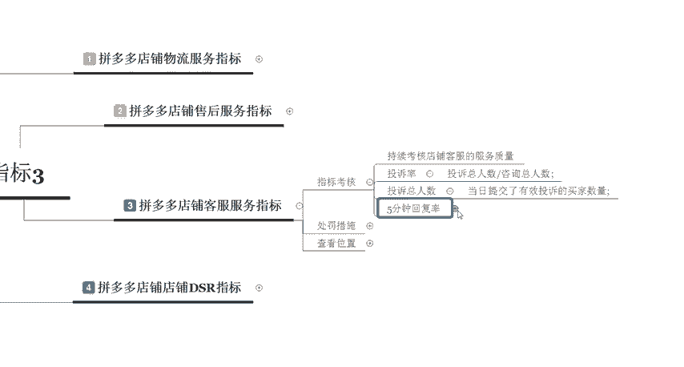

# 【拼多多运营】2024目前最新的拼多多开店新手教程！每天30分钟，零基础电商运营快速起店，实现日销千单！ - P31：31 拼多多核心指标之客服服务 - 拼多多-运营 - BV1812mY6EFh

电商无止境学海苦头滔。hello大家好，我是巨黄教育的西楼。欢迎大家来到我的拼多多干货分享的课堂。那么今天给大家分享的内容是拼多多开店核心指标的第三节课程。我们来了解一下拼多多店铺客服服务的指标啊。

首先我们先来了解一下这个服务指标里面呢，它有对应的一些服务指标的一些考核。那么考核主要的几个点呢是以下几个啊。首先第一个呢，我们在呃考核的时候呢，它是持续性的去进行考核的。

那么我们店铺客服的一个服务质量，主要是从这个投诉率，还有投诉的总人数以及每5分钟的一个回复率，这上面来进行考核的啊，如果说我们的一个呃这个投诉率呢指的就是投诉的总人数除以我们总的这个咨询人数。

比如说你今天有100个人来咨询了啊，其中有一个人去投诉你啊，那这样的情况下呢，会有1%的一个投诉率。那么第二个呢是。

投诉投诉的这个总人数。也就是说当日提交了投有效投诉的这个买家的一个具体的数量。因为有一些店铺它的一个呃整体的咨询人数可能会比较多，像一些大一点的店铺可能就要上千或者上万。那在这样的情况下。

你投诉的数量高了也不呃也是不行的。比如说你店铺里面总共有1万个咨询，那其中有1%，那也就相当于是有100个投诉。那这样的情况下，你的投诉也会非常的高的，所以说投诉的总人数也会纳入考核。

那最后一个呢是5分钟的一个回复率啊，这个5分钟回复率呢是我们在呃咨询的人数呢减去这个5分钟未回复的一个累计数，然后除以总的这个咨询人数。呃，这个怎么说呢？嗯，其实有几个注意的点，我建议大家呃。

它官方规定呢是5分钟的一个回复率，我建议大家控制在3分钟以内呃，这个注意的这个点呢就是这个时间是从早上的8点到晚上的11点去进行计录的啊，所以说这个并不是说呃有。

一些这个人发烧了啊，比如说晚上的时候啊，神经病一样啊，一连点的时候来给你啊发消息。这样的情况下，你不回复他也是没有关系的啊。我们考核的时间呢，是从早上的8点到晚上的11点啊。

那用户呢有一条这个消息超过5分钟没有回复的那么这个用户呢就会进入到5分钟内未回复的一个累积这个基数里面。所以说当客户啊你这个客户没有解决完的一个状态下，那么如果你没有进行回复啊。

比如说他可能啊就只发了一个好的，或者是啊谢谢。那么你后面呢只要最后一句话不是你发的啊。那在这样的情况下呢，他同样也是会记录的。所以说这个点大家一定要注意啊，在做客服的时候，要呃非常的小心。😊。

啊，那如果说我们客服没有做好的话，会有什么样的一个处罚呢？啊，第二个点呢给大家讲解的就是处罚的具体的一个措施啊呃，主要的一个措施呢就是以下这两个点啊。如果说你店铺全呃违规达到一定的一个数值了啊。

那么店铺全部的商品呢会移除对应的一个资源位啊，就是说限制你的流量然后第二个呢就是禁止啊不不再让你上这个资源位，然后移除这个广告，然后上新和上架啊，它会相当于是全店屏蔽一天啊。

那么第二个这个处罚呢就相对来说比较严重了，就是全店的商品呢全部降权，但不包括这个分类页，就是分类页里面呢，它也有可能会给你去进行降权，那为期的一个时间呢也是一天啊。

所以说他处罚的一个时间呢都是一以一天为周期的。那么怎么样来查看我们对应的一个客服指标的一个数据呢，查看的位置在我们拼多多管理的一个后台有个多多客服，客服数据里面会有一个。

个店铺买家投诉的一个详情啊，比如说我们打开一个店铺的后台啊，直接点击这个后台进入到这个页面之后，在左侧的位置找到多多客服。

啊，我们直接往下拉，然后找到对应的这个多多客服。多多客服这边呢有一个客服数据。在这个客服数据里面呢，我们可以看到啊整体的客服的销售业绩有多少，然后提升的销售额是多少，询单转化率是多少。

然后还有3分钟人工的回复率啊，其实在这边的时候呢，我这边写的是5分钟，其实官方在考核的时候呢，考核的是5分钟。但是我建议大家控制3分钟以内。所以说这个点呢前期也有给大家这个详细的讲过了啊。

然后呢这个是平均人工响应的一个时长。当你这个时长超过这个5分钟以后啊，可能就会达到啊造成这个违规啊，可能就会造成违规。所以说这个整体的呢就是我们这个售后服务的一些数据的指标啊。

比如说在下面呢我们也可以看到具体的某一段时间以内的一个数值啊，比如说我们想要看近30天的一个数据。

对吧然后呢像这些啊哪一些这个时间段回复的人或者是来找我们的人比较多呢，这样的情况下，你可以安多安排几个客服来打理你的店铺好，那么以上呢就是我们关于拼多多客服的这个客服服务指标。

也是我们今天啊给大家分享的这个呃拼多多核心指标里面的第三部分的一个内容啊，那么呃具体的一个内容呢，就是这么多。如果说大家有任何不理解的地方，或者是不明白啊，在哪里去进行查看的地方呢。

可以随时的私信我或者是在评论区留言啊，后期呢我也会分享定期分享更多的一些拼多多干货的内容啊，那么大家可以记住我啊。巨黄教育的西楼啊，那今天给大家的分享呢到这里就结束了。感谢大家的观看，再见。😊。

