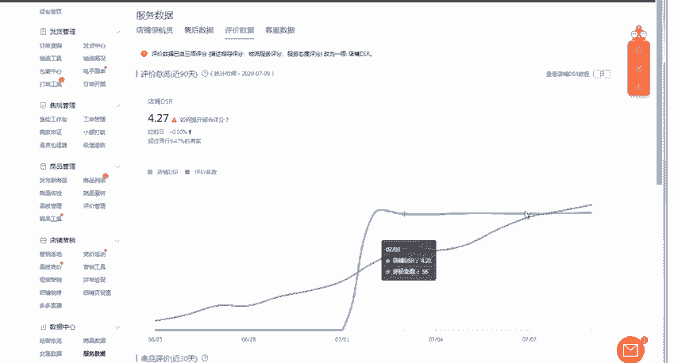
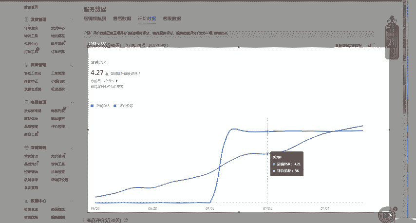
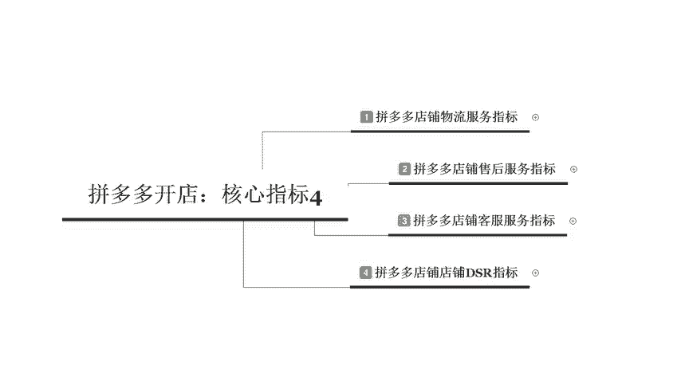

# 【拼多多运营】2024目前最新的拼多多开店新手教程！每天30分钟，零基础电商运营快速起店，实现日销千单！ - P32：32 拼多多核心指标之店铺DSR - 拼多多-运营 - BV1812mY6EFh

🎼电商无止境学海苦。hello大家好，我是巨黄教育的西楼。欢迎大家来到我的拼多多系列课堂。呃，今天呢给大家做一个拼多多开店核心指标第四节课程啊，相当于是给大家做一个总结。

我们来讲一讲这个拼多多店铺的DSR的一个指标。啊，其实前面上节课给大家讲过的我们的物流服务售后服务以及客服服务指标，综合来讲组合了组合成为了我们店铺的一个DSR的一个指标啊。

现在呢我们来看一下具体的一个查看的一个位置。它其实指的呢就是我们店铺近90天来的一个店铺动态的一个评分。比如说我们打开一个店铺啊，在打开这个店铺之后呢，然后在正上方店铺后台首页的这个位置呢。

你在这边可以看到店铺总体的1个DSR的一个情况。然后你点击这个DSR进入之后呢，你就可以看到整体的这个DSR的一个波动情况。它综综合考虑的呢就是我们评价。

条速以及我们店铺的呃这三个核心指标。🎼店铺的评价呢，我不需要去多提，就是我们店铺呢要给到了多少的一个评价的实际的一个数量啊，那么这个综合评分呢，就是指的我们的一个呃售后的一些服务指标啊。

前面呢也有给大家讲过指标的一些考核具体考核哪些数据，包括处罚的一个措施呃，措施。还有我们在哪里去进行查看，包括我们售后服务啊，售后服务呢包括这个退款纠纷率，品质推广介入率啊。

还有这个具体的处罚措施都有哪些，以及我们店铺的客服到底需要达到什么样的一个程度到底考核哪些数据。当我们把这个客服以及售后以及商品的一个物流服务全部都做好了之后，我们的动态评分自然而然就会提高。

那么这是我们就近90天动态评分的一个考核。那么还有一个呢是我们每一个商品的一个评分啊，可以直接在我们店铺商品的商品列表里面看到我们每一个商品综合。合起来会有多少的一个评分啊，比如我们打开店铺的一个后台。

在店铺列表，店铺的这个商品列表里面，我们可以看到具体每一个单品，它整体的一个呃动态分是多少。比如我们在这里可以看到近30天内的一个评价。如果说评分过低的话，我们可能就没有办法去报活动啊。当你操作完之后。

比如说你的店铺呢已经达到一定的一个数值之后，这边自然而然就会显示对应的一个呃宝贝的一个近30天内的一个评分。所以说这个点也会直接影响到我们店铺的DSR的一个指标。那最后一个呢就是每笔订单的一个评价。

在我们商品管理里面的评价管理啊，直接点击这个商品管理。然后这边呢有对应的一个评价管理，我们可以看到整体的这个好评或者是满意或者是不满意啊，一星二星在这边全部都是可以查看到的。好。

那么以上呢就是我们在呃日常操作拼多的时候呢，给大家做的这个核心开店核心指标里面的四个内容。今天也是给大家做一个整体上的一个总结啊。那关于如果说大家前面的这三个主要核心的指标呢。

没有学习到或者是没有了解到的，可以直接去翻看我之前的一个视频。后期呢我也会定期的在这个平台上分享更多的拼多多干货的一些内容啊，其实想要做一家这个盈利的店铺呢，其实不难难的是不会运营。

所以说如果说大家有不会运营店铺的，也可以直接私信我，或者是在评论区留言。啊，后续呢呃现在私信我也会有对应的拼多多大礼包，可以发给大家啊，那么今天的一个内容呢，到这里分享就结束了啊，感谢大家的观看。

我是聚皇教育的西楼，大家再见。

