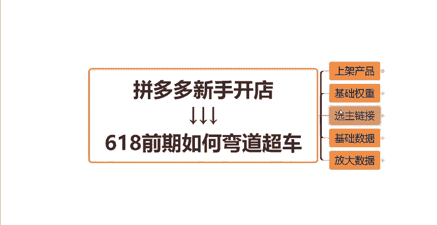

# 【拼多多运营】2024目前最新的拼多多开店新手教程！每天30分钟，零基础电商运营快速起店，实现日销千单！ - P33：33 拼多多618前期如何弯道超车 - 拼多多-运营 - BV1812mY6EFh

是。618来临前期，新手做拼多多店铺如何能够快速起款，赶上上半年的电商红利呢？今天我在一期视频会把这一套方法给大家分享一下。如果说做的好的话，你们的店铺基本上一个月的时间都不要就能从零做到日销百单。

那么目前啊我发现有很多新手商家呢做了好几个月，你的店铺还是没有订单，没有访客。其实归根结底啊，都是因为你们自己没有一个正确的店铺运营操作思路，没有一个好的操作方法，那么今天这一期视频呢。

我会给大家做一个总结，做一个分享。大家可以先关注点赞收藏起来，方便后面多学习几遍。那首先呢我们的店铺开好之后啊，第一件事情肯定就是上架产品，对吧？如果说你前期找了很多个款。

但是你要切记上架的时候不要一次性上太多的款，只需要上1到2个就可以了。这个是在初期阶段的时候，那么这1到2个款呢，它又可以上5到10条。

链接这5到10条链接啊，你注意一个点就可以了。就是相同的款上多条链接。那么这多条链接当中呢，你的主图要有所区别，你的标题也要有区别。包括你的SKU你的这个定价都要有所不同。

那么这样呢才不会被平台判定为重复铺货，导致受到处罚。好吧，那么我们在上架产品的时候呢，大家还需要注意一个重点啊，主要就是这几个方面，主图标题SQU防比价怎么做以及定价怎么做。那么我会1。

1点分别来跟大家讲一下这些到底应该怎么做啊。那么首先主图啊。主图呢我们基本上可以按照这三个方面去做啊。第一个你的这个主图上面肯定要有你的产品主体，对吧？也就是你产品的图片，这是非常非常重要的啊，然后呢。

你可以在主图上搭配卖点文案，以及搭配营销文案啊，搭配这两个文案来让你的主图更有内容，更有吸引点击的这个能力啊，那么我们随便打开一个产品啊给大家看一下那，比如说像这两个产品，左边这个是狗笼子，对吧？

那么狗笼子它的产品主体呢就是这个狗笼，它把它展现出来。那么所谓的这个卖点文案是什么呢？就是你的产品有什么特点？你的产品有什么功能，有什么卖点。那么你用文案的方式在主图上把它表现出来。比如说像这个狗笼子。

它有哪些卖点呢？真不锈钢耐啃咬，并且加厚满汉全方管，对不对？这些词啊都是它的这个产品的卖点是能够吸引到消费者。

那所谓的营销文案是什么呢？那比如说像这张图上的左上角的顺丰速运现货速发，表明了它是发顺丰快递的那一般来讲，我们作作为一个普通的消费者，我们是更加愿意去买这些顺丰包邮的产品的，对不对？

如果说同样的两个产品，一个是比如说三通一达包邮，那另外一个是顺丰包邮，他们的价格还差不多，我相信绝大多数人会优先的去选择顺丰包邮的，对不对？那还有包括像左下角的这个工厂直销啊，表明了我可能是工厂源头。

我是工厂直销。那么我的这个价格呢肯定也是有一定的优势的，对不对？这个呢就是所谓的营销文案啊，然后用产品主体加上这个卖点文案，加上营销文案，就最终组成了我们这样的一个主图。

那么这样你如果说你的主图是按照这样的一个方式去做的话，我相信你的点击率啊，一定差不到哪里去的。好吧，这个就是主图方面的一个问题啊。

然后第二个点，标题怎么去做？那么这一期视频呢，我就不跟大家去讲，就是怎么去找词啊，怎么去组成标题啊，这样一步一步的操作了。如果说还有不会的小伙伴呢可以去翻一下我之前的一些视频啊。我我都有给大家讲过。

那么如果说找不到之前的一些视频的小伙伴呢，大家可以在评论区扣三个6，找我领取一下店铺运营的一些这个课件啊，一些表格都可以的。那么这边呢就简单的跟大家讲一下我们的一个标题啊。

我们的标题是由核心关键词以及产品属性词以及热门的营销词，这三种关键词来组成的。最终组成为一个30个字，并且通顺并且没有违禁词的这样的一个标题啊，一般来讲这样的一个标题都是没有任何问题的。

如果说你实在不会找词，是实在不会主标题的话，你也可以去这个看一下同行一些做的好的产品啊。同行的一些。竞品。那么你看一下它的这个呃标题用到了哪些关键词，它是怎么去组成的。那么你可以去参考借鉴模仿一下。

都是没有任何问题的。好吧，那么这是第二个点啊，标题的一个问题。那么第三个方面，SKU。SQU的话就是我们经常讲的这个产品的规格啊。那么我们一般呢SQU它是由这三个不同类型的SQU组成的。

也就是说你的这一个链接当中呢，你的SQU需要有一个引流的SQU需要有热销的SQU需要有利润的SQU。那么我分别来给大家解讲解一下这不同的SQU类型，他们的一些特点跟作用。好吧，那么引流SQU呢。

它的一个作用就是以超低的价格来吸引消费者点击进入商品。那同样的来我们打开刚才这个页面给大家举个例子啊。比如说像这个厨房纸，我们在拼多多上买一个东西的时候。

是哪些方面吸引了我们想要去点击这个产品去具体的看一看呢？第一个肯定是我们的主图，对不对？你的主图，如果说做的有吸引力。那么我会有这个想法点击去看一下，那么第二个呢就是这个我们的这个产品的标。

题啊，以及他可能说有没有参加一些活动啊，一些大促啊等等这之类的。那么第三个点呢，就是我们的这个外露的价格啊，这个价格会有很大的这个几率来吸引消费者点击进去。同样的比如说都是做厨房纸的。然后外观也差不多。

啊，然后一个产品它的这个外面的价格可能是9。9块，对吧？那这个产品是1。25块，那我们作为消费者来讲，我会优先的点击哪一个，肯定是这个1。25块的，对不对？所以说来我们点击进来看一下啊，那么具体这个1。

25块，它到底是一个什么样的SQU呢？来后我们点击一下，我们就会发现。

它的这个SQU规格当中啊，有这个超矩型两卷，有一大卷，有中卷，有小卷。那么这个1。25块元呢，它是什么？它是最小的这个规格就是这个小卷可用108次的这个啊，它的售价是1。25块。

那么其他的比如说我们的中卷啊，它是2。43块。然后像这个一大卷，它是这个3块啊，3块钱。然后这个超矩型卷，它是4。4。79块啊啊，4。79块。那么。这个地方呢我们就会发现啊。它的这个1。

25块就是所谓的它的引流SQ。但是这个SQU呢，它的作用啊，它不是说用来给消费者下单的，知不知道？因为我们正常作为一个消费者来讲，我们想要买厨房纸，它这个只能用108次，是不是太少，对吧？

我们肯定会买多一点，那么我们通过被这个价格点击进来了，那我可能会看一下其他的SQU看一下它的这个价格怎么样，对吧？它卖多少钱，如果说觉得合适的话，那么我是不是也会下单。

所以说你们不要觉得啊说哎我做了一个这种超低价的这个引流的SQU啊，我做了这样的一个价格，那如果说消费者点击进来发现哎我的产品实际上不是卖的这个价格，它会不会就直接划走了，不要这样想，知道吧？

这个想法是错误的。只要说你的产品，其他的这个SQU的规格啊，它的性价比是合适的，是有性价比的，价格呢。也是合理的，它还是会有很大概率会下单的，知不知道？所以说这个呢就是我们的所谓的引流SQ。

那么热销SQ是哪些呢？它就是做到了一个极致性价比，热销走量的，比如说刚才这个链接，它的热销SQ是什么？比如说就是这个中卷啊，2。43块的，然后还有这个大卷3块钱的。

这个呢就是它的热销SQU就是它的价格呢也是相对比较低一点的那专门用来走量的当然呢它这样的一个SQ它的利润肯定会没有那么高的，它的利润会很低的，好吧，但是不至于没有利润啊，那么什么是利润SQ呢。

就是我们这种最大规格的啊，规格最大的，知道吧？那么这样的一个SQ呢？它的利润空间肯定会比上面这两种SQU它的利润会高很多。也就是高客单价用来抬高我们的利润的。知道吧？所以说我们不管说做什么类型的产品。

除除非你是做什么做这种服装服饰鞋包的，你可能不不太好这样去做SQU其他的一些日用品啊、快消品啊等等，其他的很多产品都是可以按照这种方式去制定你的SQU的，知道吧？所以说你理解了这个点呢，那么你的链接啊。

就可以按照我教大家的这个方法去把你们的SQU好好的梳理一下，好吧？然后第四个点呢就是我们的防比价啊，防比价的话，基本上就是通过这两个方面来进行一个起到防比价的一个作用。首先一个是规格，一个是图片。

规格是什么意思啊？就是所谓的产品规格的这个名称，知道吧？名称你要做的跟同行的名称要有区别啊，要跟它区分开，这样的话，平台才不会把你的产品跟同行的产品判定为是同一种产品，好吧。我给大家举个例子。

比如说谁卖水果的啊，卖水果的同行，它可能这个SQU的名称它写的是什么？比如说汶川车厘子5斤，然后99块钱，对吧？同行的规格是这样的，那我们能不能这样写呢？我们如果说我们也写汶川车厘子5斤99块钱。

或者甚至说价格比它还贵，那么你的这个链接啊就会被同行进行比价。如果说这边有两种情况啊。如果你的货源，你的价格足够给力，你能够做到基本上能够做到全网的低价。O那你就不用在乎这个点。

你的名称跟同行一样也没有关系，因为你的价格比它低啊，对吧？你也能拿到很大的流量，但凡啊你的价格没有优势，你只能够跟他做到差不多，甚至说比它还要高，那你就一定要把你的这个规格的名称跟同行做出区别来。

那么你可以怎么写呢？你可以写比如说前面我加一个自家果园只为酒量，对吧？我加一个这样的一个前缀，然后后面我写大号车厘子5斤，我还是五金，但是我前面这些规格跟它不一样啊，对吧？那么我的价格呢。

我可以做98元，97元，96元都可以，你可以跟它做的差不多。因为你的名称跟它区别开了，知道吧？这样的话，平台它就会把你的这个链接。你的这个产品跟同行它的区分开平台就会判定哎你的产品跟它是不一样的。

就不会跟他进行比价，知道吧？所以说这种情况下，你把仿比价做好了，你的价格跟它差不多，或者说你甚至说卖的比它贵一点，你还是能够拿到流量的。那这就是防比价的一个作用。好吧，那第二个方面呢。

就是我们可以通过这个SQ的这个图片，也就是这个东西啊，每个SQ它的图片可能说有一所区别的，知道吧？那么我们的图片呢跟同行也要区分开。那么有两种方法，你要么你有这个可以自己去实拍的一个这个条件的话。

你可以去实拍，看一下同行是怎么拍的，那么你跟它拍的不一样就可以了。那第二个呢你可以做图中图，图中图什么意思啊？比如说这个是我们的产品，对吧？那么我们可以把这个产品给抠出来，抠一张透明图，扣一张白底图。

然后在这个背景这一块大块地方呢，我可以放上一个其他的产品作为背景，知道吧？我可能说后面放个洗衣机也可以。然后我把我的这个产品主体呢放在这个洗衣机上。这样的话，就是一个图中图的一个操作方法。

也可以规避掉这个平台的防比价。好吧，那么这就是仿比价的一个。

的问题啊。然后最后一个点，定价定价这边跟大家简单的讲解一下怎么去定啊，你直接用市场的平均售价乘以2加5到10块钱。这个呢就是你们所谓的这个拼单价，知道吧？拼单价这么去定。然后呢，我们在发布产品的时候呢。

除了拼单价还会有一个单买价，对吧？那么你的单买价呢比拼单价贵1块钱就可以了，知道吧？比拼单价贵1块钱，拼单价按照这个公式去定市场平均售价怎么得出来，你直接去找。

比如说找10个找20个跟你是同类型是同款的这个同行看一下他们的这个定价是多少。然后把他们的这个定价分析出来，采采集他们的这个平均售价就可以了，知道吧？然后乘以2加5到10啊。

然后这个加5到10是什么意思呢？就是为了我们方便后续去做优惠券的活动，我我们可能会做一个什么。店铺关注券啊或者新新人立减券啊等等之类的啊。那么这5到10块钱是给我们的优惠券留出这个利润空间的。

然后市场平均成售价乘以2是什么意思呢？就是我们可以方便后续去做这个限时限量的一个折扣活动。后面限时限量折扣，我们可以去直接什么打5折。知道吧？就是我们的定价先把定价抬高。

然后我们再通过所谓的这种营销手段去把价格给压下去。如果说你直接前期定价就定的很低的话，你后面才怎么去做活动啊，还怎么去做优惠券，还怎么去做这个限时限量购啊，对吧？所以说啊前期把价格抬高，用营销活动。

把价格压下去，好吧，这就是定价的一个问题啊。那么你们的这个链接呢，把这个主图标题SKU以及防比价和还有定价按照我今天给大家分享的这几个方法去做，基本上你的链接都没有任何的问题。好吧。

这是第一个点上架产品，然后我们上架产品做完之后呢，我们接下来啊就要去核心的一个工作啊，就是去把店铺的一些基础权重给做好，基础权重是哪些呢？一个是店铺的评评价分，也就是我们俗称的店铺的DSR评分，知道吧？

先把店。或的DSR给做出来啊，我们可以在我们的店铺后台首页的地方，在这个地方看到没有？有一个店铺评价分，这个就是我们的店铺DSR。然后这个店M铺DSR呢，它的一个条件是什么呢？

就是怎么样能做出这个评价分呢？就是我们店铺最近90天内有效的评价数要大于50条才会有我们的这个店铺评价分，知道吧？所以说前期我们要先把这个东西给做出来。就是你要先做至少50单以上的这个好图啊。

好图跟评价晒图评价。好吧，那么建议大家啊做到4。9以上是最好的啊最好的。那么你如果说做不到4。9，记住啊，你的这个店铺的DSR评分最好不要低于4。6，知道吧？不要低于4。64。6以上的话。

你的这个店铺的流量还不会受到什么影响。如果说你的店铺低于4。6，甚至低于4。4。你的这个店铺的流量就会受到很大的影响，知道吧？所以说这个店铺评价分呢，大家注意一下就可以了。然后。还有第二个点呢。

就是我们的这个店铺层级啊，店铺层级，店铺层级同样的也是可以在我们的这个后台首页可以看到的。就是我们的这个成长层级啊。你们如果说是一个新店的话，基本上就是在第一层级啊，第一层级。那么你们所要做的呢。

就是先把你们的这个店铺层级给突破一下。不要让你的店铺一直停留在一层级或者二层级，至少要拉到第三层级或者第三层级以上，知道吧？这样的话，如果说你的店铺在一层级或者二层级，你的流量的上限太低了。

就是你的流量天花板是很低很低的，根本拿不到什么流量的。所以你直接干到第三层级或者第四层级，这个的话，你们直接在你们的后台的这个地方就能够看到。比如说来你们去看一下你们的店铺，你所做的这个类目，对吧？

它这个地方呢会告诉你就是你的这个30天。要达到多少销售额才能够到第三层级或者到第四层级。像这个店铺看到没有？第三层级这个地方显示的是281块钱。这个281啊，不是说你的店铺就是30天内有281块钱。

就可以达到第三层级啊，这个地方是每天知道吧？你的店铺每天要达到281块钱才能够到第三层级，那么你所需要做的是什么呢？就是把这一个地方的数值去乘以1个30，知道吧？就是乘以30天嘛，然后得到的这个金额呢。

你通过做大单的方式。就直接的把这个金额给拉上去，你的店铺层级就可以上去了，知道吧？直接的对应着去补大单啊，这个很简单这个很简单，你只要把这两个核心工作做好了，再开始去上新你其他的款式。

这个时候啊你的店铺的基础权重是O的。你去上新的话才会拿到一些比如说流量扶持啊，一些新品的扶持啊，这也就是我为什么告诉大家说，初期上架产品不要一次性上太多的款式，知道吧？先把我们的店铺的基础权重给做好。

有一定的基础权重了之后，留到这个时候再来上新，再来进行突破，好吧，上新了之后我们可以观察几天看一下你上新的这些产品啊，他们的哪个产品的数据表现最好。这边呢分为两种方法，一个是可以用自然流量去分析。

一个是可以用付费流量去分析。我先跟大家讲自然流量怎么分。啊我们在店铺的后台，比如说我们这个时候上新了很多个链接，对吧？那么我们可以在店铺的后台，然后有一个这个数据中心，然后我们点击商品数据。

点击完商品数据呢，在这个地方就可以看到你店铺内所有的产品。那么我们比如说可以看7天，对吧？你就可以看到你的不同的链接，他们的访客数有多少，然后成交有多少，以及它的这个转化率有多少。

然后以及它的这个商品的收藏用户数有多少。这些数据呢，你都是可以在这个地方可以看到的，知道吧？我们主要呢就看访客看订单，看转化率，看收藏。通过分析这几个数据指标呢。

我们就可以把数据最好的这个链接给拿出来作为我们的主推链接。那当然呢这个时候就有小伙伴会说了啊，我这个时候是一个新店。那有可能我的店铺上新完链接了，但是还是没有访客，怎么办？

那如果说有的新店可能上新了几天也不一定有数据，对吧？那么这个时候就要用到我们的什么，用到我们的付费流量，就是我们的直通车来进行测款来进行选主推链接了。

那这个时候我们可以在我们的店铺后台找到这个地方推广平台。那么推广平台有两种模式，一个是全站推广，一个是标准推广。如果说我们前期在测图测款的阶段的话，我们都是要用到这个标准推广的，知道吧？不要用全站推广。

好吧。那这个时候呢也很简单给大家演示一下，我们点击了标准推广之后，直接点击添加推广商品。然后在这个地方把我们所上上架的这些链接啊全部选中，全部选中完添加进来之后呢。

在这个地方我们就需要去设置这个计划的日限额以及每个链接的这个出价，那么这个日限额呢，大家设置一个统一出价，就是我们选指定预算。比如说我们统一100，对吧？每一个产品我们都给它统一100的日限额就够了。

然后这个出价，大家注意一下啊，出价这个点。

日销要统100出价跟大家讲一个公式啊，讲一个公式。如果说你的这个产品的客单价是在50块钱以内的啊，50块钱以内的客单价，你就按照你的热销SQU的价格去出价。

那么热销SQU就是我上面给大家讲的这个SQU啊，看到没有？中间这个热销SQU的价格去出价。如果说你的这个产品价格，客单价是在50块钱以上的话，那么你就按照你的这个产品卖一单的利润进行出价就可以了。

卖一单赚多少钱，你就出多少钱，知道吧？这是这是这个成交出价的一个方法，一个公式。那么下面还有比如说我们的询单出价，我们的收藏出价，我们的关注出价，这几个点都是不开的，知道吧？都是不开的。

然后下面这个急速起量呢，可以打开也可以关闭，这个无所谓的，好吧，然后这几个点设置好了之后，我们直接的然后点击。下方有一个开启推广就可以了。然后这个计划呢，我们可以跑3到5天啊，跑3到5天。

跑3到5天之后，我们同样的也要进行去数据分析，主要看什么，看这个。比如说。来，我给大家看一下。跑了之后，比如说这个是我们的这个计划，对吧？那么在下面这些地方呢，我们可以看到有一个总花费成交花费。

还有我们的这个成交笔数，然后交易额收藏量收藏花费等等。这边数据指标很多，然后我跟大家说一下，主要看什么，看曝光量，看点击量看转化，看收藏。有的小伙伴会说哎，这个地方好像没有这些数据啊，对吧？啊。

ok没关系，我们点击这个地方，有一个这个设置的选项，那么你把这几个数据指标给勾选其他的不勾选也没有关系，比如说曝光量勾选点击量勾选关注量勾选收藏量勾选，然后成交笔数勾选，知道吧？

把你所需要观察的这个数据勾选勾选了之后呢，在这个地方它就会展示了。好吧，那么同样的分析这几个数据指标之后呢，我们把数据最好的这个链接直接拿出来作为我们的主推链接。

就可以了。好吧，这一步呢就是我们的这个测试链接啊，测试链接，并且选主推链接。那么这一步做好了之后啊，我们就要给我们的这个主推链接去做这个什么做基础的数据了，知道吧？这个时候。

我们就要做这个比如说做销量啊，做评价以及做坑产的啊，做坑产的。那么主推链接呢？你去给他做销量，销量的话，你可以自己去做是吧？你有资源或者说这个亲朋好友比较多的话，你可以自己找这些去做。如果说你没有的话。

那么你也可以在评论区扣3个6啊，找我分给你分享一下资源都是没有问题的那还有一种方式呢，就是你也可以直接的去改销量，比如说改10万加，改100万加，改200万加都是可以的，知道吧？那么改销量具体怎么改呢？

我在之前的课程也给大家分享过，大家可以去找一下我之前的一些课程。好吧，然后这个是销量啊，然后是评价，评价呢，你就直接的去做100到200个晒图好评就可以了。

然后满足这个评价呢主要是满足我们的这个主推链接，它在前期啊有一定的这个承接流量的能力，也也就是说有一定的转化能力啊，你不要跟我杠啊，说啊改销量没用啊，做评价没用。我就问你啊。

如果说今天我作为一个消费者，我在拼多多上买东西，我打算买一个东西。那么展现在我面前的。如果说这个这个产品啊，我点击进去，我点击进去，哎，这个地方销量也没有，然后我往下滑，评价也没有或者少的可怜。

你会不会买，对吧？你想一想你作为一个消费者，你会不会买，知道吧？我们正常来讲，我们都想要买那些销量高的啊，评价多的，我们心里有一个底，对吧？有有觉得有一定的保障。

所以说这也是我们做销量做评价的一个目的啊，就是为了把我们的转化率给提高，好吧。

然后啊这两个东西做完之后。不是直接的去做推广，不是直接的去开车啊。因为这个时候你的这个链接是没有订单，没有坑产数据的。如果说你直接的去开车是很难实现低价盈利的，知道吧？那这个时候呢。

你就要做的是去需要去做一波坑产。那么坑产怎么去做呢？我们需要去做周期的递增计划。那么这边我具体跟大家讲一下怎么做。首先你要知道你要做多少单，对不对？你既然说你要做7天的数据。

那么这7天你到底要做多少单呢？你就要会算。那么这个呢我们都可以在直接在店铺的后台可以去看到的。这边大家记住啊，首先你们要记录两个点，两个数据值。我们在店铺的后台打开之后，在这个地方来我跟大家讲一下。

打开之后，在数据中心当中可以看到有一个流量数据啊，流量数据流量数据打开之后，这个地方我们选择，比如说因为我们要做7天的这个数据量嘛，我们就要选择近7天，选择完近7天之后，在店铺访客数这边。

我们在下面会看到三条这个曲线，对不对？这三条曲线蓝色的是我们店铺自己的绿色的呢是同行同层级平均的数值。然后黄色的呢是同行同层级优秀的数值，那么我们所要记录的呢，就是同行同层级优秀的这个访客的数值。

你把它记录下来，怎么记录呢？比如说你选择7天，比如说这一天这一天这一天然后你把7天的数据加起来，然后去除以7得到一个平均值。这个数据呢就是同行同层级，7天平均的优秀访客数值。是这个数据。

然后除了这个数据呢，我们还需要去记录一个点击这个成交UV价值，同样的三条曲线跟这个访客是一样的。我们也是要记录同行同层级的优秀值，好吧，然后操作方法呢跟这个访客值是一样的。

把这两个数值全部的记录下来之后，我们就可以得到什么得到一个叫做同行优秀GMV也就是意味着同行优秀的这个坑产啊，那么同行的坑产怎么算呢？就是用我们的同行同层级优秀的访客数。

直接的乘以同行同城优秀的成交UV价值。这两个数值把它乘起来，就得到了我们7天所要达到的一个坑产的数据。然后我们知道了坑产，对吧？比如说1万块钱，我们知道了同行7天可能卖1万块钱。

那这个时候我们就要计算出我们7天要做多少单量了，对不对？单量就等于同。行的优秀GMV除以我们产品的客单价。比如说我们产品客单价卖50块钱。然后坑产是1万块钱。那这个时候我们就知道了，我们要做多少。

我们7天是不是要做200单，对不对？你们自己去算一下这个值，就得到了你们要做的单量，然后这个单量呢，你把它分配分配到这7天当中，然后注意注意一个点啊，不是平均分配，好吧，不是平均分配到这7天当中。

而是要做递增，递增什么意思呢？就是每一天要比前一天多，比如说第一天我做十0单，第二天我可能就要做15单或者20单，第三天我可能要做20单或者25单或者30单，知道吧？就这样去做递增的一个7天的操作计划。

然后这样的话，你把单量分配好之后呢，你还需要去控制一个东西，控制什么控制你的这个转化率，知道吧？控制转化率转化率呢。控制在多少呢？同样的，我们可以在店铺的后台点击成交转化率，然后它同样的会有三条曲线。

那么你的转化率呢就控制在尽量不要超过这个同行同城优秀值的这个转化率就可以了。好吧，这是转化率的一个呃控制的一个范围。那么你们的基础数据呢，就按照这样的一个方法，按照这样的一个计划去做。

打开我们的啊打开我们的这个链接的流量的一个层级啊，这么按照这个计划去做完之后啊，你的这个链接基本上就有一定的初期的权重了，知道吧？不仅能够拿到比较靠前的排名的同时呢。

也还具备了啊有一定比较强的这个权重了。那么达到了这种情况的时候呢，我们再去做这个比如说推广，或者再去做这个报名活动，再去做这个直通车啊，那么这样的话它的效果呀，或者说速度啊都会快很多。好吧，然后。

报活动呢，如果说你想要这种效果快一点的，力度大一点的，你可以去报。比如说9。9块或者这个秒杀。如果说你是日常啊，想要报一些日常上的一些活动啊，稳打稳扎稳打的这种活动。

那么你就可以去报这个领券中心或者21365或者618大促都是可以的。那么直通车方面呢。你在做好了上面这些基础的数据之后啊，那么我们就可以去开直通车了。这个时候我们可以直接的去开全站推广，知道吧？

那么这个时候也分为两个点啊。如果说你是非标品，你还是可以先开这个标准推广。把标准推广开出了一定的数据之后，那么你再去转全站推广。如果说你是标品呢，你就可以直接的开全站推广，知道吧？

然后呃全站推广呢就直接前期我们用保本的投产比出价就可以了。保本投RY保本投产比就是等于你的售价除以你的利润。这个呢就不跟大家过多的去讲了，过多的去讲，然后跑5到7天之后根据数据进行调整就可以了。

等你的数据稳定之后啊，再慢慢的去进行托价就可以了，好吧？然后然后如果说不会直通车的调整优化的，或者说不会进行优化托价的呢，也可以去看一下我前面的一些视频，都跟大家去详细的讲过，有具体。

这个教学视频这一期视频呢我就不跟大家多做的去做介绍了，好吧，这样连续去做一个星期左右啊，基本上你们的这个店铺都是能够稳定的做到日销百单以上的，能够稳定的做到盈利了。好吧，那么这一期的是一个视频的内容呢。

就跟大家分享到这。看到这，如果说还有什么不会的小伙伴可以在评论区扣三个6啊，扣666，然后找我领取一份店铺运营的综合大礼包，然后有任何不懂的点呢，也可以在评论区找到我啊，然后咨询一下，我都是没有问题的。

好吧，最后点个关注，记得一键三连支持一下。然后后面的视频，我们再接着给大家做分享。

