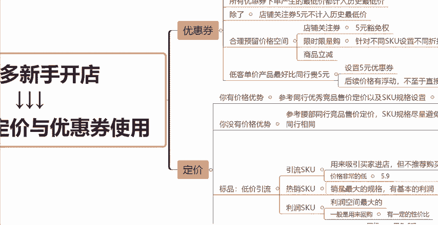

# 【拼多多运营】2024目前最新的拼多多开店新手教程！每天30分钟，零基础电商运营快速起店，实现日销千单！ - P34：34 拼多多产品定价与优惠券使用 - 拼多多-运营 - BV1812mY6EFh

如果你是一个新手商家啊，现在还想在拼多多上开店呢，那么这一期视频呢你一定要认真的听完。今天这一期视频呢主要是来跟大家分享一下关于我们产品如何去合理的定价。

以及我们店铺后台营销工具当中优惠券应该怎么正确的去使用。那么首先呢先带大家来了解一下优惠券它的一些所有的一些相关的一些东西。

那么我们优惠券呢，它的一个分类啊是。

是有很多种的，我们可以在店铺的后台，然后找到这个店铺营销，找到营销工具。在营销工具当中呢，我们点击进来就可以看到啊有一个优惠券的一个选项。那么我们点击进来，大家可以看到。

其实优惠券它是分为分很多很多种类型的。比如说我们的商品立减券，还有店铺关注券以及惊喜券以及直播专享券，不同的优惠券啊，它的一个这种功能，或者说它给我们带来的效果呢都是不一样的。比如说我们的商品立减券。

它就更加于适合，比如说我们的一些新品啊，新链接上架之后，然后通过商品立减券快速的去做一个爆发性的一个促销活动。那么让我们的这个新链接能够快速的去破零，有一定的这个基础的销量。那么第二种呢，店铺关注券。

比如说我们现在是一个新店，对吧？新店没有任何的这个粉丝，那么我们想要获取前期的一些基础的粉丝呢，我们就可以用店铺关注券去带来这种效果。因为店铺关注券啊。

它是需要消费者关注了我们店铺之后才可以领取的一种优惠券。那么第三个呢惊喜券啊，它是针对于兴趣潜客人群专享的。什么叫兴趣潜客，我跟大家解释一下，比如说近期啊有咨询过或者有收藏有浏览过啊，我们的这些产品的。

但是呢它没有下单。那么这一部分人群啊。都被称为兴趣潜客人群。那么这一个惊喜券呢就是针对于这样的一些人群来定向的去发放优惠券。而且这个惊喜券啊，它是不计入我们这个产品的最低价的。

所以说它不会影响到我们后续一些上活动啊之类的一些活动价格。那么最后呢就是一个直播专享券呢，直播专享券呢是消费者必须要进入我们店铺直播间才能够领取的一种优惠券。那么对于我们新手商家前期来讲没有开直播的话。

那么这个券我们可以暂时的不去用到。那么这就是我们拼多多店铺的几种优惠券的类型啊，比如说店铺优惠券，商品的优惠券以及平台的优惠券。那么不同的优惠券当中啊，它的这个叠加规则也是不一样的。一般来讲啊。

我们商家自己创建的这个优惠券，就是我们叫做商家券加上平台的一些补贴平台。

来的一些优惠券，它这个是可以叠加的。所以说商家券加上平台券，它的一个组合的优惠力度呢就是最大的。所以我们后续啊在给我们的店铺这些链接去创建优惠券的时候呢，也要留意一下。比如说有一些平台的活动啊。

平台优惠券的一些活动啊，我们要留意一下，避免啊我们因为优惠券的一些设置，导致最终的一个成交价格特别特别的低，甚至会亏本啊，给我们带来一些这方面的一些影响。就以说大家要去注意一个点。

那么这边还要注意的一个点呢，就是所有优惠券下单的产生的这个最低价都计入历史最低价。除了什么？除了刚刚跟大家讲到的这个惊喜券它是不计入最低价的。那么其他的优惠券呢，它都会计入这个历史最低价。

可能还有很多小伙伴不知道啊，历史最低价它是什么，或者说它带来的一个影响是什么。那么历史最低价呢指的就是你这个链接啊。比如说最近30天啊，成交的最低的价格是多少？那么在你后续啊上活动的时候。

你的这个活动的就是大部分的一些活动的这个活动价格啊，就不能高于你的这个历史最低价，知道吧？所以说它会给我们后面上一些活动啊，带来这个价格上的一些影响啊。然后还有一个呢，就是比如说我们的店铺关注券啊。

有一个5元的一个额度，这个5元呢是不计入历史最低价的。这个大家注记一下就好。好吧。所以说啊在我们前期呢就是定价的时候，我们要去合理的给我们的这个优惠券去预留一定的价格空间。

因为如果说我们在前期比如说我们在产品这个链接定价的时候呢，我们直接的就把比如说我们的这个拼单价设置的非常的低。那么后面我们再想去做一些比如说限时限量购啊，或者说做一些优惠券活动啊。

我们就已经没有这个这个利润空间了，知道吧？所以说我们在前期定价的时候呢，就尽量的稍微定高一点，好吧，给我们后续去做活动，去做优惠券，把这个价格空间给这个让出来。

那么上面跟大家讲的店铺关注券有一个5元的一个豁免权啊，然后就是这个限时限量购。

可以针对于不同的SQU去设置不同的一个折扣。然后就是我们的这个商品立减券啊。那么这边还要跟大家讲一个点呢，就是如果你是做这个低客单价的一些产品，什么叫低客单价呢？就比如说呃几块钱啊，9。

9块或者说几10块钱，这种呢就叫做低客单价。那么你在做这样类型的一些产品的时候，你的这个定价最好比同行，你可以去看一下你的同行，他们的定价是多少钱，你的价格呢最好比它的价格贵5块钱，为什么呢？

因为你的价格比它贵5块钱，表面上看起来是比它贵了。但是你后续呢可以去设置，比如说5元的优惠券。那如果说你的价格比它贵10块钱。那你后面可以去设置10块钱的优惠券，对不对？正常来讲。

比如说我们设置完优惠券之后，你的价格可能说跟你的同行是一样的，对吧？但是呢作为消费者他的一个这种。

视角来看啊。同样的一个商品。那么这一个商品它没有比如说没有创建什么营销活动啊，没有做一些这种活动的政策，它就是一个实打实的价格摆在这。那你的产品呢有做一些比如说限时限量购啊，或者说优惠券啊。

或者说商品立减的这样的一系列的一个活动，实际上啊你们的价格是一样的，对不对？但是作为买家心里来讲，他会觉得哎你做了活动，你会有更划算一点，知道吧？所以说这个对于我们后续比如说呃买家的一个转化率呢。

也会带来一定的影响，好吧？而且第二个点呢就是如果说你后续啊你的这个产品价格会有一定的浮动，你就不用直接的去改这个链接上的价格了，知道吧？比如说你的产品可能说哎呃这个成本浮动了，成本贵了一点。

那你的这个定价呢肯定要去稍微的涨一点，对吧？不然你就亏本了呀。那么你如果说。

有做这个活动的话，比如或者说有做优惠券的话，你后续呢就可以直接的去把这个优惠券给它关闭掉，或者说在限时限量购当中呢，去把这个折扣稍微的调高一点，对吧？

你可以通过这种营销工具的一个手法去把你的价格去做一定的调动。如果说你没有做这样的一些营销活动，你直接的去在你的链接上去改价的话，那么你的这个链接啊会被降权的。你的这个流量啊，一些其他的一些推广啊。

都会受到很大的影响，好吧，所以说这也是要跟大家提醒的一个点。那么第二个方面呢就是关于我们定价方面的一个问题啊。那么定价方面分为几种，我会分为第一个你有价格优势的情况下来跟你讲。

第二个你没有价格优势的情况下，然后还会分为标品跟非标品来跟你们一一的讲清楚。那么首先第一个点啊，你有价格优势。那你有价格优势的情况下呢，你这个时候啊就可以。

直接的去参考同行优秀的这种商品啊，去参考他们的链接，看一下他们的这个定价是什么样的，以及他们的这个SQ的规格是什么样的，你都可以直接的去照搬，知道吧？因为你有价格优势的情况下。

你就不需要什么就不需要太怕平台的比价啊，我们经常跟大家讲的，就是我经常会跟大家讲的，就是我们要做好防比价，要做好防比价，为什么要做防比价呢？

就是因为在同行就是在平台啊把你的这个链接跟同行他们的链接判定为是同一种产品的时候，那么在这种情况下啊，谁的价格更低的话，那么谁能够拿到更多的流量，知道吧？拼多多平台啊，它就是这样有这样的一个特性。

所以说在你有价格的优势情况下呢，你就不用去做好防比价。

知道吧？因为你不不害怕平台的比价啊，反正你的价格比它低，那么你自然而然的能够拿到更多的流量，知道吧？那么第二种，你没有价格的优势的情况下呢，那这个时候啊你就要去需要去做好什么做好防比价了，知道吧？

你可以去参考不要去参考头部啊，记住不要去参考那些卖的特别特别好的这些竞品。因为什么呢？卖的特别好的这些竞品啊，他们一般来讲他们的供应链啊，他们的这个工厂都是非实力非常非常强的。

所以你如果说要跟他比这个比什么比成本比这个货源，你是比不过的那自然而然你的这个价格，就不可能比他定的更低，知道吧？所以说这种情况下呢，你就不要去参考头部的一些竞品，尽量的去参考一些腰部的。

就是哎卖的还可以的，但是不是卖的特别特别爆的，好吧，去参考。

这些竞品，他们的一个售价以及他们的定价，然后来跟考虑这些情况来做我们产品的一个定价。那么这边还有一个点要注意的就是。

我们在做SQU规格的时候，也要尽量的避免去和同行相同，知道吧？我给大家举个例子啊，比如说我们是做水果的对吧？那同样是做水果的，同行它的SQU可能写呃，比如说两斤，对吧？那我们如果说也写两斤的话。

你卖的比如说都是苹果啊，它也两斤，你也两斤，那这个时候就陷入了一个比价，知道吧？那怎么跟它做开做好区别呢？怎么跟它做出差异化呢？我们可以写什么？比如说我们可以写买一斤送一斤，对不对？

买一斤送一斤实际上也是两斤呢，是吧？所以说这第一种呢就是这个字眼上的一些区别，知道吧？一些说法上的一些区别。它两斤，我们买一斤送一斤，他5斤，我们买三斤送2斤，对不对？通过这种方式啊去给它做出差异化。

还有什么呢？还有我们可以把这个。

呃单位啊，知道吧？把这个规格的单位给他换一下，同行写的是2斤，那我们可以写什么？我们可以写1000克啊，对不对？1000克也是2斤啊，或者说我们按照这个写法，我们写1000克，对吧？

上面这个是1000克，下面这个也是1000克，但是两种写法，它是不一样的，好吧，这边只是给大家拿水果来举一个例子啊。你们做任何的这个类目啊，做任何的产品都可以按照这种类型，按照这种方法去做好防比价。

好吧，那么这是在没有价格的优势情况下，我们就需要去做好的一些这种方面。那么还有第三种呢，就是。

我们是在做标品的情况下，标品的话最重要的呢就是我们需要去做好这个低价引流。因为我们在做标品的时候啊，我们的SQU一定要去设置好呃，这个点呢也是我反复跟大家讲过很多遍的。我们的SQU要分为多种类型来做。

你的这个链接当中呢？需要有引流的SQU需要有热销的SQU需要有利润的SQU什么叫做引流的SQ呢，我们在拼多多上买东西的时候，经常会看到某一种东西。哎，我们还没有点击进去的时候，看到它的价格。

价格非常的低，对不对？比如说我们想买一个扫把，然后我在拼多多上看看到哎有的扫把它标准了标的5。9块，对不对？你想5。9块买个扫把是不是特别特别的便宜，但是呢当我点击进去一看，发现什么？发现5。9块。

它不是扫把，它可能只是什么，可能只是一个那个呃，我们叫做戳寄，对吧？也可以叫笨笨斗啊，对吧？或者5。9块呢，它只是一个配件啊，或者说只是一一袋这个赠送的这个垃圾袋，对不对？反正它不是你想买的那个东西。

所以说这种SQ啊，它的一个定价呢就非常非常的低，它不是给买家用来下单用的，知道吧？它只是什么呢？只是用来吸引买家进店的，但是不推荐买家去购买的，它的作用呢？就是这样，这个就叫做引流SQ。

懂不懂？然后第二个呢就是热销SQ。热销SQU呢它是一个链接当中销量最大的一个规格，然后它也有基本的利润，但是它的利润空间不会特别的大。因为什么？因为他要把这个性价比给拉满，对吧？让这个消费者看到之后啊。

觉得非常的划算，有很大的概率会去下单的。所以说一般来讲这个SQ它的一个定价也不会特别的高，基本上就是一个在消费者看到的情况下都会觉得非常划算的一个价格啊，这个就叫做热销SQ。

然后第三个呢就是利润SQ它的作用呢就是用来撑起我们整个链接的一个利润空间的。它的利润空间是最大的，知道吧？这种情况下，一般来讲。

啊，是用来。回购的。知道吧？一般是用来回购的，就是在一些快消品啊，在一些日用品的情况下。当一个消费者买过你的产品，并且觉得这个产品质量什么各方面的还不错，对吧？他再次来回购。

他肯定会去选择那个数量相对稍微多一点的，对不对？因为他肯定也会想着一次多买一点省事嘛，免得用完了又要买，用完了要买，对不对？所以说这个一般是用来回购的，并且有一定的性价比，知道吧？有一定的性价比。

它的这个性价比呢可能是跟你的热销SQ是一样的，但是什么呢？但是啊它的这个规格。就是它的这个单位，它的重量，不管是从数量上来讲，还是说从重量上来讲，它一定是更大的。知道吧？所以说你们在做标品的时候呢。

也要按照这几种类型的SQ去做好布局，知道吧？不要你就一两个SQU挂在那啊，你的产品是什么，就写什么老老实实的。这样在拼多多上做店是不行的，好吧，要学会码匾啊，要学会适当的码点，好吧。

然后最后一种呢就是如果说你是做这个非标品的，什么叫非标品的？比如说我们的服饰鞋包，那这种情况下呢，你就一定要在SQU规格名称，一定要做出差异化。就是我上面跟大家举的例子啊，做水果的，知道吧？

一定要从SQU的规格名称上去做差异化啊，比如说啊同样是卖衣服的，可能同行。

同行他写的什么黑色。然后嗯。SSS码对吧？同行可能是这样写的那我们可以怎么去写呢？那给大家举个例子啊。

那我们可以怎么去写呢？我给大家举个例子啊，比如说我们我们就不一定要写黑色啊，对吧？我们可以写个什么午夜黑。啊，然后随便的加什么KH啊，对吧？然后S码这样的话，你跟同行是不是就区分开了啊，同行说它是黑色。

那我们说它是午夜黑，那其实都是黑色，只是我们把它这个名字叫的牛逼的一点，对吧？然后这个KH是什么意思呢？没什么意思，你可以把它理解为一串编码，也可以理解为我们自己做好区分的一个这种编号。

也可以把它理解为我就是要做好这个差异化的一个点，知道吧？所以说你们可以这么去做出差异化。这个是针对非标品的啊。那么这期视频呢分享到这，希望大家都能够搞清楚啊，就一个是优惠券，一个是定价方面怎么去做。

好吧，如果说还有任何其他方面不懂的呢？大家可以在评论区扣三个6，找我领取一份，我给大家整理的这个店铺运营的综合大礼包。那么有任何其他的问题呢，也可以找到我。然后我如果说有空的话，都可以。

帮你去解答一下。

