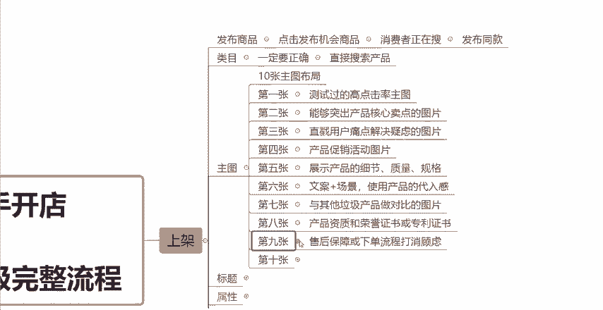
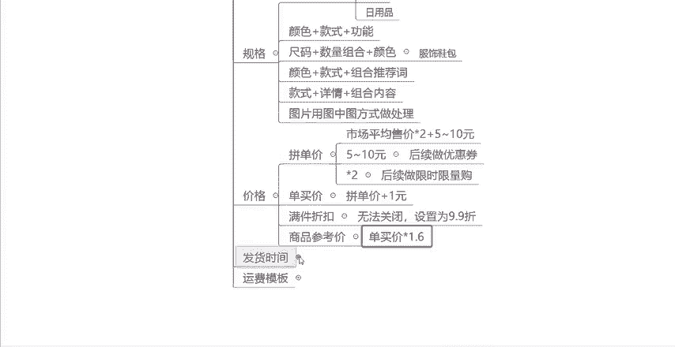

# 【拼多多运营】2024目前最新的拼多多开店新手教程！每天30分钟，零基础电商运营快速起店，实现日销千单！ - P35：35 拼多多产品上架保姆级完整流程 - 拼多多-运营 - BV1812mY6EFh

。新手做拼多多店铺想要起店又快又稳。那么一个好的产品内功布局是必不可少的。今天这一期视频呢会跟大家分享一下关于我们产品上架这个环节，一个非常详细非常完整的一个流程啊。

平台上那些啊前十或者说做的特别好的店铺。那么他们的产品的内功啊，都是这样去布局的，上架就自带流量。所以如果说您现在是一个新手啊，还没有了解过拼多多店铺怎么去运营的。那么这一期视频呢，你一定要先点赞收藏。

多看几遍啊。那么首先我们第一步啊产品上架的时候，一定就是发布产品的。发布产品的话，大家这边教大家一个小技巧啊，就是不要直接的去点击发布商品这个这个途径啊，你可以点击发布机会商品。

然后里面有一个消费者正在收，那么点击消费者正在搜呢，这个里面啊它就会给你展示一些啊。

非常多就是现在搜索的这个买家比较多，但是拼多多平台上的一个产品呢还不是那么多的这样的一些同款啊，这样的一些产品。当然呢你也可以去直接选择你想做的类目。

然后在这个类目下呢去找一下有哪些这种产品这种款式是平台商品就比较紧俏的啊，然后你找到了之后，直接点击发布同款。然握在这个页面里面去上架去发布你的商品啊，这个路径会更加好去前期帮你获取流量。

那么接下来呢这一个点就是关于我们的上架的这个类目。类目呢，你一定要发布正确啊，一定要正确。因为。

你可以在上架的时候，在选择类目的时候，直接的去搜索你的产品。比如说你是连衣裙，你就直接搜索连衣裙，或者你是比如说男鞋啊，女鞋或者说高跟鞋等等等等。你是什么产品，你就直接搜索什么产品。

那么这个平台呢它都会给你推荐一下，就是你这个产品应该上的是哪一个类目，那么你直接去选择就可以了。一定不要放错类目啊，因为你放错了类目之后呢，就很容易会被限流的啊，到时候你到后面发现你没有流量。

就基本上是你这个类目放错了的一个原因啊。那么类目选择好了之后，然后就是关于我们主图的一个布局。因为拼多多这个平台上啊，我们这个上架发布这个主图，也就是我们俗称的轮播图，它是可以上传十张主图的啊。

所以说这十0张主图，我们怎么去布局，也是有讲究的，那么分别来跟大家讲一下，首先第一张呢我们一定要放的是什么？就是我们测试。

过的高点击的高点击率的这样的一个图片啊，也就是我们所说的主图。那么第一张呢，它是用来帮助吸引消费者去点击的。所以说啊第一张图片你一定是要测试过点击率的啊，你不要说呃懵蒙蒙的啊，也不知道这张图到底行不行？

点击率数据啊，这些到底好不好，你就直接把它放上去了。这个你到后面你的点击率如果说差了，也会很大的这种程度下会影响到你的这个流量的啊。然后第二张呢就是去放能够突出你产品核心卖点的一些图片。

就啊就比如说你的这个产品你想凸显的是什么卖点。然后你可以通过图片的方式啊，或者说通过这个文案啊，把文案放在图片上的这样的一些方式啊，去把它做出来，做出这样的一张图片。

也就是第二张你应该放的是这样的一个图片啊，展示你这个产品的优势展示你这个产品的核心卖点。然后第三张呢。你需要放的是可以直戳用户痛点，可以解决顾客疑虑的这样的一个图片。比如说你啊做的是什么功能性的产品。

对吧？那你这个产品帮助客户解决了什么样的一个问题，对吧？解决了一些什么样的一个痛点啊，能够有什么样的一个优势，那么你可以在第三张啊，放这样的一张图片，那么第四张呢。

如果说你的产品现在还有做一些什么促销活动，比如说价格上来呀，或者说一些什么赠品啊，或者说发什么，比如说快递啊等等等等。只要是你这个产品关于你产品的一些促销，你都可以把它做出一张图片来。

然后你可以放在第四张，这样的话啊可以帮助我们去提高这个产品的一些转化率啊，然后第五张呢，你可以放你的产品的一些细节放大的图片，或者说展示你这个产品质量的一些图片，或者你产品的。规格啊。

能够了解你产品的一些做工啊、质量啊、品质啊，可以放这样的一个图片。然后第六张呢，你可以放这个，比如说文案。加场景啊，放这样的一张图片啊，可以更加的让消费者有这样的一个代入感啊代入感。

第七张呢我们还可以放什么？比如说啊我们的产品跟同行啊，跟市面上现在其他的一些垃圾产品去做对比，我们有什么样的一些优势，对吧？我们的比如说材质上有什么样的一个优势，或者说外观上款式上等等。

有什么样的一个优势，你可以做一张这种对比图出来，然后你可以放在第七张，当然这样的一张对比图啊，包括上面所说的这些文案场景图，或者说一些促销活动图片，你把这种图片做出来了之后啊。

它不仅仅是可以放在这个主图上的，知道吧？也可以后面比如说改一下这个尺寸，可以放在你的这个详情页里面的啊，知道吧？然后第八张呢你可以放比如说你的产品，如果说有一些什么资质认证啊。

或者说有获得什么专利啊等等荣誉证书啊，你可以把它放。上去啊，放在第八章。然后第九章呢，你可以放一些，比如说你的产品有什么售后保障，对吧？或者说放一些下单流程啊，教一下顾客怎么去下单，怎么去拍啊。

这样的话可以打消顾客下单前最后的一个顾虑，对吧？比如说你呃三年质保，五年质保或者说有一些其他的什么售后保障，你都可以把它表达出来，然后第十张呢那么你就可以去放白底图，对吧？可以放一张你产品的白底图。

这个扣一下就可以了啊，抠出来很方便的。这样的话可以方便你后续去报名一些活动。因为报名活动它是需要白底图的啊，白底图是一定要有的，好吧，然后这就是我们主图的10张图片的一些布局。

那么不管说你是做什么产品的，除非说你是做什么服装啊啊，或者说这个服饰鞋包啊等等这种产品，那么你这十张图可以都放啊你产品的一些款式，一些这种模特图啊，这个都无所谓的。

那么其他的一些比如说做一些标品，或者说做一些电器数码等等等等之类的啊，你都可以按照这10张图片这样去布局啊去做你的主图。好吧，然后这是主图怎么去布局的一个问题啊。然后接下来呢就是标题啊。

标题这一期视频呢会跟大家简单的讲一下。因为后面会单独出一期视频来重点跟大家讲一下标题该怎么去写，能够获得更多的流量啊，那么这边呢你只需要记住，就是一个标题是60个字符。然后。

如如说归到汉字上呢，就是30个字啊，然后你要组成，要尽量的去写满这一个标题，就是写满30个字，并且你的标题要是能够通顺的。然后要是包含这种核心关键词的，并且是不带任何违件词的这样的一个标题。

基本上呃不会有什么太大的问题。那么大家注意一下就可以了。后面会跟大家来具体详细的讲一下这个标题啊。然后接下来是属性啊。

寿悉。属性的话就是你属性填写的正确啊是否正确，或者说填写的是否详细，它是直接关乎到这个搜索推荐页的一个流量的啊。因为你的这个属性如果说填写的不完整。但是你的同行填写的是完整的。

那么当消费者在搜索关键词的时候，比如说他在搜索某一个关键词的时候，那么这一个关键词它刚好又是属性当中有的关键词。

那么同行它的产品就有很大的这种可能会展现在你的产品前面，知道吧？所以说它会影响到我们搜索推荐页的一个流量。所以你们在不管说做任何的产品，任何的内部啊，你的这个属性都尽量的第一个是一定要填写准确。

就是不要填错了。然后第二个就是尽量的要填写的详细。不管说是不是必填项，你都尽量的去把它填上。好吧，这是关于我们属性的一个问题。那接下来就是产品的这个视频啊视频。

那么视频呢就是这个点，虽然说不是说让大家一定要有，知道吧？因为我们视频当中有，比如说我们的商品视频，或者说商品的讲解视频以及商品详情页视频。不一定是要上传的。但是呢建议大家都尽量的去拍一下，对吧？

因为这个拍一下也不是特别的难，然后也花不了什么多少功夫，多少时间，但是如果说你有这个商品视频的话，它是能够帮助我们大大的去提高我们产品的转化率的，知道吧？所以说这个东西最好是有，但是不一定是要有好吧。

那么你有的话就更好了。那么接下来是我们的详情页啊，详情页的话呢没有什么太多的一个讲究啊，大家可以直接的去参考同行布局的一个方式。但是有一个点你们注意一下就行了。就是把你产品重要的一些信息。

重要的一些元素图片，尽量的放在前六张。因为现在消费者在我们拼多多平台上买一个东西来讲啊，他会去看详情页，但是他不一定会把你的详情页全部的看完，基本上他就会看前几张啊，看前几张。

那比较重要的其实是你的这个呃买家秀啊或者说一些评价晒图啊，重要的是这些东西啊，所以说你尽量的把你产品重要的一些信息放在前六张就可以了。然后最后呢就是刚刚上面跟大家说的白底图啊，白底图是一定要上传的。

它不它会影响到我们后续上活动以及这个类目推荐页的一个流量啊。所以说大家白底图一定不要忽略的啊。然后接下来呢是产品的规格，规格这边。

有几种组合方式大家可以记一下。然后这几种方式呢也也是可以帮助我们去做到这个防比价的啊，防比价的一个是数量加规格。比如说一般你是做这种啊零食或者水果或者这个。

还有什么数量加规格啊，比如说你是做零食的，做水果的，或者做一些日用品的。

知道吧？像这种你一般是会用到数量加规格，比如说多少个多少个啊啊，然后是一套，比如说啊两套里面是多少个，对吧？是这样的。然后接下来呢是颜色加款式加功能，这种一般就是用在什么用在一些呃这种数码电器啊啊。

或者说一些其他的这种一些功能性的用品上啊，就用颜色加款式加功能去组成你的SQU。然后接下来尺码加数量组合加颜色，一般就是用在这个呃服饰鞋包啊，用在服饰鞋包里面会这样去用。

然后接下来呢就是颜色加款式加组合推荐词啊，你如果说啊你的产品是分颜色的，然后分款式的，你可以用颜色加款式，然后加上一些组合的推荐词就可以了。然后接下来还有一种就是用款式加详情加组合内容啊，这样去做。

然后这是几种这个SQU规格的一个名称的一个组合方式，大家可以去对号入座，看一下你的产品，你的类目更加适合哪一种，你直接去套用就可以了。知道吧？然后我除了SQU的规格的名称之外。

还有SQU规格的一个图片啊，图片也是需要去上传的。然后图片怎么去做到仿比价呢？这边教大家一个方法，就是直接用图中图的方式去做就可以了。什么叫图中图简单的跟大家讲一下啊，就是比如说我们用美图秀秀，对吧？

把你的这个产品啊，你产品不是有一个图片吗？然后用美图秀秀可以把你的这个产品的主体给抠下来啊，抠下来抠成一张透明图，然后你再随便的去找一张其他的图片，跟你产品不相关的，作为背景图。

再把你这个产品放在这张背景图上，这个就叫做图中图。那么图中图的话是很好的可以做到一个仿比价的这样的一个操作啊，大家可以去尝试一下。然后接下来呢是我们关于我们产品价格的一个问题啊。

价格的话，我们有一个拼单价，有一个单买价。那么拼单价呢，这边建议大家可以用市场的平均售价乘以2加上5到10块钱。这样去做呢？它有一个好处，就是不仅有利润有这个优惠的空间。那么也会为我们后期啊。

比如说提价啊，可以提前做好一个布局。当然啊比如说这个55至10块钱，为什么让你加这个5至10块钱呢？就是你的这个价格定出来之后，你可以后面再去做5块钱，或者做10块钱的这样的一个优惠券啊。

这是一个营销活动。那么为什么让你乘以2呢，乘以二的话是方便你后续可以去做这个限时限量购，你可以去打5折对吧？打6折，这样的话也不会把你的这个价格压的特别的低。你直接的按照这样的一个公式去定价。

然后按照优惠券以及这个营销工具啊，去把你的价格打下来就可以了。这个就是啊你们。

去定价的一个方法啊。然后这个单买价，单买价很简单，就是你把拼单价定出来，拼单价定出来之后，在拼单价的基础上去加1块钱就可以了。这个就是单买价。然后接下来这个有一个满件折扣啊。

你们在发布产品的时候会看到这样的一个东西。这个呢其实是拼多多平台，它属于这个一个流氓软件啊，一流氓的工具，它是没有办法去关闭的。所以说你只能尽量的去设置高一点啊啊，没办法取消。

自己去设置的高一点就可以了。注意一下，不然到时候你没注意的话，打个半折，你都不知道是哪里出现的啊，出单亏损就划不来了，你可以去把它设置为9。9折就可以了。这个对你价格也不会有什么太大的影响啊。

然后最后呢就是商品参考价，商品参考价的话，基本上就是我们单买价乘以1。6就可以了啊。这个就是价格方面的一些设置。然后关于这个发货时间呢，建议大家直接选择48小时就可以。

了啊，以防到时候你耽误发货了，被处罚。这个呢你如果说是自己的一个货源，你就建议你去选择48小时啊，因为。对吧万一呢万一你20你如果说设置的是当日发货或者说24小时，你没有及时发货。

被这个罚款拿那就不太好了，知道吧？所以说选择48小时是比较稳当的啊啊，当然如果说你是做这种一件代发的，货源不是你自己的那这个发货时间，你就一定要去跟你的这个货源方啊，去跟你的上家去确定好。

他们的发货时间是多久。然后你根据他们的来设置就可以了啊。那么最后一个呢就是我们的运费模板，运费模板的话，你去设置好就可以了。一般来讲是一个默认默认模板啊，就是偏远地区不发货或者不包邮。

当然呢这个也是根据你当地的一个就是你自己谈好的一个这个快递情况去设置就可以了。是吧？如果说你也是做一件代发的，那么你也去跟你的这个货源方跟你的上家去确认好，他们有没有哪些地区是不发货的，或者说不包邮的。

那么你去问清楚了之后来。把你的这个运费模板按照同样的去设置好就可以了啊。然后这个呢就是我们新品上架新品发布的一个布局啊，一个完整的一个流程。你的新品按照这样的一个流程，按照这样的一个布局去发布啊。

想要不起自然流量都很难啊。那么看到这里的小伙伴呢，如果说还有什么不懂的，或者说需要表格资源的，可以在评论区评论666啊，找我领取一份。我给大家整理的这个店铺综合的运营大礼包啊，感谢大家的一个观看。

