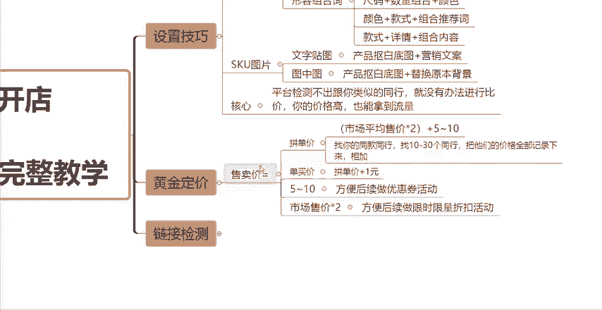
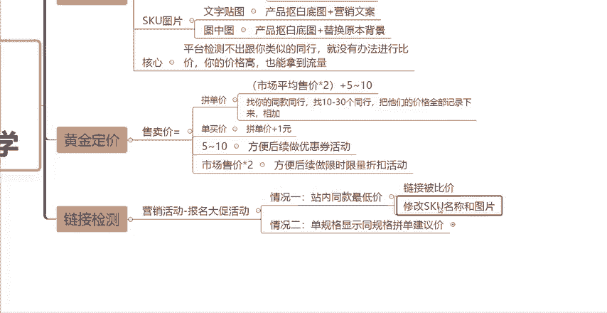
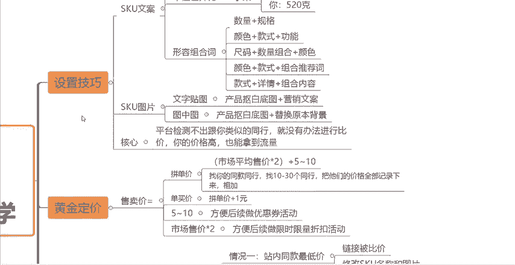

# 【拼多多运营】2024目前最新的拼多多开店新手教程！每天30分钟，零基础电商运营快速起店，实现日销千单！ - P36：36 拼多多店铺SKU防比价完整教学 - 拼多多-运营 - BV1812mY6EFh

前面的视频课程呢跟大家讲了很多关于流量怎么去做拉伸以及流量下滑之后啊，怎么去做操作啊，包括新品上架的一些内功优化一些基础啊，其中呢就有涉及到仿比价的这一块的内容啊，然后很多小伙伴还在问我怎么去做仿比价。

那么今天这期视频啊，我就特地给他出一期关于我们这个店铺防比价的一个完整的教学内容啊。呃，由于现在的这个拼多多平台呢，它的这个仿比价系统啊，再次的去做了升级啊，现在的这个仿比价会比之前更加的变态。

以前只是关注这个SQU啊，一些名称啊，文字啊文案之类的。现在的话这个SQU的图片啊，都要去做点稍操做才可以了啊，图片都会被仿比价对比价，知道吧？那么做SQU防比价的一个好处呢，大家。

也都清楚，就是我们可以呃原价上活动，然后也能够让我们的这个产品价格卖的高一点啊，然后也能够获得一部分的流量啊，可以不比那些卖低价的产品流量来的少。然后也可以让我们长期的去获得很多的自然流量。那么。

还有很多小伙伴啊是不懂这个防比价的，所以说你的店铺的这个流量啊，或者说你链接的这个流量一直就是特别特别的差。所以说今天这一期视频啊，希望大家能够认真详细的啊去听一下，然后点个关注啊，点个赞。

防止后面找不到了好吧，那么防比价啊，然后SQ总共有两个板块，一个呢就是我们SQ的文案，然后一个呢就是SQ的图片，先跟大家讲SQU文案啊，呃，SQ文案呢一般来讲啊，就是之前我们去做这个仿比价的话。

一般就是字符的一个限制啊。因为之前的话我们通过软件是可以呃突破到18个字符的啊。然后用工具呢可以突破到25个字符。现在的话啊SQ的名称规格可以写22个字符，然后用工具的话可以突破到30个字符啊。

这这是之前跟现在的一个差异啊。

然后第二个呢就是单位上的一个差异化。具体什么意思？我给大家举例一下，比如说你是做水果的对吧？那么做水果的呢，你会发现啊比如说同行他们做的都是一斤啊，比如说他写500克。那如果说这种情况下。

你也写500克，那就会陷入了一个比价，对吧？你的水果跟它做的是一样的。你的这个克重做的也是跟它一样的，那么平台就会把你们这两个产品进行一个价格上的对比，谁的价格低，谁能够获得更多的流量。

他们会相互的竞争。所以说我们在这种情况下，我们就可以什么？比如说我们做520克，对吧？我们的规格跟它区分开，就不会啊陷入这种平台上的一个比价，知道吧？这是单位差异化的一个例子啊。

然后第三个呢就是形容组合词，大家可以记一下这几个搭配方法啊，这几个SQU文案的一个公式，比如说你可以用数量加规格，用颜色加款式加功能，或者用尺码加数量组合加颜色。

或者用颜色加款式加组合推荐词，或者用款式加详情加组合内容啊，这些都是不同的一个组合方式啊。你们根据你的这个具体所做的产品啊，组所做的类目，然后分别的去套用就可以了啊，去套用就可以了。

一般来讲这样去组合的一个SQ的文案的这样的一个规格，基本上都是不会被比较的啊，不会被比较的，知道吧？你就。你的这个。SQU的文案就不要的随便去写啊，随便去写。如果说你随便去写的话，跟同行是一样的话。

就很容易被比价了。好吧，这是第一个点啊。SQU文案方面的一些问题。然后第二个呢就是我们SQ图片上的一些问题。图片可以用两种方式来做这个。

仿比较。呃，因为现在这一个图片啊，平台这个拼多多系统它是已经加强了对比的。所以说你自己再去随便弄一张常规的图片，是没有办法逃过比价的。现在升级之后的一个玩法呢，有两种，一个是文字贴图。一个是图中图。

文字贴图呢就是把你的产品抠出一个白底图，然后加上各种各样的营销文案去做一个这种图片。第二个是比较好用的，就是图中图。就是首先呢我们可以。呃，打开这个美图秀秀，然后在美图秀秀上去编辑。

就是把你的这个产品的图片先抠下来啊，抠下来保存，然后去网上随便找一张别的图作为背景图。比如说呃你是做这个。啊，服饰鞋包的对吧？然后你把你的产品抠下来，然后在网上随便找一张别的，比如说找个洗衣机的图片啊。

然后把它作为背景图，然后把你的这个比如说你服装放到这个洗衣机上面，然后稍微缩小一点点。这个时候啊系统它就会误认为你的这个产品是洗衣机，就不会把你的这个衣服拿去跟别的衣服进进行一个比价，知道吧？

这样的话就能够实现这个迷惑平台的一个行为啊。狸猫换太子，规避仿比价啊，规避比价，知道吧？

然后这里面有个核心啊，就是。

如果说平台检测不出跟你类似的同行，他就没有办法进行比较，知道吧？你的价格高也能够拿到流量啊，也能够拿到流量。呃，做好上面这两个操作啊，那么你的这个新品呢也能够快速的获取自然流量，知道吧？

然后第二个我们的仿比价设置好了之后呢，就涉及到一个产品定价。产品定价的话直接教大家一个公式啊，就是售卖价怎么去设置。首先我们有我们需要去设置一个。

单买价啊是本设置一个拼单价，设置一个单买价，对吧？

单买价，那么拼单价怎么去设置，大家记好这个公式啊，记好这个公式，市场平均售价乘以2加5到10。

市场平均售价怎么算啊，你去找你的同款。

同行。找10到30个同行。然后把他们的。价格全部记录下来。然后相加。再除以，比如说你找10个，你就除以10，你找30个就除以30。这样的话你就可以算出。

你的这个款式，你的这个产品市场的平均售价是多少，知道吧？然后把你所得出来的这个数值乘以2，再加5到10块钱。这个呢就是你的拼单价。知道吧？拼单价为什么让你加5到10呢？是因为你要留出一定的这个优惠空间。

方便你后续去做营销活动，知道吧？5到10呢就是方便你后续可以去做优惠券的一些活动。比如说你设置一个新人啊，新人优惠券5块钱或者10块钱的，知道吧？然后为什么让你把市场平均售价乘以2呢。

就是方便你后续去做限时限量的这个折扣活动。你可以去做5折，可以去做6折，知道吧？这样的话你通过这一系列的这个营销活动下来之后，你的价格也是有利润空间的啊，不至于没有利润空间，知道吧？另外一个方面呢。

如果说。你后期要涨价，对吧？那么你可以怎么去做呢？你可以把这个折扣设置高一点，对吧？或者说把这个优惠券取消掉，那么你的这个价格是不是就提上来了，是不是就不用直接的去修改你的这个价格？

如果说你直接去修改价格的话，那么你的这个链接的权重，你这个链接的流量很大概率会受到影响。知道吧？所以说你就按照这个公式，按照我跟你。我跟你说的这个公式去设置你的拼单价，然后单买价怎么去设置呢？

拼单价加1块钱。就可以了，知道吧？就按照这样的一些公式啊去设置你的这个售卖价，这个就是黄金定价的一个公式啊。然后这两个这两个操作做好了之后，我们还要去检测一下，检测什么？就是检测一下你这个链接。

防比价到底做好了没有，知道吧？怎么去检测呢，你可以去营销活动当中去报名大促活动。报名大促活动首先可能会有两种情况。如果说你的仿比价没有做好的话，第一种。

站内同款最低价。

啊，如果说它显示给你显示的站内同款最低价，那么就证明你的这个链接被比价了，你就需要去修改一下你SQ的这个文案名称，或者修改一下你SQ的图片。

知道吧？那么第二种情况，如果说单规格显示同规格拼单建议价，那么就证明你其中的某1个SQU啊，没有做好对比价了，你就需要去修改对应的那个SQU它的规格的名称和图片，知道吧？

如果说这两种都没有显示这两种情况都没有出现的话啊，你会发现你的这个链接。

啊，也可以高价去上活动，知道吧？你上活动的时候，价格就不需要设置的特别低，甚至还有可能可以原价上活动，理解吧？如果说你能够高价上活动或者原价上活动，就证明什么呢？证明你的仿比价做好了，做成功的，知道吧？

那么以上呢就是我们设置仿比价的一个具体的操作方法啊。如果说看到这里还有什么不懂的小伙伴呢，可以评论区留言666，然后找我领取一份店铺运营的综合大礼包啊，感谢大家的一个观看。

