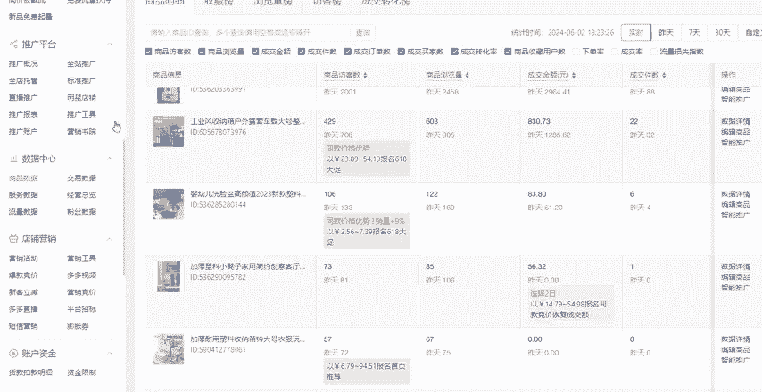

# 【拼多多运营】2024目前最新的拼多多开店新手教程！每天30分钟，零基础电商运营快速起店，实现日销千单！ - P37：37 电商小白必懂运营常用专业术语 - 拼多多-运营 - BV1812mY6EFh

。这一期视频呢主要是针对于一些拼多多的新手商家，也就是刚刚接触到拼多多这个平台，或者说刚刚接触到店铺运营的这方面的小伙伴呢，给大家出的一些视频。

就是教大家搞懂我们店铺运营的过程当中会经常涉及到的一些专业的术语，以及他们是什么意思啊。那么今天给大家整理了三个方面啊，一个是店铺后台相关的，一个是推广活动相关的，一个是其他的一些运营名词。

来后我们一个一个来啊，首先第一个呢是访客数，访客数这个东西呢，基本上大家会经常在我们的店铺后台。然后有一个这个数据中心里面有一个流量数据。在这里面啊大家会看到，然后有一个店铺访客数，这个访客数啊。

顾名思义就是进店的一个人数啊，进店的人数。今天有多少个人进入了我们的店铺进入了我们的这个链接，这个就是做访客数，好吧。然后第二个浏览量呃，很多小伙伴会把浏览量跟访客数这两个给混淆啊，搞不太清楚。

访客数是一个人进店，那么就是一个访客数。那么浏览量呢是同一个访客，他可能会多次进店，那么他就会记入多次的这个浏览，知道吧？1万个人进店，那么你今天店铺的访客就是1万，但是这一万个人呢。

他比如说每个人进反反复复进入了两次店铺，那你今天的这个店铺的浏览量就是2万。好吧，然后第三个呢是我们的这个转化率啊，转化率。转化率呢它通常涉及到我们的店铺的后台关对这对应的这个成交转化率。

那么我们一般分析数据啊，对吧？我们要分析转化率到底好不好。除了在这个地方，我们可以看到店铺整体的这个成交转化率，它会有三条曲线，一个是同行同城平均值，一个是同行同城优秀值。那么这个转化率啊。

它的一个公式是订单除以访客，它就得到了我们的转化率。那么转化率它的一个作用呢，就是帮助我们去分析哪些商品，哪些链接，它的转化率是比较好的，哪些链接它是转化率比较差的，甚至说没有转化率的。

那我们就通过这个数据指标能够去判断一个款式，它到底能不能够卖啊，能不能够卖爆啊，或者说数据到底怎么样，有没有做的必要。那我们基本上会通过转化率来分析这个数据。那么第四个呢就是客单价，客单价在这个地方呢。

也可以看到啊，就是店铺整体的一个成交客单价。客单价的话，它就是平均每笔的成交金额，知道吧？呃，客单价越高，那么就代表着什么？代表着我们的这个坑产会越高。给大家举个例子吧。比如说我们的客单价是50，对吧？

那这个时候有一个同行，他的客单价是30。那在这种情况下，同样的，比如说我卖了100单，同行他也卖了什么？他也卖了100单。那在这种情况下呢，我的这个什么，我的成交金额就是5乘以50乘以100。

就等于什么等于5000，对不对？等于5000，那同行它只有多少，它只有3000，这个时候我的成交金额是比他高的那在同样的情况下，比如啊就是我跟同行都卖了100单的情况下，那我的成交金额比他高。

从而我相对应的我获得的这个权重的提升也会比他高，知道吧？这就是客单价的一个作用啊，你们可以去分析一下，然后第五个呢就是我们的访问深度啊，这个给大家简单讲一下就好，就是平均每一个访客浏览了多少个产品。

这个呢就取决于你店铺类的产品，你的关联性强不强，知道吧？可能说买家是这个消费者是通过这一个产品。比如说消费者是通过你店铺的这一个产品进店的对吧？但是这。这个产品他综合看了一下呢，可能说还不是特别的满意。

对吧？还达不到他直接下单的这样的一个条件。他如果说你店铺内其他的产品做的也还可以的话，那么他就可能再去浏览一下你店铺其他的这些产品，看一下有没有自己喜欢的有没有合适的，知道吧？这个就是访问深度。

访问深度呢就是越越高越好啊，越高越好。然后接下来呢就是这个SQSQ的话就是产品的规格啊，给大家看一下具体在哪。就是我们在上架产品的时候，那么我们都会要去编辑到这个产品的规格啊，然后我给大家看一下。

在我们的商品列表来，我随便点击一个产品啊，随便点击一个产品。然后。往下滑这个地方看到没有？有个规格与库存啊，这个呢就是我们的SQU我们经常说的SKUSQU就是这个东西啊，就是这个东西。

它的比如说颜色啊、规格啊、款式啊、套餐啊、型号啊，这些都叫做产品的规格。好吧，然后接下来呢这个DDSRDSR呢，它的官方叫法叫做什么叫做店铺评价分啊，在我们的后台首页这个地方可以看到有一个店铺评价分。

这个它有一个要有一个要求啊，就是你的店铺没有评价分的话，基本上就是你的店铺最近90天内有效评价数低于50条。那么它是不显示这个店铺评价分的。所以说当我们如果说是做一个新店啊，或者说做一个老店。

但是很久没操作的，重新开始做的这种情况下，那当你的店铺没有DSR评分的时候，你要优先的去把这个店铺评分评价分给做出来。让它有店铺评价分之后，你再去做其他的操作。比如说补单也好啊，或者说开车也好。

然后报活动也好，都是要建立在先有这个店铺评价分的基础上，再去做其他的操作。好吧，然后这个店铺评价分呢建议大家能做到4。9以上是最好的。那么你如果说做不到，对吧？可能说有时候有一些差评啊。

或者说有一些服务质量被打了低分啊，你的评价会会会掉下来。那不建议大家低于4。6，好吧，不建议大家低于4。6，因为低于4。6的话，你的权重可能会受到一定影响。如果说低于4。4的话，那就很糟糕了，好吧。

会受到很大的影响的。这个是这个是DSR的一个条件跟作用啊。然后下面呢就是我们的UV价值，UV价值是什么意思呢？就是平均每个访客的成交金额。在这个地方也可以看到，在我们的店铺后台。

呃，然后在这个数据中心当中有一个流量数据。然后下面呢它也会有这个成交UV价值，看到没有？同样的它也会有三条曲线，一个是同行同城平均值，一个是同行同城优秀值。

那我们一般建议大家这个UV价值呢都是就是高于同行同城平均值是比较好的，好吧，就是这个东西。然后第二个方面呢就是关于我们推广活动方面的一些名词啊，大家需要了解的。

就是我们经常所说的第一个资源位展现位是什么意思呢？就是所谓的资源位，它就是产品的流量入口啊，所谓的资源位和展现位，资源位和展现位有哪些呢？比如说这个是我们拼多多买家端的一个后台首页，对不对？

首页上大家可以看到很多元素啊，比如说上面有这个频道，对吧？热门百货女装食品车品，这是一个资源位啊，一个展现位。还有下面的活动方面的一些资源位，比如说限时秒杀多多果园。

然后其他里面的9。9618，然后满减对吧？领券中心等等，还有下面的多多买菜里面的一些。然后再往下呢，百亿补贴，然后再往下这些呢就是首页推荐资源位，知道吧？这些都是资源位跟展现位置啊。

然后也是我们产品的流量入口，知道吧？这个就叫做资源位展现位。然后第二个曝光量曝光量这个数据呢，一般在我们开直通车的过程当中会遇到啊，我给大家打开一个直通车后台，大家知道了。

比如说当我看在开直通车的过程当中呢。我会经常看到一个数据，对吧？我点击，比如说我点击数据，然后在数据当中。你就会看到啊你就会看到有一个什么曝光量，就是这个这个数据啊，曝光量它是什么意思啊？

它就是去你的产品展现在了多少个人的面前啊啊不是说多少个人点击你的产品啊，是多少个人看到了你的产品，我给大家举个很好理解的一个例子啊，比如说我们在路上逛街，对不对？那路路边有很多个店面啊，有很多个店铺。

那这个时候比如说你从某一家店铺门口经过你看到了这个店铺，那么你就形成了一个曝光量，知道吧？这就是一个曝光量，那么最终你决定进不进入这个店铺呢，那就另外说你进去了这个叫做点击量，理解吧？如果说你没有进去。

那么就只形成了一个曝光量好吧，这个就是这个意思啊，很好理解的然后第三个呢就是点击率啊，点击率点击率它的一个计算公式。等于点击量除以曝光量啊，就是得到了点击率。

点击率它的作用一般是我们用来分析分析判断一个图片，它的点击率高还是低。它啊如果说点击率低的话，那就证明你的图片有问题，你就需要去换图，知道吧？因为什么呢？因为比如说在同样的情况下。

比如说同样有1万个1万个曝光，对吧？同样有1万个曝光的情况下，当你的这个图片，如果说你的图片做的还可以，你的点击率达到5%的话。

啊，5%的点击率。那这个时候啊1万个曝光就有多少，可能是不是就有。呃，500个人能够点击进入你的产品，对不对？那在同样的曝光情况下呢，你的点击率只有2%。那这个时候啊只有200个人能够进点击你的产品。

你想想这个流量的差距有多大，对不对？流量的差距大了，那么你转化你后续订单的差距是不是也跟着变大了，所以说啊这个点击率这个数据指标是很重要的，知道吧？

我们在前期呢一定要先去测试一下你图片的点击率是不是合格的。一般来讲都要达到5%或5%以上，如果说太低2%3%啊，甚至1%，那你就要去重新的优化一下你的这个图片了，知道吧？这就是点击率方面的一个东西啊。

然后是点击单价，点击单价很好理解啊，也我们也经常把它叫做PPC啊，PPC就是。点一下花多少钱，你们就这样去理解，点一下花多少钱。它的一个计算公式呢就是点击量除以总花费，就是点击单价。

好吧，这个就是用来判断你这个直通车它的点击单价，比如说点一下多少钱的一个作用啊。然后还有一个投入产出比啊，就是所说的ROI啊ROI然后ROI当中呢需要跟大家具体讲解一下啊。

有三种ROI因为这个你们在后续开全站推广的时候，会接触到这个点的。我提前跟大家讲一下，ROI叫做投入产出比。但是呢在我们开全站的时候。

会有一个直接ROI会有一个进ROI会有一个最佳RI它们分别是什么意思呢？先跟大家讲直接ROI直接ROI它的计算公式。很简单，用总成交金额除以总花费，就是你的直接ROI啊，给大家举个例子，比如说。

我这个时候我啊卖了1万块钱，对吧？那么这1万块钱我可能说花了2000块钱的一个推广费。那这个时候我用1万去除以2000得到了多少，得到的5，对不对？这个5就是我们的直接ROI。啊，就是我们的直接RY。

那么什么叫做进RY呢？因为在我们开直通车的过程当中，肯定会产生成交，对不对？产生订单。那这个时候呢，有订单，它就一定会有退款，对不对？你你卖1万块钱，但是这1万块钱里面会有退款呀。

你可能实际成交没有1万块钱啊，对不对？所以说进RY呢，就它的一个公式就是用你的直接ROI除以一减去退货率再乘以1。1。举个例子，比如说上面我们算的直接RY是5啊是5，然后用5除以1减退货率。

假设我们退货率是20%啊，我们就一减20%，然后乘以1。1，这个乘以1。1什么意思？我跟大家讲解一下啊，因为前面讲的这个一减20是退货率啊，是考虑到退货的一个原因。那后面1点1呢。

比如说我们还有一些运费上的一些货破损，对吧？运费上的一些补贴，或者还有拼多多平台，它会有一个手续服务费啊，千分之6的一个这个服务费，对吧？还有一些其他的，比如说罚款啊之类的7788的。

就是平台它肯定会或多或少的给你扣那么一点钱的，知道吧？所以说我们乘以1个1。1是很合理的啊，是很合理的一个状态。那这样的一个公式，我们就可以计算出来，它的一个进ROY是多少啊，我。5除以1减20%。

就是0。8嘛，对吧？然后乘以1。1，最终得到的就是一个数值是。6。87对吧？6。87就是进RY，也就是你的直通车，比如说你开到了5。你可能是不赚钱的。知道吧？但是你用GRY，你达到了GRY，你达到了6。

87，你把退货也扣了，把其他的一些7788的一些扣费也扣了。你能够达到这个RY。那么你的直动车是肯定不会亏钱的。知道吧？肯定不会亏钱的啊，然后还有一个最佳ROI。也就是说你的直通车。

如果说能够开到这个最佳ROI的一个状态的话，那么你的这个直通车就是非常良性的啊，非常健康的。进RI的一个其最佳OI的一个计算公式呢，就是用我们的进ROI乘以1。3，这个叫做最佳OOI好吧。

大家记一下这几个公式就可以了。这个你们在后续开直通车的过程当中，如何去判断你的这个直通车投产比是不是健康的，是不是能够盈利的，能不能够赚钱的。那么你们就用这几个公式去算一下。然后去看一下你们的。

这个RY能不能够达到就可以了。好吧。然后接下来呢是我们的千次展现成本啊，千字展现成本顾名思义就是每1000次的展现所消耗的一个费用啊，这个就是千字展现成本啊，没有什么太多好讲的。

然后最最后呢就是人群画像啊，人群画像这个东西呢，在我们坐店的过程当中还是很重要的。因为如果说你的店铺流量不精准，你的人群画像不精准，那么就有可能会造成一个情况就是光有流量进店，但是转化率特别差啊。

转化率特别差。

所以说这个人群画像也是你们以后会接触到的一个点。那么人群画像啊，它就是根据访客的标签以及不同的属性啊，包括比如说因为我们每一个人的账号啊，它都是自带属性，自带标签的，知不知道？比如说性别啊年龄啊。

职业啊，在哪个地方啊，然后喜好啊等等等等，会跟平台系统会根据这些东西给我们进行一个账号的划分标签，这个就叫做人群画像。好吧，然后第三个方面，关于我们运营名词方面的一些东西啊，就是大家会经常接触到的。

比如说我们经常所说的权重权重，那权重它到底是一个什么东西，其实它就是一个用来衡量我们链接好还是坏的一个量化的标准值，知道吧？权重高链接就高，然后排名就高，流量就多，权重低，那相反的，自然流量就低。

排名就低，知道吧？那其实权重。这个东西呢它没有一个具体的数值可以表现的，知道吧？然后第二个呢就是我们的买家秀啊，买家秀呢它就是我们的啊这个产品链接评价当中带图带视频的一些好评。这个就叫做买家秀。

然后第三个坑产。坑产，我们经常也会把它叫做什么叫做一个。GMV啊叫做GMV，也就是我们所说的成交金额啊。然后第四个千人千面。千人千面呢跟我们上面的人群画像它是有关联的。

因为当我们在拼多多这个平台上去买东西的时候，大家会看到就是你们把你们的这个拼多多打开之后，下面展现的这些产品，跟我现在是让你们所看到的这些一定是不一样的，知道吧？

每一个人你们的拼多多买家端的页面展现的这些产品都是不一样的，这个就叫做千人千面，因为平台它会根据买家的就是你的这个账号的标签，然后你的一些行为的标签来匹配，就是他这边会给你推荐，你有可能想买的东西。

你有可能喜欢的东西，有可能你最近需要的东西，知道吧？它是很智能的啊，然后这边就涉及到了一个东西叫做标签啊，其跟大家具体讲一下标签它到底是什么啊，标签，它其实分为。

为账号标签跟行为标签。什么叫账号标签呢？就是我上面所说的，你的这个账号性别是男还是女，对吧？你的年龄是多大？你的地域，你在哪个地方，在哪个城市，对吧？你的职业是什么等等等等，很多的。

它会组成一个叫做账号标签的东西，那么账号标签呢，它有一个特征，就是在短期内是不会有改变的，它是一个相对来讲固定的一个标签，因为性别性别来讲，正常人啊，我们一辈子你是男还是女性，这个一辈子是不会改变的。

对不对？男性有男性喜欢的东西，女性有女性喜欢的东西。然后年龄呢年龄也不会怎么去改变，对吧？今年今年你比如说你今年30岁，你明年31，这个其实区别不大，对不对？然后地域的话基本上也不会有太大的一个改变啊。

然后职业的话也是一样的一个道理，所以说账号标签呢基本上。啊算是一个固定的标签。然后。会比较有所改变的是什么呢？是我们的行为标签。行为标签是什么意思？比如说你最近的浏览，最近的收藏。

最近的购买这个组成的你的行为标签，知道吧？你最近比如说你最近夏天到了啊，想要买短袖。买T恤、买拖鞋等等等等的。你一旦说最近浏览了，或者最近收藏了，或者最近有购买过了。那么你的这个千人千面。

你的首页推荐位这边就大概率会展现跟这些相关的或者同款或者类似的产品，知道吧？就是这个意思啊，有我们的账号标签加上我们的行为标签最终组成了我们的这个标签。好吧，这些呢就是我们在运营店铺的过程当中呢。

可能说会经常遇到的一些这种电商的名词。所以说希望大家能够搞懂每个名词，它的意思是什么啊，它有什么样的一个作用。好吧，那么如果说还有其他不理解的，其他不懂的呢，也可以在评论区扣3个666啊。

然后找到我找我领取一份我整理的店铺运营的综合资源大礼包，好吧，同时呢也别忘了一键三连支持一下，后续也会给大家带来很多的这个运营的知识干货分享。

