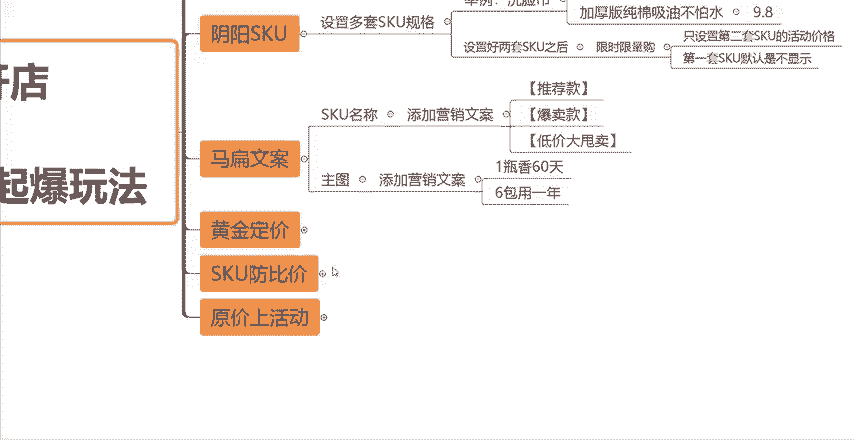
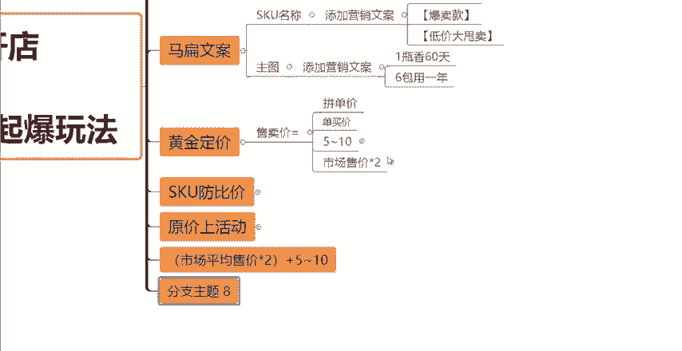
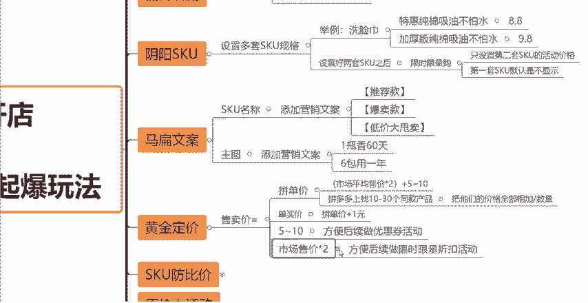
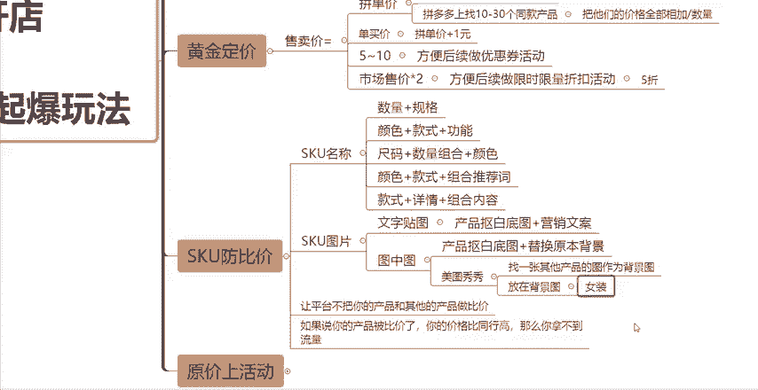

# 【拼多多运营】2024目前最新的拼多多开店新手教程！每天30分钟，零基础电商运营快速起店，实现日销千单！ - P38：38 拼多多链接最新六歩操作起爆玩法 - 拼多多-运营 - BV1812mY6EFh

现在做拼多多店铺啊其实没有那么难。新手做店呢也就几个步骤，很多新手做不起来的原因啊，无非就那么几点。要么你不会拼多多的操作玩法，要么你对于整个店铺的运营没有任何思路。那么今天这一期视频呢。

我会详细的跟大家讲解一下一个链接最新的一个操作起爆的玩法，总共分为6个步骤。如果说你学会了啊，可以让你前期的这个操作更加的顺利，让你事半功倍。大家可以先点赞关注啊，收藏起来，方便你后面反复观看。

那么今天分为六步操作啊，来跟大家讲解这一个玩法。第一个是低价引流，第二个是阴阳SQU第三个是码扁文案，第四个黄金定价，第五个SQU防比价。第六个原价上活动。首先第一个啊什么是低价引流呢？

其实这个就是用到我们店铺后台的一个营销工具，营销工具当中，你需要去设置两个东西，一个是设置一个店铺惊喜券一个。

是设置这个限时限量购。因为当我们新品前期上架了一个新链接之后啊，如果说你只是在后台把它的价，把它的拼单价，把它的单买价这些价格方面设置好了之后，但是你没有去做任何的这个营销工具营销促销的一个活动的话。

那么你这个链接在前期是很难获得自然流量的。所以说我们前期在定价上就要需要做一些策略，给我们去做营销活动让出足够的一个这个优惠的空间。那么首先店铺惊喜券呢，大家可以设置一个5到10块钱的面额。

然后限时限量购呢可以设置一个5折的一个折扣就可以了。那么这个低价引流呢是搭配后面这个黄金定价啊，一起去做的。那么我后面还会给大家来讲到。

那么讲到第二个阴阳SQU这个可能很多新手小伙伴不太了解到底是什么东西。其实我跟大家讲解一下，你们就明白了。

所谓的阴阳SQU呢就是去设置多套的SQU规格。比如说我给大家举个例子啊，我们在做洗脸巾的时候，那么在做洗脸巾的时候，我可以在这个拼多多有一个上新机会商品啊，发布机会商品的这样的一个端口。

那么我在里面呢可以找到一个跟我类似于同款的一个产品，我直接的去发布同款。那么在发布同款的时候呢，我需要把这个链接的SQU重新的去改一下。我会设置两套SKU。

比如说第一套SQU我设置的跟我参考的那个同款是一模一样的。但是呢我会在SQU的这个名称规格上做一点点改变。比如说我是做洗脸巾的啊，我第第一套SQU，比如说我写的是特惠纯棉吸油不怕水。然后我的价格呢。

比如说我会设置一个8。8块。当然这个价格在设置的时候，你们要注意一下这个价格一定要比你那个参考的那个链接，它的一个价格一定要低一点点。这是一个重点一个核心。

你的你第一套SQU的价格一定要对比着它去设置每一个SQU都要比它低一点点。然后第一套SQU我们设置好了之后呢，我们可以再去设置第二套，那么第二套SQU呢，我们也可以参考第一套。

比如说但是我会在名称上稍微做一下改变。比如说我第二套我做加厚版纯棉。よ？不怕水，对吧？这样的SQ规格看着跟第一套好像是很像的，但是还是会有一点差异的。然后这一套SQ呢，我的价格就不用再比它低了。

我可以比它高一点点，也可以跟它一样，这个都没有关系，根据你实际的一个这个成本以及你的利润空间来就可以了。如果说你的成本比较高，你想要有一定的利润空间呢，你可以比它稍微高一点。

那如果说你的价格跟它设置的一样呢，也有足够的利润空间呢，你也可以跟它设置的一样。这一套SQU啊就不用比它更低了，知道吧？那么我们设置好。

两套SQU之后，那下一步操作我们要怎么去做呢？我们可以去做一个限时限量购的。

活动是吧我可以去设置一个限时限量购。但是在这个活动当中呢，我只。设置第二套SQU的活动价格。也就是说我设置了两套SQU第一套SQU我是不参不参加不设置这个限时限量购的活动的。

我只设置第二套SQU的这个活动。那么这种情况下呢，第一套SQU默认是不显示的。

知道吧？虽然说我们设置了两套SQ，但是第一套SQ，因为你没有参加这个限时限量购，那么它是默认不显示的，知道吧？所以这一套这个阴阳SQ的玩法，它的核心原理，它的逻辑是什么呢？

就是我们用第一套的这样的一个SQ它的一个价格比你的这个同行同款来的低。那么在平台比价的一个这样的一个角度来讲，你的价格是比它低的。那么自然流量从流量这个角度来讲。

平台就会更加倾向于你而你在设置限时限量购的这个活动当中呢，又只设置了第二套SQ所以说你正常去卖的这个SQ呢是第二套SQ知道吧？所以说阴阳SQ的一个玩法逻辑啊，就是这样的，你们学会了之后呢。

可以去尝试一下O这是第二个玩法，阴阳SQ的。那么第三个码扁文案，码扁文案主要是体现在哪呢？是体现在我们的SQ的名称跟。

主图上，首先SQ的名称，我们需要去添加一个营销文案。什么叫码扁文案呢？也就是这个啊对吧？骗的意思啊，大家这样理解就可以了。也就是我们需要加上一些营销文案来促进我们的这个转化率，让买家更加容易下单。

容易成交，知道吧？那么我们可以加上什么样的一些文案呢？比如说我在我的SQ名名称，前面我可以加一些推荐款或者爆卖款或者啊只限多少多少单，对吧？剩下多少多少单或者低价大甩卖等等。

我可以去加一些这样的这种营销文案啊，形成一种这种热销啊，在我在做这种现实活动的一种感觉啊，在做这种大促的一种感觉，然后给消费者去营造一种这种紧张感迫切感，所以说它下单的一个这种概率呢，也会更加的大。

这个呢就是我们从SQ的名称上，我可以去添加一些营销文案。那么从主图上呢，我也可以去设置一些营销文案。比如说啊我这个时候我给大家举个例子。比如说我是做这个。

车载香薰的对吧？那我在车载香薰的这个主图上，我可以加一个什么呢？我比如说我加一个一瓶香60天或者一瓶香半年等等等等。这个你们自己去设置就可可以了。根据你们的产品自己去设置。

如果说你是做那种啊这种呃香薰卡片啊，对吧？这种香香卡或者说香这种香囊箱袋啊，香包等等。这种你也可以说比如说六包用一年。然后这个是你的规格嘛，对吧？你这个是你要卖的规格，然后你把它的这种功能。

把它的这种呃营销方面的一些属性，把它做成文案加在你的主图上，这个呢就叫做码扁文案的一个设置玩法啊，你们根据你们自己实际上做的产品做的类目去设置就可以了，好吧，这个就不跟大家多讲了。然后第四个黄金定价。

刚才说了黄金定价跟我们的引流这个低价引流是一起的啊，我就要教大家，我们在前期上架一个链接的时候，这个。

定价我们到底应该怎么去设置，怎么去做啊。首先。我们设置一个产品的这个售卖价的时候，我们肯定要设置一个拼单价，对吧？我需要去设置一个呃这个叫做拼单价，我还需要去设置一个什么单买价。那首先呢我教大家啊。

你们记好这个公式就可以了。拼单价怎么去设置啊，怎么去设置你。

用市场的平均售价乘以2，然后加上5到10块钱就可以了。市场平均售价怎么去算出来呢？我教大家，你在拼多多上。找10个或者啊你想找多一点，找30个10到30个同款产品，然后呢把他们的。

价格全部相加再除以数量知道吧？除以数量，这个呢就得出了市场的平均售价。什么意思呢？你比如说找了10个同款的产品，对吧？把他们的这个销售的价格全部的加起来，再除以10，这个就是他们的市场平均售价。

你找30个就除以30，这个是一样的道理。然后我们计算出了市场平均售价之后呢，用市场平均售价乘以2，再加上5到10块钱，这个就是你的要设置的拼单价，哎，有的小伙伴会说啊，这样去设置我的拼单价不是很高吗？

那我还怎么卖呀，对吧？我还卖得出去吗？不用担心啊，后面会把价格降下来的，只是说你前面要先把价格设置的高一点，为什么呢？你要给后面你去做这种营销活动，你去做这个优惠让出足够的优惠空间，知道吧？

那拼单价设置好。了单买家怎么设置呢？直接在拼单价的基础上加1块钱就可以了。这个很简单，没有什么好说的啊。然后刚才所说的市场平均售价乘以2加5到10块钱。这个5到10块钱是什么呢？

就是用来去做我们前期去做这个优惠券的活动的。比如说上面我跟大家说的，设置一个店铺惊喜券，然后这个优惠券的面额，你可以去设置5块钱或者设置10块钱都可以的，好吧，然后呢。

为什么让你们去用市场平均售价乘以2呢，就是你可以去做后续的这个限时限量购的一个活动，知道吧？你可以直接的去设置什么？设置5折。

知道吧？你前面市场平均售价乘以2了，然后你后面设置一个5折，你的价格是不是又降下来了？这样的话能够保证你的这个新链接是参加了足够的这样的一个营销活动的。那么在新链接在前期的时候。

平台他知道了你的链接是在做活动的。那么他可能说觉得你的这个链接哎，是前期的一个这个优惠力度是比较大的。那么他也会给你倾斜一定的这样的一个流量，知道吧？这个呢就是黄金定价的一个公式啊。

你们可以参考这个去把你们的产品价格给定出来。然后第五个SQ防比价。

SQU防比价的一个作用呢，就是为了。

让平台不把你的产品。和其他的产品做比较，知道吧？因为如果说。

啊，如果说你的。产品被比价了啊，你的价格比同行高，那么你拿不到流量。

知道吧？那么你拿不到流量，如果说你的价格比同行低的话，还好，你能能够拿到流量。如果你的产品一旦被比价了，那么你的价格但凡比同行高，那么你是拿不到流量的。好吧，所以说我们做SQ反比价的一个目的呢。

也是这个不让平台把你的产品和其他的同款产品做比价。那么我们就需要从SQ的名称以及SQ的图片，这两个方面去入手了。SQ的名称，大家可以记一下这几个公式啊，然后根据你们自己的产品。

以及你们所做的这种不同的类型去做一个这种套用啊，你可以用数量加规格去做SQ的名称，可以用颜色加款式加功能，可以用尺码加数量组合加颜色，也可以用颜色加款式加组合的推荐值，最后可以用款式加详情加组合的内容。

好吧，这几个公式呢，你们就自己根据实际的情况去套用就好了。然后这个SQ的图片，你可以怎么去做呢？第一种你可以去做文字。

贴图什么意思呢？可以把你的这个产品抠出一个白底图来，然后加上我上面跟你说的，你可以在主图上去添加一些营销文案，然后用这样的一个图片，尽量的跟同行去做出这个差异化去区分开。当然啊，现在拼多多这个平台。

它的一个防比价的系统是做了一代一代的升级的。很有可能你用这种方式的话是没有办法避开防比价的，知道吧？那么你这个时候呢就需要用到第二种方法，图中图。图中图什么意思呢？在美图秀秀上。

把你的这个产品同样的抠出一个白底图来。然后去找一张。

其他产品的图片作为背景图。然后把你刚才抠出来的这个图片，白底图稍微的缩小一点，放在。

背景图上给大家举个例子，比如说你是做女装的，然后你把你的这个女装的产品抠出来，抠了白底图，对吧？然后这个时候呢，你找个什么，找个，比如说洗衣机，找个洗衣机的图片，把洗衣机作为背景图。

然后把你这个女装把你这个衣服的图片缩小一点，放在这个洗衣机背景图的上面，那这个时候平台它就可能会认为你的产品不是女装是洗衣机。那么它就不会把你的这个女装跟其他的同款去做比较，知道吧？

这是一个图中图的一个玩法。大家如果说学会了也可以去试一下啊，那么这就是SQ仿比价的一个具体操作的一个方法啊。那跟大家讲最后一个原价上活动的一个操作方法。一般来讲是我们新品上架的时候会遇到的一个问题。

因为。

很多小伙伴呢在报名活动的时候会发现平台它让你活动的一个价格会要求你设置的非常非常的低，很有可能你是没有任何利润的，甚至你还是会亏本的。所以说教大家可以尝试一下原价上活动的一个方法。

导致我们有一定的这个利润空间啊，就算上活动呢也不会去造成亏本的一个情况。那么首先你的这个新品的链接啊，你的定价需要在常规的定价基础上乘以3倍，知道吧？乘以3倍之后呢，你去报名大促活动。

然后报名大促活动啊，平台它首先检测到了你的这个价格，你的链接的价格肯定是会很高的。所以说它会让你这个降价，一般呢是8。7折左右。然后它让你降价的时候，你就点击我要降价，但是每次的幅度不要太大，知道吧？

1。1点的去降，降到你正常售卖的一个价格为止。

知道吧？降到正常的一个价售卖价格为止，然后报名成功之后啊，你同步的去把你的这个链接操作1000个销量，然后去做100到200个好评晒图就可以了。这样的话，你的这个链接报名活动成功之后啊。

你把你的销量跟评价基础做完之后啊，你的这个链接在活动的这个渠道上，在这一次活动当中也会产生不错的一个数据啊，也会去卖出非常多的一个单子啊，大家可以去尝试一下啊。那么以上呢就是我们6种操作玩法啊。

可以帮助我们新品。在前期快速的去起量去起流量去出单的。好吧，那么看到这里还有什么不懂的小伙伴呢可以在评论区留言3个6找我领取我我给你们整理的一份综合运营大礼包啊，感谢大家的一个观看。

