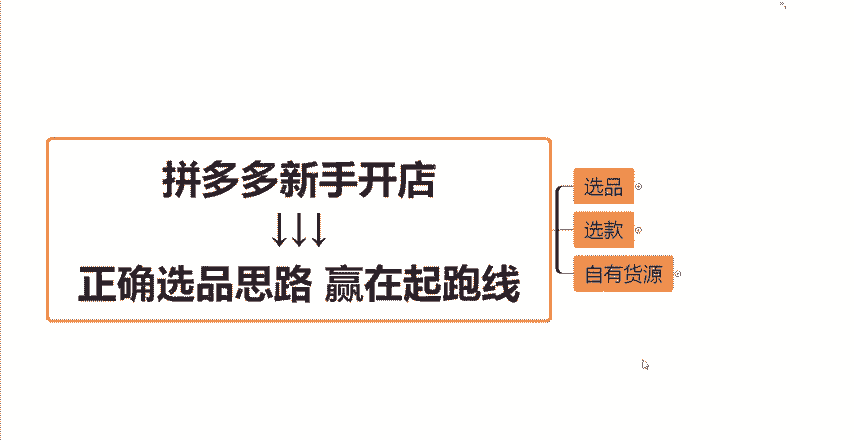
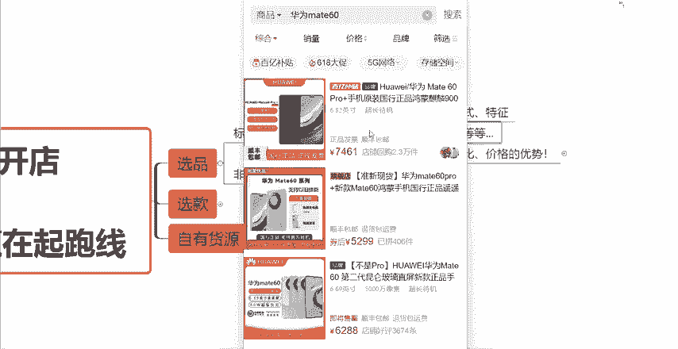
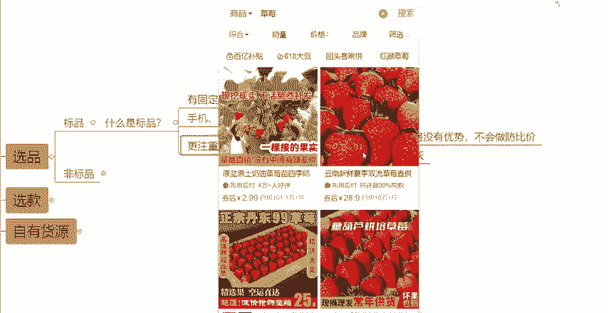
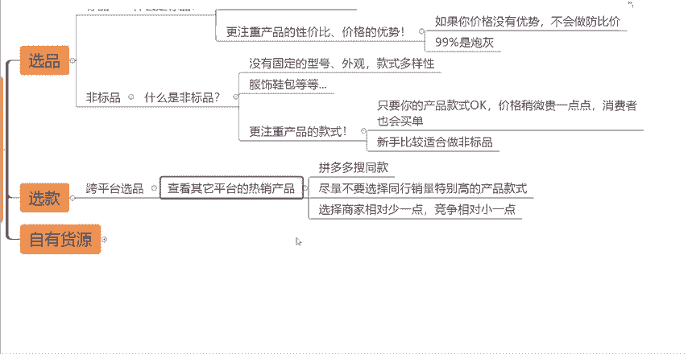

# 【拼多多运营】2024目前最新的拼多多开店新手教程！每天30分钟，零基础电商运营快速起店，实现日销千单！ - P39：39 拼多多正确选品思路赢在起跑线 - 拼多多-运营 - BV1812mY6EFh

最近有很多拼多多的新手商家小伙伴来找到我说问我能不能出一期关于这个拼多多怎么去选品的一期这样的一个课程啊。那么今天这期视频呢就跟大家分享一下这方面的一些知识点啊，呃，因为很多新手商家做店铺做了很久。

然后可能说做了一个月两个月，店铺依然没有任何的效果啊，或者说数据非常的差，每天也卖不了几单，但是又不知道问题出在哪里。那，其实可能很大多数情况下，都是你们在前期就是选品的这一个方面就已经出现了一个问题。

导致你的这个店铺啊越做越难。因为你最开始的这个时候啊，都这个选品都没有做好。那么你后面不管说怎么样的一个操作啊，都会啊没有效果的。如果说你最开始就选择了一个有潜力的商品，有一个正确的商品的话。

并且加上有正确的这个运营思路。

那么每天我们呃作为新手来讲，每天卖个50单到100单，其实还是很简单的啊，也不需要太多的这个运营技巧。好吧，那么今天这一期视频呢，就跟大家来分享一下我们如何去选品，然后以及起店的一个正确的思路啊。

看完之后你们就能够理解到到底什么叫做选择大于努力啊。

那么首先跟大家讲第一个点，就是关于我们选品的这个点。选品。我们经常讲就是拼多多上这么多的产品，这么多的类目。那么他们其实是有一个大概的一个划分的，一个叫做标品，一个叫做非标品。

需要跟大家解释一下这两个它到底是什么意思啊，以及他们的一个区分到底是什么？首先跟大家讲什么是标品呢？其实标品啊就是。

比如说我作为一个消费者，我在拼多多上想买一个东西的时候，我的脑海当中就已经出现了产品大概的一个样子。比如说外观，比如说型号啊。

也就是说，标品它是有固定的型号，有固定的这种，比如说款式，然后特征啊之类等等的。比如说手机或者电器或者水果，那给大家举个例子，比如说我今天我想买一个手机，对吧？我可能说收华为啊。

华为这个mate60对吧？我想买一个这样的一个手机，那我在拼多多上去搜索完之后呢，华为mate60这一款手机，它是不是长的都是一个样啊，对不对？它是有固定型号的，可能只是上有颜色上的差异，对不对？

这个就叫做标品。那还有比如说啊我今天我想买水果，我想买一个草莓，那我可能搜索草莓，对吧？展示出来的草莓是不是也都是基本上是一个样的，只是主图上可能会有一点不一样，然后什么？然后规格上啊，对吧？你卖三斤。

我卖5斤，它卖10斤，价格上会有一点不一样，但是产品都是一样的。

是不是这种东西，这种产品它就叫做这个什么标品，好吧，那么标品它有这样的一个特征呢，它就会有一个特点，就是它会更注重于产品的性价比以及价格的一个优势，对吧？比如说我想买草莓，那大家的草莓长得都是一个样子。

我只能看到我又吃不到，对吧？我又不知道你的甜还是它的点，你的大还是它的大，那我只能通过什么来判断呢？我只能看哪一家卖的更加的划算，对不对？我肯定会优先去找一个卖的更便宜，更划算的这就是标品。

它的一个特征，消费者会更注重于产品的性价比，会更注重于价格的一个优势，好吧？那如果说哎咱们是做的这样的一个标品啊，是属于标品当中的一系列的产品。那如果你的价格方面，没有优势啊，你的比如说货源或。

你的成本是没有任何优势的，而且你又不会做仿比价，那你的这个产品，你的链接99%就是炮灰炮灰款。这句话有没有毛病，对吧？大家能不能能不能够理解这句话，好吧，这是第一种啊。

就是什么是标品以及标品它的一个特征，那再跟大家讲到底什么是非标品啊，就什么叫非标品呢？非标品顾名思义啊，既然标品我们知道了什么是标品，那非标品肯定就是跟标品相反的呀，对不对？

所以说标非标品它是没有固定的型号，没有固定的外观和款式啊，款式它是有多样性的啊，比如说什么我们的服饰鞋包之类的那比如说我想买个连衣裙，那我搜索连衣裙，搜索完连衣裙，你们会发现唉每一个款式，每一个链接。

它的长得都不一样，对不对？它的款式，它的花纹，它的材质，它的比如说细节。

等等等等。它的差异是比较大的那我如果说想要买这样的一种类型。比如说服饰鞋包啊，我作为消费者，我在购买这一类产品的时候，我会更加在意什么？我是不是会更加注重于产品的款式方面，对不对？

因为刚才跟大家做了一个，假设假设是连衣裙，连衣裙，他有什么？它有长款连衣裙，有中长款连衣裙，有短款的连衣裙，有吊带的连衣裙，有黑色的白色的灰色的，也会有各种各样颜色的连衣裙，对吧？

那消费者呢他就会找到一个自己更喜欢的更适合自己的这样的一个款式，理解吧？那所以说如果说你卖的这个产品？

你的款式是没有问题的对吧？那你的这个价格方面呢，可能说比一些同行稍微的贵那么一点点。只要你的质量是真的ok的。并且你的款式是好看的那消费者他也是会买单的，理解吧？

所以说他就不存在这种呃价格上的这个对比会很强烈的这种情况，所以综合来看呢，其实对于我们什么拼多多的一些新手商家来讲会更加的适合去做非标品，理解吧？因为你不不用那么去打价格战，这个点。

因为对于我们新手商家来讲，货源肯定是我们很头疼的一个问题是我们的一个短板，对吧？弊端，那么我们肯定就不能去拼价格战，我们就更加的适合去做这个非标品啊，所以说大家先理解这样的一个点。那么我们如何去选。

择好这个款式呢，对吧？就是我们所说的选款。那么今天这一期视频呢，我跟大家讲的第一个重点叫做跨平台选品。因为电商平台啊有很多，比如说有什么拼多多啊，有我们的淘宝、京东，然后包括我们的抖音快手等等等等。

特别特别多，每一个平台，他在这个平台上面都有很多卖报的产品，对吧？那也有一些产品，比如说淘宝上是有的，京东上是有的，但是拼多多上他是没有的那这个时候你的商机是不是就来了，对不对？

很多中间商啊或者说品牌方啊，他可能说他只做某宝或者只做抖音，他没有做拼多多，对吧？那又比如说有一万个人他买在他在某宝上买了这个产品，但是呢这一万个人当中啊，他一定会有那么几千个啊。

一定会有那么几千个会去其他的平台去对比一下。

价格去对比一下产品的，对不对？那如果说哎我们是同样的产品，那我们在拼多多上，我们卖的价格呢比他在比如说在淘宝上卖的价格稍微的低一点点。哎，那这会怎么样，它是不是就有可能会在我们的这个店铺进行下单了。

对不对？所以说我们跨平台怎么去选品呢，其实也非常的简单啊，我们可以去其他的平台上，比如说我们先确定下来，我们想要做的是什么产品，对吧？你是想要做连衣裙，做鞋子，做服装，做包包啊。

做其他类各种各样的一个产品，你先确定下来，你做什么类目，然后呢，你再去其他的平台啊，淘宝啊、抖音啊等等都好，你去其他的平台上去看一下这些平台上哪这这些类目当中哪些产品，哪些款式是卖的非常非常棒的。

是卖的非常销量非常高的，对不对？那你可以把这这样的一个产品，这样的款式，把它的。

图片保存下来，然后怎么样呢？然后我们可以打开我们的这个拼多多的这个买家端，然后在搜索框的右边有一个这个相机的一个图标。这个呢就是我们搜索同款的一个功能。

那比如说今天我我看到了在其他平台上一个卖的很好的一个连衣裙，对吧？我今天我想在拼多多上也卖这个连衣裙，那我就可以什么我就可以用搜同款啊，比如说这个我打开我直接搜索同款。

那么这个款式在拼多多上它的一些销量啊，一些商家的数据情况就会展示出来，对不对？那我们就可以去分析了，比如说在同样的款式，它有卖137的，有卖129的，然后下面有卖136的，有卖127的，看到没有？

也有卖96的，有卖101的款式基本上是一样的，只是说价格方面有一定的差异。那么大家。

在这样的操作情况下呢，需要注意几个点，就是当我们在拼多多上去搜同款的时候，你要尽量的去避开那些同行销量特别特别靠高的这种产品这种款式。比如说当我搜了一搜索了一个产品之后。

我发现唉同行这一家比如说这一家同行他卖了几万件，这家卖了十几万件，这一家也卖了几十万件，这一家也卖了十几万件。就是有很多家销量都特别特别高的这种产品，我们就尽量的不要去选择了。为什么呢？因为。

这个产品虽然说它有很多家都卖爆了，证明这个款式是okK的，但是啊它的竞争相对的也是特别特别大的，知道吧？那我们作为一个新手商家来讲，我们怎么去跟这些头部商家去PK呢，去做对比呢？对不对？

我们一价格拼不过他们。2、基础没他们高。三可能资金还没他们多，对不对？所以说综合来看，我们都不适合去做这样的产品。那我们要选择的是什么呢？就是我发现某一个产品或者某一个款，我当我搜索了同款之后。

比如说像这个款，我发现。

在整个同行当中，有这种卖1000多件的，有这种卖几百件的。但同时呢他也有个别几个商家，他卖的很好。比如说像这个卖了1万多件，对不对？还有像。

其他的比如说卖了几千件，像这家卖了1。2万件，对吧？给大家举个例子，像这个卖了1。6万件。也就是说什么选择这种做的商家相对少一点的，竞争相对小一点的但同时呢又有那么一两家两三家卖的特别好的，知道吧？

去选择这种产品，为什么呢？首先第一个做的商家相对少一点，竞争呢肯定就小一点，对吧？你就更有更大的机会可以做起来做爆。那另外呢有那么几家商家他卖的很好了，就证明什么他帮你去证明了这个款式它是ok的。

它是能卖的，知道吧？你就可以去省掉什么啊，我再去测试，我也不知道这个款能不能卖卖爆啊，这个款到底行不行，能不能够受到消费者的喜欢，我不知道的那既然有商家卖的好了，那我肯定心里就有数了，对不对？

所以我们要尽量的去选择这样的一些。产品你选择产品选对了之后啊，那你再去起变，你每天做个50到100单，岂不是轻轻松松吗？对吧？别人卖的好的，一天卖1000单啊，我们基础比较差一点。

我们吃它的10分之1也好，20分之1也好，我们一天卖50单，卖100单不行吗？对吧？也可以啊。

好吧，所以说。😡，你们在前期选产品选款式的时候，一定要多去分析，多去对比，好吧，多看一看市场上以及同行他们的这种数据情况。好吧，你选对了起店还是很简单的。如果说还不会起垫的具体方法的起垫的具体思路的。

那么大家可以去看一下我之前给大家分享的一些视频，或者找不到的小伙伴呢可以在评论区扣三个6，找我领取一份起垫的这个运营资资源大礼包。好吧，那有的小伙伴就会问了啊，说唉那我是自己有货源的对吧？

我自己有产品的，我只能卖标品，那这种情况下有没有什么好的办法呢？那我只能说给大家一个建议啊。就是如果说你自己有产品的，你是做标品的话，尽量的不要去打价格战。好吧，你一定的要去学会去做人群。

去提高你的这个产品的价值。我给大家举个例子啊，比如说。

今天有一位小小伙伴啊是卖这个茶叶的，大家。可能了解过的小伙伴都知道茶叶这个类目是很卷的。对不对？是很卷的那我如何能在不打价格战的情况下去把我的这个产品价值给提高呢？

那么这你就要学会去做人群，做提高产品价值的一些附加属性。今天比如说有一个消费者。😡，他买茶叶它是什么？基本上就两种情况，对不对？要么我是买来自己喝的，要么我是买来送礼的。所以说你们做的产品。

你们要会分析对应的人群是什么样的，对应的使用场景是什么样的，茶叶难道买茶叶的都是自己喝的吗？难道买茶叶的都是送礼的吗？是不是有这两种情况呀，那不同的情况，你是不是是不是要根据不同的情况来去做对标啊。

来去做分析啊，对吧？那这种情况，比如说第一种我是买来自己喝的，我可以做什么？我是不是在价格没有太大优势的情况下，我是不是可以给他加一点赠品啊？

对不对？喝茶叶我需要什么？我是不是可能会需要一个保温杯，或者我在家里喝，我是不是需要一个茶具套装。这些赠品啊在比如说在其他的一些批发网站上很便宜的啊，没有你们想象的那么贵的。

所以说你们要学会去做这种赠品，去做另外的营销活动，知不知道？那同样的，比如说同行。

啊，茶叶他卖什么？他卖49。那我卖什么，我卖59。😡，但是呢我可能送他一个保温杯，我或者送他一个茶具套装。那这样的一个赠品，它的成本可能10块钱，那贵一点20块钱。对不对？

但是我的价格基础上比它贵10块呀，所以说我的成本方面，我的利润方面也会有一定的利润，能不能够理解？那在同样的情况下，同行卖49，什么都没有。我卖59，我送一个保温杯，或者我送一个茶具套装。

那在正常作为一个消费者的情况下，他可能会去买哪一个链接呢？是不是有很大概率会去买这个59。对不对？能不能够理解这个意思？所以说你们要去会学会去分析，要会学会去提高产品的价值。那第二种情况。

比如说你是送礼的，对不对？送礼的会在意什么？送长辈送领导，对不对？你就需要有一个礼盒装了，对不对？你就要需要把包装啊感觉做的很有逼格啊，包装做的很精美，那这个时候你再去提高价格就很好提高了，知道吧？

因为送礼的人呢，它是对于价格方面没有那么在意的，他更在意的是这个礼他拿不拿得出手，它的这个礼盒它精不精美，它高不高的，知道吧？其实做一个礼盒也很便宜的，几块钱，10块钱能够做一个很好很好的礼盒的。

知道吧？所以说这些东西啊都可以去帮助我们提高产品的价值的，所以说做拼多多啊，你们一定要学会一些思路和方法都是很重要的。俗话说啊，一分选品，两分运营啊，三分啊靠。

运气不是没有道理的。好吧，所以说你们这期视频啊，你们要学会什么？一个是选品，两个是选款，第三个是学会去做人群，学会去提高你们的产品价值，把你们的产品客单价给提高起来。好吧。

那么看到这里还有什么不同的小伙伴呢，可以在评论区扣3个6，或者说直接找到我，然后找我领取一份，我给大家整理的店铺运营的综合大礼包。然后同时呢也别忘记了一键三连支持一下。

后续也会给大家分享更多的这个拼多多的运营干货小技巧。

