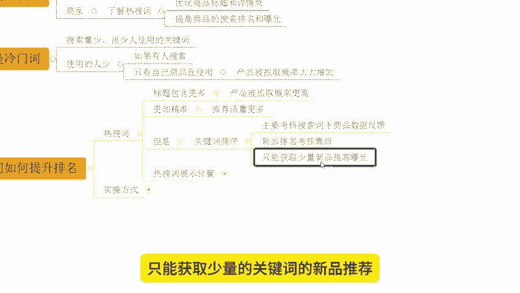
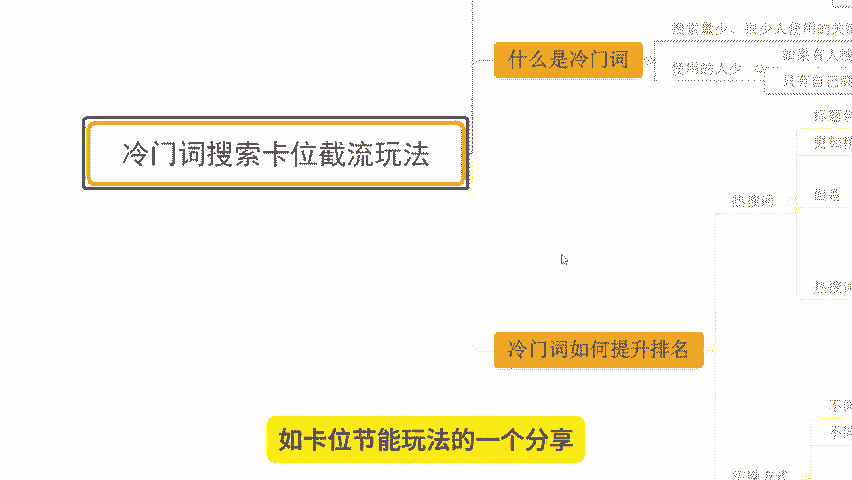

# 【拼多多运营】2024目前最新的拼多多开店新手教程！每天30分钟，零基础电商运营快速起店，实现日销千单！ - P3：03 拼多多冷门词搜索卡位截流玩法 - 拼多多-运营 - BV1812mY6EFh

hello，大家好，我是西楼。今天给大家分享内容呢是我们拼多新手日销签单爆单实操玩法中的冷门池搜索卡位节定玩法啊。

那么在飞享这个玩法之前呢，老规矩啊先给大家看一下近期跟着时尚小伙伴的店铺数据，好不好？

OK了，可以看到像这个店铺呢，原本的访客在3000多啊，那么一直卡的这个地方其实已经蛮长时间了啊。那跟了实超之后呢，我一起带着他做了数据分析。那么了解清楚它整体数据提升的问题啊，就是它产品转化跟不上。

所以呢进行的产品的结构以及我们商品SQ的优化啊优化之后大家可以看到整体的访客在不断的增长。为什么因为转化率提升了啊，可以看到在后期的话，一天访客呢从原本的3000左右干到了14000啊。

那么订单的话一天是2100多单转化率14。67，非常不错的。当然呢除了像这一种有基术有数据的店铺之外啊，同样的很多的这个新店啊一样的跟着实操也是能达到很好的数据反馈的，可以看到像这个店铺对吧？

原本呢是零访客，那跟着实操之后呢，我们完成了市场分析和竞争分析确认了选品的爆款之后开始上架超操作啊，那么到后期的话，一天访客呢也做到了90。多将近1万啊，一天订单呢是1200多单啊，转化率呢13。

27%也是非常不错的。而这个店铺啊就是用到了今天要分享的冷门池搜索卡位的一个吉利玩法。那么具体的售售方式呢，我稍后会跟大家进行详细讲解的。而这些店铺呢也都是用到的自然流操作啊。

如果说你想知道如何通过自然流来打造爆款，如何通过自然流来操作店铺OK那么建议呢可以仔细观看我分享视频。

店铺运营呢对于很多的心入小白来说呢，会有到很多的困难跟问题啊，这个很正常。如果说你在店铺操作过程中有遇到问题啊，需要资料的呀，可以找我有时间的话呢，我也可以带着你一起去实操坐店啊，就像这些小伙伴一样呢。

我们一起能够有到更好的方法，能够让我们店铺呢做的更好，好吧，那么来看一看啊，冷门值搜索卡位节定玩法到底是什么。那首先第一件事情呢，我们要搞清楚到底什么是冷门词，什么是热搜词对吧？那么什么是热搜词呢。

来看一看啊，热搜词呢，顾名思义，就是我们平台上呢用户搜索频率较高的词汇啊，那么这些词呢就反映了当前的消费者它的一个兴趣，以及购买需这个趋势啊，那对于我们商家来说啊，那了解热搜词，对吧？

能够去通过这些热搜词呢，优化我们商品的标题，以及我们的详情以及我们主图等等啊，那么这个时候呢就可以提高我们产品的搜索排名和曝光，也能够完成更。

好的转化引导啊，这是非常不错的一个选择，对吧？啊，当然呢也有很多人呢会使用到这个词，对不对？那么冷门词又是什么呢？来看一下啊。

能不能值其实同样道理啊，它就是我们搜索量少，很少人使用的关键词。

那么很少有人去使用，对吧？这个时候呢，如果有人去搜索的话，只要我们标题有在使用它，那这个时候呢就能够大大的增加我们商品被平台抓取到的一个概率啊，就这样子的啊，所以在整个操作过程中呢。

我们就要去用到冷门池来撬动整个产品的排名，获取到更多曝光啊，那到底冷门池如何提升我们商品排名呢。来看一下，首先。

搞清楚一个事情啊，我们的热搜词呢标题里面可以包含的更多的话，这个时候呢产品被抓取的概率是会更高的对吧？因为它的基数在这里摆着的啊，同时呢这些词更加精准呢，我们也能够得到更多的推荐流量，对吧？

这个是呃肯定的。因为毕竟这个产品呢它和产品的属性啊和我们的这个关键词贴合啊，推荐呢肯定是会更多更精准对吧？但是啊注意啊，但是呢重点来了啊，但是关键词的排序啊，它主要考核的是我们关键词下面的商品数据反馈。

包括了我们啊各种各样的数据啊，这个点击呀对吧？转化呀啊成交额客单价等等乱七八糟的东西啊，都在这里面，而我们的新品排名，它通常会比较靠后，只能获取少量的。

关键词的新品推荐曝宝。所以这个时候就很尴尬啊，那么热收时展示位置呢，它是有很多很多的对吧？呃，包括说我们之前提到过的下了框，包括说我们说的这个呃。

呃，这个这个这个机位商品里面的热搜词词膀对吧？等等啊。那么这个时候呢，我们去使用到的关键词，如果说这个出现了某一个关键词啊，它能够去在热度上啊能够去在热度上注意啊。

比较高啊，产生一个非常大的提升。而且这个词只有我在使用。那当这个热度呢达到一定量级的时候呢，就可以替代到下拉框的同样的位置。而这个时候呢，这个词因为只有我在使用的同时，就会形成一个关键词的垄断啊。

那么这整个过程就是完成冷门词。

进行热收时替代的过程。啊，那实操的过程中呢，我会跟大家讲解具体的一个玩法。但是这个逻辑大家搞清楚，就是我通过使用到某一个关键词，而这个关键词同行没有在用啊，而一开始可能没有人说入，但是它热度逐渐提升。

到达一定量级的时候呢，会嘛会产生一个呃替换到我们下拉框热个词的一个一个现象啊。

OK那么组作方式怎么样的呢？来看一看啊，操作方法呢并不是很难啊，注意不同量级的关键词呢，它的难度是不同的。

啊，比如说像我之前给你们看的这个店铺啊，这个店铺做的是呃这个发饰啊，做的是这个发圈啊，还有这个发箍这种东西啊，还有一些这一个呃这个头头这个丝巾啊，丝巾啊啊，绑头发的对不对？类似这种东西。

那么如果说你直接是用到一些大齿啊，比如说发箍对吧？比如说这个头绳对吧？这种大尺你可能操作起来会比较麻烦一点，但是如果说你是聚焦到了某一个属性对吧？比如说啊发箍啊，这个简约啊，或者是这个呃可爱对吧？

你带了一些属性，带了一些风格词，O你再往后去拓展的话，那么它的一个难度就会减少啊，因为它的曝光范围不一样啊，是这样子的。

那么同样的不同产品呢，它的操作难度也不同啊。如果说今天我用到的产品是服装。

整体的市场热度，市场的这个搜索数据很大啊，所以这个时候呢我的操作难度也会很大。但如果说今天我用到的是一个这个比如说哑铃啊啊商相对来说服装来说啊，哑铃搜索的人群可能会更少一点。

那么这个时候呢这个哑铃这个产品呢它的操作难度就会小很多。又或者说我今天啊这个操作的产品呢是一个呃自行车的刹车片对吧？哦那又不一样了啊，难度可能会更低啊，是这样子的。所以说我们在做的过程中呢。

小类目啊我们直接去做大尺。

而大类目呢我们要去做精准词，做一些仓尾词，这样子好操作。当然可能这样讲呢，很多小伙伴不是很理解啊，但是没关系啊，那么我们说一下啊，具体的操作呢一般3到7天啊，一般3到7天。那么这3到7天干嘛呢？

比如说今天我做的是一个。

刹车啊刹车啊，那么这个刹车呢，如果说我直接用刹车这个词，它可能搜索量热度很高。比如说有2000啊，打个比方一两千0啊，但是我去做刹车这个词。

同行都在使用对吧？同行都在使用刹车这个词呢热度有比较大。那我在下拉框里面产生的这些关键词，比如说。

啊啊，刹车呃A啊刹车A啊，刹车。D啊，这些都是刹车相关的关键词啊。好吧，那么刹车A呢热度是1000。

操售B呢热度是800。

今天我想去创造一个热搜词出来，我就需要去最少达到800的量级，然后才能挤掉刹车B，对吧？可能我现在做了一个只式刹车C。

啊，叉车C啊，那我要达到800的量级呢就很麻烦，对不对？但是如果我用到的。

核心的目标关键词是刹车B啊，它上限只有800，对吧？那么现在呢刹车BA。

啊，刹车BA注意啊，这个不是刹车B，也不是刹车A了啊，是刹车BA啊，所以它是刹车B下面的一个下拉框池，它的热度可能只有300。

啊，它的热度可能只有300对吧？然后呢，刹车BD。3说BD啊，可能这个时候呢，它的热度只有200。

那么没有别的更多的方向车了，对不对？这个时候呢，我去做了一个刹车BC。

好，它达成200的难度就会很低，我就可以很容易替换它。

当我替换它之后，有人收了刹车B的时候，在刹车B的下拉框里面就会出现刹车BC而刹车BC没有人在使用。只有我在用用户如果一旦完成这个产品的关键词点击。那么我就可以形成垄断啊，所以说在这个词替换的过程中呢。

我们要操作3到7天，让这一个刹车BC的热度呢，持续很高的一个状态。那么怎么操作呢？OK第一个动作找10个精准的标签号啊，让这些人呢反复去搜索关键词，30分钟一次搜索刹车BC来提高刹车BC的搜索热度。

同时呢可以操作人气资源来做一个数据递增使用这些人气资源来操作刹车BC的一个搜索啊，每天做30%的一个比递增啊，从50开始啊，从50比如第一天50个啊，第一天50个。那么第二天呢可能就是这个65。😊。

往上啊，好吧，当然你可以高一点也可以啊，你可以直接做到75对吧？每天50%递增也可以啊，30%是最基础的最最最少的一个状态啊。那么做3到7天，正常来说。

我们的刹车BC这个词啊就可以完成替代掉刹车BD的一个状态啊，得到一个很好的展示效果。那么这个时候呢我们就可完成关键词的一个流量垄断，形成引流啊当这些用户能进入我店铺之后。

我能够有到很好的流量承现能力产生转化之后好，我们的商品权重会不断的累积递增，最终呢你会发现刹车B刹车A刹车等等这些关键词。

我们都能够去获取曝光O啊那么以上呢就是我们关于产品的冷门指数卢卡位玩法的一个分享啊。当然呢可能这样去讲解的话，很多新手小伙伴呢还是没有办法很好的理解啊，包括说一些操作的细节可能也很难去这个把控啊。

但没关系啊，如果说啊你在店铺运营过程中有遇到困难。😊。

🎼或者是有问题啊，需要资料的都可以直接找我啊。还是那句话，有时间的话呢，我也可以带着你一起去实操。就像这小伙伴一样呢，我们一起能够有到更好的玩法，让我们店铺呢做的更好。好吧。

OK那么今天的视频呢就到这里，我们下次再见，各位，拜拜。😊。

