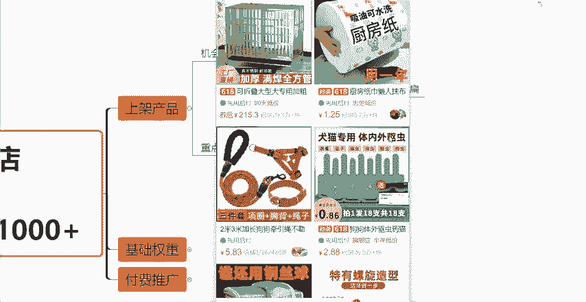
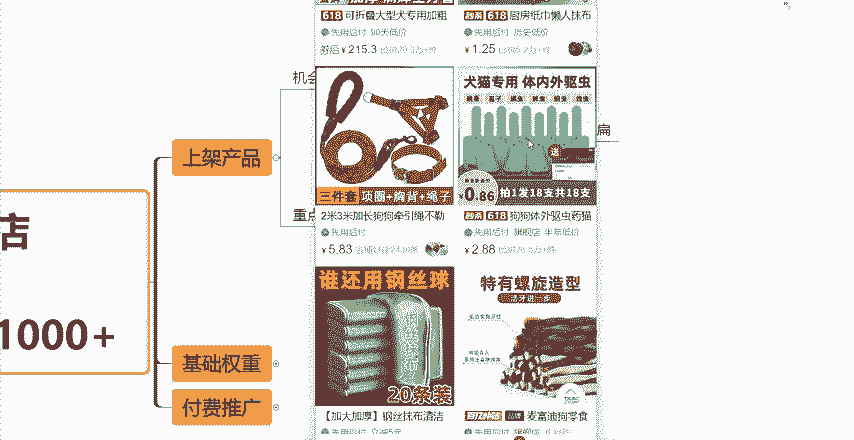
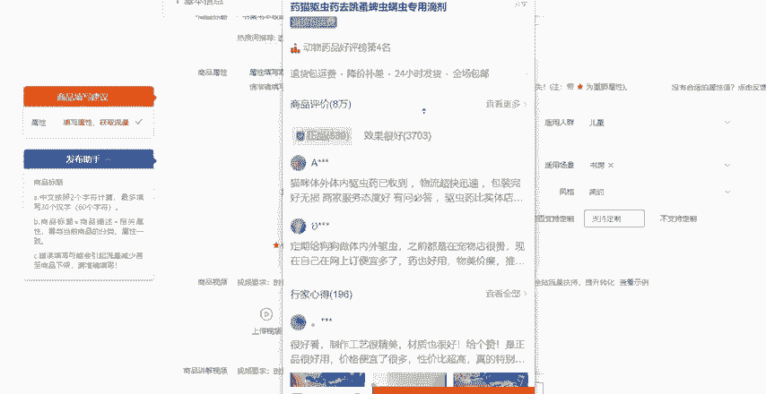
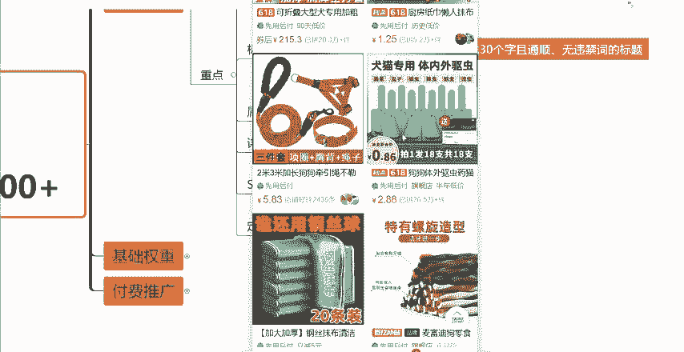
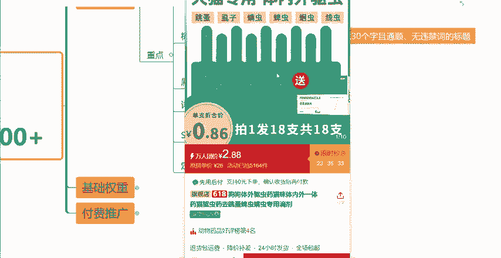
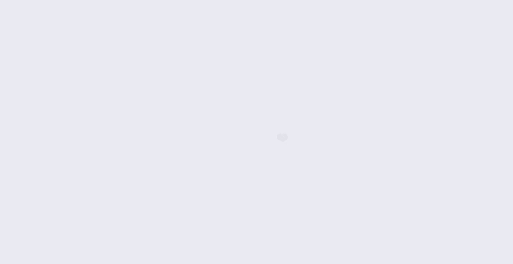
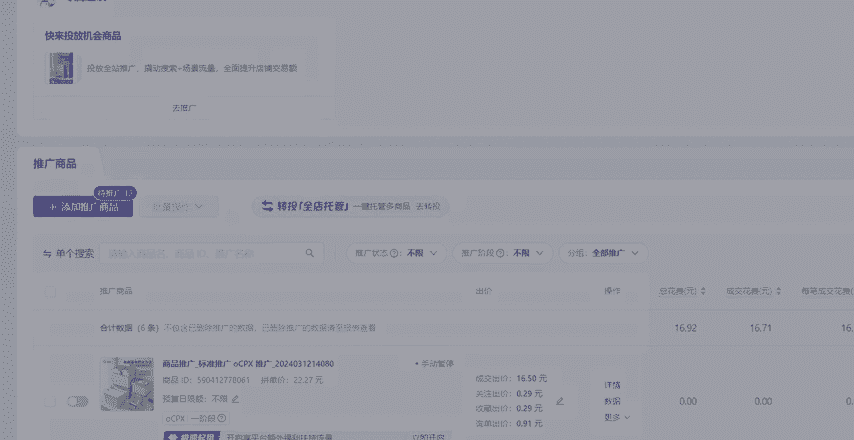
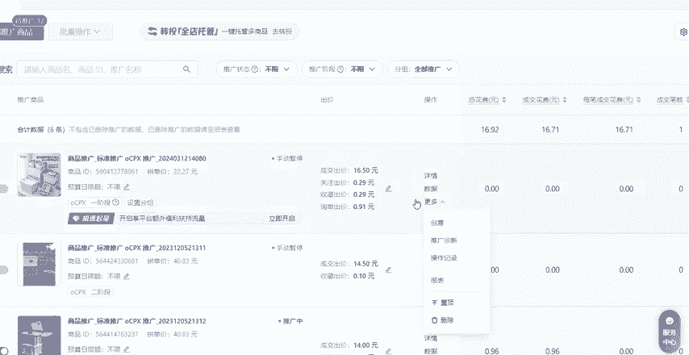
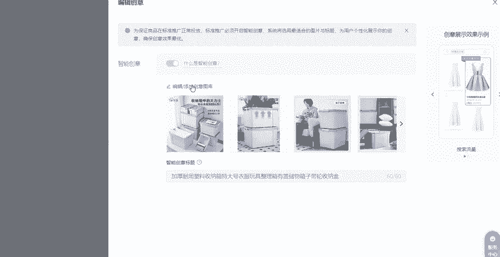
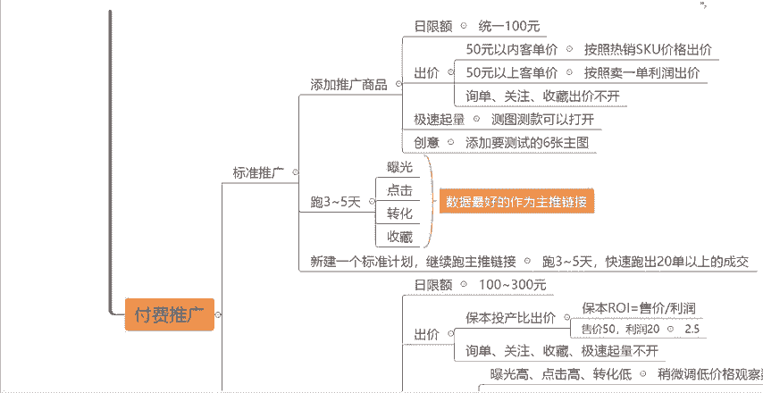

# 【拼多多运营】2024目前最新的拼多多开店新手教程！每天30分钟，零基础电商运营快速起店，实现日销千单！ - P40：40 拼多多起店实操轻松日销1000+ - 拼多多-运营 - BV1812mY6EFh

。现在做拼多多啊还在用老方法起店的，那么完全就是浪费时间，浪费资金。特别是新手商家不要一上来就研究什么黑科技玩法，什么卡投产原价上活动啊。你就按照我今天这一个视频教给你的这个思路方法来执行。执行到位啊。

你什么产品都可以卖爆。大家可以先关注点赞收藏起来，多看几遍。那么我们进入今天的一个视频正式内容。首先第一步呢一定是我们的这个上架产品。那么上架产品这边有一个注意点，就是大家在后台上架发布商品的时候呢。

不要点这个发布新商品，我们可以尽量的去选择这个发布机会商品来上架我们的这个产品啊。点击上发布机会商品之后，点击有一个消费者正在收。那么这个消费者正在收呢，它代表的就是什么？就是我们这个拼多多平台。

最近消费者搜索量比较大。但是商品紧缺的这样的一个款式这样的一些产品，然后在下面呢你可以选择一些类目，知道吧？然后在这上面呢，你也可以选择，比如说你是做什么类目的，你就去选择对应的类目就可以了。

然后在下面可以找到一个跟你类似或者说同款的产品，然后点击发布同款，然后把它里面的一些信息改掉就可以了。好吧，尽量的去用机会商品发布这一个路径去上架你的产品。然后这边呢要注意的一些重点呢。

就是我们的类目主图标题属性详情页SQU以及定价。那么我分别1。1点来跟大家讲。首先第一个呢是我们的类目。在上架产品的时候啊。然后我随便点击一个给大家举个例子啊，大家在上架产品的时候。

在这个地方会看到有一个商品分类。然后你可以看一下你的产品这个发布的这个类目是不是正确的。如果说你的这个发布的类目啊不正确，那么你一定要把它改过来，一定一定不要上错类目，知道吧？

不然的话你的这个流量的权重会直接减半的，甚至会有更大的影响的。好吧，然后第二个点呢就是我们的主图啊，也就是我们的这个商品轮播图。那么拼多多平台官方啊，它是允许我们上传这个10张图片的啊，10张图片的。

那么建议大家呢就是尽量的把这10张图片上传满啊。如果说你图片够的话，尽量上传满。然后你的第一张图呢是最重要的一张图，也就是我们所谓的主图啊，主图，所以说第一张图一定要什么，一定要凸显出你的这个。

核心的卖点，你可以用微码点啊，可以做个微码点来提升我的点击率。然后主图呢，大家可以按照这三个点，有这三个元素去做。一个是产品的一个主体，就是你产品本身的一个这个图片。然后第二个呢。

你可以搭配上这个卖点的文案啊，卖点文案。然后第三个你可以搭配上营销文案。通过这三个点去做你的这样的一张主图，给大家举个例子啊。比如说我们在拼多多平台上来随便的呃打开一个产品。

比如说像这个这个是我们的这个宠物的驱虫药，对吧？那这一张图上它有哪些信息呢？第一个就是我刚刚所讲的产品的主体，那么这个驱虫药，像这个呢就是它的产品主体，然后还有第二个点就是卖点文案，卖点文案指的什么？

就是你产品有哪些卖点有哪些特点啊，有哪些功能作用等等之类的。那像这个产品犬猫专用体内外驱虫可以驱这个跳蚤啊、狮子啊、螨虫啊、蜱虫啊等等等等。这个呢就是所谓的卖点文案，然后还有第三个点呢，营销文案。

就是你产品有哪些活动啊，有哪些赠品啊，或者有哪些服务啊，对吧？比如说像这个拍一发18共18只，然后单只核算多少钱，包括它还送一个。

这个什么东西啊，它把它做在主图上，这个呢就是我们的所谓的营销文案，知道吧？所以说你们不管说做什么类目，做什么产品，你们的这个产品的主图啊，尽量也按照这三个点来做，基本上点击率都不会很都不会差到哪里去的。

好吧，然后这是主图的一个问题啊。然后第第三个方面呢，就是我们需要去做好我们的这个商品标题啊，商品标题商品标题呢是60个字符啊，也就是30个字，30个字。然后要包含这个核心关键词。

产品属性词以及热门营销词。然后这一期视频呢我就不跟大家具体的去讲怎么选词啊，怎么组成标题了。因为我之前的一些课程有跟大家讲过。所以说有不会的小伙伴呢，可以去找一下我之前的一些课程一些视频啊。

然后说如果说实在找不到的话呢，也可以在评论区留言三个6，然后找我领取一下课件啊之类的都没有问题，好吧，然后。哦，你把这些词全部找好，全部采集出来了之后呢，那么你就可以用这些词去组成1个30个字。

并且通顺，并且没有任何违禁词的这样的一个标题就可以了啊，就可以了。然后这边要注意一个点呢，就是。你的这个标题啊。前12个字。一定要。对。核心的关键词为什么呢？来比如说我们在拼多多上买东西，对吧？

我们在这样的一个页面看到的这些商品呢，它的标题肯定不是显示完整的不可能说显示30个字，对不对？一般来讲，如果说你的这个产品没有参加，比如说什么秒杀活动啊，618活动啊。

那么你的这个链接你的这个标题啊基本上是会展现前12个字，看到没有？展现前12个字。所以说你在这12个字当中呢，就要把你的这个标题当中一些核心的一些重要的关键词把它放在前面，让消费者一眼能够看到。

这是一个核心的一个小技巧啊，一个重点，大家注意就可以了。然后标题做完了之后呢，我们接下来就要填写我们的这个商品的属性啊，需要填写一些比如说品牌啊，试用场景啊，适用人群啊，什么风格啊，什么材质啊。

什么功能啊等等等等。这属性。这个方面呢，大家注意两个点就可以了。一个是填写完整，一个是填写准确。因为我们在属性当中，大家可以看到有一些这个属性的前面是有一个五角星的，有的是没有的。

那么带五角星的官方做出了解释解释啊，带五角星的是重要属性，就是一定要填写的属性。那么没有带的呢？你可以填写，可以不填写。那我为什么说让你们尽量的去填写完整呢。

就是因为这一个跟我们的这个搜索流量跟我们的推荐流量是挂钩的。如果说你这个属性不填写完整，或者说填写错误了，那么会对你的这个流量的推送很大的影响，知道吧？比如说我们随便点击一个产品，那么这些属性啊。

它是会呈现在我们的产品这个这个地方的，然后我们往下滑，看到没有？在这个地方商品详情的下面。

这些啊就是我们的这个什么商品的属性，知道吧？只有你的这些属性填写的够完整并且正确。那么这个地方啊，比如说消费者在搜索一些关键词，带有我们的属性的时候，它你的产品就会被优先的推送到他的面前，知道吧？

所以说属性这个方面呢，大家一定要填写准确并填写完整。如果说填错了或者不填会影响推流。好吧，然后接下来呢就是我们的这一个详情页啊，详情页详情页呢，你们就自己的去上传就可以了。好吧，这也去上传图片啊。

上传图片最多可以上传50张。但是一般来讲不会上传这么多，一般来讲就15到20张是比较正常的啊，比较正常的。但是你要注意一个点就是尽量的把你想展示的，以及重要的一些信息放在前六。张知道吧？放在前六张。

让它展现出来。因为。你的这个详情页越往后越没人看啊，因为一个消费者，他不一定每个消费者他都有足够的耐心会把你的这个详情页全部的看完。所以说你要把重要的放在前面，让消费者一眼就能够看到，能够看明白。

这样的话它的这个转化率可能才会相对的比较高。好吧，然后接下来呢是我们的SQU就是我们所谓的这个产品的规格啊，产品的规格在这个地方规格与库存。然后这个里面呢大家注意一个点啊。

就是我们做产品的SQU的规格的时候，一定要按照这三个方面，这三个方面，这三个类型来做你的SQU。首先第一个是引流SQU一个是热销SQU一个是利润SQU我给大家讲解一下这是什么意思啊。比如说。

我们作为一个消费者，对吧？我们在拼多多这个平台上去买东西。那么当我在众多的产品当中去选择产品的时候，我会受到哪些因素的影响，来导致我点不点击这个产品呢？首先第一个影响最大的肯定是我们的主图，对不对？

主图，你的图片的点击率的好坏，点击率的高低，点图主图做的好坏，直接影响到了消费者是否愿意点击查看你的产品，这是第一个因素。第二个因素就是你的标题，你的标题展现的这些关键词，是不是消费者想要购买的。

是不是它想要看的，这个也很重要。第三个呢就是什么就是我们的这个外露的这个价格。你的这个价格能不能够吸引到消费者，对吧？比如说同样类型的一个产品，一个产品它外面的价格，比如说像同样的驱虫药。

一个产品它写的9。9块，这个产品它2。858。你觉得消费者他会优先点击哪一个产品呢？肯定是这个2。88块的，对不对？这是第三个因素。第四个因素呢就是它的销量啊，已拼多少件。那同样的一个产品。

比如说这个也是驱虫要。假如说这个也是驱虫要店它这边显示店铺已拼啊，1000件，然后这个店铺已拼26。5万件，你觉得消费者会优先选择哪个，肯定会吃这个对不对？所以说啊我们的这个链接呢。

就是由这些因素组成来决定消费者，他看不看它点不点我们的产品，那你这个外露的这个价格呢？这个就是我们所谓的引流SQU它的作用是什么？以一个超低的价格来吸引消费者的一个点击。比如说我们来我们点击进去看一下。

这个2。88块，就真的是这个产品，他卖2。88块吗？肯定不是的。来我们看一下它的这个规格。看到没有？我们点击进来。

哎，这个它的价格怎么是15。9块啊，这个也是15。9块啊，这个也是15。9块啊，然后便宜点的多少？9。2块。那这个2。88块，它到底是什么呢？是这个东西，看到没有？3支一盒体验装2。88块。

这样的一个SQU呢，它就是我们所说的引流SQU那你觉得我们作为一个消费者，正常的消费者来讲。我们一般来讲会不会买这个选项呢？肯定是不会的，对不对？要么这个选项不是我们想要买的这个产品的主体。

要么呢它的这个规格太小了，正常人不会去买。一般来讲他都会买上面的这些对不对？所以说这1个SQU它的作用啊，就只是用来吸引消费者点击进来的。那有的小伙伴可能会说了啊，我外面我设置一个2。88块的价格。

那消费者点击进来发现哎不是2。88块，他不是马上就划走，马上就退出去了吗？不会的啊，正常的消费者怎么讲呢？就是他会去看一下你其他的这些SQ那如果说你其他的这些规格，你的价格，你的定价是合理的。

是有性价比的，他会不会买，也会买的，知道吧？所以说你要分清楚不同的SQ它的作用是什么。然后什么是热销SQU呢？它就是做到了一个极致的性价比，用来。热销走量的。比如说刚才这个链接当中，它的热销SQ是什么？

就是这些啊，比如说体外9支加内区6粒啊，这样的它卖多少钱？9。2块9。2块，这个呢就是它的价格不会特别高，它的性价比是很高很高的。当然呢它的利润空间可能没有那么高，可能赚不了什么钱啊。

比如说它的成本可能是8块钱，它卖9。2块，它一单就赚1块钱啊，赚1。2块。但是呢它的销量会比较高，对吧？这个呢就是我们用来走量的称销量的一个SQ那什么是利润SQ呢？

就是上面的这种规格最大的这种18支加内区6粒啊，15。9块，这样的一个利润空间肯定会比下面这些利润空间高很多的，知道吧？那么这样的SQ呢，它就是高客单价用来抬高我们的利润的。

只要说你的这种SQ你的这个性价比。你的这个定价是合理的，是价格是划算的。那么作为一个消费者来讲，它下单这个SQU的概率也是很大的，知道吧？也是很大的。所以说你们在自己做链接的时候。

在自己做SQU的时候啊，你们也要学会去分析啊，学会去做SQU到底怎么去分类，怎么去做啊，怎么做好，那么你就按照这三个类型去做你的SQU知道吧？这三种类型不是让你做三个SQU啊，这三种类型，知道吧？

引流SQU，你可以做一个热销SQU跟利润SQU，你可以做好多个，知道吧？那么这就是SQU的一个方面啊，SQ的一个方面，然后最后一个就是我们的一个定价。定价怎么去定呢？这边给大家一个公式啊。

就是用我们的市场平均售价乘以2加5到10块钱的一个空间。那么给大家具体解释一下啊，为什么要加5到10块钱呢？是为了我们后续可以更好的去做一些优惠券的活动，比如说我们做一些呃店铺关注券啊。

或者新颗粒减券啊，或者一些啊其他的一些优惠券，那么这样我们有足够的空间，我们可以做一个5块钱的优惠券，甚至做一个10块钱的优惠券都是可以的，知道吧？如果说你前期这个定价太低的话。

你连优惠券都没有空间去做了，知道吧？那为什么要用市场售价去乘以2呢？就是我们后续可以去做限时限量折扣的一个活动，知道吧？你可以通过限时限量购，打个什么打个5折，打个6折。

直接的可以把你的这个价格就拉下来了，知道吧？这样的话，你一方面你的定价也是合理的。另一方面你设置了优惠券。你设置了限时限量购，你做了这样的一个活动促销。那么平台呢它还会给你更大的一个这种流量的一个扶持。

流量的一个推送，知道吧？那么这是定价方面的一个问题啊。那么在上架产品这一步呢，我们把所有的基础啊都做好了之后，接下来我们要做的就是基础权重的啊，就要做好基础的权重了。基础权重，首先是店铺的基础权重。

一个是店铺层级，如果说我们是一个新开的店铺，大家可以在哪里看呢？比如说我们的店铺后台，大家可以先找到后台的这个。首页的一个位置啊，我们看一下。来，我们先。往上滑找到店铺后台首页。

然后在这个地方呢有一个成长层级啊，这个就是我们的一个店铺层级的一个位置。在这个地方可以看到。一般来讲，我们新开的店铺呢都是在第一层级的一个位置啊，第一层级。那么第一层级或者说第二层级啊。

你的这个流量的上限，也就是所谓的流量天花板是很低很低的系统，如果说你的店铺一直在第一层级或者第二层级的话，平台它是基本上不会给你推什么流量的，知道吧？所以说我们先要去把你的店铺层级给拉上来，拉到什么呢？

拉到第三层级或者拉到第四层级，那么可以直接在这个地方呢看到啊，你在第三层级或者说第四层级需要多少的这个坑产在这个地方你可以看到的，直接用这个地方的这个数值啊乘以30就是你所需要达到的一个成交金额。

然后按照这个金额直接去做大单就可以了。好吧，直接做大单就可以了，一定要先做到第三层级以上啊，做到第三层级以上好吧，这个是店铺层积的一个问题。然后第二个点呢，就是我们的店铺评价分。

就是我们经常所说的店铺的DSR，也叫做什么。也叫做这个。店铺评价分，然后店铺评价分它的一个要求是最近90天内，你的店铺有效的评价数要高于50条，才会有这个店铺评价分。那么这50条呢。

你就直接的要么你找身边的朋友去做啊，通过比如说多多进宝啊，或者这个好评晒图啊去做都可以了。那要么呢你就直接的去找资源去做，知道吧？直接的去把50条有效评价做出来就可以了啊，做出来就可以了。

然后这个很简单啊，做到4。9以上是最好的啊。然后接下来呢就是你链接的一个销量的一个问题了。销量的一个基础权重。销量的话可以直接的去改销量，改10万加也可以改百万加也可以，好吧，这个就不多说了啊。

然后评价的话呢，做100到200个晒图好评就可以了。这些呢都是可以帮助我们去提升产品的这个前期的点击率，可以提升产品的基础的转化率的啊，所以说你不要偷懒，不要说这些东西觉得不重要，不做啊。

这个是一定要做的。然后这个基础权重方面做好了之后呢，我们就可以到下一步，就是我们的付费推广。付费推广它分为两个方面。一个是标准推广，一个是全站推广。那么标准推广是什么时候开呢？

就是我们把上面这些基础的做好了之后，我们就可以先开标准推广。在我们的店铺后台首页，然后再往下滑找到推广平台，这边有一个标准推广，点击标准推广。然后把你所要这个推广的这个链接啊，点击下方这个添加推广链接。

把你所要这个推广的链接全部的勾选就可以了。然后在这个地方去你需要去设置什么，需要去设置好日限额，设置设置好出价。那么日限额呢统一100块钱就可以了。然后出价这边有一两个公式啊，大家注意一下。

就是这个成交出价的一个设置啊，这个是主目标，知道吧？主目标。

然后出价呢，如果说你的这个产品，你的客单价是在50块钱以内的，那么你就按照我上面跟大家所说的这个热销SQ的价格，看一下你们热销SQU的价格定价是多少，按照这个价格去出价就可以了。

如果说你的产品客单价比较高啊，超过了50块钱，你就按照卖一单的利润空间去出价就可以了。比如说你卖一单赚10块钱，你就出10块就可以了。好吧，然后下面这一个询单出价。

收藏出价跟关注出价这三个点都是不开的啊，都是不开的，知道吧？然后急速起量。如果说你是测图测款的话，那么你可以把它打开。如果说不是的话，可以不开好吧，可以不开。然后这一步设置好了之后。

我们就可以点击下方的开启推广，开启推广之后还有一个步骤，就是我们比如说这个是我们刚刚创建的计划。我们需要点击更多。然后这边有一个创意啊，创意，我们点。

及编辑创意，然后点击编辑添加创意图库。在这里面我们需要添加好我们要测试的主图，知道吧？把需要测试点击率的主图添加进来，然后跑3到5天，我们去分析数据，分析哪些数据呢？

一个是曝光，一个是点击量，一个是转化，一个是收藏。分析这几个数据。然后我们把这几个数据综合来讲，数据最好的这个链接呢，就是我们后续要重点操作的这个主推链接，知道吧？主推链接，然后点击率最好的这个图呢。

就是可以作为我们这个链接的主图，好吧，这里的话呢，我们前期啊开标准推广，基本上开个3到7天，主要要什么主要要看成交，知道吧？我们把主推链接测出来之后呢，用这个主推链接去新建一个标准计划。

然后继续的去跑主推链接，跑3到7天或者3到5天，快速的跑跑出20单以上以上的成交，知道吧？尽量的让你这个计划的出单啊，出到20单以上，因为这样的话你的这个新品，包括你的这个计划就已经可以度过。

这个什么冷启动期了。但是记住啊，跑不要直接的去跑二阶段，知道吧？不要直接的去跑二阶段，你跑出了20单以上的这个成交了之后呢，你就可以什么。可以直接的去开我们的这个全站推广啊，开全站推广来选择放大收割啊。

放大流量。那么标准计划呢，它是搜索和场景合并起来的。那么流量前期来讲相对的精准。所以说我们前期会先开标准推广来拿精准的流量。而全站推广它的作用呢是放大流量，并且收割流量。所以说我们后期啊转到全站推广。

那么全站推广怎么开呢？我们在这个推广后台还是一样的啊，比如说在这个推广平台，我们选择全站推广，然后。一样的，我们需要添加一个推广商品。比如说把你刚刚测试出来的那个主推链接啊，测试出来的选中。

然后在这个地方呢，它跟标准推广有点不一样，就是它的成交出价，它会让你设置一个目标投产比，它就不是按多少钱去出价了，知道吧？然后日限额的话还是一样的。你可以根据你的实际预算去设置啊。

100到300都是可以的。然后这个成目标投产比出价呢？我们前期先按照保本投产品去出价，知道吧？先按照保本投产品出价，什么叫做保本投产比呢？就是用你的这个售价去除以你的这个利润，比如说。我们的售价。

比如说我卖一单是这个。50块钱。对吧然后我卖一单的这个利润是20块钱啊，20块钱。那么这个时候呢，我的这个保本RY是多少？就是用50除以20等于2。5，理解吧？这个地方呢你就前期你就去设置1个2。5啊。

设置1个2。5的目标投产就可以了。前期啊就按照这样去出价。然后一样的，你的这个询单，你的这个关注你的收藏就是下面这几个东西啊，下面询单收藏关注，然后包括。极速起量都不开啊都不开，都把它关掉。

然后这样去设置好了之后呢，一样的跑3到5天啊，跑3到5天。根据你这个计划的数据表现来进行优化。这边教大家6个公式啊，也就是对应着6种情况，你们分别根据你们自己的一个具体的情况去优化你的这个直通测的计划。

如果说你发现你的曝光高，你的点击高，你的转化低的话，那么你可以稍微的把你这个链接，把你这个产品的价格稍微的降低一点点，然后来观察你的这个数据的这个表现情况，好吧，这是第一种情况。

因为这个情况有可能是你这个产品价格稍微的有一点高的这个问题。然后如果说第二种情况，你的曝光高，但是点击低，但是转化高的话，有可能是什么？有可能是你这个创意图，你的图片是有问题的。那你就需要去更换创意图。

然后来重新做测试。那如果说你的曝光高，但是你的点击跟你的转化率。率都比较低的话，这个时候啊你可以先把这个地方把你的投产比，比如说前期我们设置的是2。5嘛，你可以先设置到2。7或者2。8。

先把它稍微的提高一点点，然后再来观察一下这个数据表现，知道吧？先再来观察数据表现，然后第四种情况，如果说你的曝光低点击高，但是转化也低的话。

这个时候你可以先把你的这个刚刚设置的这个目标投产比给降低一点点啊，先降低计划的投产比获取更多的曝光再来观察你的转化是否有所提高，知道吧？那么第五种情况，如果说你的曝光比较低。点击也比较低。

但是转化比较高的话，这个情况下证明什么证明你产品的本身是没有什么问题的那你所需要做的呢就是先把你的这个目标投产比降低一点点，获取到更多的曝光量，再来观察你的点击是否有上升，观察一下数据，好吧。

然后最后一种情况，如果说你的曝光低，但是点击跟转化都是比较高的。这种情况下证明你的产品本身和你的这个图片都是没有任何问题的。那你只需要把你的比如说你的这个目标投产比哎给这个降低一点点。

或者说把你的这个日线额调高一点点啊，来增加你的这个曝光量，然后再来观察你的这个数据，好吧。然后通过这几个优化手段，你的这个计划优化好了之后，那么你的这个计划会跑出成交，会有一定的这个订单。

量的数据知道吧？订单数据有了之后，那你肯定就知道什么，肯定会知道你的产品实际上退货率是多少，知道吧？那这个时候你就需要去修改一下你的这个目标投产比了，你就可以按照你的净投产来出价。那么净投产什么意思呢？

就是我们的保本投产除以一减去退货率乘以1。1，按照刚才跟大家算的，比如说我们的保本RY是多少是2。5，对吧？那我除以一减去啊，啊，一减那假设我们的退货率是20%啊，那我们就一减20%乘以1。啊，乘以1。

1%，那最终那大家可以算一下2。5。除以1减20%就是0。8%嘛，对吧？除以0。8再乘以1。1等于多少？等于3。43。那么你的净投产的这个数据指标啊，就是3。43。

所以说当你把你的这个直通车计划优化好了之后，你就可以把你的这个投产目标投产比给提升到3。43这样的一个净投产比之后，优化之后啊，就按照这个净投产的这个数据去跑几天。然后跑几天之后，你需要去观察一个数据。

就是观察什么呢？观察你这个计划的日限额的消耗速度。因为这个日限额的消耗速度啊，它是来决定了你适不适合做托价的一个阶段，知道吧？当你发现哎你比如说我的日限额是300块钱。但是我发现我的日限额。

比如说下午就能够烧完，或者中午就能够烧完，就证明什么？证明我们的这一条计划的权重是比较高的那我就。可以去做托架了，知道吧？托架是怎么托呢？来，我给大家举个例子啊。比如说。

这个时候我的这个呃目标投产比是3点啊是3好吧，然后日限额是300块钱。那当我发现啊当我发现。日限额下午就烧完了。那么在第二天的时候呢，我就可以去拖价了，托价怎么出，怎么拖呢？

我可以先把目标投产比提高一点点，提高多少，10%的幅度，也就是我可以提高到3。3%，知道吧？那么相对应的日线额，我也可以提高10%，也就是330，知道吧？

第二天我就可以把我的这两个数据指标调整到这样的一个幅度知道吧？10%的幅度，然后我再来观察啊，再来观察，如果说哎我的这个日线额还是很快就能烧完。比如说还是下午就能够烧完，那么在第三天我还可以什么。

还可以继续的按照10%的这个幅度去把我的投产比给提高，把我的日线额给提高，知道吧？那当我发现什么呢？当我发现我按照这样的一个幅度去调完之后啊，我的直通车日线额消耗速度下滑了，或者说数数据也有所下滑了。

那这个时候我就什么就不能够再拖价了，马上停止托价，知道吧？那么这个托价拖到什么阶段呢？一般来讲啊，拖到最佳投产左右啊，最佳投产比左右就能够实现盈利了。那么最佳投产怎么算呢？就是用我们的净投产乘以1。3。

那比如说上面我们算的净投产是是多少3。43，知道吧？那我们用它乘以三就等于多少，等于4。45，也就是意味着你的这个直通车的你的这个计划，投产比能拖到4。45的这样的一个数据左右。

那你的这个直通车就是能够盈利的，你就可以去放大的去开的，知道吧？那么新品啊按照我。以上跟大家讲的这个流程去做啊，一般来讲，20天左右啊，或者说一个月时间就能够取款。

能够达到什么日销百单是完全没有任何问题的，知道吧？那么看到这里的小伙伴呢，如果说你掌握了，学会了，就可以抓紧时间去操作了，好吧，如果说还有任何问题不懂的呢，可以在评论区扣三个6啊。

找我领取一份店铺运营的一个综合大礼包，好吧，然后同时呢也别忘记一键三连。后面我们会接着给大家去分享更多的这个干货。

