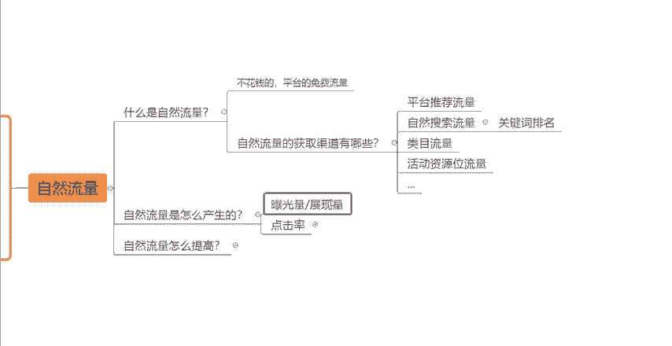
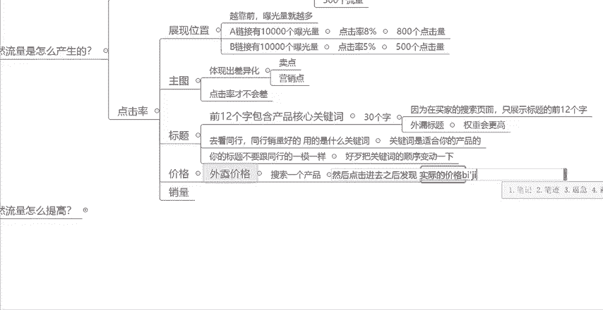
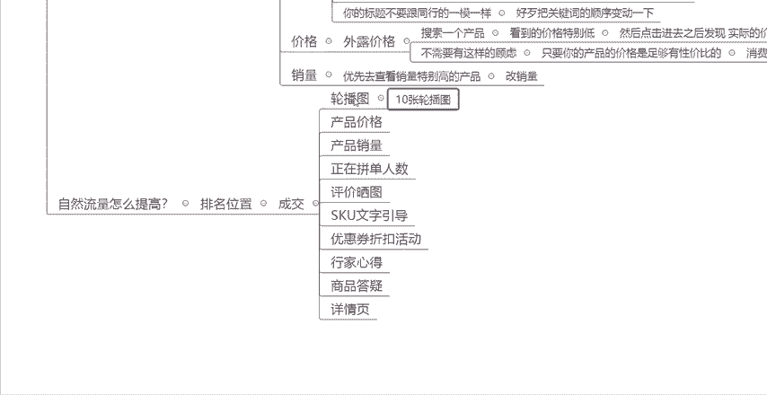

# 【拼多多运营】2024目前最新的拼多多开店新手教程！每天30分钟，零基础电商运营快速起店，实现日销千单！ - P42：42 拼多多开店自然流量快速起爆 - 拼多多-运营 - BV1812mY6EFh

很多拼多多的新手商家在前期做店的过程当中啊，都会遇到没有自然流量的一个这种困难啊这种困境。那么这种情况下啊，就是你对自然流量，它这一个流量途径啊还没有一个很清晰的认知。

你不知道怎么能够快速的把自然流量做起来。那么今天这一期视频呢就跟大家来分享一下，呃，如何能够把自然流量快速的做起来啊。那么我们想要把自然流量做起来呢？我们首先肯定是要了解自然流量它到底是一个什么东西。

以及自然流量它是怎么产生的。最后自然流量到底要怎么样去提高。今天这一期视频我会从这三个方面哎，给大家把自然流量这一个东西啊给大家讲明白。那么我相信你听懂了之后啊。

对于怎么去操作自然流量啊就有一个很清晰的认知了啊，那么你后续在做自己的一个店铺的时候呢，你的整个运营思维运营的。

操作手法那么也会更加的这个通畅啊。那首先第一个啊先带大家了解一下什么是自然流量啊。顾名思义啊，自然流量就是不需要去花钱的，就能够获取的平台的免费流量，这个就叫做自然流量。那么自然流量的获取渠道有哪些呢？

比如说平台的推荐流量，对吧？还有自然的搜索流量，对吧？自然的搜索流量就是呃我们大家都知道的啊，关键词搜索，那么这边就涉及到了一个关键词排名。那还有第三个啊就是我们的这个类目流量。

还有第四个也是大家比较熟悉的一些活动啊，一些资源位的流量，那么这些流量渠道啊，它通通都属于自然流量，那我们知道了自然流量的一个渠道有哪些之后呢，我们还要来搞明白自然流量它是怎么产生的啊。

那么这边涉及到了两个量啊，一个是报。

光亮啊一个是展现量。然后还涉及到了一个绿啊，就是我们的点击率啊点击率给大家举个例子啊，比如说你的链接。

有1万个。曝光量。对吧那这个时候比如说你的这个链接，你的点击率是5%，那这个时候你能获得多少个点击量啊？我们通过算一下就知道啊，1万个曝光量，然后5%的点击率，你是不是能够获得500个流量，对吧？

那么自然流量啊就是这样去产生的，知道吧？你先有曝光量，然后你会有一个点击率，然后你会获得流量。

知道吧？所以你就要明白一个点，就是你想要有自然流量。你首先要有第一个东西是什么呢？就是我们的曝光量。那曝光量跟什么有关呢？跟展现位置有关，知道吧？你的这个产品，你的这一个链接展现的位置越靠前。

那么曝光量就越高，很多小伙伴有一个错误的认知啊，觉得我的这个链接这个排名越靠前，那么我的流量就越多，对不对？这样听起来是没问题的，但是实际上啊你的这个流量的多少跟你的排名位置是没有关系的。

而他们之间的一个观联是什么呢？是因为你的这个排名越靠前，你的曝光量就越多，而你的曝光量越多，你的流量才会越多。那么在同样的情况下。

就有小伙伴会说了啊，为什么我的链接流量不如别人，不如同行，对不对？而，我们的销量啊，我们这些数据啊好像都差不多。但是为什么我的流量就是没有它高呢？这个时候啊就是你点击率的问题，还是一样的。

给大家举个例子，比如说这个时候同行链接啊，我叫它A链接，对吧？它有1万个曝光。然后它的点击率是多少？它的点击率比如说是8%，那么它这个时候有多少？有800个点击量，对不对？也就是有800个流量。

而你的链接，比如说你是B链接同样的有1万个曝光量。而你只有5%的点击率。这个时候你有多少，你只有500个点击量，对不对？你想想再差不多的排名位置，在一样的曝光量的情况下，差了3%的点击率。

你们之间就差了300个流量，差了300个点击量，那你再想一想这三个300个点击量，你们之间会差多少个成交，会差多少个订单。

知道吧？所以说啊。😡，你大家要重视点击率的这个问题啊，所以你们在做主图的时候呢，要注意什么？要体现出差异化。因为你只有做出了差异化啊，你把你产品的这个卖点，把你产品的这个营销点在你的主图上体现出来。

把它做好你的什么你的点击率。

才不会差。理解吧？所以说大家一定要想要做好一个链接的前提呢，想要获得高流量的一个前提呢，都是要先把你的这个主图给做好。O这是第一个点。然后第二个点就是你的标题啊，你想要获得自然流量。

特别是你想要获得自然的搜索流量，那你的标题就一定不能做，不能随便做。你的标题要什么？要包含核心关键词。那么这种情况下，如果说你不知道的话，你可以去看同行。

同行销量好的用的是什么关键词？如果说这个关键词。是适合你的产品的，你也可以拿过来用。知道吧？你也可以拿过来用。😡，也就是说你们可以去参考一下你的同行。

然后把它的这个产品的标题当中的关键词去分析一下哪些关键词是适合你的产品的。那么你可以把它拿出来，然后组成你的产品标题。但是这边呢你大家要注意一个点啊，就是你的标题不要跟同行的。

一模一样。知道吧？不要一模一样，就算你们的产品是一模一样的，你们的关键词是一模一样的，好歹把关键词的顺序变动一下。知道吧你不要连顺序都不变啊，就一模一样的复制过来了，这样肯定是不行的啊。

然后还有一个注意的点呢，就是你的标题，因为大家都知道啊，标题是30个字嘛，对吧？那你的这个标题的前12个字，一定要包含产品的核心关键词，为什么呢？因为在买家的。搜索。页面。只展示标题的前12个字。

所以说这标题的前12个字呢，我们又把它叫做什么？把它叫做外露标题。那么外露标题如果说你是包含了核心关键词的，你的权重会更高。

会更高一点点，当然不会这个差异化不会特别更特别大，但是它会更高一点点，知道吧？会有一定的帮助。所以说大家在做标题的时候，注意一下这几个细节啊，前12个字，一定要包含产品的核心关键词。好吧。

这是第二个标题的问题。然后第三个就是关于价格的问题啊，价格呢有一个叫做外露价格就是什么？就是。

我们在搜索，比如说搜索一个产品的时候，大家会发现一个问题啊，就是有的产品看到的价格特别的低，然后点击。啊。然后。点击进去之后，发现实际的价格。比较高。

你们在拼多多上买东西的时候，有没有发现这样的一个问题啊？我比如说我我我想买一个东西，我搜索了之后，哎，我看到有一个价格啊就超出了就是我的一我对这个产品的一个常识，对吧？

我想象不到为什么这个东西能卖的特别便宜。那这个时候我是不是会有一个好奇感啊，我想看一下这个到这个产品它到底是不是卖的这么便宜，那我是不是就会点击进去啊？对吧那我点击去去之后。

你会发现哎这个价格特别特别低的，它不是这个产品的实际价格，它可能只是什么？可能只是一个比如说小样一个试用品啊，一个体验装对不对？或者又是一个其他的一个，比如说这个产品的一些配套的工具。

它不是这个产品的价格，那我是不是就会对吧？啊，有一种被片的感觉啊，但是什么呢？但是我又点击进来了。对吧我又点击进来了，那这个时候大家就会觉得哎，如果说我去这样设置的话。

消费者点击进来之后发现这个价格不是这么低的话，他会不会就直接走了呀？他会不会不会购买呀？其实。

不需要有这样的。过滤知道吧？为什么呢？只要你的产品的。价格是足够有性价比的。那么消费者。也会买单的。知道吧？消费者也会买单的，我们做一个很低的外露的价格的一个作用是什么呢？只是为了获取点击量。

只是为了先把消费者骗进来。骗进来了之后，我们再做其他的动作，再做其他的打算，知道吧？只要你的产品的价格是有性价比的。那么消费者也会买单的，不用担心他不买，好吧，然后最后一个呢就是销量。

因为我们在我们作为一个消费者正常来说，在拼多多上买东西的时候，也会优先去查看销量特别高的。产品对不对？如果说这个时候有一个产品它的销量是10万加，然后有一个产品的销量可能只有几百，对不对？

你会优先看哪一个，你肯定会优先去看销量高的产品嘛？对吧？所以说啊销量高，也会帮助我们提升流量，也会来提高我们的点击率，知道吧？这个时候呢你就可以去做一个动作是什么改销量。理解吧，可以先去改销量。

把你的销量改到什么。比如说1万加10万加或者100万加都可以的。好吧，那么这几点呢，主图标题价格销量都是会影响到点击率的一个问题，都会影响到点击率的一个点。所以说我们需要把这每一个步啊。

每一个步骤每一步都做好啊，都做好，我们才能够把我们的综合指标给提升起来。O那么知道了以上几一些点了之后呢，那么自然流量到底应该怎么提高。那这边呢就涉及到了一个排名位置，排名位置就是上面所说的展现位置。

我们刚才所了解的所学习的主图怎么做标题怎么做，价格怎么做，销量怎么做，这几个的操作的一个核心都只是去提高我们的点击率，但是点击率提高了，你的展现位置没有提高，还是没有用啊，对吧？你展现位置不。

的话你还是没有拿不到曝光量啊。那这个时候我们就要做的是提高我们的排名位置，提高我们的展现位置。那么提高展现位置怎么去操作呢？需要做哪一个点呢？其实只有一个就是我们的成交，知道吧？

我们要围绕着我们的成交去做优化，去做一系列的操作，那么哪些东西会影响到我们的成交呢？第一个轮播图。

知道吧？十0张轮播图。去上传好好吧，去上传好，然后是什么？然后是我们的产品价格，这个就不跟大家多说了啊，你的产品性价比是直接影响到了你的产品的转化。

好不好的一个因素啊，然后产品销量跟上面一样的。我们作为一个消费者来讲，我们会更加偏向于去购买一些销量比较高的链接，知道吧？所以说你不要说觉得这个产品的销量不重要，觉得无所谓，这个是很重要的。好吧。

所以说建议大家可以尽量的去改一下销量。然后还有一个就是正在的拼单的人数。这个呢可以给消费者。啊，消费者制造一种。氛围感知道吧？如果说你的拼单人数特别多的话。

那么在这个产品的页面会显示啊谁谁谁正在拼谁谁谁正在拼单。所以这样的话也会去促进啊消费者立即下单的一个这种概率，知道吧？然后就是我们的评价晒图，这个是很重要的。理解吧？作为一个消费者来讲。

他可能会随便的看一下你的产品的主图，可能会随便的看一下你产品的详情页，但是他一定会很看重什么，很看重评价晒图，所以说这个是很重要的。评价晒图，一定要好好的去做。如果说你是一个新链接。

那么建议你至少要做100到200个晒图评价，知道吧？不要顶着几个晒图评价或者几十个晒图评价在哪好吧，至少先去做100到200个晒图评价。然后呢就是我们的SQ的文字引导啊，文字引导。比如说做一些。

啊，营销文案，比如说限时特惠呀，或者超值套装啊，对吧？做一些这种啊文字营销文案在你的SQ当中啊，也会去促进成交的一个概率，然后就是优惠券的一些折扣活动的啊，这个跟你的定价有关啊。你的定价啊。

就是你的拼单价可以设置的。

高一点，然后通过什么，然后通过比如说优惠券，通过限时限量购。

去把你的价格压下来。那么消费者在你的产品页面之后，看到的是什么？看到你有在做优惠券的活动，看到你有在做限时限量购的活动，那么也会提高它的一个转化率，知道吧？然后就是什么？然后就是呃我们的行家心得啊。

然后商品答疑啊，然后详情页啊，这些都是我们产品内功方面的一些东西，这些都是你需要去好好做的啊，你这些东西做好了之后，你的转化率才能够更高，知道吧？所以说我们做的这一系列的一个动作呢。

都是为了提升我们的成交率，提升我们的转化率，只有你的转化率提高了，你的成交提高了，你的排名位置才会提高，你的排名位置提高了之后，你的点击率，你把它优化好了。那么你的这个链接它的流量就会越来越多。

流量越来越多了之后，你的订单也会随着越来越多，理解吧？OK这看到。

这呢这个就是我们自然流量啊，到底应该怎么去提高的一个详细并且完整的一个玩法一个操作方法啊。看到这边还有什么不懂的小伙伴呢，可以在评论区扣三个6，找我领取一份店铺运营的综合大礼包，好吧。

