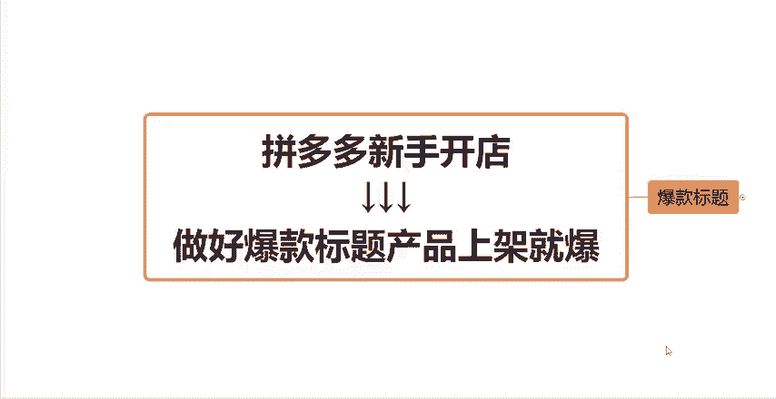
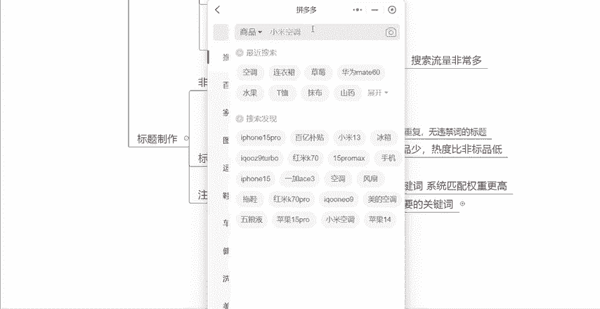
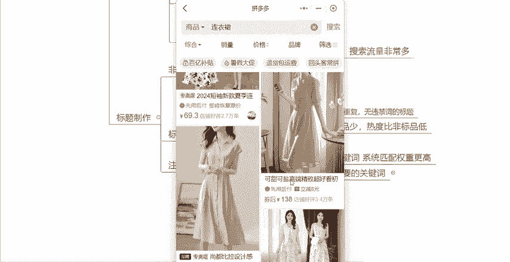

# 【拼多多运营】2024目前最新的拼多多开店新手教程！每天30分钟，零基础电商运营快速起店，实现日销千单！ - P43：43 拼多多做好爆款标题产品上架就爆 - 拼多多-运营 - BV1812mY6EFh

新手做拼多多店铺啊，在前期非常重要的一个点呢，就是关于我们产品这个标题到底应该怎么去做啊，怎么去制作一个爆款标题。因为标题啊它直接决定了，就是你的这个产品在前期搜索流量的一个好坏。

所以说这个环节是非常重要的。那么这些视频呢就是要跟大家来分享一下，关于我们这个产品的标题到底应该怎么去做。怎么去做好一个爆款标题，让我们的产品。

上架啊就能够获取到非常多的一个流量。那首先啊我先带大家搞懂一下什么是标题啊。其实产品标题它不是写给我们自己看的，知道吧？就不是给商家看的，而是什么？而是用来给平台去收录的。平台收录了你的关键词。

那么在买家搜索的时候，它才能够把你的产品推送到买家的面前，这是第一个它的一个作用。第二个作用呢就是你的这个产品标题是用来给买家理解的。这句话什么意思呢？就是当买家搜索了一个关键词之后。

那么比如说啊我在拼多多上啊，对吧？我想要买一个啊，比如说嗯连衣裙，那么当我搜索完连衣裙之后啊，会产产现出非常多的这个产品，对吧？每一个产品呢，它且大家都会带有这个标题，那么你的这个标。

题呢就决定了啊买是不是买家想要的。比如说我想买一个这种桑蚕丝的，对不对？那你的这个标题当中，比如说这个有商桑蚕丝，那么我作为一个消费者，我可能就会点击进来，我去看一下这个产品到底怎么样，对吧？

如果你的这个产品不是桑蚕丝的。但是我想买的是桑蚕丝的。那我就不会点击进去看，对不对？所以说这就是第二个点是用来给买家理解的，那么标题呢它就是搜索流量的一个主要入口啊，你的搜索流量好不好。

就取决于你的标题做的，好不好？O那么我们想要知道怎么去做好一个标题之前啊，我们肯定要先来搞懂什么是关键词，对不对？因为我们的标题就是由关键词去组成而来的呀。那么一个标题呢，它是由60个字符组成的。

也就是30个字啊，30个字，那么关键词当中呢。

它又分为很多种类型，比如说类目大词、长尾词、精准长尾词、属性词、人群词、引流词、营销词、品牌词等等等等。通过这么多的关键词啊组合在一起才组成了一个什么才组成了我们的这个产品的标题。

那么首先先跟大家讲一下什么是类幕大词啊。比如说啊我刚刚给大家讲的，你是做连衣裙的，那么连衣裙就是你的内幕大词啊，比如说你是做这个高跟鞋的那么高跟鞋就是你的内幕大词，你是做什么空调的空调。

就是你的内幕大词，知道吧？你做什么产品的，你的内幕大词就是什么？那么内幕大词它有一个特征呢，就是它的流量是非常非常大的。比如说我们想买一个空调，那我肯定就直接去搜索空调了嘛，对吧？我顶多再加一个什么。

再加一个品牌，啊，格力格力空调或者小米空调或者美的空调对吧？这个呢就是它的搜索流量啊，是特别特别大的，但是呢你的竞争也特别特别大啊，这是内幕大词的一个特点。那什么。叫长尾词呢？

就是由多个关键词组成起来的这就叫做长尾词。来我给大家举个例子啊，比如说像这个像这个产品啊，它的这个标题，小香风连衣裙2024。那么比如说小香啊，我给大家举个例子啊，小。

香风连衣裙2024新款啊。这样的一个关键词啊，它什么新款夏季。这样的一个关键词，它是由什么？它是由小香风。加上连衣裙。加上。2024新款加上夏季，它是由这四个关键词组成的，对不对？

所以说它这四个关键词组成的这一个关键词，这种就叫做长尾词，这个也很好理解，对不对？什么叫精准长尾词呢？比如说小香风连衣裙2024新款夏季，你觉得它精准吗？你们觉得这个关键词精不精准呢？其实它不精准。

为什么？因为连衣裙首先夏季这个关键词。你基本上所有的连衣裙对吧？只要是夏天穿的都可以用夏季这个关键词。然后2024新款这个词就更不用说了，它更是基本上所有的产品都能用这个词唯一稍微跟精准沾点边的是什么？

是个小香风，对不对？所以说这个长尾词啊，它是不精准的那什么叫精准的长尾词呢？比如说小香风连衣裙，然后加上什么？加上什么？啊。A字裙。对吧然后加上什么修身显瘦。知道吧？这样的一个呃关键词，它才叫做什么？

它才能够叫做精准长尾词。知不知道？为什么呢？因为它里面有什么？比如说你的小香风，你的这个连衣裙是不是小香风的是小香风这种风格的，你才能用这个关键词对吧？你的这个连衣裙是不是A字裙，对不对？你是A字裙。

你才能够用这个词嘛？你的这个款式是不是修身的，是不是显瘦的，对吧？如果说你是宽松的，你可能不能用这个关键词啊，所以说这种带有属性词的关键词，它才能够叫做精准长尾词。

O接下来这个就很好理解什么是属性词的嘛，对吧？比如说我们每一个产品，我们在上架的时候，都会让我们填写属性，那属性当中有很多种，比如说你的这个风格啊，你的这个组合形式啊，你的款式，你的袖长，你的裙长。

你的领型，对吧？

这些就叫做属性词。那么属性词，比如说有什么像这个产品，比如说小香风。

对吧它是一个属性词，还有什么？还有这个A字群，它也是个属性词，对不对？还有比如说我们的短袖。

还有比如说中长裙。还有这个wining，像这些关键词，它就叫做属性词。理解吧，那人群词是什么呢？就是你的产品是用在什么样的人群之上的？比如说连衣裙对吧？肯定是用在女性啊，用在女性身上的。对吧啊。

女还有比如说我们男装肯定是用在男身上的对吧？啊，童装是用在儿童身上的那又分为比如说女童啊或者男童。那比如说中老年服装啊，比如说妈妈装，那是又用在妈妈身上的对吧？爸爸装啊，爸爸装。

是不是这种呢就叫做人群词，也就是你的产品对应的是什么样的一个受众人群。那你可以把这个人群加在你的标题当中。那还有呢，比如说我们的连引流词，引流词是什么意思呢？就是给你的链接能够带来更多自然流量的。

然后搜索热度最高的关键词，比如说连衣群当中，你可以去看一下啊，同行他们都在用哪些关键词啊，比如说。

对吧呃，连衣裙2024新款，那像这种就叫做引流词。2024新款或者说夏季新款理解吧？

像这种关键词呢，它就叫做引流词，就是大家都在用，都可以用。然后搜索热度呢也很高啊，理解吧？然后最后呢就是什么营销词营销词。比如说我们的新客立减买一送一或者你的产品如果说是顺丰包邮啊，或者说你是厂家。

你可以用厂家实销像这种营销词呢，你也可以加在你的标题当中。当然，营销词啊一般是放在你标题最前面的，知道吧？然后最后一个就是品牌词，品牌词啊，如果说你的产品没有品牌，那你就不能用。如果说你有品牌。

你就可以用这个品牌词呢，就不是说所有的产品它都是可以用的好吧，那么我们的关键词呢就是基本上由这些分类啊来组成的呃，类目大词啊，长尾词、精准常尾词属性词、人群词引流词营销词品牌词啊等等这些关键词来组成的。

那么我们知道了这些关键词的分类了。

之后我们就要来知道怎么去制作成一个标题。呃，我分为非标品跟标品来分开跟大家讲啊。非标品呢它就是以引流词为主，知道吧？以引流词为主。因为什么？因为非标品，它的关键词啊差异非常大，所以说它的搜索流量非常多。

同样的，比如说一个连衣裙，它里面的风格就特别多，款式也特别多，对吧？有A字裙，有半身裙啊，有长裙，有短裙，有中长裙，有长袖，有短袖，有V领，有圆领，有高领，有小香风以及等等，其他各种各样的风格，对吧？

所以说它的这个词啊是特别特别多的。它的关键词的差异化呢也特别大，所以如果说你是做非标品，你就要学会去找词找词可以从哪里找呢？可以从第一个同行同款热门商品。也就是你先去找到跟你的这个款式是一样的。

找到你的同行。

然后看一下你同行标题当中，他们都用了哪些关键词，你可以把符合你的这个产品的拿出来用，这是一个方法。第二个呢，你可以在拼多多的下拉框尺当中啊，去找你适合你产品的词。比如说你是做连衣裙的。

那么你可以直接搜索连衣裙，搜索完之后啊，下面就出现了，看到没有？非常多的这个下拉框尺里面比如说有什么真丝桑蚕丝女夏季啊，35到40岁上档次女人味。

还有这个2024新款连衣裙，还有胖美眉遮肚啊或者长裙或者高级感小众轻奢。这里面关键词就非常非常多啊。你需要做的呢就是在这里面把你适合你的产品，跟你产品符合的关键词去筛选出来，然后拿出来用就可以了。

然后第三种找词的路径呢，就是可以在推广工具当中有个搜索词分析，可以在这里面去找关键词。那么这就找关键词的途径啊，基本上就这三种，基本上是够用的，知道吧？你通过这三个路径，通过这三个方式呢。

去把你适合你产品的这个关键词全部找出来。最后然后组合成。啊，组合成1个30个字，并且通顺。并且无重复。并且无违禁词的标题，知道吧？你把词全部找出来之后，然后把它们拼在一起。拼在一起之后，如果说有重复的。

你就把它删掉。然后再检查一下它读起来是不是比较通顺的，然后再去看一下它有没有违禁词，没有这几个点都没有的话，那你这个标题基本上就是没有任何问题的，知道吧？这是非标品，然后标品的话。就是以营销词为主了。

为什么呢？我给大家举个例子，比如说。呃，你是卖空调的对吧？那空调当中能用哪些关键词呢？基本上大家用的都是一样的，知道吧？什么一级能效啊、冷暖变频啊、家用啊、卧室啊、挂机啊，节能省电啊，对吧？

然后加上品牌词，然后加上你的功率，然后你看这个美的空调，它是这个标题，小米的它也差不多什么一。5匹对吧？一级速能啊，智能啊，家用空调挂机啊，闭式的还有什么？

还有这个海尔的空调大一匹变频挂机、一级能效、冷暖家用，是不是大家产品类型是差不多的。所以说能用的关键词就那么一些，那所以说这里面你是做标品的话，你就没有那么多的属性词可以找出来用。

所以你就是以营销词为主，知道吧？因为你的热搜词的数量会比非标品少很多。然后热度呢也会比非标品低很多。

所以你要以营销词为主，营销词加上引流词，加上内幕词，加上属性词，这个啊就组成了你这个标题的这个啊标品的这个标题，知道吧？

如果说你是做标品的，你就按照这个方式去组合你的标题OK那么这边有一个注意细节，大家要注意一下，就是一个标题当中啊，前12个字是最重要的，为什么呢？因为当我们在搜索一个产品的时候，比如说我搜索空调对吧？

那么展示来我给大家看一下。比如说我搜索。

啊，连衣裙。对吧大家可以看到展示出来的这些产品，它的标题，如果说你的前面没有这种啊打标潮流好价啊，什么暑假大促，没有这种活动打标的话，那么像这个产品，你的这个标题啊，虽然说是30个字。

但是买家只能看到什么，只能看到12个字。

只能看到你标题的前12个字甚至更少。所以说前12个字是最重要的。外陆的关键词系统匹配的权重更高，所以要优先的去放重要的关键词，知道吧？重要的关键词是哪些呢？比如说类目大词，比如说精准的长位词。

比如说营销词。

理解吧？你就要把重要的关键词放在前12个字当中，不要放在后面了。因为放在后面当买家搜索的时候，你后面的关键词是展示不出来的。

知道吧？那么这就是你在组合标题的时候需要注意的一个细节。

那么学会了这个方法，搞懂了关键词之后，知道怎么去找词，知道怎么去组合标题了之后呢，我相信大家都能够做出一个爆款标题来啊。那么看到这里还有什么不懂的小伙伴呢，可以在评论区留言666找我领取一份。

我给大家整理的这个店铺运营的综合大礼包啊，感谢大家的一个观看。

