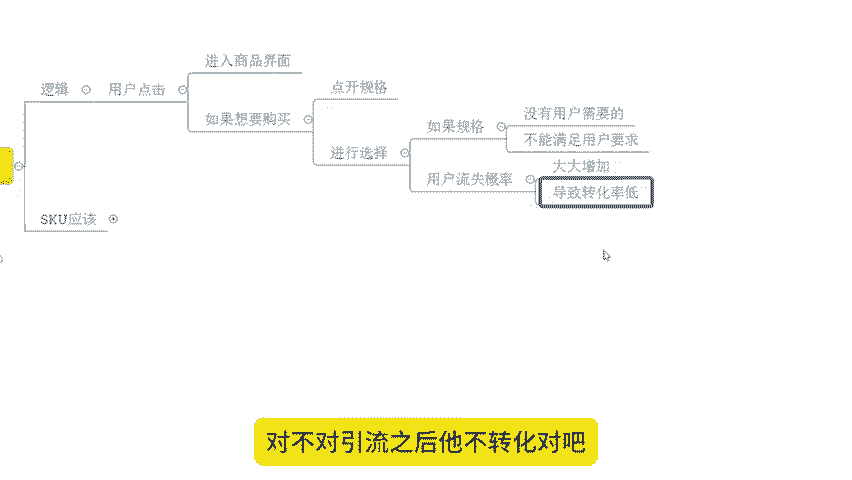
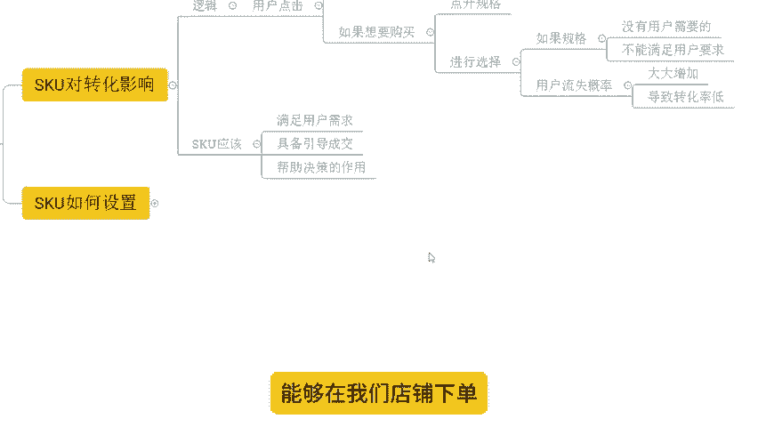
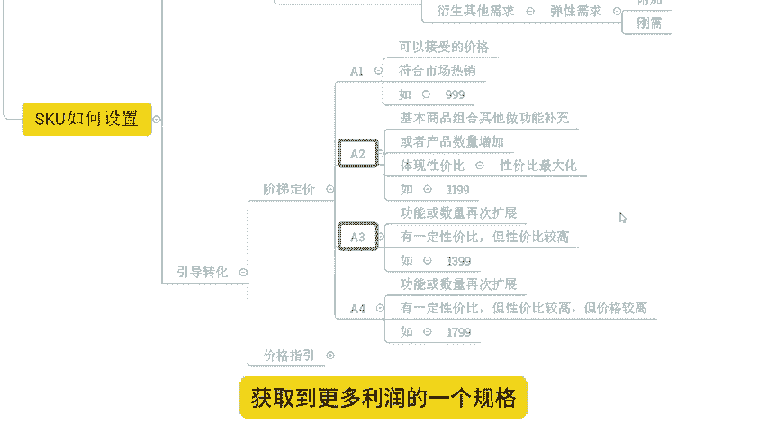
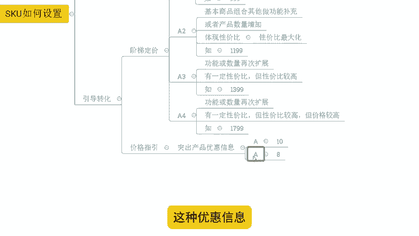

# 【拼多多运营】2024目前最新的拼多多开店新手教程！每天30分钟，零基础电商运营快速起店，实现日销千单！ - P4：04 店铺转化提升5倍的SKU布局方法 - 拼多多-运营 - BV1812mY6EFh

hello，大家好，我是谢楼。今天给大家分享内容呢是我们拼多多新手日销签单报单实操玩法中的转化提升5倍的SKU布局方法啊。

那么在分享之前呢，还是老规矩啊，先给大家看一下近期更着视他小伙伴的店铺数据，好不好？

OK可以看到，像这个店铺呢，原本是一个您访客的新店啊，没有任何数据。那跟了实操之后呢，首先我们完成了产品的市场分析，竞争分析，以及我们商品的会员对接。那么上架商品之后呢。

我们也正进行了产品的这个数据提升啊，通过一段时间的数据累计之后，可以看到整体的访客呢也在不断的增长啊，到后期的话，一天访客呢做到了9000多，将近1万啊。

那么一天的订单呢是做到了1200多单，转化率呢13。27%，可以说是非常不错的一个一个状态啊。成长趋势非常好啊。那除了这个店铺之外呢，还有这个店铺也是一个新店啊，零访客的对吧？没有任何数据。

那么跟了实操之后呢，同样是能够去经过一段时间的沉淀跟数据累积之后呢，得到一个非常快速的爆发，可以看到啊，在经营在经营了这个10天左右的时间时候呢，访客直接就破千。然后呢，注意啊这个是自然流访客啊。

那么到后面第这个12天左右直接到了6000多访客啊，然后呢一个月结束，那么访客在200一天的订单呢是3600多单转化率15。09，非常不错的一个数据啊，当然呢，除了像这种新店啊，零访客的。

那么一些老店铺啊，有数据的店铺有基础的店铺跟了实操也是可以得到很好数据提升的。

像这个店铺可以看到啊，原本的访客在3000左右啊，那么整个店铺呢也是陷入了一个瓶颈的状态啊，没有办法得到突破。

了实操之后呢，那我们完成了产品的呃结构调整，也完成了我们商品的SQ的一个布局调整啊。优化之后，整体的数据呢也在不断的增长啊。那么呃像我们转化率提升之后呢，整体的访客呢也在啊快速的提升。

所以今天我们要分享了这个主要内容呢，就是这些店铺是如何完成我们商品的SQ布局得到一个这么高转化率的一个状态的对吧？像这个店铺3。27%转化率这个店铺15。09%转化率。这个店铺呢是14。67转化率对吧？

O那么店铺运营呢对于很多的新的小伙伴来说呢，是有到非常非常多的一个困难跟问题的啊。如果说店铺操作有问题需要资料的可以找我啊，那么有时间的话呢，我也可以带着你们一起去实操做店，像这些小伙伴一样呢。

我们一起能够有到更好的方法，那我们店铺呢做的更好好吧。O那么转化率的提升，我们刚提到了是通过SQ布局来完成的那我们首先了解清楚就是S。

KU的一个影响啊是哪些啊？对于我们转化来说，首先我们来看看逻辑啊。

那用户呢如果点击了我们商品啊，进入到了我们的商品界面，对吧？这个时候呢，他如果想要购买我们产品，对不对？就一定会点开规格，然后来进行选择的啊，这个是一个必然的动作，对吧？如果说我们的规格，对不对？

他没有客户需要的，或者不能满足客户的要求。

好，这个时候呢大概率就会导致我们的客户流失啊，那么大大增加我们这个用户流失的一个风险啊，并且呢会导致我们的转化率很低。

啊，这是一个非常痛苦的事情，其实引流都是很费劲啊，很耗费心力的一个事情的，对不对？引流之后它不转化对吧？那不是更心痛吗？是不是？所以与其这样子，我宁愿我店铺还没有访客，对吧？可能我还好受一点。

当然呢我希望呢是所有人的店铺呢都能像我带实操的小伙伴一样呢能够有到啊非常不错的访客数据，对吧？都能有到很好的订单，好吧？O的，那我们回过头来看一看啊，那像这些这个影响说是这么一个逻辑来的话。

那我们应该这个怎么去操作呢？啊，SQ应该怎么去设置呢？啊，OSQ的应该呢有3个啊，好吧？第一个呢满足用户的需求。😊。

第二个应该呢是具备引导成交的作用。第三个应该呢是能够帮助决策的作用啊，帮助谁帮助我们用户啊完成这个决策来能够在我们店铺呢下单啊，这个是我们SQ要三个应该啊，怎么应该的啊。好。

那么具体操作如何去实现这三个应该，是不是我们来看一看啊。

来。SQ如何设置？第一个呢就是要分析我们的用户需求啊，这个很关键啊这个很关键啊。呃，我们可以看到像这一个店铺呢做的是玩具啊，它就非常明显了，对吧？从最早的几千访客到后面的话，一万多的访客一天的话。

2000多单，对不对？转化率呢不断的成长提升，到后期的话转化率14。67%，怎么来的，就是不断的在挖掘用户的一个需求。好吧？那么用户需求是什么呢？

看一下。

首先。😊，基本的生理需求啊，这个是针对到所有商品的。好吧，这针对所有商品的。

我们来说一说人啊，他都有吃喝拉撒睡这样的一个啊基本的生理的一个需要，对吧？那这里面呢就包含了各种各样的需求，是吧？像我们吃的对吧？吃的商品呢，它就有食物嘛。那么这些食物呢，它就需要满足最基本的生理需求。

什么基本生理需求呢？能够提供我们身体所需要的。

这个呃营养和能量对吧？来维持我们的生命活动啊，这个是我们产品的基本需求。生理需求，对吧？然后再是喝的喝的呢一些液体了啊吧？一些液体了。那么哪些液体呢主要是水啊，其次呢还有一些其他的饮料，对吧？

那么这个呢也是维持生命体征的一个非常重要的一个部分啊，然后再就是拉根纱，对吧？这个呢就涉及到了很多的一些各户家庭的一些产品呢？那么他们可能是呃需要有到更加好的清洁跟环境的一个需求，对吧？啊。

都是我们可以通过它来实现的，然后再来就是睡啊。

啊，能够去有到一个好的休息，好的睡眠啊，这个是我们睡啊所需要的一个啊这个身理需求的一个特征啊。那么它呢就包含了很多的这个床上用品啊、床啊，对吧？

睡眠保障类的一些产品呢等等啊啊都是属于我们的啊睡这一板块的。然后再呢就是我们产品的基本需求啊基本需求。那么产品的基本需求呢，其实就是我们所谓的刚需啊，注意每个产品都有刚需。

这个刚需就是我们所说的维持最起码的生命特征的一些基本需求啊，它所需要的啊，比如说我们吃的对吧？哎，我维持呃吃这个动作能够帮助我活下去啊，它就需要能够提供能量，对吧？啊，能够提供足够的这个营养物质啊。

那么我就需要能够起码填饱肚子对吧？能够去让我生存下去。在此基础之上啊，这个是刚需啊，在此基础之上我可能需要有到更多的啊这个很好的口感啊，更多的这个营养物质啊，更好的更健康的一个饮食啊，那么这些呢。

就是我们在基本需求之外的，在我们刚需之外的啊一个环境或者衍生的其他需求啊，这个属于弹性需求啊，这个属于弹性需求啊。那么这些弹性需求呢是市场影响的，也是我们基本需求满足之后产生的啊，是这样子的啊。

它是一个附加的。

但是根据我们现在时代的变化，那么这些附加呢其实已经演变成了一个啊逐步演变成了一个刚需啊刚需啊，它是时代啊变化导致的一个一个一个结果啊。好吧，那么这些东西呢，了解清楚之后。

我们再来回过头来说一说我们的引导转化的一个操作方式啊，来，首先呢在定价上面我们要去做好这个操作啊，定价上面我们要注意做好这些操作。那么定价呢是有两种方法的啊，一个是阶梯定价。

一个是我们的呃定价这个价格指引啊，那么阶梯定价是什么呢？来，比如说现在呢我们有一款产品啊，那么这个产品呢我们分为四种不同的规格。A1A2A3A4啊。那么A一呢，它是我们产品的最低价。

也是我们产品的露出价，是用户可以接受的价格，也是符合我们市场热销的一个价格，它是完成我们产品的定位的。比如说。

今天我们做了一款手机对吧？这款手机呢它的价格呢是啊999，对吧？听到这个价格大家应该熟悉吧，是吧？啊，某米手机啊差不多定价就是套路的啊，那么再呢就是A2A2呢，它是我们用户啊用户啊，在这个最起码的。

需求之上，对产品的功能或者组合进行补充之后，或者在数量上面进行提升之后产生的一个呃规格。那么它呢是体现出我们的性价比，对不对？能够把我们性价比做的最大化啊，注意它的价格呢可能是1199，对吧？

比我们999。

为了200块钱啊，贵了200块钱。那么然后呢再就是我们的A3A3呢，它是在功能和数量上再次拓展，有一定性价比，但是性价比啊比较高的，同时呢也没有说是最高啊，对吧？它只是比较高啊比较高。

所以说它的价格呢是什么？1399啊，1399啊1399啊，那么它可能会相对来说更高一点啊，更高一点。那么然后再就是我们的A4啊，在我们A4A4呢是对我们功能和数量再次拓展之后有一定的性价比。

但是性价比啊比较高。同时它的价格会比较高一点。比如说价格会做到了1799对吧？这个时候呢，这几个价格跨度从最开始用户需要的一个价格到最终的一个价格跨度比较大啊，用户能够接纳的程度的时候呢。

它可能更多选择是在A2和A3进行选择，而A2A3呢是能够充分去获取。

到更高的客单价，获取到更多利润的一个规格啊，这是阶梯定价啊，好吧，这是阶梯定价。相当于我们最低的1个A一呢，它是一个价格锚点的效应啊，能够通过这个价格锚点呢来给用户呢做一个产品的价格定位啊。

来让用户选择更具性价比，更有优势的A12A3啊，是这样子一个过程。而在这个过程中呢。

OK我们在做SQ的名称的时候，就需要根据我们所谓的用户的需求啊来完成SQ名称的命名。我们要在我们的规格里面把我们用户的需求写进去，能够体现出需求的同时呢，才更加具备吸引力啊。比如说今天呃我们实物，对吧？

我可以把呃更健康更更营养等等这些呃具体的聚焦的某一个点写到我的SQ里面去，对吧？这个时候呢用户呢看到这个呃SQ名称的时候呢，它的吸引力会更大一点，或者对它的一个影响会更大一点。

它不是一个简单的产品展示啊，那么再来说一说我们的价格指引啊，价格指引的操作方法呢其实也不是很复杂啊。那么它重点啊就是要突出我们产品的价格的优惠信息，什么意思呢？今天比如说A这个产品啊它是有两个规格。

注意啊，产品都是一样的，都是A两个规格呢。

一个是卖8块，一个是卖10块。那我相信啊，但凡是这个脑袋灵光一点的啊，应该都会选择8块。但是确实也有人脑袋比较铁，对吧？他会觉得哎价格贵的这个质量好一点。但是注意了啊。

那么价格8块就是我一开始的目标定价。我产品可能本来就卖8块钱。今天呢我是卖8块。同时我设置了一个10块的这个SQ来做对比。同时在8块的SQ里面呢去露出了这个优惠信息，比如说限时限量之类的啊这种优惠信息。

那么这个时候呢，消费者可能就会看到哎他有在做活动，有在便宜啊，我就赶紧买了。因为这个价格也是我可以接受的。😊。

🎼对吧那万一有人选择说哎我要买贵的啊，质量更好一点，那我赚的更多，对不对？所以说这个操作的话，就可以帮我们完成我们用户的一个营销转化的指引啊，是这样子的，那么整个操作过程中呢，我们用户的转化呢就会更高。

就像这些小伙伴一样对吧？这个店铺一样啊，那么转化呢从最开始可能并不高到后期的话一转化率呢做到了14。67整体的访客呢不断的在拉升，对不对？所以说效果是比较明显的。

如果说你自己目前呢确实在操作方面存在短板想要做好店铺啊，不懂如何运营O那我的建议呢可以考虑跟着一起实操做店啊，这样呢对你的提升会更大一点啊。当然如果说有需要这个解答问题啊。

像这些店铺操作方面哪里不清楚的或者是有需要资料的也可以找我那么今天的分享呢就这里，我们下见各位拜。😊。

