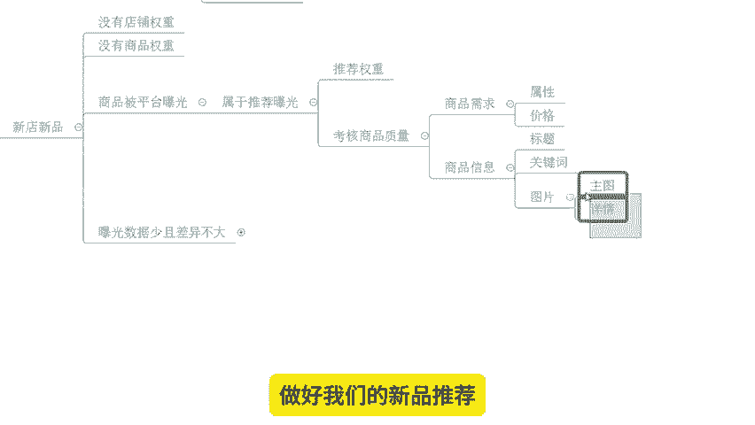
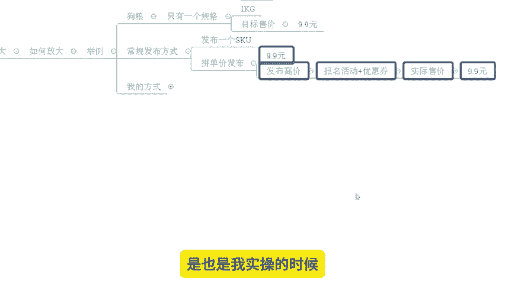
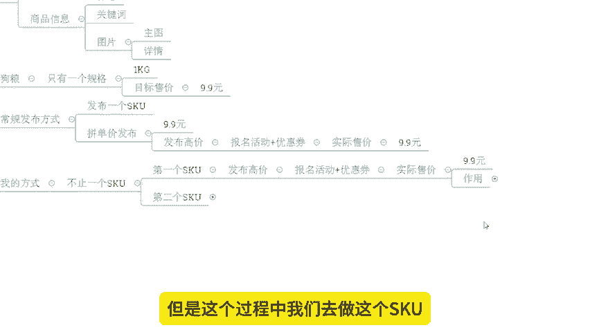
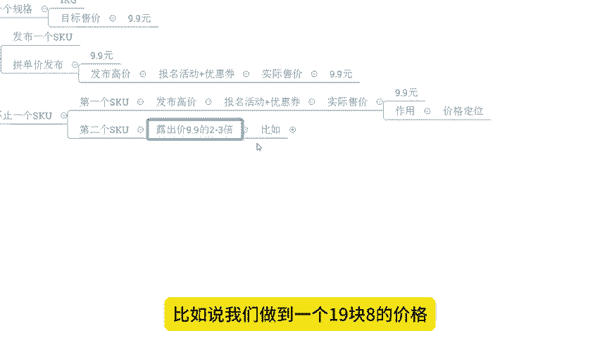

# 【拼多多运营】2024目前最新的拼多多开店新手教程！每天30分钟，零基础电商运营快速起店，实现日销千单！ - P5：05 开店一招获取四层商品推荐权重 - 拼多多-运营 - BV1812mY6EFh

hello，大家好，我是西楼。今天给大家分享的内容呢是我们拼多多新手日销签单报单实操玩法中的一招获取四成商品推荐权重的内容啊。那么这套玩法呢，也是我们自然流操作中的一个核心操作。那么在分享前呢。

先给大家看一下近期跟着1小伙伴的店铺数据，好吧。

OK大家可以看到啊像这个店铺呢是一个纯新店啊，最早是零访客的一个数据啊。那么跟着实操之后呢，我们完成了产品上架，完成了我们产品的新品操作，对吧？在整个操作过程中呢。

商品的权重得到了一定的沉淀啊之后呢就形成了一个快速的爆发。那么操作了10天左右啊，访客就直接破千。那么在第12天的样子呢，访客是到了6000多啊，非常快速啊。那么后期呢不断的增长提升。

那么真是也非常的迅猛啊，那可以看到后期呢一天访客做到了2万多访客啊，一天的订单是3000多单，转化率呢15。09啊，非常不错。还有像这个店铺啊也是一个纯新店来的，最早是零访客的一个店铺啊。

那么用到的方法呢也是同样的操作方式啊，那么整个操作玩法的话都是从零开始打爆的，那么快速的让访客呢直接到了9000多接近1万啊。那么一天的订单呢是1200多单转化率13。27%。当然呢这店铺操作呢都是。

通过自然流的玩法在做，也都是通过这个呃新品起来的。当然呢，一些老店铺啊，这个有数据的店铺。

同样的啊，也能够跟时到到一个很好提升啊。像这个店铺呢，原本访客呢就在3天左右啊，卡在这个地方很久了。然后通过我们的产品布局调整，通过我们产品的SQ调整啊，那么完成了数据的一个提升。

到后期的话一天访客呢做到了14000啊，一天的订单是2000多单，也都非常不错的。那么呃如果说你自己呢对于店铺操作，不懂如何通过战略来打造店铺数据来操作爆款的话，OK那么建议可以仔细观看我分享的视频。

好吧。

店铺运营呢，对于很多的新的小伙伴来说呢，可能会有很多很多的问题跟困难。这个东西呢也是非常正常的一个事情。毕竟的话一个陌生的领域嘛，对吧？那你肯定会有的时候显得比较迷茫一点，对吧？那么店铺操作过程中啊。

如果说你有有遇到问题对吧？或者是有需要资料的啊，都可以找我有时间的话呢，我也可以带着你一起去实操坐店啊。就像这些小伙伴一样呢，能够有到更好的方法啊操作店铺，让我们店铺呢得到一个更好的数据，好不好？O啊。

那么回到话题中来，既然说叫一招获取四成商品推荐权重。那到底什么是推荐权重，对吧？这个东西我们先来搞清楚啊，O推荐权重的意义。我们先来看一看其实推荐权重呢并不复杂，它就指的是我们平台依据算法啊。

那么给予我们商品和店铺的一个评分。那么这个评分呢在相同的产品权重和店铺权重情况之下呢，就会影响到我们商品的排序。什么意思呢？举个例子，今天呢我们有两个产品啊，这两个产品呢都是新品啊，假如说它都没有成交。

那么这个时候呢他们的商品的所谓的权重，对不对？啊，可能呢就是呃。😊。

一心啊或者一分啊，那么这个是它的基数啊，这个是基数。那店铺呢如果说都是新店的情况之下呢，可能店铺的权重呢也是一分，对吧？啊，它没有任何的其他的分数啊，其他的一个加权啊，都是一分。

然后这个时候我们可以看到啊1乘以1，这是它的一个啊整体的商品的权重啊，和店铺权重的一个啊这个得到的最终的一个啊权重的一个比值啊，算是啊那么它还是一对吧？还是一呢之后呢，后面呢就会进行一个评分的比分啊。

那么这个评分呢是附加值啊，附加值。比如说我们商品推荐分呢是从一到100或者从0到100啊，那么每0。啊01分啊，为一个这个积分标准的话，O那么它实际上呢就会有到0。01啊到啊到100啊到100啊。

那么这个是或者是到10。😊。

呃，100。00啊这样的一个一个比值吧，算是从0到呃从1到1万啊这样的一个有1万个一个一个一个分数啊，一个档次啊档位啊。那不同的商品的这个推荐权重分就会有到一个不同的排名啊，会有一个附加值，对吧？

换句话说呢，它可以决定1万个商品排名。

那么这1万个商品排名呢，就可以影响到我们后面商品的整体的这个权重啊，或者是我们整个的展示的位置啊，这样去理解啊，可以更加形象一点啊。那么。

推荐权重越高啊，我们认为呢产品的曝光越靠前。那么这个推荐权重越高的时候，比最高的时候呢，就是100分啊100分。那么它呢就是在第一名的位置啊，它是在第一名位置。因为他分数最高嘛啊，他越高是越靠前的啊。

那得到的曝光机会呢也会越多一点，对吧？那同时呢我们得到的销售机会也会更多，是这样的一个情况这就是我们所说的推荐权重的一个一个逻辑。但这个推荐权重他到底根据什么来的对吧？哎。

那个这个地方呢就是我们需要去重点关注的一个问题，其实你们可以看到啊像跟我实操的这些小伙伴，尤其这些新店啊，他们能够通过非常快速的操作获取到访客，就是因为能够在推荐权重上得到更多。

他能有到更好的产品展示排名，能够拿到更多的系统推荐曝光，从而才能得到更多的访客啊，是这样子的。那么推荐权重如何去获取，一起来看一下，这个是我们可能今天要重点了解的一个内容啊。

也是大家需要去重点去掌握的一个部分啊，可以看看啊。那么首先呢。😊。

们说新店新品对吧？新店新品呢它是没有店铺权重，没有商品权重的。这个其实我们刚刚有讲了过，对吧？它是一嘛，对吧？1乘以一还是1对吧？那这个时候呢，商品是会被平台推荐的啊，得到一个平台的曝光，对吧？

那么这个曝光呢就属于推荐曝光，这是一开始的基础曝光。那么这个是根据什么呢？根据我们的商品质量来进行考核的啊，这是推荐权重啊，这是第一次的推荐啊，第一次推荐。那么商品质量呢。

它其实就对应着是我们商品的一个用户需求和我们商品的一个信息啊，是这样子的。那么商品的需求呢，是指我们用户的需求。那么它对应到的是我们商品的属性和价格。😊。

那么这个东西怎么理解呢？比如说今天我是卖衣服的对吧？今天我卖衣服的，现在呢假如已经到了这个冬季，或者现在是到了夏季，那么不同的季节。😊，会有到不同的需求。冬季呢我需要的衣服呢可能会比较厚实一点，要御寒。

对吧？夏季呢我可能需要更加透气，更加清爽一点啊，那么这个东西就是我需求。如果这个时候我的商品属性，它是对应这个需求的是匹配的好，那么我的平台推荐就会更多。同样的一个产品对吧？比如说呃是一个厚一点。

一个薄一点，你在冬天去运营，你在夏天去运营，这两个产品呢，他的一个展示机会是不一样的啊，同时呢还有价格对吧？比如说平台上的所有商品都是这一个9。9块的对吧？用户呢他也喜欢购买9。9块的产品。

你非得做1个99的虽然说你可能讲我的价格高，我利润高，我少卖一点没关系，我卖一件顶10件，但是实际上你可能曝工拿不到啊，就这个意思，我们需要找到的是符合用户需求的价格和属性来更好的完成商品啊。

得到一个平台推荐的一个过程啊，这是我们首先第一个啊商品的推荐权重。那再一个呢就是我们。😊，商品信息。那商品信息呢包含了我们的标题关键词图片啊，那么图片里面呢啊就包含了我们的主图和详情啊。

那这些信息呢平台会进行考核。如果说你的标题包含了更多的关键词，你的关键词都是符合商品的，并且是满足平台搜所需要的啊，那么你的展示机会可能会更多。

同时呢你的图片啊是能够有到一个比较好的点击率是原创度比较高的啊，能够去更好吸引用户的话，ok那么你的推荐权重更高的时候呢，也会在后续进行一个数据放大啊，它是一个非常嗯这个重要的一个环节吧。

算是啊所以这个时候呢我们去做做好我们的新品推荐做好我们产品的一个曝光获取。O是第一步啊。第一步。那么得到这些数据之后，后续呢曝光的数据啊，它的多少呢可能会有太大的差异。这个曝光呢会比较少一点，不会太多。

因为它本身推荐是基于我们商品的关键词进行展示的啊。

而且是在展示的这个新品推荐位进行推荐的。所以说数据不会太多啊，相对来说可能会比较少一点。但是呢同样的产品同样是新品，同样是新链接，它差距不会太大。然而啊然而啊各位这个时候我们的数据是要经过运营去放大的。

这个才是一个非常非常重要的核心点啊，什么意思呢？怎么放大呢来我们举个例子啊，举个例子啊，假如说今天我们做的是狗粮啊，假如说我们今天我们做的狗粮啊，那我们只有一个规格啊，我们有且只有一个规格啊。注意啊。

那么它的规格呢就是一公斤的啊，它的规格就一公斤的。而我们的目标的销售价格呢，哎是9。9块啊，打个比方啊，9。9块啊啊，那按照常规的一个商品发布方式，我可能说只会发布一个SKU对吧？那么就是拼单价呢。

发布成9。9块或者是发布一个高价，然后呢再用到报名活动加优惠券等等这类。😊。

形式呢让我的最终的实际售价呢变成9。9块，对吧？这个是我们正常来说啊，常规情况的一个操作啊。那在这个过程中呢，整个的操作可能如果说你去做做第二种，肯定是优于第一种的对吧？至于原因。

那我们报名活动报名优惠券肯定会有到额外的推荐权重的，这个是肯定的啊。那么但是这种方式对不对呢？我不能说它错，但至少来说对于我来讲，它不是一个很好的选择，什么意思呢？我给大家看一下。

像刚刚给你们说的这些店铺啊，像这个店铺啊，对吧？人家为什么可以非常快速的从你访客做到这个一天1000多单怎么来的啊，看一下啊，对吧？这个操作方式呢是也是我实操的时候经常喜欢用到的一个玩法。

也是我非常喜欢推荐给大家使用的一个玩法，大家可以参参考一下啊。那么。

我包括说我跟着我小伙伴的话啊，我会要求上架不止1个SQ虽然说我们的产品只有一个规格，但是我会要求不止上传1个SQ怎么做呢？来，首先第一个发布1个SQ那么这个SQ呢我们可以发布高价对吧？

通过发布高价之后报名活动加优惠券的形式来实际售价做到9。9对吧？家可看到啊，跟我们正常情况下，你们大多数人做的方式其实一样的这个过程其实一样的啊，但是这个过程中我们去做这个SQ呢，它的作用是干嘛呢？

它的作用就只有一个价格定位来锁定人群啊，那么这个链接这个SQ它是不做任何的经营销售跟操作的啊，不做任何操作。它的目的就只有一个定位啊，那同时呢我们会发布另外一个S这个SQ呢它的露出价是9。

9块的2到3倍。😊。

啊，我不管你最后的一个结果怎么样，我不管你一开始发布的价格怎么样，反正最后我们打折之后，第1个SQ9。9块，第二个SQ呢，你的价格2到3倍，好吧，就OK的啊。比如说我们做到1个19。8块的价格。

那么它的作用是什么呢？来看一下。😊。

首先在新品操作销量的时候呢，我们做一个动作，就是通过这一个SKU来成交啊。那么通过它的成交的话，我们的客单价会更高。同时我们的UV价值会更高。那么达成同样的销售额呢，我们的操作的单量会更少。

操作难度更低。所以好处不言而喻啊。那么整个过程呢我们连续操作7天。这个时候这一个SKU呢就会被打上热销SQ的标签啊，那么打上标签之，这个时候呢我们再来发布第三个SKU注意发布第三个SQU的时候呢。

第一个SKU下架不删除啊，下架不删除。然后在第三个SQU里面，我们把它最终做成露出价在9。9以上。比如说15。86。8块等等都无所谓啊，最终的露出价格，这个价格啊。

你可以是通过活动打折之后的价格都是可以的。那么同时呢在第一个SQ下架不删除。

同时我们把第二个SQ对吧？进行一个活动提报露出价呢做成9。9块，让这个SQ来替代第一个SQ的定价的作用。这个时候操作完成ok我们就可以获获取到什么东西呢？第一个降价的推荐权重。

因为我们产品SQ降价幅度超过50%10%啊，同时呢我们还可以得到降价榜的推荐。那么降价榜推荐呢是降价排名幅度靠前的商品啊，所以这个时候我们可以得到第二重推荐啊，同时再就是我们报名活动之后的活动推荐啊。

它是三重推荐啊，三重推荐。而且还有点就是什么呢？我们在操作数据过程中呢，我们SQ产生的数据啊，这些数据呢也会累积权重，所以它是四重操作推荐啊，那么整个操作呢就从我们SQ的发布编辑开始的。

那么这个操作大家掌握好之后一早搞定四重推荐完美解决这个问题啊那整个操作玩法呢可以帮我们快速的去获取到更多的推荐权重，从而呢。😊。

🎼像这些店铺一样呢能够得到更多的新品的访客，带动我们整个产产品的一个数据增长啊。如果说大家还有什么地方不清楚的，或者是有操作方面的问题，那么可以跟我进行交流沟通。同样的啊，还是那句话啊。

如果说你自己做店，没有方法不懂操作啊，想要去好好做店铺的话，O有时间的话呢，也可以找我跟着一起实操做店。就像这小伙伴一样呢，我们一起能有到更好的方法，让我们店铺做的更好好吧，OK今天的视频呢到这里结束。

我们下次见。各位拜拜。😊。

