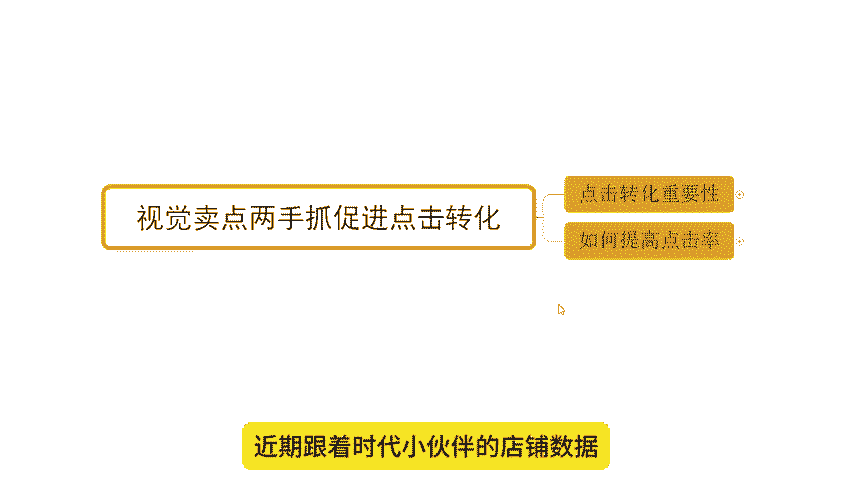
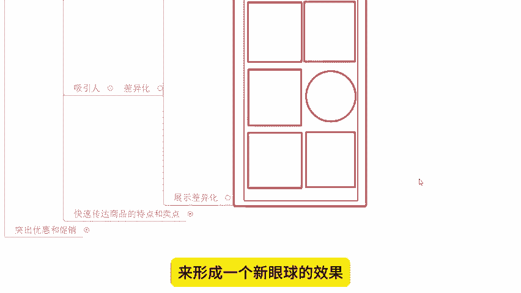
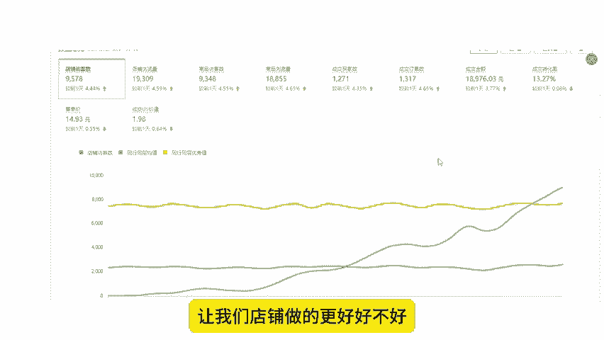

# 【拼多多运营】2024目前最新的拼多多开店新手教程！每天30分钟，零基础电商运营快速起店，实现日销千单！ - P6：06 店铺视觉卖点两手抓促进点击转化 - 拼多多-运营 - BV1812mY6EFh

hello大家好，我是西楼。今天给大家分享内容呢是我们拼多多新手日销签单爆单时操玩法中的视觉卖点两手抓，促进点击转化的内容啊。

那么在分享之前呢，老规矩啊，先给大家看一下近期跟着时材小伙伴的店铺数据，好不好？

大家可以看到啊，像这个店铺呢，原本是一个零访客的新店啊。那么对于新店的操作呢，其实大家都很清楚的。我们同样的需要首先完成我们产品的竞争分析，以及我们的产品的一个会员对接，对吧？搞定这些东西之后呢。

我们要来进行我们商品的视觉策划。完成视觉策划之后呢，我们才能进行商品的上传，然后再进行代品运营，是吧？而视觉策划是保证我们后期数据提升的一个非常核心的关键点。

如果说你的产品没有办法去体现出产品的竞争力没有办法去吸引用户眼球的话，O那么你的点击率你的转化率会受限。会导致我们后期的数据呢可能提升非常缓慢，或者是根本就没办法提升，对吧？所以大家可以看到。

像这个店铺从零开始到后期一天访客2万多转化率的话，15。09啊，那么可想而知，我们在前期的时候，点击转化做好之后，帮助是有多大的啊，那么当然了，除了像这个店铺之外啊，包括还有像这个店铺也是一个新店来的。

对不对？最早零访客，后期的话一天9000多访客啊，可以看到点击的这个转化率啊，转化率13。27啊，13。7。那么订单的话一天是1200单，对不对？所以。

这样的一个操作的话，能够去帮助我们在后期数据增长，或者是能够去给到我们后期的数据啊更好的一个保障啊，它是一个非常非常重要的点啊。至于它重要多重要，我们就不去反复去强调那同样的这个操作呢。

它也不仅仅说只是适用于新店啊那么一些老店铺同样使用的对不对？那如果说你的店铺呢在整个运营过程中数据达到一个瓶颈，没办法突破，那也可以尝试着操作优化你的图片试着去拉伸点击和转化。那么同样曝光情况之下呢。

点击率更高，那么你的访客也更多的是不是同时呢你的转化更高呢，你的访客不变的情况下，你的订单也会更多，整体的产出也会更高。

那么从而我们整体的店铺群众和商品权重得提升啊那么这些玩法啊针对到我们的视觉和卖点的一挖掘上呢，它其实也是基于我们产品内功也是我们自然流的一个核心操作家可这认真的去思考下这个问题啊。对于店铺运营来说。

很多的新手小伙伴呢在操作过程中肯定会面临很多的困难跟问题，这个很正常，对吧？如果说有遇到什么问题啊，不清楚的，或者有需要资料的呀，可以找我啊。还是那句话，如果有时间的话，有需要也可以找我跟他一起实操。

对？就像这些小伙伴一样呢我们一起有到更好的方法，然后操作店铺让我们店铺呢达到一个更高的水平，好不？O那么既然说视觉方面，它是跟卖点一起啊两手去抓，然后促进我们点击跟转化，那么点击转化，它到底有多重要啊。

我们来详细说一说啊，首先在我们考核的这个曝光数据过程中的话，O的，他就会针对到我们的啊点击包括说我们转化进行一个考核啊，那么点击率的计算公式这里大家说一下？

它呢是等于我们的点击量除以曝光量再乘以百分之百啊，它等于我们点击率。那么这个东西呢如果说我们产品的曝光相同，对？那么你的。

点击率越高。刚刚我们提提到过的那这个时候呢，你的访客是越多的。同时呢平台也会认为用户对你的商品需求也会更高，从而会给到你更多的推荐权重，什么意思呢？

同样的两个产品。你给了1000个曝光，你拿到了100个点击。另外一个产品给了1000个曝光，它只有50个点击。那么你点击率更高，你有10%点击率，别人只有5%OK那么你的这个用户喜爱度就会更高。

平台会认为那么可以给你更多推荐，让你尝试着把数据放大啊，你最后呢在完成产品的一个测试是这样子的啊。😊。

所以在这个过程中。点击率会影响到平台的推荐。同时呢在后期呢我们不光是要点击率，对不对？如果用户得到推荐之后，给到你访客之后，那么你还得转化，所以说转化率越高。OK那么这个时候呢，我们相同的访客。

你的单量就会更多。从这个同时呢我们这个平台也会认为你店铺的流量利用率也就越高。

那么平台呢也可以给到你更多的权重，给到更好的排名，给到更多的访客，让你能够拿到更好的数据啊，他是这么来的啊，他是这么来的。所以我们想要去啊卖的更多的货，让我们产品做的更爆。

那么你就必须去优化好你的点击率和转化率啊，这是最起码的一个要求。那到底怎么去优化来看一看啊，首先。

第一件事情，如果说你不懂视觉策划。

你使用的是同行或者供应商的图片，那么这个地方就有问题了啊。这个时候呢我们的产品呢可能大概率呢是会被货比的啊，被货比的同时呢，可能会导致我们的产品利润很低。同时我们的新品权重也会很低。那么新品权重低呢。

我们的推荐曝光就会减少。而且还有一点就是我们商品的同质化会比较严重。那么导致我们有到非常严重的用户流失啊，这个是得不偿失的。所以说啊我们想要去做好我们产品的这个数据的话，OK的啊。

那我们就需要去优化好我们这个呃商品的主图啊，要化商品的主图好吧，所以这个是非常非常关键的点啊。

来啊，那怎么优化呢？首先主图是我们用户看到的第一个视觉元素啊，它影响到我们平台用户点击啊，所以说我们优化主图是非常非常重要的一个事情。那优化方式怎么做呢？来看一下第一件事情要保证我们图片的清晰度。

啊，那么通过图片它清晰度的一个表达，那么可以体现出我们上面的品质。如果说你的图片啊非常模糊，跟打了马赛克一样的是吧？用户看着这个就感觉就很劣质，很垃圾的一个产品，它可能大概率也不会点击甚至不会购买。

是不是？那么我们的用户呢流失也会非常严重。我们的曝光可能会损失很多，对吧？同时呢我们的主图还需要就是吸引人而吸引人的话就通过一个事情来做到啊差异化啊，差异化。可能很多人说差异化是什么？

O那我跟他讲一讲差异化是什么啊，差异化就是两个东西，一个是颜色差异化，一个是展示差异化啊，那么颜色差异化什么呢？来看到这边对吧？这个大框子呢，我们可以理解为是拼多多的界面啊，那么里面的小框子呢。

我们可以理解为是一个一个展示的商品。其中呢有很多的小红色的框子有一个绿色的框子对吧？那当我们看到这个图片的时候呢，可能我们最显眼的就是这个绿色的框子。😊。

这个就是颜色差异化，别人是另外一个颜色，我是一个颜色，对吧？那么这个颜色差异化呢，我们怎么去体现呢？如果说我们在做产品的时候，好，我们可以在我们产品上下功夫。比如说卖衣服的，我同行都是展示的红色的衣服。

我展示一件绿色的衣服，我同行都是展示白色的衣服，我展示一件黑色衣服。

对吧通过颜色啊产品颜色差异化来突出产品。又或者呢我们通过背景颜色差异化来体现。比如说同行的产品的背景图是黑的，是灰的，是白的。那我去弄一个红的黄的对吧？我弄个绿的啊，或者我弄个彩色的对吧？

通过这样的方式呢来进行一个啊更加吸引眼球的一个表达啊，来完成我们产品的差异化突出产品，对不对？像我刚刚给你们看到了这个新店啊，就这么玩的啊，那人家从零访客到后面的话，一天3000多单转化率15。

009%怎么做的，就是在这方面下了功夫的。用户可以在非常清楚的浏览过程中，一眼看到我们的产品，通过我们产品的卖点进行吸引，让用户进入我店铺，同时在后期进行一个成交转化的引导啊。

所以这个时候呢我们商品的权重就蹭蹭蹭往上涨啊，排名会夸夸的往上飙对吧？所以这就是一个效果问题啊，那么来啊除了这个颜色差异化之外，还有。😊。

那叫展示差异化。那么展示差异化什么意思呢？来看下这边啊，同样的大框子呢是我们拼多多界面，里面呢红色的框子，还有这个红色的圆圈，其实都是一个个产品啊。

那么。红色的框子呢，我们可以理解为同行的产品展示呢可能是。这个平拍图或者是模特图或者是其他的方面的一个展示，对吧？但是我的展示方式不一样。别人是平拍图的时候，哎，我就用一个模特图，别人是模特图的时候呢。

我就用一个细节图对吧？啊，别人是一个细节图的时候呢，我就用一个拼接的图片，对吧等等啊。那么通过表达上的区分来突出产品来形成一个新眼球的效果，OK的这就叫展示差异化，那做好这个东西呢。

基本上我们点击啊就成功一半了啊，那么另外一半是什么呢？另外一半就是我们要通过我们的呃这个。

产品的卖点啊，它的一个快速的传达来吸引用户啊。那么因为我们之天讲的是视觉和卖点两手抓，对吧？那如果说没有卖点，你只是视觉的话，那么你就只有一条腿在走走路，对吧？只能是在蹦跶啊，那么两条走腿走路。

你可走的稳啊，所以说现在我们一条腿已经有了。那么另外一条腿我们来接上它啊，怎么接呢？来，那么这里呢我们就要了解清楚卖点的表达啊，卖点表达呢其实就是要去找出用户的痛点是什么啊。

当我们了解用户痛点是什么时候呢，我们在针对痛点进行卖点的输出。

就可以了。比如说呃我之前有看到过一个非常有意思的文案，是卖灯具的啊。那么当时这个灯具呢呃用户可能更多的在意的是使用寿命，对吧？他的这个文案呢写的是什么呢？一灯传三代人走灯还在对吧？

现在说这个这个文案有点有点低俗有点搞笑啊，大家都觉得确实有点有点傻，但是确实有效果，对吧？大家觉得什么呢？很有趣，而且直接痛点啊，所以我们在设计我们的文案啊，找出我们卖点的时候呢，要以这样的方式来操作。

这样子能才能更好的去达成用户引导啊，完成点击好吧？O那么最后呢还有一就是什么呢？我们要去更多突出我们的优惠和促销信息，啊，比如说通过一些限时折扣啊，这个团购优惠等等这些手段来吸引用户点击和购买啊。

这样就O了，好不好？O啊，那以上呢就是我们讲到的关于我们视觉卖。😊。

点两手抓促进点击转化的一个内容啊。对于整个操作呢，其实啊我们需要更多的是结合产品具体分析，然后来完成定位啊。所以这个过程呢可能没有办法去让你们每个人都确确实实通过这么一个分享，完全掌握啊。

还需要更多的实操。好吧。如果说你在操作过程中有遇到什么问题啊，或者需要资料对啊，O可以找我。同样的，如果有兴趣啊，实际允许的情况之下呢。

🎼也可以找我一起实操坐垫啊，就像这小伙伴一样呢，一起能够有到更好的方法，让我们店铺呢做的更好，好不好？OK啊，那么今天的分享呢就到这里，我们下次见，各位，拜拜。😊。

