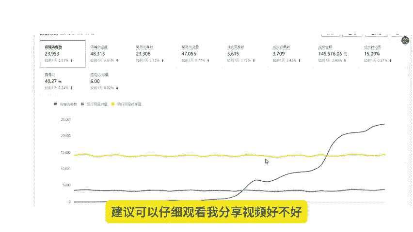
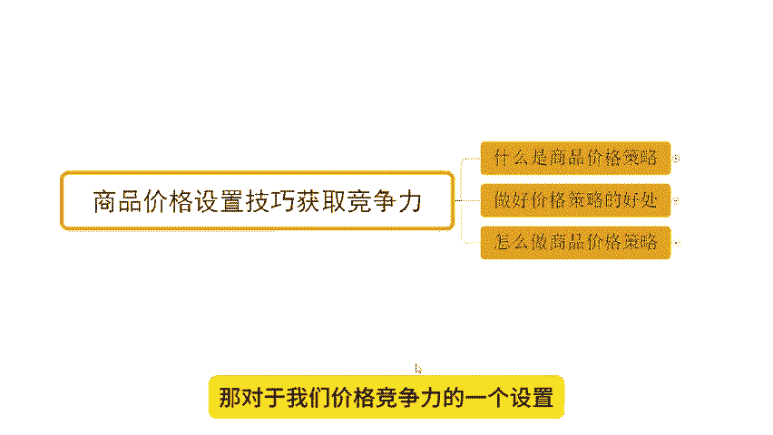
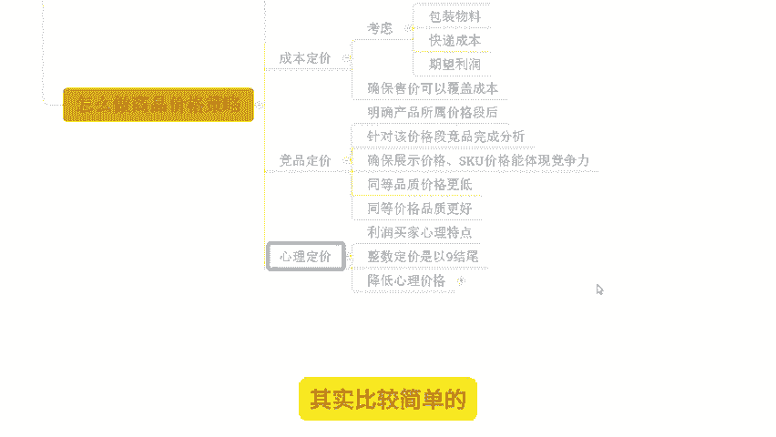

# 【拼多多运营】2024目前最新的拼多多开店新手教程！每天30分钟，零基础电商运营快速起店，实现日销千单！ - P7：07 拼多多价格设置技巧获取竞争力 - 拼多多-运营 - BV1812mY6EFh

hello，大家好，我是谢楼。今天给大家分享内容呢，是我们拼多多新手日销签单报单实操玩法中的商品价格设置技巧，获取竞争力的一个玩法啊。在分享之前呢，老规一矩而且给大家看一下近期跟着他小伙伴的店铺数据。

好不好？OK可以看到像这个店铺呢，原本访客呢在3000左右。那么其实这个店铺访客达到300已经很长时间了，而且一直陷入一个瓶颈啊。后面的话确实他自己操作呢有点。😊。

把控不了，对吧？选择跟他一起实操。那么跟实操之后呢，那我带着他一起呢做了我们产品的这个定位啊调整啊，做了我们产品布局调整，包括是我们的SQ调整啊，也完成了我们产品的价格的一个调整啊。

那么操作之后可以看到整体的访客是在不断的提升的，为什么？因为商品的转化拉升啊，可以看到到后期的话一天的访客呢从原本的3000左右干到了14000啊，一天的订单呢是2000多单转化率呢14。67啊。

非常不错的一个数据啊。除了这个店铺还剩这一个也是啊一个老店铺啊，可以看到访客卡在2000多3千不到的样子卡了很长时间啊，同样的通过了产品的SQ调整跟价格定位调整之后呢，那么把转化率往上拉之后。

访客开始提升啊那么在一波小的爆发之后进入了一个小高潮，对吧？后期呢也在不断的增长啊，那么从原本的3000不到的一个访客呢做到了1000一天订单1700单转化率呢10。

。25啊也非常不错的啊。当然呢这个操作玩法啊，我说一下，它不仅仅说只是适合于我们在后期去调整产品转化，进续拉竞争竞争力啊。在我们前期新品操作策划的时候一样的可以做的啊，可以看到像这个店铺对吧？

那么其实我们在一开始上架商品之前也去把这些啊价格的布局呢等等这些东西提前做好的啊，做好之后后去操作呢，我们也可以更省力一点啊，好不好？那这些店铺呢也都是通过自然流的玩法再操作啊。

而这个价格定位的一个策略玩法呢，其实就是我们自然流的最起码的一个操作，大家需要去了解清楚。如果说你对自然流操作玩法有兴趣，想要了解的话，O建议可以仔细观看我分享视频好不好。

店铺运营呢对于我们很多的这个新手小白来说呢，肯定会有很多的困难的啊。如果说店铺操作方面有问题需要资料的，可以找我。有时间的话呢，我也可以带着大家一起去实操坐店啊，就像这小伙伴一样呢能够有到更好的方法。

让我们店铺呢做的更好，好不好？那对于我们价格竞争力的一个设置，我们来看一看啊，怎么去完成它的。首先第一个什么是商品价格策略啊，这个可能是大家在日常运营过程中会容易忽略的一个地方啊。

所以呢今天也给大重点聊一了这个话题。那么首先第一个点啊，那商品的价格策略呢指的是为了更好的吸引我们消费者啊，吸引我们的买家提升我们商品的转化啊，来进行我们商品的展示价跟我们商品的SQ布局的一个规划啊。

那么这里呢就两个概念，一个是我们的展示价格，一个是SQ价格啊，那展示价格呢就是我们商品在搜索结果页首页等外路页面进行商品展示的一个露出价格。

。啊，而SKU价格呢就是我们用户点击了我们链接进入之后，在我们内部规格的实际销售价格啊是这么个东西啊。那么这个东西呢是我们在后期进行产品经营的时候呢，必须去做的一个事情。

那么有了这些东西才能更好的完成产品的价格引导啊，能够去进行转化，能够达成上面的一个销售，是这样子，那如何去做好我们价格的策略呢，对吧？价格作业策略做好之后，有什么好处呢？来看一看。

首先它可以帮我们精准市场定位啊，怎么定怎么精准呢？首先我们的露出价格啊是可以帮我们产品完成价格定位的。

那么露出价格呢是可以帮我们去获取到对应价格人群的一个展示，对吧？那精准的定位到能够去呃展示到这个对应的展示人群。然后呢，他们会对我们的产品呢带来更好的点击啊转化率会更高。

同时呢会对不同的人群呢进行价格分成啊，那么我们在进行价格设置的时候呢，可以针对到不同的需求价格来完成链接发布啊，能够从而通过它覆盖到更多的市场，更大的市场。换句话说，同样的商品，我们可以做不同的价格。

不同的规格，完成不同的人群定位啊，是这样子的那同时呢我们可以增加竞争力啊，这就是价格策略的另外一个好处啊，那么怎么去增加竞争力呢？就是我们的露出价格，对吧？当我的露出价格更低的时候。

这个时候呢在首页在我们的搜索结果页呢，就可以有到更好的吸引力。用户可能点击我们的概率会更高。

从而带来更多访客啊，这就是我们啊价格策略做好之后的一个好处啊，那怎么去做呢？来看一下，首先呢价格分为很多种啊，第一个呢是我们的市场定价，我们需要搞清楚这个东西的啊，那市场定价是什么呢？市场定价就是我们。

😊。

市场的需求和消费者的喜好。爱情区分的。那么我们需要怎么去区分呢？其实我们非常简单的一个套路啊，我们可以找到各个价格段的一个销售情况。比如说今天我要去做一个产品啊，我要卖一件衣服。

那我去搜索这个衣服的关键词。我把销售靠前的商品呢通通的给记录下来，然后进行一个价格的划分，对吧？哎，1块到50的有多少，50到100的有多少，100到150的有多少，150到200的有多少。

然后再具体的每个区间再进行细分，对吧？哎，那50以下的话，哪个价格段的销售是最多的。找出来，注意注意啊，这个是外显价格啊，这个是外显价格，找出来之后呢。

我们再通过这个东西来确认好我自己要去经营的一个对外露出的价格段。

那么在这里面呢来保证我们后续获客的一个呃市场份额，对吧？那么对应的展示的价格呢，一它销售越多，一定是这个价格段啊，它的销售人群更多的对吧？同时呢我们还要干嘛呢？我们要去搞清楚我们的成本啊。

通过成本来考虑我们的定价啊，考虑到我们产品的成本包装物料，我们的快递成本对吧？还有期望的利润等等。那我们最终的这个产品销售价格呢是需要覆盖到我们的成本的啊，需要覆盖他的啊。

那么同时呢我们要对我们的竞争对手来进行一个这个竞品的一个定价啊，我们要确认我们所属的价格段啊，通过第一种方式啊，市场价格市场定价。

确认价格之后呢，针对到这个价格段的的完成分析啊，我们要确保我们在对应的所谓的目标价格段里面，我们的产品展示价格和SQ呢能够体现出足够的竞争力。同样的品质呢，我们要有更低的价格，或者同样的一个价格呢。

我们的品质要更好才能够什么呢？带来一个竞争优势啊，那么这个时候我们后期操作的时候呢，有到一个更好的数据啊，然后最后呢就是我们的一个心理定价法。

心理定价法呢其实比较简单的就是利用我们买家心理特点啊来完成定价。在我们进行价格设置的时候呢，比如说我产品要卖10块钱，哎，那我设置成9。9块对吧？那我整数的定价的时候呢。

我以酒来结尾啊来消除一个呃相当于让人觉得啊比较比较实惠的一个状态啊，那么不是说就另外一个层级对吧？9。9它也是几块钱对吧？10块钱的话它就是它就是多块了？

两个概念啊两个概念啊那么然后再一个呢就是降低我们的心理价格。😊。

谁的心理价格，顾客的心理价格嘛，对吧？这个东西呢，其实跟我们刚刚说的这个呃以九结尾的方式其实一样的啊，就是说我能够在价格设置的时候呢，把它往更低档来进行操作啊，我把它从10块做成9。9块。

把它从20块做成19。9块啊等等这种方式。OK搞定啊，这就是我们的呃价格定位的一个一个技巧啊，一个技巧。那么在这个过程中还有到一个非常非常重要的一个点啊，在这个地方我要重点提醒一下，就是我们的产品的。

😊。

实际售价啊，它要加上我们的什么优惠券，再去乘以我们的活动折扣，才是我们的拼单价啊。那么这样去操作呢，后期我们在设置的时候呢，会有到更好的竞争力。比如说什么呢？比如说我们在做优惠券的时候。

如果说我的优惠券金额比较大啊，超过了呃整个产品的50%。这个数候你是法发布的。但是我们可以通过啊让我们的产品的呃拼单价做高去设置一个优惠券，然后再来设置折扣来形成我们最终的一个结果啊。

比如说我举个例子吧，今天我要去做一个优惠券。这个优惠券呢我要设置成这个5块钱啊，我要设置成5块钱啊。但是呢我的产品只有8块钱。

那我设置5块钱的优惠券呢，我就不能去发布这个这个价格了，对吧？不能去发布这个价格了啊，因为8块钱你是无法设置5块钱的优惠券的那怎么办呢？我就把我的产品价格做高做多高呢？哎，我直接把它做到，比如说。😊。

20啊，比如说我直接把它做到20啊，比如说把直接做到20，然后我再去设置一个5块钱的券，这个时候轻而易举对吧？轻而易举。然后我希望我最终卖的是8块钱的话好。

那么我最终的一个这个8块钱减去5块钱的券话就是3块钱？3块钱啊那这个时候干嘛呢？再去通过活动打折把我的20块的这个这个这个金额啊打折打到8块钱去。这个时候呢我的5块钱的券能够生效，并且能够发布啊。

那么这个时候呢我既能够得到活动推荐又能得到优惠券的一个推荐啊，就可以得到双重推荐是这样子的。所以我们的整体权重呢也会更高啊，这就是我们价格设置的一些小技巧啊，能够得到更好的竞争力的一个小技巧。好吧。

那通过这些操作呢，我们整个商品的点击和转换就更高像你们看到的这些产品对不对？的小伙伴他们的数据为什么能够从几千访客标了1万多。

能够没有什么太多的数据做到一天2000单一天这个1000多单一天3000多单。😊。

🎼来的啊，那如果说你在整个操作过程中有哪里不清楚的，或者有需要资料的，可以找我。确实自己操作过程中无从下手，不知道怎么去玩的，也可以找我跟你一起实操。好吧，那么呃像这些小伙伴一样呢。

我们一起能够遇到更好的方法之后，让我们店铺呢做的更好，好不好？OK今天的视频呢就到这里结束，我们下次再见，各位拜拜。😊。

