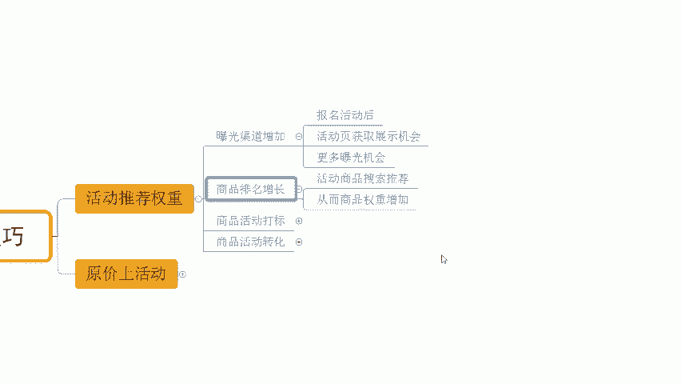
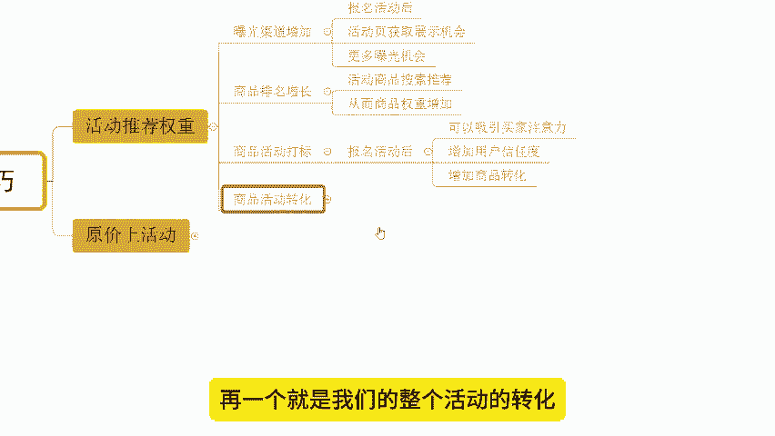
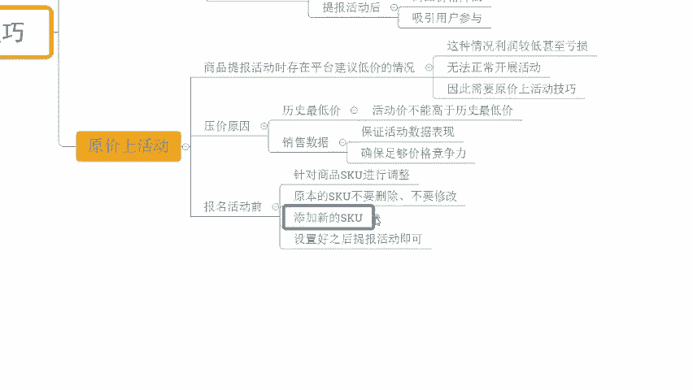

# 【拼多多运营】2024目前最新的拼多多开店新手教程！每天30分钟，零基础电商运营快速起店，实现日销千单！ - P8：08 拼多多运营爆款必备活动提报技巧 - 拼多多-运营 - BV1812mY6EFh

hello，大家好，我是西楼。那么今天给大家分享内容呢，是我们拼多多新手日销签单爆单玩法的爆款必备活动提报技巧啊。那么在分享之前呢，先给大家看一下近期跟着时操小伙伴的店铺数据，好不好。

像这个店铺可以看到啊，原本是一个您访客的新店啊，没有任何数据的。那么在整个经营过程中呢，我们也多次去利用到了平台活动提报来完成产品权重类获取啊。在刚刚上架的时候呢，我们通过活动提报完成价格定位。

当我们完成了前期的基础操作之后，再一次通过活动底报获取到了平台推荐权重，实现了访客的提升。那么在这个过程中呢，也不断的在利用活动来实现多次的平台推荐。那整个过程呢也是我们正常的暂流操作的一个玩法啊。

那么这个玩法呢也不仅仅说只是局限于我们的新店新品。然后店铺老链接同样可以使用的啊。像这个店铺一个老店铺，一个老链接，对吧？那我们通过整个的操作也是可以得到一个非常好的数据增长的啊，可以看到前期的话。

访客只有2000多30千0不到啊，那后面的话一天访客呢做到1600，一天订单呢是1700多单，转换率10。25%啊，还有像这个店铺可以看到啊，原本的访客呢在3000多3千出头，对吧？

那跟着实施之后呢，一样的啊，通过活动的玩玩法来完成的商品的一个推荐权众获取啊，访客也在不断的提升。到后期的话，一天访客是14000啊。那么订单的话，一天是2100多单啊，转化率14。

67%也是非常不错的。如果说你想知道如何通过自然流，如果通过活动来打造产品的推荐权众来打造爆款，OK建议可以仔细观看我分享的视频，好不好？

那店铺操作呢对于我们新手小白来说呢，肯定会有到很多的困难的啊。如果说对于店铺操作，你有遇到什么问题啊，有需要资料的呀，OK可以找我啊。那么有时间的话呢，我也可以带着你一起去操作店铺，就像这小伙伴一样呢。

能够有到更好的方法，让我们店铺呢找到更好的一个数据，好不好？OK那活动推荐权众到底是什么，怎么获取呢？来看一下啊。首先。

活动推荐节奏呢，它可以帮我们去。这个在曝光渠道上进行增加啊进行增加什么意思呢？可以看到。首先第一点啊，那报名活动之后，我们商品在活动页是可以有到展示机会的。

这个展示机会呢是给到我们整个商品的啊，知道吧？所以它可以得到更多的曝光的一个机会。比如说我去报了这个9。9块特卖的一个活动啊，或者我报名的秒杀的活动啊，或者我报名的其他的一些平台大促活动等等啊。

只要我报名的活动，那么这时候呢在活动页面我们都是可以得到更多推荐的啊。那么我们是有展示机会的。如果说你不去报名这个活动，那保险啊在对应的渠道你是没有曝光的啊。

所以说我们报名活动呢可以拓展我们的呃展示的渠道啊。同时呢我们上面的排名是可以得到增长的。😊。

什么意思呢？来。在进行商品展示的时候呢，我们活动商品它是被搜索推荐的啊。那么比如说原本呢我们商品可能展示在100名，因为我报名的活动，这个时候呢有到活动的推荐加权。那么你的展示排名呢就可以更靠前啊。

当然我们可以换一个说法，如果说有两个商品。你们的商品权重是一样的，其中一个报名活动呢，另外一个没有报名活动OK那么这个时候呢，有报名活动的商品呢就会优先展示。啊，通过这种方式呢。

我们就可以得到更好的产品展示，得到更多的推荐加权啊，它就可以带来更好的数据。

同时呢我们还可以得到一个活动打标啊。这个东西呢根据不同活动它是不一样的。当我们报名活动之后呢，我们商品呢就可以得到对应的一个活动达标的标签啊。那么这个标签呢是可以更好的吸引用户的注意力的。

比如说我们在搜索结果页对吧？你有某某活动。那么你的你的标题前面呢会有到这个活动的一个标识。那么很醒目很显眼啊，用户呢可以更加的容易看到你对吧？同时呢也可以得到更多的用户的信任啊。

也能够带来更好的产品转化啊，因为我们报名活动呢对吧？平台这个对活动考核，对这个用户的一个心理把控也会更好一点啊，他所以说在信任度啊在转化上都有帮助的啊，再一个就是我们的整个活动的转化啊，有所提高啊。

那么用户呢它的一个这个价格敏感度是很高的。😊。

拼多多本身就是一个用户对价格敏感度很高的一个平台，对吧？所以这个时候呢当我们报名活动之后，哎，我们的产品呢是有真正意义上有时间降价啊，并且这个价格呢是有具备一定竞争力的话。

那么这个时候就可以吸引大量的用户来参加这个活动啊，实现我们的购买啊，得到更好的销售数据对吧？像我给你们看到这些小伙伴吧？人家为什么说从零访客干到一天1万多访客差不多不？干到一天10多单哪里来的？

就是这么来的啊，当他能够通过活动的方式获取曝光的时候，能够得到更好的转化的候那么离成功就很近很近不会太那么在这个时候呢我知有小说你确实说的没错，确实报名活动是可以得到很好的数据反馈。

但是报名活动呢平台会卡价格会给到很低的价格，对不对？所以这时候我们就需要一个操作叫做原价上活动。😊。

那么平台报名活动的时候呢，价格很低的这种情况呢是非常非常正常的一个情况啊，是非常常见的一个情况。那么这种情况呢会导致我们的利润比较低，甚至亏损。所以说很多时候就会觉得没有办法上活动啊。

所以这个时候呢我们就需要。😊。

原价商户中的技巧啊，那么原价商户中的技巧如何去实现呢？我们首先就得搞清楚平台压价的原因。

首先第一个历史最低价。如果说我们的产品在前期有过更低价格的销售，那么这个时候呢，平台在进行活动考核的时候呢，就会要求我们的价格不能高于历史最低价，所以说会压价啊，这是第一种情况。

第二种情况呢就是我们商品在呃前期的一个呃销售数据啊，在前期的一个销售数据啊。

它会影响啊，那平台为了我们产品在活动过程中有到更好的数据表现啊，就会确保我们产品呢是有足够的价格竞争力的。如果说你在整个的商品啊过程中。进行考核的时候，发现你前期的价格呢不具备竞争力，产品转化很低。

可台就会压你的价啊，直到他认为合理的价格啊为止。所以这个时候呢就会价格打到比较低一点啊。那么这种情况之下呢。两种考核原因其实都是我们的历史数据。导致的。是吧。那怎么办？OK在这种情况之下呢。

我们就可以在报名活动之前做一个动作，就是针对到我们的SQ进行调整。

这个调整呢怎么调整呢？原本的SQ不要去删除，不要去修改。因为你删除修改呢会影响商品的权重啊，所以这个时候新增SQ啊，新增SQ新增SQ呢。

我们把新增的SQ通过它的这个目标活动价格来进行反推推出它的最终的拼单价啊，一般活动折扣呢，我们建议是5到7折啊，所以这个时候呢比如说我要卖10块钱的产品，我准备活动打5折，那我的拼单价我就先设置20块。

如果说我们要去做优惠券的话，我在20上再把这个优惠券金额加进去，或者是我在打完折至基础之上再把它加上去啊就可以了啊。那么这个时候设置好，我们就可以正常报名活动了。而我们原本的SQ呢就把它下架就可以了。

注意是下架不是删除啊下架啊。那这个时候呢我们在报名活动就报名新的SQ而这Q没有历史低影响也没有历史销售数据的影响，就不会被比价。当前提条件是。😊。

🎼SQ呢我们做好了防比价的操作啊，就会导就会给到我们一个正常的价格去提报活动。正常来说是9。9折都可以报啊。但是我们把折扣打第一点，它的通过率会更高。一般5的7折啊就可以了。

O那么以上呢就是我们爆款必备的活动提报技巧啊那整个操作呢会相对来说更多需要去实操。如果大家对操作方面呢有什么问题呀，不清楚的地方呢，你都可以跟我交流沟通哈。还是那句话，如果说你自己的操作过程中呢。

觉得确实自己能力不够，做不好店铺需要有到一个指导的话，可以找更多实操。像这小伙伴呢，带一起去玩，可以有到更好的方法，让我们店铺呢做的更好好吧。O那么今天的分享呢到此结束，我们下次见各位拜拜。😊。

