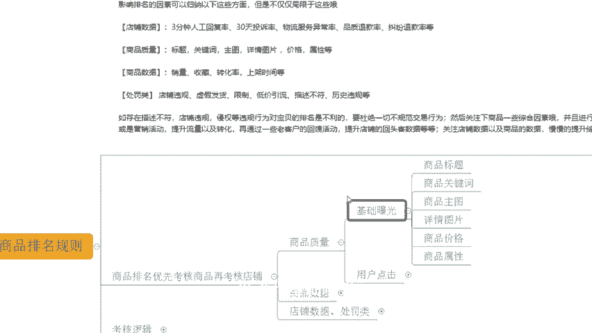

# 【拼多多运营】2024目前最新的拼多多开店新手教程！每天30分钟，零基础电商运营快速起店，实现日销千单！ - P9：09 店铺运营底层逻辑商品排名算法 - 拼多多-运营 - BV1812mY6EFh

hello大家好，我是西楼。今天给大家分享的内容呢是我们拼多新手日销签单报单实操玩法中的运营底层逻辑商品排名算法的内容啊。

在我们店铺运营过程中呢，如果说你连算法都不清楚，你连排名方式都不知道的话，你想做好店铺，我觉得是很困难的，是不是？那么在分享之前呢，我们就还是拿回去先来看一看，清期跟着我实上的小伙伴，他们的店铺数据。

好吧。那可以看到像这个店铺呢，原本访客呢在3000左右，对吧？那跟着实效之后呢，通过了产品的结构调整，通过了我们商品的SQ调整。那完成了我们商品的转化提升。当我们转化提升之后呢。

整体数据也在不断的增长啊。那么在后期呢也通过了不断的来获取到平台的活动推荐等等操作方式。那么访客最终呢从原本的3000左右做到了16000啊。那么一天的订单呢1700多单转化率10。25%啊。

非常不错的。那除了这个店铺之外呢，还有像这个店铺啊也是一样的啊，可以看到原本的访客在3000多啊3000多。那么同样完成了我们商品的结构调整完成了我们商品的Q一个调整。那通过转化的优化啊。

达成了我们数据的增长到后期的话，一天访客呢做到了14000一天的订单呢是2100多单。那么转化率呢14。67%啊也是非常不错的啊。当然除了像这种店铺之外呢，一些零基础的新店啊。

可能实操也是能够得到很好的数据的。可以看到像这个店铺原本的访客呢是0啊，没有任何数据的。那跟实操之后呢，通过了我们产品的分析完成的商品定位结合到我们商品排名的这个算法啊。

完成了商品数据权重考核在经过一段数据累积之后啊，访客呢也在不断的增长，到最后呢一天访客呢9000多将近1万啊，一天的订单呢是1200单啊，转化率13。27%也是非常不错的。

那么这些店铺呢也都是通过自然流的方式操作的啊。那如果说你想要通过自然流的方式来操到店铺，想要知道如何通过自流来达到爆款的话，O这样也可以仔细观看分享视频，好吧好。

那么店铺运营呢对于很多的这个新手小白来说呢，可能会有到很多的困难啊跟问题啊。那如果说在店铺操作过程中，你遇到的问题或者有需要资料的，可以找我有时间的话呢，我也可以在这里一起去实操做店啊。

就像这些小伙伴一样呢，一起能够让我们店铺呢有着更好的方法达成到一个更好的数据啊，OK的。那么关于我们运营底层逻辑商品排名的算法呢，这里呢其实更多的呢就是了解清楚我们规则的一些内容啊。

那么首先我们来看看规则重要性啊，那规则重要性呢，其实不言而喻啊，无规矩不成方圆嘛，对吧？那么对于我们商家来说呢。

规则啊，他是可以更好的激励商家的。什么意思呢？那像我们的排名规则，对吧？它是可以促使我们的商家来形成竞争，优势劣汰嘛，对吧？能够有到更好的数据反馈，能够达成更好的排名的考核标准。

那么这个时候你的排名更靠前。那么你呢也会为了达成这个数据呢来不断的努力努力什么呢？努力达成更好的商品服务，来达成更好的商品质量，得到更好的商品数据啊，所以呢他可以促使我们的商家达成一个竞争关系啊。

而这个竞争关系呢是为了更好的服务而存在的。😊。

那除了之外呢，对于我们的用户对吧？消费者啊，那么规则呢是可以提高我们用户的体验的啊，为什么要这么说呢？OK。首先。😊，那么通过排名规则来完成平台的商品考核，对吧？

这个时候呢能够确保我们的用户在搜索商品的时候呢，能够快速找到一些高质量受欢迎的商品啊，这个时候呢用户再进行购买的过程中，不管是拿到商品之后还是购物过程中的一些体验，往往会更好。因为不好的商家。

不好的商品肯定会被淘汰掉，对吧？逐步保留的呢都是一些优质的商家，优质的商品啊，那么再来说一说，对于平台，那对于平台来说呢，我们能够有到更好的规则。那么它是可以提高我们平台的影响力的对吧？

首先呢他能够让我们的买家得到更好的产品，得到更好的购物体验。那么这个时候呢，我们的市场体量就会更大，市场占有率也就更高。同时呢为我们平台呢也能够创造更高的价值。

那么能够吸引到更多的投资者能够吸引到更多的优质商家来形成一个更好的良性循环啊，这就是规则。

啊，这个规则。那拼多多的商品排名规则到底是怎么样的对吧？平台算法到底怎么样的那我们如何去了解清楚平台的这一个运营底层逻辑是什么，来看一看。

针对到我们的商品呢，平台是有考核标准的。那么这一段呢是平台针对到我们商品考核的一个具体的说辞，对吧？

平台类目商品的排名是按照一段时间的商家商品上银时间、销量、价格、质量、售后、商品评分等综合因素排名更新的。注意啊，排名的因素呢可以归纳为以下这些方面，但不仅仅局限于这些哪些方面，四个考核内容。

商品啊质量、商品数据、店铺数据，还有处罚类啊，还有处罚类。那么平台呢会针对到商品进行考核商品排名呢，就会考核到我们的店铺数据对吧？那么它是优先考核商品，再次考核店铺的啊，这个过程这样子的啊。

那么这里呢我们来说一说商品质量。

商品质量呢它是基础曝光的一个体现啊。那么当我们产品进行发布之后，平台呢就会根据我们商品的标题，商品的关键词，商品的主图，商品的图片啊，详情图片啊，包括价格还有属性等等来进行基础曝光。

为什么呢？因为我们商品的价格和属性会圈定到消费人群啊，那么我们产品的标题呀、主图啊、关键词啊，它又能够去呃为我们进行更多更加精确的一个推荐啊，那么你的图片是原创的产品权重会更高。

其实这个东西之前有提到过，对吧？所以这个时候呢平台会针对到我们的商品质量完成技术推荐。而这个时候呢，用户呢可能在这个基术推荐技术曝光的情况之下呢，会形成点击啊。

那么这个时候呢就会得成我们的点击率点击量啊，包括说我们产品呢还会记录下我们的搜索热度啊，这是我们曝光带来的啊，包括带来的。

那么这个时候如果说我们数据表现更好，我们点击率更高，平台也会认为说我们商品呢受欢迎程度更大，对吧？用户更加喜欢我们产品，所以说也会给到更多推荐啊。同时呢在我们的商品数据里面呢。

在我们新增的这个技术曝光之后呢，就会开始我们后续的商品数据考核啊，包括我们的销量啊、收藏啊、转化率啊、剩下时间等等的考核。那么考核到我们产品点击的后续的反馈啊，那你的产品呢有能够拿到多少的订单。

能够拿到多少的销这个销售额能够达到多少客单价，UV价值是多少，同品生长率是多少等等啊，都包含在销量里面的。那么这个时候再来次进行我们商品数据考核啊。

那么表现好的转化高的客单价高的能够有到更好成交的一个金额的对吧？UV价值更高的，流量利用率更大的好，排名更靠前啊，以此类推。那么在这个基础之上呢，还会考核到我们的店铺数据。还有我们的处罚类啊。

什么意思呢？店铺数据和处罚类呢包含了很多很多东西啊，像我们的3分钟人工回复率啊，30天投诉率啊、物流服务异常率啊、品质退款率、纠纷退款率、店铺层级、DSR评分，包括我们的店铺违规等等啊。

都是属于我们的店铺数据和处罚类的。如果。你的这些数据不达标。那么这个时候呢，平台就会减少你的曝光，降低你的曝光的起点啊。换句话说呢，哪怕你的商品数据做的最好，哪怕你的商品的质量做的最好。

哪怕你能拿到最大的平台推荐。但是因为你的店铺有处罚。因为你的店铺数据不达标，也会减少你的曝光范围，导致你的曝光受限。所以平台呢会优先推荐一些更加优质的商家和优质的商品。那么这也是我们之前提到过的平台。

它对于我们呃进行规则算法的利用，加以运用之后得出的一个竞争环境的一个状态，是这样子的，好吧。

那么我们来思考一下啊，考核的逻辑。

在我们的产品进行系统曝光的时候，OK这是一个坐标系啊，中间这个原点是零，往左是负数，往右是正数啊，往下是负数，往上也是正数。那么中间这条线呢考核的是我们的商品质量，竖着这条线呢考核是我们的商品的数据啊。

如果说今天我们的商品质量，还有我们的商品数据做的最好。OK那我可以覆盖到最大的曝光范围，也就是红色这个框子。

没错，就这个啊就这个。但是如果说今天我的商品。

受到了店铺违规，受到了店铺数据不合格，他的起点就会往下往斜下两方面去走啊，如果说店铺的。

这个数据不达标就会往下走啊，直接往下走啊，从这个最初的这个原点往下走啊。那么如果说我们的店铺是有违规的，那么就会往左下方走啊，它会把我们的高度跟宽度统一减少，最后呢得到的一个黄色色块啊。

这一个大小就是我们最终的最大曝光范围，对吧？受到影响就变得很少啊，原本是一个整个红色的在上面这个右上角最大块的一个范围啊，现在只有黄色这一小块，为什么？因为我们店铺有违规，我店铺的数据不达标。

所以说对于我们店铺来讲，如果你是一个新店啊，你可以不用考虑店铺数据跟违规，你可以正常操作，因为它的曝光是最大的对吧？但如果说你是一个老店铺啊，那么你在操作商品的时候呢，一定要注意维护好你的商品数据。

店铺数据处罚类，不要有违规店铺的考核一定要达标评分要做好，只有这样你才能有机会拿到更大的曝光，拿到更多数据，好吧。

🎼OK啊，以上呢就是我们关于我们的呃商品的排名算法的一个分享啊。大家清楚知道哪些地方是我们的考核项目之后呢，针对性的去运营就可以了。如果说在操作过程中确实不清楚怎么去玩，怎么去操作。O的。

有问题呢也可以找我啊，包括说需要资料的也可以找我啊。还是那句话，如果说自己确实做店不会做，想要去做好店铺，O也可以考虑找我跟一起试操作店啊，就像这小伙伴一样呢在着里们一起有到更好的玩法，操作店铺。

让我们店铺呢做的更好好吧。O那么今天的分享呢就到这里，我们下次再见。各位拜拜。😊。

