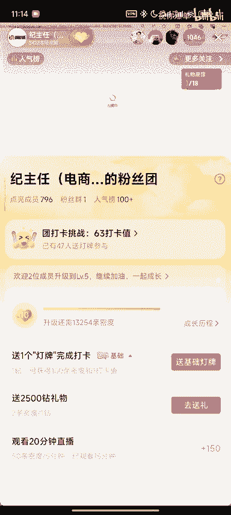
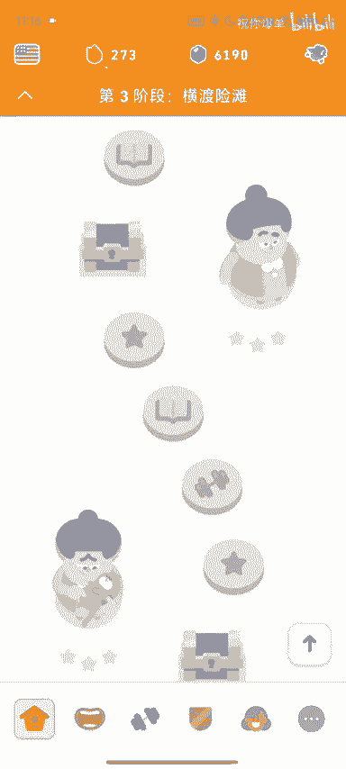
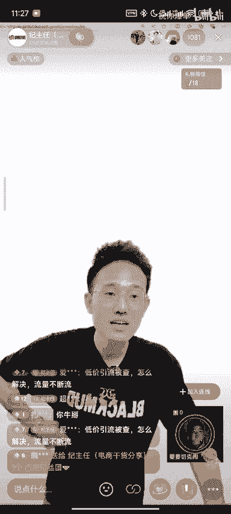
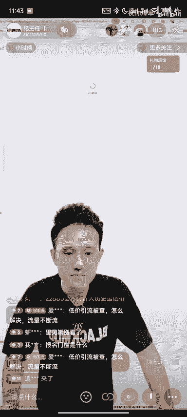
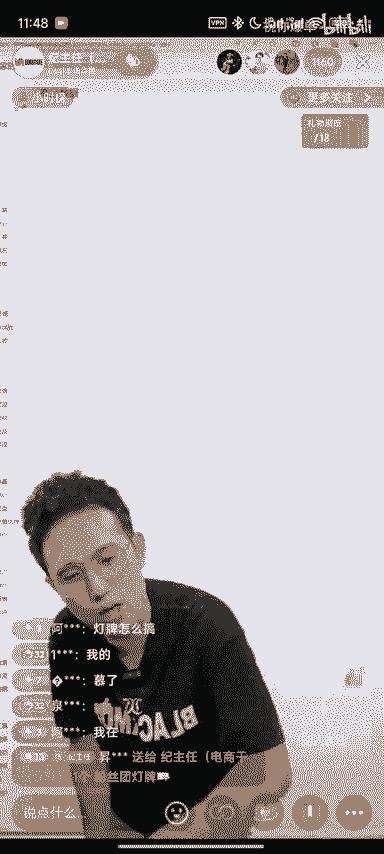

# 【拼多多运营】一上来就开成交出价，属于傻逼行为！纯给拼多多送钱！ - P1 - 祝你爆单 - BV1NxxceKEiF

机当断流了，你就搞一下10个流量，然后流量进来之后，咱是不是可以取消这个链接现在是有大促误的。哥们，不对，这个链接，现在是直接秒杀标啊。😡，这个链接现在是有秒杀标啊。😡，现在是直接有秒杀标的10个库存。

你秒不起是吧？屌流量没有哥们，你连你连流量都没有，你花钱，哥们今天花1块钱买了你一辈子的曝光，你知不知道啊？😡，到啦。哥们，今天花了1块钱买了你一辈子的曝光，你天天只会开一投产，你做什么拼多多啊，兄弟。

😡，你在说屌子了没有哥们，你说对不对？我在那里用1块钱买很多的曝光，进来之后可可以取消取消了嘛，现在就没有了嘛，对不对？听懂的兄弟扣个6。😡，我最烦，我教你东西，782不要不要，你做过没有？😡，啊。

你做过没有，气死了。我花了10万年，我能买你命了干嘛啊？😊，是不是哎呀，对不对？😊，简单了没有，是不是？这个东西就是这么操作的啊，那看你怎么用。😊，看您怎么用，哥们，这个活动有非常多组合的打法。😡。

对不对？OK那么今天我也发一下抖音视频，我说如果你们玩的是应记。😊，如果你们玩的是应急的玩法。😡，玩的是应记的玩法，然后玩的是低客单产品，想要玩高投产的。

其实很多人亏钱的最多的时候是容易在前期的人启动身上。你要想你一单的客单价，可能像这位哥们，可能一单的客单是30块钱。他如果玩低价玩高投产，他可能最多毛利纯利是5块钱左右。但是这个世界上有5块钱的车吗？

可能没有5块钱的直通车，对不对？他最低每笔成交花费，他30块钱高低，可能前期去入职的时候，也要花个十几块钱，但如果他今天花了100块钱的直通车，是是裸动的投资进去的。

那他可能花了1000块钱只能出100单，没毛病吧。因为他可能只他一单的每笔成交扣费是10块钱，所以你可以到可的确可以选择这种呃，成本价或者成本价加一点点的方式先把链接流量给他拿过来。

到时候在你该开车还是该干嘛再说一个链接，如果你前期能启动速度太慢，对于现在版本的拼多多真的很难做。😊，知道吧？希望可以帮到你们好不好？这个东西我们就讲到这个地方啊，我们这个东西就就就讲到这个地方。

好不好？那么我们接来还是整断，好不好？什么时候取消啊？哥们刚刚讲你不听，那你只能等下一波，好不好？😊，我说了这个东西就会有下一个说了这个东西就有下一个没听懂你来没听懂，没有关注我，你怎么会听得懂呢？

是不是？😊，没有关注我，你怎么会听得懂呢？😡，对不对？你没听全，你怎么会听得懂呢？所以你玩来了，对不对？来，兄弟们来，我们有请今天第一位追磨人。😡，有请今天第一位追梦人。😡。

这听不懂有这个这这个这这个听不懂，有点是有点危险了。来，走马，等会儿可以再讲一下，因为我我也才刚开播10分钟，刚好啊，知道吧？我刚好才十分钟，这个玩法你可以随便操作啊，是是是是是是是可以组合的。

理不理解啊，来，这位兄弟在哪里呢？三单说实话有点不是很想看，为什么呢？这个店铺很垃圾。😊，为什么说这个店铺很垃圾呢？第一个。😡，我第一次看到。就是。做了好久的店铺重新做，然后拿这个店铺。

去去去去去起新链接的哥们，你倒不如重新开个新店，这一看就是老店新做，但是是拿个垃圾老店来新做的这个店应该很久没单了。😡，信不信？这个一一层级，你连二层级都没有，你好歹。😡，有人四颗星的店铺。

他好歹可能二层级三层级，你这个一层级都四颗星店铺，这怪难起的。哥们，我们但是你连上的是第一个，我们可以看一下，但这位兄弟如果不在的话，我们马上换下一位兄弟了。因为我们好多兄弟在等我看他的店铺嗯。😡。

43。2。一我们换下一位追梦人啊，来下一位追梦人。准备找我待运营了，哥们别准备了，好不好？我们代运营排到america去了啊，哥们，节后再找我们待运营，这要排队，待玉先排队，你别准备了，哥们，节后再说。

你先去玩好不好？来，我们来看这位兄弟是做我们什么星的，这个是今天第一位哥们。😊，这个第一位哥们是什么产品呢？啊，什么东西？五金啊，五84不通过什么原因？五八是不通过是因为你的品没有GMV，没有过自信度。

😡，啊，就这么就就这点东西啊，来，我们来换下一位兄弟。😡，接受哎，这位哥们是L同学，对不对？我们连一下这位L同学。😊，怎么说？😡，喂，你好，哎，这个美女是吧？你好。😊，呃，主任。

你帮我看一下那个直通车第一个链接呗，看是可以看。怎么说呢？这个地你什么玩法告诉我一下强付费，强付费那个也只能打强付费了，那同行基本都是在打强付费是吗？对。😊，第一个第一条链接。

对我这个如果开那个搜索的话，就是最低出价也是有流量的。嗯，但是我想给他开那个全站全站。单量上不去，开全站的话，你在上面点了个4个，就商品推广告嘛？你喝酒了是吧嗯。搜索在哪里呀？😡，呃，不是搜索。

就是那个成交出价嘛，哦哦哦成交出价是吧？然后呢，我现在出价是4。15块，我现在是有单量的，但是嗯我想给它转成全站推广啊，全站推广的话，我可以就是少出价我懂你的意思，你现在转成投强比，是不是啊。

对对对啊呃，你的利润率多少呢？😊，呃，50以上吧，50以上，那这刚好保个本啊啊。呃首先我看你的SKU可以吧？嗯，就这个是一个很老的链接了，对吧？嗯，对，好几年了，我这个报过很多次单了，报过很多次单。

它评价数多少？😊。

评价数哎，他有没有明显淡忘记？呃，明显10月1到春节之间是比较旺的，每天大人多吗？就是他这个会定制吗？或者说他会应该不会需求，不会是不？没有嗯，就是家常用的那所以基本上你的每笔成交金额，我看一下。

最近30天的啊，因为因为它有数据的，每笔成交金额都是在13。88块。那么你这个链接最高的S档SKU的档的话，SKU占比最高的是在中这在在10米的这个里是不是嗯，对，10米到14米这2个SKU当中。

对不对？对。😊，好，那么这个的确是合投产比的，它不适合成交出价。那如果你今天如果你今天的这个这个成交出价是把广告费给它控在这个地方的。你这个4。15块啊，呃，属于你这个链接，是老链接。

如果你是今天随便做了一条新链接，你就用成交出价去跑啊，也是起不来的。然后第二个我纠正你一个问题，就是你有一个很大的问题，就是你前面上来就跟我说搜索和权站。那么你是属于很老的商家，我可以理解。

但是现在是商品推广成交出价不是搜索。😊，RY不是全杖，他们都是属于盲盒流量黑盒机制。因为现在拼多多，我们可以把它理解为是5。0版本的拼多多。就以现在买的流量，它有可能是搜索的，也有可能是推荐的。

但是90%的都是推荐流量。如果你是老商家，因为你是二开头的链接，应该是2020年上的链接，对不对？那么你这个链接呢，你可以去看一下，原来我们开启直通车，我们都是用搜索OCB叉那个时候去打标签的，对不对？

那么我们开发搜索OCB叉在我们的后台的流量数据这个地方会一个搜索板块流量，这里一个搜索流量，对不对？搜索销售和指数是会涨的。那么也就是说，现在为什么很多人会率刷指数单。因为指数单出来的流量是比较精准的。

但是你现在如果前期直通车打开了，你只会有这个只会有这个不会有这个因为拼多多不想让流量那么精准精准了，它的服务器成本就会比较高。所以所有的平台的不断的大数据的优化。

你不要把你不要再有在拼多多这个平台不要有什么搜索搜索全站的这个热度。😊，交出价就是搜索呢转是的不是的，这个跟淘系完全不一样。多多这里面没有搜索流量。😊，除非个别产品高客单价，它可能是有的那搜索流量。

你可以理解为这转化率比较高，这是第一点。所以这是第二个。为什么要纠正你这个东西，不是因为我很我很喜欢咬文嚼字，这个很危险，就是你很容易前期把就是很容易出现一个错误的情况，就是你这个东西开成交出价去硬拉。

拉完之后转投产比，这不是一个玩法，直通车记住，现在拼多多的直通车，你直接把你成本多少，就是在这个地方我不是经常会跟大家开玩笑吗？成本多少，卖多少钱，然后退货率预算运费险一算上去，然后你随便写一个数值。

这里前前期投产比低的去出价，但是你一定要积累数据，但当链接的数据，比如交易额能够到2000多，然后慢慢开提投产第一档在这里第二档子这里最终是3。4，就是以此类推，每次一次幅度提10。1到0。3。

就是这么简单，拼多多直通车上来就是能跑的就就能挣钱。如果上来是要死亏的，是这。😡，不了钱很简单的，不用想太多，也不要去想什么人群标签。所以我觉得你你有点想太复杂了。

因为我看我现在可以把它开成那个投产比嘛？我想那样开那样开的话，那个每一单的扣的费比较可以。但是我跟你说，你现在如果切换模式。因为你长期的开成交出价，你切过去，它一定会断留两天。😊，呃。

我切过确实是断流了，然后我又切回来了。嗯，但是他断了两天就好了。😡，哦，那那我就硬扛是吧？对，是的，没错，但是那我开的时候放大量的都是投产比，不是成交出价。那么什么时候开成交出价呢？

你还记得我前面问你这个链接的时候，问你会不会容易开大单，会不会容易定制。如果会就必须开成交出价。哦，我知道之前你那个课程讲过对，是的，那我现在明天给他转一下，转成那个可以的，可以的，没有问题。

然后接下来呢我觉得你再就可以去在再上一条链接哈。在上条链接把不出单的SKU不就不要了，我们就优化能出单的SKU在那里做印阳SKU就会好很多。😊，哦，行，那那我想那个开投产比给它放大的话，能怎么放大呀？

呃，投产比放大什么意思？放大首先有机单量放大。当量放大嗯，无非就是降投产，对不对？那我现在明天转的话，错了，降头厂拿到的流量更大。现在的拼多多起量是巨快的。但是很多人在起量的过程中。就是可能今天出十单。

明天出50单了，后天就又回到了十0单三角形的模式起量。就是因为你的链接可能接不住那么大的流量，像你这个链接布局起的的确很快，但可能过个两天就断流了。因为你的SKU很容易被分流走，就被比价。

你打强误会的话，是的，就你这种SKU那如果你是你是起新链接的话，就很容易断流。😊，知不知道？嗯，所以你问我怎么放大，那放放大就是我这边有给个到家一个放量的出价，就前期用这个去怼怼怼单量。

但是你能不能提投产，就看你会不会被别人分流，就看SKU了。😡，K什么情况下可以提投产呀，什么意思？什么情况下可以提投产呀？老快人就提投产，记住这个口诀就可以了。😡，啊，跑快了就可以提投产，这是第一点。

第二个限额，如果限额花超了，也能提投产。呃，我限额给他开的1000多之前，那10千0我就问你一千0要花了多少才可以最好提头上。有时候能画完，有时候画不完。来限额100105绝对能提投产。😡。

那如果你限额200是200，昨天晚上讲过，每次都加加50块钱是吧？对。呃。5块钱不是50，每100是5块。啊啊，对对对，每100是5块。这层这个你们可以自己去看看，是不是这样子的。😡，知道吧？行嗯。

那我那我第二个这个直通车不是第三个，这个好像是被比价断流了，还能拯救吗？我前面两个第三个这个。呃，对，呃，再说一次，主任昨晚没有来哈，你来说一下，我考考你昨晚有没有来。😊，啊，我吗？就是100块钱限额。

如果能够提投产，是能够花了多少的？😡，105，然后1200210就每100会多花5块。这个5块钱你可以分你你们可以理解为，如果你限额100块钱的一条计划，它能够跑到105的实际的预算。那么你是满分。

那么如果是104，你可以理解为是80分。😡，103就60分嗯啊以此类推。哦。啊，知道吧？嗯，好O那这个我还能拯救我们对了，废了啊，这废掉了啊。会议的链接一定要开开心心的去报秒杀。😊，这个报秒杀吗？

对对对对对啊。哦，这个还能洗一下SKU能拯救吗？洗屁呀洗SQ这个东西我跟你讲，洗SQ能拯救的是首先基于你有量这个东西洗SQ可能也才三单。😊，哦，那我就放弃了。我现在第二个卖的还挺好死太久了啊。哦。

行好的，谢谢主持们。拜拜那个那那个那个还有个事情啊，那个工具怎么领啊这个不是这个今天不能这么说了哈哦哦。😊，哦，我知道昨天很感谢你的很感谢你的。😊，这个我今天拿那个算锅，我才知道这个是保本的。

我就放心的开直通车。对，如果真的想要忍不住的话，可以在抖音粉丝群拿。OK对拜拜拜拜啊，昨天被警告了，哥们，昨天被官方警告了，今天我那个错，我账号就出来了，在谢谢大家谢谢大家。

然后是不是很多人找不到22660在哪里啊。😊，哎，追义同学22660怎么报名？是不是很多兄弟今天看到了我，但是我说要报1个22660，但是却发现22660这个东西哎没有了。😡，怎么办？😡，没有了。

那么首先呢。😡，第一步去你报名记录里面已结束的活动，随便先选择一个。😡，对吧。点击报名详情。

然后接下来呢在这个上面输入22660。😡，唉。然后查看活动详情有没有？😡，去报吧。有一点断流的链接，到10个库存就行了。好不好？可不可以？😊，好不好？去吧，兄弟们。😊，大哥，你们能别吹了吗？

虽然你靠这个吃饭的，我我吃靠拼多多吃饭的哥们，你没有说错啊。😊，就喜欢你看不惯我，又干不掉我的样子。😊，来下一位追梦人来下一位追梦人继续兄弟们不懂的可以随便问，好不好？😊，问题。一点。都。

什么都能问好不可？好不好？兄弟们什么都能问啊。😡，对，随便问，不要害怕不要害怕，不懂就问啊，不懂就问OK这个哥们是做什么的？😡，这些哥们做什么的？😡，这个兄弟做什么的？😡，一次性输液加温贴。

一次性输液加温贴，这是什么呢？谁的呀啊，这个是F勾什么东西的，我们来理下这位哥们啊，这个是个验证码是吧？哎，兄弟，你连我。😊。

阴阳SK两个一样的一个高，一个价格低。阴阳SK就大家如果是刚做拼多多来我直播间是情有可原的，不要害怕，也不要管别人说什么，我们大家你上面的他也不认识你，你也不认识他，大胆提问，能得到就好。

得不到就一笑而过不是就可以的吗？在网络的花花世界，你何必那么认真呢？兄弟们，你们说对不对啊？在这里如果你提出来哎，被我看到了，我回答你就ok了嘛，对不对？没有回答到你天天来不就好来蹲我不就可以了。

是不是？😊，你好。你好你好，主任大点声哥们。😊，哎，你好你好，我有点耳背。😊，没有。主任，你看一下我这个我这个他后边要怎么做啊，是应该转投产吗？转投产是吧？不首先第一点哈，就是你上来就开车，这是不对的。

就是车开的有点差。😡，就你还问我应该转投产还是怎么样？就是我觉得你收开的很差。😡，因为这个ROI啊。好像才一。对不对？如果你开车没有目的，开的单都是那个那个。嗯啊，我我不管你怎么样。

就是说你如果说你的开车是没有目的的。😡，啊。我觉得没必要看下去要不要给转投产？我觉得你现在开的是成交出价。😡，哦，对，现在开始成交出价，你链接一上来是开成交出价是吧？对你这个傻逼。服务这个不是。

我为什么要这么骂你呢？因为你在送钱。😡，我就在骂你。你有没有前面感觉咯噔一下？😡，记住啦，这是傻逼行为。这种就是傻逼，一上来开陈交出下都是傻逼。😡，干嘛强期把车开着动就牛逼了吗？亏出去就牛逼吗？

你的目的是把这个钱送出去，那么你想挣钱吗？你如果目的是挣钱，你就听我的上来，不要直接开成交出价，成交出价是直接是比投产比跑的快，因为他是把广告费给他稳稳住RY不确定，但是你后面会被所投产。😡。

你们觉得出家跑的快就牛逼的是吧？😡，跑步，然后所有跑不快都是直通车的问题，是吧？😡，不是我我我看那个那个别人说的，然后我说先开个这个试，不管怎么样，哥们，你刚刚做评多多，你听别人说是好。

但是你要有自己的判断能力。那么我现在跟你讲，为什么不能应该开成交出价，我们不会只打个嘴炮，或者我不能说啊，我就不能让你开成交出价，我告诉你原理。

为什么不能上来直接开成交出价，ok不可？😡，嗯，我们讲道理嘛，而不是说直接不能开，可不可以？😡，首先第一个，拼多多的直通车只有一种。😡，叫做商品推广。可以找到在哪里吧。可以有两种的出价模式。

一个叫ROI，一个叫成交出价。那么他们俩有什么区别呢？成交出价是把广告费给稳定了。😡，ROY是把ROY给稳定了。😡，说白了，投产比是以结果为导向，成交出价只看转化率。再讲的细一点。

一个链接是不是有多个SKU？😡。

像你有卖5块的，有卖21块的，有卖59的，有卖118的。😡，像你这么多的一个区间里面。😡，你如果是以ROI形式去出价的话，你比如说你投产设备2，我举例子可以吗？嗯设备2。😡，然后你如果设为二的话。

如果你别人拍的都是这1个SKU。😡，投产是不是2？对，那实际上每笔成交花费就2。5块。那如果别人买的都是118的。😡，每笔成交扣费就是60块，可不可以理解？😡，可以，所以对于投降比模式。

拼多多更喜欢我们给他送钱的方式，我们也有的证。因为这个对这个SQ对我来说，我的利润更高。好，那么如果你一上来开成交出价的话，你如果只出在这1个SK身上。

你现在的出价可能是出因为拼多多认为是最高价的SKU，你你他认为你是卖118。你必须出价50才跑得动。但是买家进来，你没有评价，他只能先试用。因为今天我看到一个链接，它是医用的。再加上呢它没有评价。

他没有销量，我只能选择试用。而且你再又把第一个SKU放在了第一个，是不是如果是消费者是不是也挺合理的，我先试用，贵在运费，我可以先出1个5块钱去试用一下。如果好我在买。但是这个如果基本没有了。😡。

理不理解？所以你上来直接开成交出价，就是告诉平台，我给你广告费，你不需要给我保担保。😡，结果所以就会有非常垃圾的流量进来了，拍在了这个第1个SKU身上，这个叫人群。

因为拼多多真正的人群是看他会买哪1个SKU的价格。所以你就有第二个问题了，SQ分太大了，这个被查5块2159到118。如果你开投产，这个链接基本跑不动。你如果就两个SQ跑的话，可能头产反而更容易动。😡。

你不理解。所以你你的链接它没有做好，就去开投场比的话，你这个链接上去直接死掉。然后对，所以就会导致一种情况。你昨天投场比有3，今天投场比连一都不到。😡，哎，这个就可以看出来了。好，所以大家现在上去。

我们反过来，我们要先确定我们的链接能不能拿到结果再去放量。你可以先投产中间成交，最后投产，这个没有问题。可你你可否会懂？嗯，懂，明白，先投产再成交，最后投产。😡，可以嗯，但是先成交就是傻逼。😡。

太风险太大。如果你要砸钱，你不要跟我聊技术，你都不要来连我们挨个嘛，我们你要连我们博足就是省钱哪。😡，你知道吧。嗯，懂了。啊，所以我现在点开你直通车，我只能说我只能留留下两个字，你这个傻瓜送钱了啊。😊。

O。知道吧？那这个好，那那这这个怎么转啊，这个链接怎么转啊，怎么怎么转，我觉得你链接有问题。😊，怎么怎么办啊？这个这玩意儿啊。😊，这怎么办？这个链子这怎么办？我跟你说啊，你先强行转ROY如果跑不动。

把低价也流删掉。😊，把低价引流的删掉。对对对。哦，用钱是解决不了所有问题的。就好像用钱你买不到爱情一样。哦。知道吗？你用钱能买的爱情吗？呃，不知道你用钱买的爱情，那你不花钱就没有了。拼多多的单量花钱买。

你不花钱也没有了。是吧嗯。对吧对，核心还是要靠自己，对不对？那三楼的爱情都是一次性的，你这个当然也是一次性的。你今天如果不是一。二投产，你都你都没有十久单。😡，对吧嗯嗯，那我就直接转转投产比。

然后看他能不能跑得动再说。对，跑不动是改链接本身。呃，那那就把那个低价的删了之后继续跑嘛。对，如果跑不动的话，嗯，然后平常直播间少看点哈，听好，你呢少看点直播间的知识。先在这里面了解基础的东西。

再来看直播间，不然你没有判断是非的能力。今天你觉得。他讲的好，明天又觉得他讲的对。很乱，知道太多又做不到，等于不知道，还不如不知道。对我现在我不看他们了，我就看你，我就等11点一开始就等哎都行。

你看谁长得帅，就看谁好不好？嗯，对对对拜拜，对，还有不是还有一个问题，主任什么问题？我我我那个我那个我是暖贴的厂家，其实这个东西是我是我是我这个另外一个产品，我自己卖的。然后我主要是暖贴。

然后暖贴现在我应该怎么玩？就是我等你用店铺上来，我们再连麦，好不好？拜拜好不好？嗯嗯，那好好，拜拜拜拜啊，你可以少刷一点啊，对，来我直播间肯定会觉得我最己好。

在其他直播间的兄弟肯定会允许其他部最好兄弟们。😊，兄弟们，流量这么大，是公寓的流量，谁谁O你觉得你你觉得我这个人讲话没有口音，你觉得我说话你是比较O的，你就你就认同我，你你就点个关注。

你如果听天觉得我讲话，你觉得哇这个逼咱妈在讲话又快呀，又有口音又说话口齿不清呃，讲的话什么狗逼不通，那你就那你就可能跟我们八八字不合，那就合不来，那你没必要听。即使你如果你觉得一个人讲讲话都那样的话。

那你觉得他讲的就算再牛逼，那你可能也不认同，是不是？😡，反正你喜欢你喜欢谁就看谁的就OK了，不要捧一才艺，是不是哥们，所有人都很牛逼啊。😡，来，各位们在哪里，这位是要要切个到，是不是？😊，啊。

但是有时间都可以看一下我啊，因为你黑粉也可以领资料的。😊，😀啊。😊，哎，主任你好主任，你看你看这位哥们说我废话太多了，兄弟你就适合只领资料。是吧这位哥们他就只适合领子料。😡，上来关注一下。

然后顶他去我们粉丝群里面，对吧？这个就可以，每个人都不错，你好。呃，你好，主任哎我看一下，你今天75块钱卖了355是吧，还可以啊。😊，呃，你看我12号的推广，就是我我就昨天跟你说过，模是5。8提到了6。

4，然后直接就掉掉没了。

你跟我什么时候说过，我还是不记得了。😡。

昨天晚上那那个另外一个号说的。那个房你不是晚上练另一个号直播吗？你昨天有连过有连有跟我连过麦是吗？😡，呃，没有，但你就是公屏上你说了一下哦，公屏上看到了，那那我可能没真没印象了。不好意思，哥们。

你就是在公屏上面发了一句话，然后我看到了嗯，那我可能没有印象，那个可能没印象，哥们，不好意思啊，你是从5。8的投场一口气提到多少？呃，6。4。呃，你你你可能刚刚作品更多，是不是？呃，我做了一年多了吧。

那你一边白做了，太可怕了。啊。曝光曝光涨得好猛，就是你曝光涨多少，哥们，你这个黄征来了都不能停那么多，他提也死啊，是哪条链接，我仔细看一下呃，那个5。29的第三条第三条链接，这个是吧？😡，对对对。

你活该还要干嘛啊？😊，是什么时候发生的事情？😊，嗯，12号。有病啊，我靠，这天你起来尿尿的时候，你发现淘餐米太牛逼了。然后你早上把5。3偷产提到了6。8，然后呢对，然后你去睡个回笼觉。

下午起来中午吃饭的时候，你你老婆来起来吃饭，然后你起来看看店铺怎么倒闭了，然后你把淘餐米往下降。😊，对。然后多次就给头让你死掉了。然后之后第二天本来还能卖6000卖500了，这把他涨粉了。

这500还他妈都退了是吧？对。😊，你死了，这没办法了，哥们，你现在是不是你从5。3提到了6。8，然后又从6。8又降回了5。3，发现没有流量了，对不对？😡，对，是的，我觉得应该是跟多多跟多多视频有关系。

我们来看下这天9月22号，但按道理它不会死这么快的，应该是多多视频。因为多多视频如果多多视频它起来一下，哪怕你动了个0。01的同场比都会断流的。可否理解？因为你是突然起来的，下面竖个中指。😡，啊，明白。

干不下。对，对吧？突然起来了。然后你觉得呃你这时候刚好起来吃，你刚好起来尿尿了，对吧？然后你把投资场比5。8提到了6。4。😊，但这个也是错的啊，这个属性也是错。但是它一它这种90%是。😡。

90%是这个录视频，我们来看一下对。是多肉脆品吗？好像是吧我手机上看显全是那个多的视频成交的那上显示的多看才知道，你不要手机上看好不好？好。呃。他就是朵多视频。在9月22号吧。对。

然后多多视频起来的我问一下你，你那天55。3投场比的话是挣钱的吗？呃，呃保本是保本是3。0。好的，那你就有罪了，这个也不怪你。因为肯你你可能不知道嘛，就所有人做应应季产品的时候都记得。

当你的链接像这位哥们一样啊，但是是他回不去了哈，就所有人像一样，你突然起来了，你第一眼都是认为多多视频。但是以后有突然的这种数据成成倍的突然竖了个终指的，你们大家不要去提投产。因为如果是多多视频的话。

你提个0。01，他会把流量分给别人。😊，嗯。哦，明白。知道吧？那这个是救不回来的，因为它根本不是你发的视频。😡，对，不是我发的多多视频能爆单的，不是自己发的，你们不要傻傻的，自己去发视频。

能爆单的是什多多视频爆单的逻辑是什么呢？我给你们讲一下，所有能听清楚就是多多视频为什么会爆单。首以第一个你得开车。😡，对开车起来的链接。这个类目有没有推荐流量。😡。

那拼多多现在呢把多多视频里面的推荐流量给你划分到直通车里面来，要挣你钱。😡，然后这个时候你因为这个链接你是不是开了好多的直通车，它有一点起色，它也没有断流，它选到了你。😡。

你就作为我这个视频爆单的匹配的商品，于是你爆单了。😡，但是这种同行有好多啊，有我也有同行。如果今天你不知好歹，你提了个0。1。好，那我就让下一个人报单。😡，有不理解？明白。

所以不是你跟跟你一直去发视频没有关系。😡，所以不要陷入一个误区。今天我跟你说多多视频。😡，Yeah。爆单了。然后。に。去把这个呃这个去把。😊，提提着头懒死掉，然后你去你去找到之前爆单的视频。

然后一直去发。你发现你发一辈子也不会爆单。😡，对。懂了懂了，或而且你们想想能起来的都是开过车的。多多视频都是他直通车数据表现还不错的链接，它不可能平白无过一条链接。今天刚刚打开直通车就多多视频爆单。😡。

实际上这个因为其实不这个多多视频爆单呢，它不是运气，就是因为你这个类目实在没有过多的推荐流量了。当你这个计划需要进化的时候，你被投胎到多多视频里面去了。是这个意思。但是多多视频呢也害人。

它报不久很容易被下架，因为能爆单的，在这个平台里面，它没有一个很好的监管机制。😡，知道吧。OK对他们有一个很好的监管机制，多多视频里面的那个视频很像20年前的快手。😡，全他妈是插边视频。

所以能爆单的一般都是插边的，插边的又留不久，所以就是一个死循环。所以你玩多多视频基本都是爆三天到4天就死了。你不要去救他。因为成几何时，我也去研究多多视频的玩法，我发现了。😡，为什么不回归本质？

玩好好玩好玩好图文呢？很多视频一直发爆单的，其实不是你发的这是最潮讽的事情，知道吧？😊，对，明白了。那那那接着我现在我又上了6条新链接，那这个链接是有权重的。他从现在开始可以继续把头上米压低一点去提。

好的，好不好？好的，你说是不是我因为我操作了一下，知道吧？因为那个多的视频，他的他说的是貂绒的毛，里面不是貂的嘛，然后把那个推网收限是吧？对，不是对，然后把那个视频直接给那个服务窗嘛给关掉了。

我说了多多视频，跟你的视频讲解又是两回事了，哥们。啊。啊，一这这个又是两回事，你又不能混为一谈了。😊，他们听乱掉了啊。啊啊对吧。嗯，你就记住以后树竖中指候。不能去提投产明白明白OK啊。

不要萌萌发视频了OK。😊，好的，明白明白，OK okK拜拜。嗯，好。😊，好，谢谢主任啊。哎呀，多多视频报的呢，我又把视频多铺几个，太牛逼了。😊，哼。牛啊牛啊牛啊牛啊，哥们啊，22660呢是在哪里？

网页直接找就好了，它被拼多多隐藏起来了，但并不代表这个活动下线了。😊，拼多多的隐藏活动太多了。😡，22660怎么去怎么去找到22660不懂的兄弟扣1个6，因为大家可能才刚刚进来我的直播间。😊。

22660找不到的兄弟可以扣个6，多的话可以演示一下。找不到是吧？好的好的，现在我们来找一下知道的兄弟，你耐心等待一下。因为你也是刚刚才知道的。首先呢这个地方有一个商品ID，这个是20981。

但是我们可以选择22660网页端，哎一回车啊，就是22660的就可以了。😊，知道了没有？你们这里去报名就好了。它虽然说被隐藏了，但是你在上面用网页版端口这边去ID就OK了，好不好？啊，主任是我的。好的。

我连你哥们哈。呃我连你呃，来这个这个C啊，CCCCCC同学对不对？你好，C同学呃，主任哎哎哎哎哎你好你好你好。😊，呃，我说是这样子的，就是我是这个产品是很多人在做，现在啊就是都在打低价啊。

我另外一个号一天也有400多单。那那那你另外一号扫码，我看一下，不要你不要给我吹牛逼，但是手机号不在我这里，你吹牛逼的，没没有吹牛逼，但是也是会到你现在就想问你这种情况打电话要验证码，1000个人等你。

不太好吧。这东西400单让我开开个眼，不是不不是这个下面那个下面那个这个400单。对，也你让我开个多店铺的是多店铺的，这又多店铺了哦，这这个是真的不是吹牛逼，它这个夏就夏季的时候还是有量的。😡。

就是曾经有过400单是吧？最高峰的时候应该有800单。那今天几单另外一个店铺今天嗝屁了，就调价格了，就是说代卷了，从16块几卷剩下6块多，那真的不巧了啊呃，什么问题呢？哥们，你说吧。

他就是同行一家卷低价，而且他们是打微付费，就我们身边一群人都是打微付费的啊。他们还一直是有单，然后我现在是卷不动了，然后开就想来问你一下是有什么办法？就是我首先第一个，他们是全全球购的店铺吗？对。

都是全球购，都是全球购店铺啊。对。确定啊打V不位确定他们有低价引流吗？没有，都是呃3个SKU有大处吗？😡，没有没有大鼠标。也是这样的图片。😡，不是这不是这个，是下面那个产品，这个是没单的啊。

而且这个这个这个这个这个这个这个俄罗斯抗战胜利的战战利品是吧？对。😊。

妈的。就这样图片。对啊，今天刚换的。不今天你开玩笑吧，你你他妈全部这么假，你。😡，你SQ做成这样。哎，随便做了，没单了，没心情了，你这心情也太可怕了。谁这不像没心情的人，做出海的SK图片。😊，是啊，这。

啊。别搞好讲话，真的假了，你真的要推这个链接，不不是推这个链接，是那个号不睡那个主人睡觉了，我扫不上来。不是你别搞，你不要乱搞什么自己搞搞个SK神经病给不要这样搞就是在乱搞这个号这个号确实是乱搞的啊。

你随便插个，不要这样搞，你好好浪费时间，你好无聊好没有主要是想连上问一下，用那个226660那个活动啊，就我是报上去了，然后是他那个要取消，刚没听，就是说如果说是要等什么时候取消这个啊。

我我说了22660的用用途有好多，你现在是问你有问题的是吧？这是不是你店铺啊。😊，这个是我店铺。我真的假，我现在怀疑这不是你店铺啊，我都感觉你对这店铺熟啊，哥们这个店没什么管的丢那里的。😡，啊，老板。

我跟因为既然我都发了抖音视频，我讲一下吧。来，这位兄弟史迪仔同学，对吧？😊，四种。呃，你是在我直播间看到这个小操作，你觉得有用，你来继续问的，对不对？是是是不是这个意思？对，这个玩法啊。

首先呢呃首先你首先我跟那我首先我先讲的时候，就是第一个就是所有的活动要上去，都是这个链接本身要有流量，它不可能是雪中送炭，它是锦上添花，这个可不可以理解，不然等会儿我他我都得讲什么2600。

很多刚进来的黑粉，就说啊，我因为这个活动没有流量。哥们，那是你本身的问题。如果你拿一天1万单的链接去报名，你觉得它会没有流量吗？😊，可不可以理解？你如果拿IT没有单的那你还不如开车，这是实话实说。

但是为什么要用好这个活动呢？因为你要知道活动是有节奏的，就好像我为什么推这个22660一它是会带秒杀横幅的，秒杀横幅是不是比大促横幅更高级，自己说是不是对吧？那么你如果是要玩低价。

前期是不是很容易亏在直通车里面，对，因为推太多了，对吧？因为你推了没有结果，可能他妈的今天花100块钱纯亏出20单，不可能出两单，有没有可能？😡，有可能，而且是拍下退款更多。对，然后还没什么访客。

但还不如直接我们给到让利给消费者，通过活动的方式去曝关产品。如果亏亏不动，那也亏不了多少钱。如果能亏出去，那么是不是也相当于是全品？对对嘛，所以你这个时候你这个时候我推的那个22那个22660呢。

我们可以先去上一个就是大促不计价的一个活动。😡，这个是不是有100件一折？对呀，你这100件你如果觉得受不了了，流量进来是可以取消的呀。😡，兄弟们，你们可不可以听懂啊？😡，这个有一点单量之后。

你隔天就可以去报这个22660，但是2260的用法太多了，我只能够跟你们讲几点。第一点呢就是你的链接如果有点断流了，其实可以通过少库存的22660。😡，作为一个实践获损，把曝光一下子拉起来。

就比如说你今天都断流，断了跟屎一样了。😡，那我能不能去做10件的货损啊，可不可以啊？哥们可不可以可以是吧？我哪怕成本10块，我半个我卖了个8块，但是我在上面能不能吸引到太多曝光，能不能？我也是不拉访客。

对，但是这访客你不要说也没用，但是直通车一定能够发育的起来。😡，不管说但是大海捞盾，但是他会有非常多的流量进来，理不理解？😡，所以第一个用法。是这里。比如说。你是有没有可以报名的？😡，可以啊。

你这个店随便搞随便搞，不是随便搞，你这个店可能都没有到我随随便搞的水平，哥嘛？😡，你死逼仔让我随便搞，兄弟，你他妈太看得起我了吧。你这黄，你看你这什么随便搞都报都报不了一个链接，他妈的一个店铺里面。

但是他要先上一个大要先上一个大促哈。你这个都没有动，你就是不是？所以得换个店，就是在这里面秒杀是可以随便替换SKU的，你可以就留2个SKU，然后呢选择一个库存。😡，那么我就不教你了，我换能爆的。

你这个太不争气了，哥不我只要你问一下这个用途2260的就是说。作用。平常少刷点。小美女多看点干货直播间，看我抖音视频老是刷不上来，你这粉丝太快了，刷不上来啊。好好好，来我们换下一位能报名的。

我们再继续讲下去，不然断了，节奏不好，好不好？认真听好，你这个报不了哥们，你们一个链接能报，你不是浪费我时间吗？是不是对吧？我们马上换下一位能报名了，好不？能报名少，我们接着讲下去O不O不？

因为讲到一半非常不爽嘛，你们也想听完，干脆讲着讲了就不要藏着掖着了，是不是就讲完就行了，哎上来继续我们前面就是呃讲讲了报名那一块哥这这个哥们不争气，没一个能报的，是不是？是位？兄弟们，你上来签下啊。

你们上来歇一下，这个哥们太不争气了，一个都报不了，是吧？😊，你看啊我举个例子啊，兄弟们啊，你看我们点开这里随便的一个这个。😊，我们点开一个呃报名记录。报名记录呢这边我们可以随便选择一个链接，稍等一下啊。

这里有我们把SQ的I这个把活动ID啊给它替换掉22660，然后过过来，然后点击立即报名，这边能够报名的会这边有显示啊，比如说我们可以点击这个确认啊，那边确认对不对？😊，确认之后呢，我们去选择一个。

比如说我们选择一个吧，或者这一个我们选中间的这一个。第二个。那么中间的第二个呢来，兄弟们，你看啊。😊，那么你现在它有好多的用途。首先呢就是这个你一这边你一点击确认报名上去，它不是马上会给你一个流量。

它是会给你打秒杀标，可不懂的那它可不可以提升转化，它可不可以给你瞬间带来一些曝光量？他可能不会直接把单喂在你嘴里，但这个肯定是可以做得到的。如果你今天不好意思，刚好遇到了有点断流了。

你可以选择一些的SKU吧。你看你。啊，他这个没有库存，我们再刷新一下啊，我留一个有库存的SKU啊，你看它一共有5个规格，对不对？啊，我可以把我可以留一个，你看我我留一个。

那兄弟们，我假设这个成本它拼单价是29，我卖9。8块，是不是亏死？对不对？假设它成本是15块钱，我卖9。8块，那么一单亏6块，是不是亏死？😡，对不对？但是我这边库存呢，我写10个。那么我就亏了60。

那么我用这60重新激活了一次活动的流量。我现在是不是比我去低投产拉流量？😡，要省钱，对于高投产的利益来说。😡，懂不懂？我才亏60。😡，但是如果我。去开直通车可能不止亏60，这是第一个用法，可不可以理解？

可以的话，扣个6。所以这个是10个库存。😡，点内提交，你一发现流量进来了就可以取消了，这是第一个用途。😡，还有好多用途。😡，是不是？就你怎么省钱就用哪一个，但是你强付会议可以用吗？强付会议没必要用。

因为你价格差太多了。但是你我本来玩的就是低价可不可以用，可以用。😡，强做会不行。😡，强购会不行。强迫被价格差太多了，是没有意义的。😡，怎么知道流量进来了，你这话问的太牛逼了。哥们，你是不是做拼多多的？

😡，你好歹问你别的也行啊，你问我怎么。😡，怎么知道流量进来了？😡，为怎么回答？😡，阁下如何应对？如果我问你今天这个问题，你能你你能怎么回答？😡，主任，我问你怎么知道流量替掉了没有？😡，😀。啊，看曝光啊。

看这个单量就可以了啊，不要骂人啊，哥嘛不要骂人，谁刚来都是这样，只不过用这种打趣的方式告诉大家，OK。😊，啊，然后这个10个就可以了，为什么能不能低？因为它最低的就是10个啊，10个我觉得划算嘛。

这是第一个用法，还有好多用法嘛。还有好多的用途，但是你就记得啊，核心就在于上了这个马上是有秒杀的标的。然后可以来一点流量的，但是老链接能用吗？不要是在你需要拉一下的时候，它可以用这个东西去拉一下。

这是第一个作用。第二个呢是给它快速的递增日销量。你如果今天有一个应记品是需要做的，你可以直接就是大促100件，加上这个，然后再再加上双活动，没毛病吧。😊，是不是OK这个是我讲解的啊。

那么我们来看下这位兄弟在哪里了。😊，来看这位兄弟也打活动的。来，这位朋友在哪里是没有开一毛钱直通车的。然后呢，卖了77800，这是一个应季品，应该是五分品牌的探险者哥们在哪里？😊，这是这个是品牌的啊。

品牌的应季品打活动的。来，这位兄弟在哪里？😊，看着很熟啊，是不是？这位兄弟在那里来，我我们直播间是随机扫码，但是没有灯牌，就没办法连麦。😡，阿，呆的春天，我哦就是我们直播间是随地扫码。😊，懂么？但是。

啊，阿呆。阿大弟做。😡，阿，呆的春天。这谁的？😊，你不叫我们换下一家喽啊，这是你的店铺嘛，对不对？😊。

怎么在？这是应记品挺好做的。😡，啊。这个没什么技术啊，哥们嗯。😡，拼多多不花钱起量，要么是品牌，要么是价格，有什么技术呢？不去。嗯，谁驾谁利润率90%不开车呢？要么是品牌，就是这个玩法。

他告诉你你能用吗？😡，今天真的这个问他把它从头到尾。😡，怎么做的？一五一十告诉你，就是因为人家是五分黑标，加上你价格有优势，加上百亿补贴的秒杀。他的他人家已经是做官网价了，官网在推你能做到吗？你做不到。

是不是不适合你，你又不是他这种店铺，这种这这这种店铺他讲出来的玩法不适合大家。😡，你们说对不对？😡，不要被数据而迷蒙蔽的双眼。啊，阿大现在有了啊，你好。😊，喂以，记主，好久不见。好久不见，什么意思？

我这个店铺起件的时候是你教我的呀。啊，就是好吧。😊，我怎么不是对你没有印象呢？😡，我经常在粉丝群里问东西的哦哦哦哦哦，那你现在遇到什么问题呢？我我现在有两个问题，你很弱智的问题啊，一个这个电视我是不怕。

因为你上来问问题不带弱制的，你不懂的就不会弱智，反而是别人说你的还是弱智，多傻逼。谁一生来就会做拼多多，我我到现在还不会设定，就是客户那个退货退款商家怎么设定审核一下。什么。就是客户退货退款。然后呢。

就需要到我们商家这里，就是我们商家审核同意他才能退货退款。因这个我还不会呢，在这里有一个售后小工具，那里，你看看可不可以。可以可以。在售后小助手这里是吧？😡，对我这里开了好几个。

我但现在都是客户一申请就自动同意了。我们要我想给他弄一下，就是我商家同意他才能退。这个创建策略你看怎么创建吧，我们从来没去管这个东西。哈哈哈哈。😊，我们没有往这块想过，他退就退了，管他。

还还有一个事情就是我觉得不现实啊，如果每一个人仅退款要。你同意的话，这不太扯淡了吗？我退货退款，因为我们不是那我问你急那个那个那个先用后付怎么关掉？先用恢复好像关不了吧。对呀，那这个也关得了啊。😊，嗯。

这个也关不了呃下一个问题。😊，第二个问题就是现在就是我这个品，就是之前按照你说的嘛，就是上大促活动或者是秒杀或者是白一白谱嘛。然后上了上了，然后也就是这几天这两个品开始报的。嗯，嗯。

前面反正一直都是比较平稳，嗯，嗯他也报不起来。然后这两天开始报了，报的话，然后但是它也不是一个长久的品，因为马上冬季了嘛，冬季换品。新品的话，我们现在就是同行同店铺的品牌，他们的品已经就是布局好了。

我如果在搞的话，有没有什么策略。

问题会不会比地球还大？你链接还没上，问我没有上的链接怎么做？我上了。在哪里？不是哥们，你这问题有点比地球还大。就。我听我只听了我小脑萎缩的，你问的不是你现在店铺的链接问题，是你觉得起来了不够爽是吧？😡。

嗯，不不不不，我要做新的品，就是你看一下我那个报名新的品你。有人说你数据是假的，啊，不不不，我数据是真的，报名记录里面你可以看一下啊，就比如说第四个这个第四个。😊，或者你刚看那律师也行，报告支付也行。

下面列表第四个对这个税袋。还有还有第五个，还有下面那个税单，就是我现在要想在做这两个品。但是这两个品就是我们同行他们已经把这个品就是我有个新玩法。你如果听我的挣到钱了，可以玩我新玩法叠价切投产。

切头产这个不懂哎，不懂得学，这个是新玩法，这个没办法在直播间教叠假切完法。我们10月后国庆有课，你可以报一个。很有高客单的碗。可以啊可以啊，哎，就是适合高科的嘛。如果客单是低于10块钱不要报。

因为我我我我目前为止没有10块钱以下的案例出来过，因为太慢了，没有10块钱么没有10块钱以下的客单，就是我没有就是10块钱以下的客单，这次不要报。因为我现在目前为止没有做起来大量的。

我觉得挣钱的那种10块钱客单一下，因为你10块钱客单以下，你挣钱至少要四五千单吧，它有意义做下去吧，是吧？而且10块钱以下好容易被推广出限，所以我们没有做。那所以客单价高的，我们起量特快，像这个就O。

而且你这个我们也还不错，这个可以做叠价。如果你想做的话，你为了这么放，那我也跟你说是okK的。国庆节后我有个叠价切投产，就是这个思路你肯定没有在之前听过，我自己也没有讲过，然后整个目前抖音也没有人讲过。

就是我们自己开发了一套思路玩法。节假切投产啊，线下课吗？呃，线上也能学，国庆后国庆后可以学。是的，但是线线下会更细，你可以自己选择。但是线剩但是线上我国庆后就开始交了。啊，请客人讲行，可以。

我粉丝群会通知吧。呃，不是粉丝群，绿泡泡。😊，688是吧，行，我来弄。对，OK okK嗯，好的，拜拜哈。😊，嗯，拜拜啊。这位兄弟，因为他在我这里拿到结果了，所以我就必须要跟他介绍这个事情，是不对？

兄弟们，因为他是属于长大的韭菜。😊，可以收割了。这个你们谁长大了，跟我说一下。😡，我得收割你们了呀。是不是没长大的就不要说话了呀，没长大，慢慢的被我们施肥浇水就好了。😊，长大了说一下啊。

就是长大了要过来说一下，哎，没长大的，你先给我浇浇水，我让你先长大。😊，ok。啊。地震所以卖的好。是的那为什么同行他卖的不好呢？线上现在价格一样，不不不呃，最近不收五黑啊，最近不收五黑。

因为我最近没有做五黑。我最近三个月我都没有起五黑的产品，所以。我不太了解五黑了，最近实话实说，我不说五黑。最近，因为我最近这三个月我没有啊。啊，我们来看一下这位兄弟才一单。

裁一单的话可能没有办法进行诊断啊，我让你来割一下，能不能让我连一下，我也想割你，但是我连不上你啊。我们的直播间是我们的直播间是这个样子的啊，兄弟们。😊，因为我这个人。比较喜欢随机性。

所以这个二维码一露出来呢，大家都可以先扫码，扫到了，我们就是有缘分，我们再来找找到你进去连麦。那如果你有呃你的订单量有两位数以上，有一个灯牌，我就可以跟你连麦，没有的话，那真的不好意思啊。

长大的话是愿意被我割了，那是必须的。兄弟们，所以来我直播间慢慢长大就好了啊。但是长大不能超不能急，就是学习。😊，并不是能够改变。一切的就你今天如果亏的跟狗屎一样，并不是因为今天你报个课可以让你。😡。

咸鱼方生的。只不过有了这个机会，就是这个技能而已。但是最核心的还是在于你的产品能不能做产品决定上限，方法决定下限，对吧？兄弟们。对不对？产品真的是第一个OK。来，我们来看一下这位兄弟是做什么产品的啊。

嗯，这个是做。😊，食品的阿华田食品呃，是一个个人店吗？啊，这是我们个人店是我们福建的吧，这应该是福建的。是不是？这是福建的同学啊，阿华田哎，我们来看一下啊，这是漳州的是吧？😊，江夏X。

漳州的好兄弟是不是漳州的？哎，对，是的，龙海的啊。对对对，哎，老块主要是食品呃，你定价定错了，哥们。😊，啊，怎么说？就是现在龙海的品不要打强富贵。啊，可是我们这边大部分的玩法都是以前富位。

你问一下谁挣钱了，最近。😡，啊是的，最近今年今年是情气不好，对不对？😊，我我就知道你这么说，但是我就问你，你去问下谁最近挣钱了，就就这就就就这两个月。对，这近是很很卷打全部被。😊，我为什么知道啊，没有。

最主要是呃基早上我做我的品牌哦，它是有控架的，我知道有控架，但是所以你肯定不要做阿环铁，能不能不做阿环铁哦，可以是吧？😡，食品最近打不了蔷薇味。做不了，那那是要做低价吗？

价低价20级的利润率开九铜场十这样十啊十食品。二0的利润率我觉得开九头产都不怎么挣钱，要开到十五去。😊，可是售后售后的话哦，那你就是哦那我懂，我觉得食品，它的这个投资它比较久。

食品是现在拼多多里面这么多类目里面。最难能启动的类目。啊，不接受任何反驳，就食品最难冷起动，就我玩低价的食品是最难能起动的。强付费我另当别论啊。就是比如说我二0的利润率，我上去不可能开一头产嘛。

嗯二头产嘛，食品是最难冷起动的。就你即使成本价挂在一个新店里面，它可能半个月它是不会它是不会进流量的。😡，就是因为季节还没有完全的到，这是第一点。他要等到国庆十，其实我们每年都是国庆节之后。

食品开始暴打，对对对对吧？但是现在得得做准备了，得打低价了。所以你会发现这里好多兄弟开始上官谷了。😊，啊，然后上秒杀了，上活动了，这个食品可以解决的，但是食品就不要打强付费，根本给我个面子。

食品打不了强付费哦，可以可以，那我懂了。那然后像我我我这些品牌就就可以直接不要做吗？还是呃阿阿华田没必要做阿华田就可以就可以去做抖音。😊，哦，可是抖唯哪有旗舰店，所以呀他不他不自己没有放，对不对？😊。

啊，阿华田做不了，你可以做抖音，抖音能做。但是只是说一个因为他拼多多他好像操作没有那么厉害，他主要是主攻抖音。他们旗舰店的话，然后他拼多多没有旗舰店，拼多多也没有旗舰店嘛，哪有阿华田旗舰店。呃。

没有是吧，对。他们他们没有的，这个不行，这个很垃圾。这个这个这个品不行，多上点品吧。哦，可可以，那我懂呃，你去做那个生巧福团吧。啊麻薯类的东西嘛是吧？然好体谅，但是嗯起一个死一个起一个死一个可以可以好。

那很好起，那个很好起的啊。好好好，谢谢啊。比你做这种品好1100万倍啊是吧？啊，对对对，哎，可以可以，不要你就问有的时候就把钱投错了地方就不好了，知道吧？有的品它就是有问题的，就做不了。OK好好好。

谢谢啊。拜拜拜啊。嗯，拜拜啊。😊，呃，成绩打个S上去就可以了。食品类目10月后，反正你要是做应季品的。今天我有让我们的小助理发一出通知啊，大家可以仔细听一下啊，你看看是否符合以下的。😊，我问问大家。

你们有没有符合以下几种情况？😡，第一点。客单价在10块钱以上，这是第一点。客单价在10块钱以上。第二点，你的产品不是劣质产品，评分是比较稳定的，不要低于4。4以下。第三点。

你的利润率是可以做到25到45，仍然是不是太贵的。就你的利润率是25到45，在市场上面不是太贵的，但也不需要你全网最低价。😡，第4个是印制品，大类目，有黑标，有百亿都可以。这4个但是就不要太小的类目。

第5个，电商老板想要寻求一个简单粗暴可复制的方法。😡，然后。不是以下类目的超小类目定记。那定制反记黑5。这6个条件。都适合我的最新玩法，叠价切投产。啊。

有一个最新叠价切投产数数据可以在我们助理的绿泡泡里面看这个稍微宣传一下，因为宣传到国庆之后，我们就不宣传了。这个玩法当要封闭起来，到10月底的线下再发出来。所以就只有两波学习时间，大家可以去看一下。

嘿我不行。不行，因为我没有黑我的案例就不行。而且我为什么10块钱以上？😡，10块钱以下不收，因为我现在没有10块钱以下起来的案例。我没有我就不收，我有我就会收，知道吧？我10块钱以下我做不起来。

我这个玩法我不知道为什么，10块钱以下，你他妈的做不起来，就是只能卖100多单，200多单，但是不挣钱哪。你看你你十你看你个位数最少是个千把单。😡，是不是确实是这个样子的？😡，对不对？你就一两百单。

你客单七八块没有做没有意思，学费都挣不回来，对不对？客单高点的时候可以的，最合适的客单是五六十到200这个。😡，因为我们起的案例最多，美妆太低的不太好，暖贴可以吗？暖贴也行吧。

OK那我们就今天也就说这个地方，明天是星期六，大家如果想要来看我直播的话，也可以来，明天晚上应该会直播，或只不过会晚一点，因为明天我晚上可能有点事情，今天我们的直播你看也到了12点了，好不好？

今天晚上呢我们的直播就先到这个地方结束了，很感谢大家的支持。没有关注的兄弟们可以关注一下，不然明天可能找不到我，好不好？兄弟们，那么今天晚上我们的直播先到这里，告一段落了啊，我们明天晚上见面，O。😊。

兄弟们，拜拜，明晚见面都可以来找我们拿小工具啊，拜拜。兄弟们，今天没有怎么讲小工具，对不对？上方可以加入粉丝群，领取小工具，拜拜兄弟们。😊。

