# 【拼多多运营】单链接SKU怎么合理设置拼单价 - P1 - 电商辰瑞 - BV1ve1XY8Ewh

关于你们SKU的这个拼单价的问题。

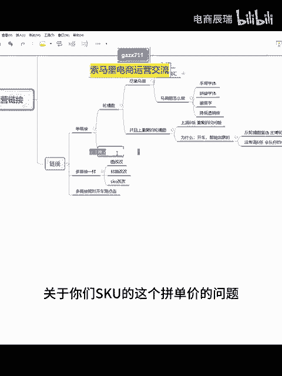

拼单价问题。低客单价的。就是卡拼单价。知道吗？什么叫卡低一拼单价就是高外楼价。

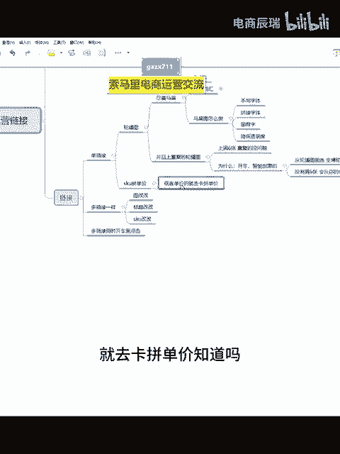

就是消费者。看到的价格是。是正常，你的卖价。

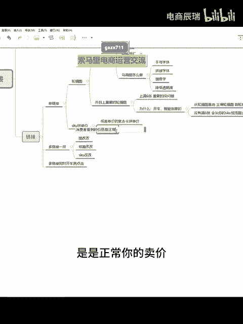

呃，但是系统。系统里链接是。

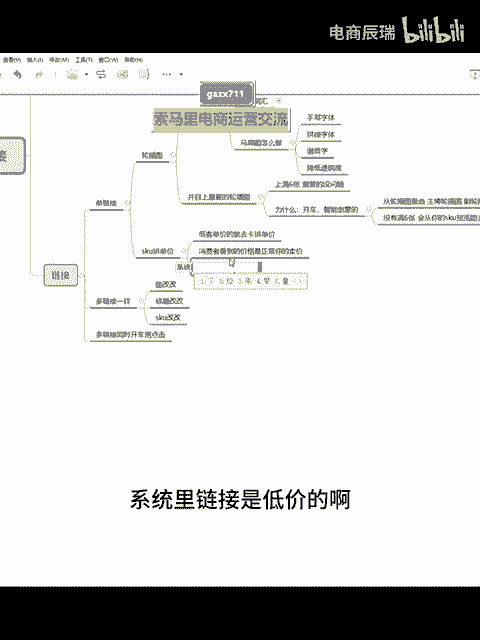

低价的啊，这个就是。

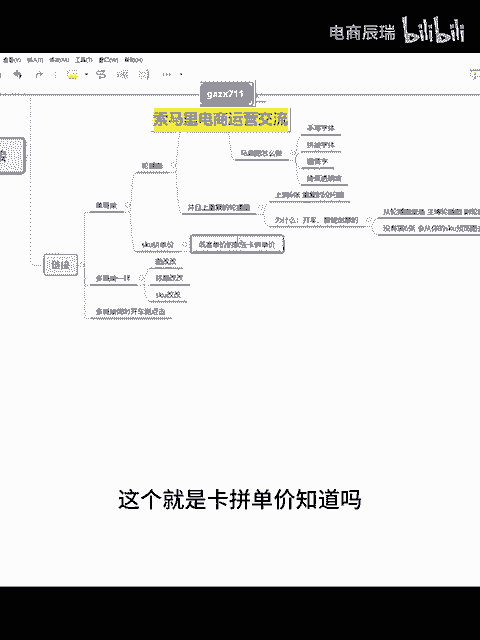

卡片单价知道吗？低客单价的你们就可以去这么去做啊，但是高客单价的。

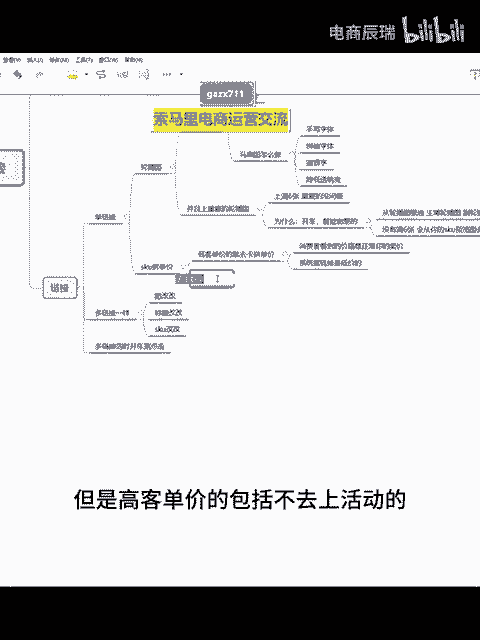

包括不去算活动的，低客单价的。不玩活动的。

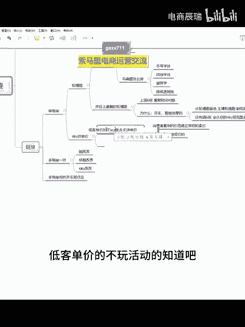

知道吧？就是卡拼单价啊，然后如果说你是正常卖，你也不算是低客单价的，你就价格。

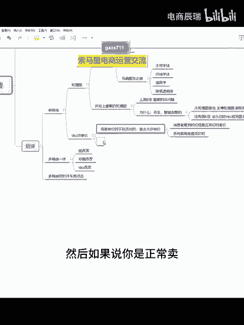

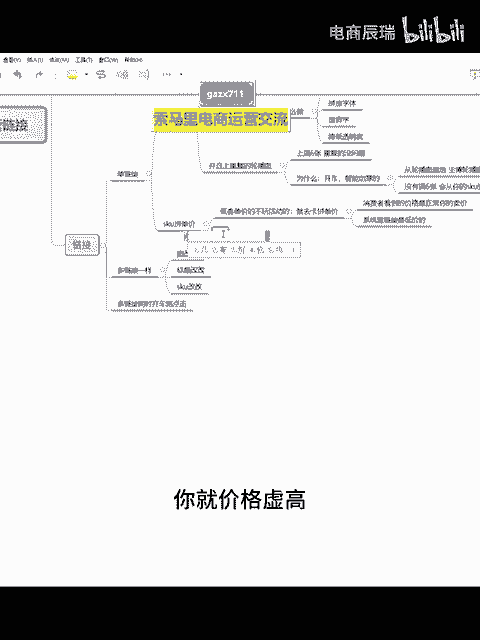

虚高价格虚高就完事了，知道吗？怎么去虚高，就反正大概就是你要卖给。消费者的价格，然后加不计入历史成交。

最低价的。劝啊，这个是很重要的，知道吗？然后再除以。限时限量折扣。限量的这个折扣。

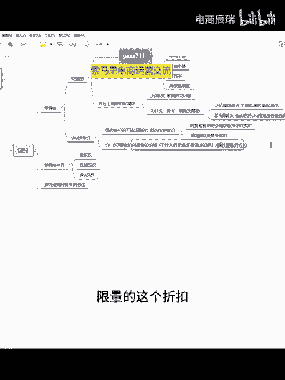

你这个地方你除1个0。70。80。90。95都可以，你们就按照这个去虚高就行了。

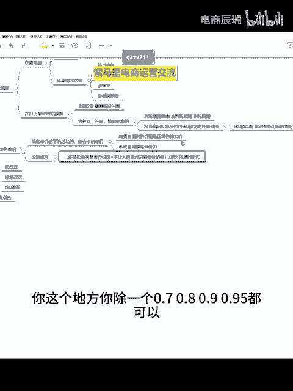

知道吗？啊，对我是有一段时间没开播啊。嗯，感谢喜欢好吧，这个什么罗雅喜鹊。😊。

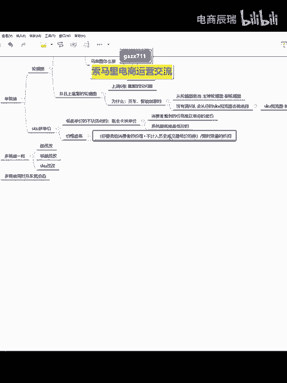

嗯。🤢，你们就套公式就行，好吧，明白吗？呃，哪些。

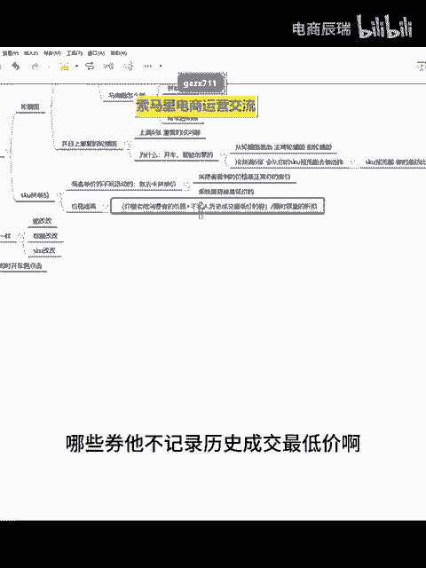

券它不计入历史成交最低价啊，这个东西的话呢就像那些什么呢？呃，常用的，你像新客立减券。

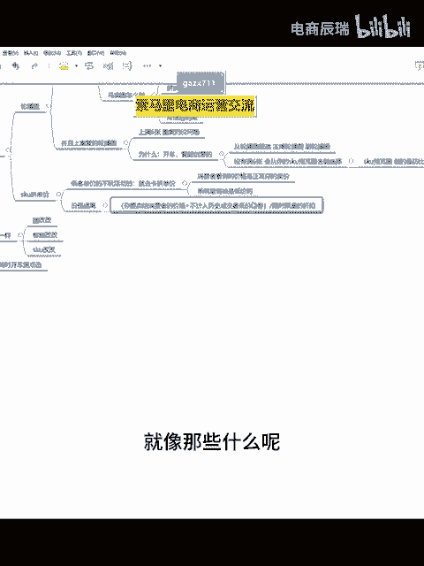

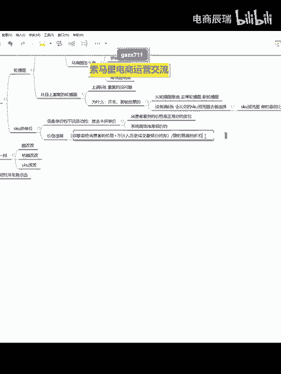

商品关注券包括直播专享券啊，你就是这些券就行了。但是一般大部分就是新客立减券。

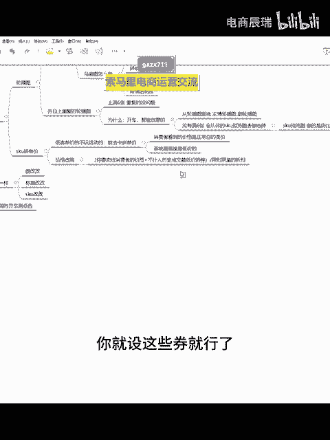

呃，其他那种。

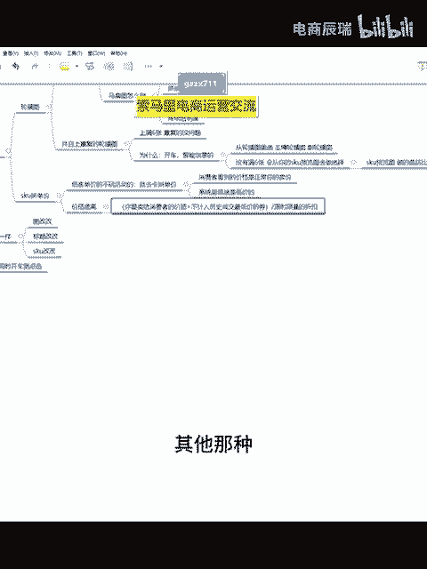

不是不是很清楚的啊啊，就去看我之前给你们发过的这一篇思维导读就行了。

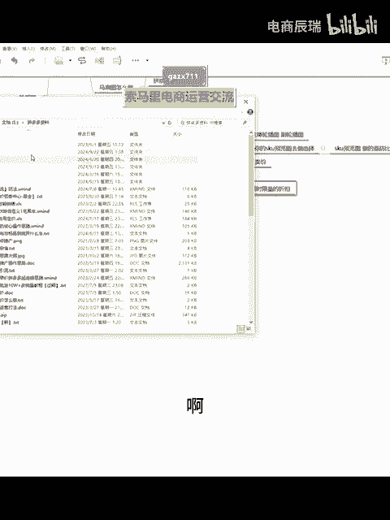

营销工具里面的这个优惠券，这面给你们写了的啊。

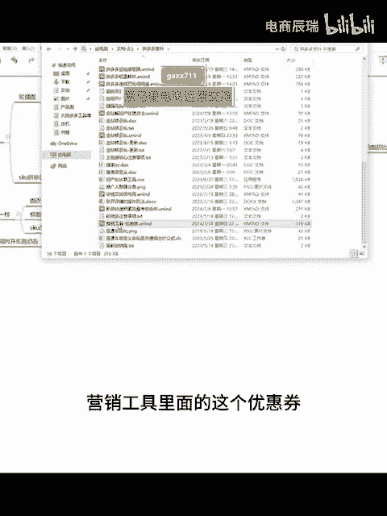

里面有的。干嘛拉人新客啊，直播专享圈，店铺观赏店铺关众券啊都行。知道吧？两个地球都是我的啊，你们随便加一个就行了。知道吧。你们随便加一个就行，要的就到时候发你们，反正就现在设的多的话，就新颗粒眼圈。

而且新客立减券的话呢，现在生效呃立马设置，它就立马生效啊，所以说用新客比较方便。反正就套公式吧，好吧啊，其他过多呢也不解释。

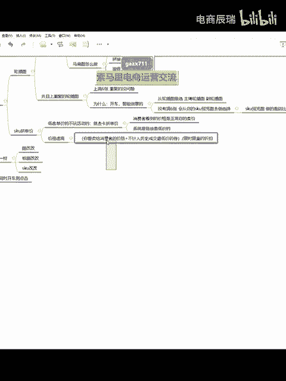