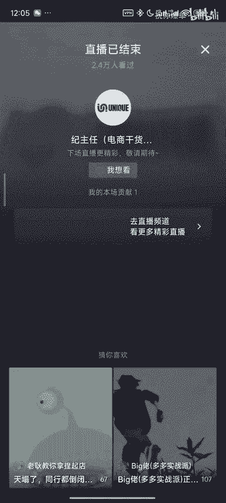

# 【拼多多运营】手把手教你做市场分析，小白必学！ - P1 - 祝你爆单 - BV1VWxuezEmC

就好像有有做过淘系的，可以知道淘系其实优化的还可以，一个叫标准，一个叫权站，很像拼多多的前身，就是一个更加的贵，一个更加的便宜。现在大家如果想要前期能启动，可以用全店托广开二头产。

是可以取代掉标准推广是欧了。😡，主任这两天空烧为什么那么多？因为拼多多。😡，阶段一有50块钱是按照曝光收费的这50块是每天50块，尤其你打开了全局啊，全局优选体量，或者是你打开了结束起量。

反正只要在阶段一或者阶段。😡，显示了之后又不显示了怎么办？哥们直接删掉，希望可以帮到你不要怕不痛不痒。O销量回升会影响链接吗？呃，按道理是会的，那你如果跟拼多多不讲道理的话，那就是不会的。

你能不能理解我的意思。兄弟们，就是大家最近这两天被回的销，我告诉大家，三天之后又会起。因为最近是上面leader帽子在抓这个平台，哎呀，我又搞这个东西讲出去了。😡，马上什么节日了？😡。

你想想马上什么结了？😡，最近有leader在管控这一个leader LEADER有leader在管控这一块。那么国庆后你被回的消都还给你了，你信不信嘛，你自己看吧。😡，国庆后回的消息都还给你了。

这个很正常啊，所以现在改销等个两三天就okK了。其实不单单是改销，你各行各业现在。😡，是不是他老师多了？😡，最近有没有去三楼的？😡，哎，你们不是天天说你们不是说天天去三楼吗？最近去得了吗？

门都给关起来了，去得了吗？你自己想想，我们做电商不是一样的吗？是吧，你最近在三楼还在二楼啊？😡，对不对？😊，你想想一样的，世界是一个圆啊，对不对？一样的吧啊，我们这期又回到我们的电商话题啊。

我们不扯这种成人的话题啊，不然从不然去扯这种成什么，怪不得我这两天直播了，神经病，什么我从来不去，我只是听说最近吧马马上快那个了，leader在那个我信李主任，我其他都不看就信你那哥们能不能点个关注。

😊，不是你说的那么坚决，哥们能不能点个关注？😡，咱们就点个关注可以吧，好不好？我有个朋友，对我有好多朋友对吧？不要往下定价错了，数据怎么看是这个原因。你如果是打强付费的，你提1个0。1投产。

你如果往下掉量的，那就是定价错了。O好，但是呢你你你一定要搞清楚，现在的拼多多，如果玩直通车，前期肯定是亏损的，但是你不能选亏，我们诸葛多多上面有一个放量出价，你只要把你的成本和你现在的售价写上去。

这里有个放量出价，这是适当的亏损。因为你不太高出价拿到的流量都很杂。比如说你可以做个测试，现在的链接，假设你保本是2啊，我们说保本是三，你二开到的转化率就是比三开到的转化率要更高。

那么如果你前期转化率如果不高的话，你这个链接基本上后面就跑不动了，就放不大，所以拼多多现在直通车带动整个爆单的过程，不管什么玩法，哥们，你一定要单，你一定要量，你没有。😡。

量去扯很多的什么你没有量去扯太多的玩法是扯不了的，是不是？哥们，一定要记得，你前期上来一定是做单做量，一定是可以的，是没有任何问题的。所以你会发现很多地方比如说教你去前期成本价起量，那也没毛病。

或者用活动去积累，反正就就记得拼多多前期一定要有量，没有量是孵化不出来一个爆款链接的啊，所以基本上前十0天基本上都是亏损状态保本违规吧，到后面15天微证到后面才能拿到推荐流量。O。😡，诸葛工具哪里领取。

上方加入我们的粉丝群就OK了，谢谢你好不好？啊，前期一定要把坑场搞起来吗？不是坑场是最终的导向，你要有流量，你要有单量，你要有转化率哦，哦，好不好？OK啊。

主任直通车二阶段每天限额都会烧剩下10%花不出去，曝光变成几个，是因为你这个链接没有权重。就大家你会记得啊，我我我刚好这位兄弟谈到这个问题，我们说一个很多人有发现，但是他不知道的玩法。😊，兄弟们。

所有人给我听清楚，我只说一遍，慢慢讲。第一个，你们可以把你们新起的计划限额100或者200块钱。😡，如果你有权重，我就告诉你一个数字，100有权重是跑多少钱？是跑105。如果200有权重。

跑的是210300有权重，跑的是315，400有权重，跑的是42五百有权重，跑的是525，600有权重，跑的是63700有权重跑的是735，800有权重跑的是840，以此类推，100块15块。

证明你链接有权重，100块花不完垃圾链接总是会设那么个10跑不动。那么有人会说，哎，可能是预限额不够。对你把100块加到120限额。

只能跑110把120限额开到150只能跑1301150限额跑的开了200，只能跑12，证明你的链接总是在限额的阶段跑不完的点，你的链接根本买不上便宜的流量，理不理解听懂的兄弟扣个6。所以正常来讲。

如果你想要提投场，为什么一定要限额，就把你现在的整数乘以5，看看能不能跑得动。如果你能够满配了，800跑。😡，840，哥们，今天晚上提个0。3，如果哥们，你800就跑个790。哥们。

你只能适当的去提个0。1。这个告诉你了啊，你们可以做个看看，你去限额给一条，你可以去这样去试你利润率比如说30%啊，你就假设利润率30%你开一个二投产或者1。5投产，就是去验证我说的。

你限额1001下跑完，它就是跑一105%。😡，😀あは。对不听是不是是不是听不到是不是听不到啊，听不懂很正常，没有关注的，赶紧关注一下好不好？嗯，没有关注的就可以关注一下。像这位哥们说了什么呢？😊。

这个为什么我卖的更便宜？二开极速比我卖的跑出来贵的投场低。哥们，你这说什都别多税。😡，你在在说什么鬼东西，站位链接怎么做了，去站位上的？哥们去站位上的，你干什么站位链接去站位做的，怎么做哎呀。

主任我在榜单已经两年了，洗了SKU还是显示商品高价，让它上新怎么处理。在两年的榜单跟比价又是两回事了，比价归比价分流归分流，哥们不要把这混为一谈，在榜单链接一定不会比价吗？你想什么鬼东西呢？哥们。

是不是来，兄弟们，如果你没有看店需求的，从来没有在这里跟我连麦过的兄弟们，你们可以扫码了。因为我们第一个码，我不需要你关注，我不需要你加灯牌。

即使你是刚刚刷到我直播间或者在直播间外面有缘看见我的进来扫个码。扫码连麦，先扫码再连麦，根据去微信O。😊，好。直播间不能分享了，卡刷活动官方再查查吧，哥们查吧，把这个和谐掉，我再给你更新。

这不就简简单单。你查吧，随便查吧。哥们，但是这种店铺可能没办法聊啊，怎么说呢？就是咱们就是怎么个说法呢？您这个您这个花了29买了33个访客，这属实有点难受，作为我们来看这位兄弟卖什么产品的。

依然有可观的利润是吧？我们来看看这位兄弟卖什么产品的啊卖这个家纺的啊，啊，这个家纺呢，是不是来这位好朋友在哪里，这属实过得有点惨日子干就是做的有点惨，这两天啊，这个惨中产，王王中网属于今天被骗了29。

9块，今天29。9块，买了33个访客还理都不理我们啊，不过也好，只亏了29，有的人今天打了500多的包子啊，打了500多单子，然后呢还亏了299是吧？😊，来，我们来看一下。来，这位兄弟在哪里？

你不在的话，我们就往下换一个追梦人了，好不好？因为你扫上来，我怎么会猜得到是哪一个兄弟呢？是不是你不说话，如果让我猜的话，这个玩法就很牛逼了啊，来我们换下一位追梦人。😊，啊，来这个一单没有卖。

依然有可观的利润。对，因为这个因为现在拼多多你不亏钱，其实就已经很牛逼了。😊，来，我我想问一下大家，你们今天有没有亏钱呢？😡，我直播间有大概是800个人哈，我想问800个兄弟们，你们今天有没有亏钱？😊。

你们今天有没有亏钱？😡，亏了吗？有亏钱吗？亏了多少钱？😡，小小小赚90其实已经超越了90%的人了。😡，啊，小赚90亏了是吧？这些说亏的哥们一个都是爆单选手，种子选手不要去馁啊，肯定是包挣钱的。😡，来。

我们来看这个是做服务器的啊，不亏的会来看直播间吗？哥们，就你一个人亏钱。😡，你就只有你就只有你一个人亏钱。😊，你这没有幽默感的一级小号，就只有你一个人亏钱。我们抓住这个小黑粉就喷他说你看什么没有亏钱。

会来你直播间吗？你是说我800多个哥们全他妈亏钱是吧？我就就你亏，你11月，你亏死你。第一天亏你8000万哥们啊，我直播间兄弟们个个爆单的哥们啊，来，我们来看一下这个这个这位朋友在哪里啊？😡。

第一个就连了女粉丝也不错啊。来，这位女粉丝在哪里啊？这是谁的店话啊这个。😊，啊，这个女粉丝是吧啊，连一下，因为我们依然有可观的利润。你好，喂，主任你好，哎，你这头像不是女的吗？😊，呃，男的男来男的。嗯。

我想我想问的是，这个我们现在因为现在他卖的全部都是单个的批发到现在还没有。然后我现在开的推广呢是开的投产。然后目前为止投产也还好，但是我想知道啊，后期如果说有跟你讲，嗯，如果一开始一个人评选错了。

他就不配后期，这第一句话，因为你倒出来我高低要给你诊断点问题出来。嗯，那么第二个就我首先我没有做这个品，因为我不可能什么品都有做过，所以这个品你拿来我现在是有点懵的，因为你没有什么数据。

所以我希望你告诉我几个问题，可不可以？我说回答我一下，好不可以？好的好的，第一个你拼多多你自己做多久了。嗯，两个月吧，两个月OK对啊，然后第二个你是厂家吗？呃，拿货拿货。第三个，你哪里的是河北的吗？呃。

临沂临沂山东的是吧？对对，那第四个这个东西这玩意儿第一名一天多少单，就跟你同样属性的产品，同样的SKU套餐的。嗯，现在是500单，因为旺季还没来，没事，反那因为旺季还没来给它去掉，就是550百单。

第二名多少单？嗯，300，第二名300，第三名呢嗯大概100多单，他们三个都是老链接吗？还是有一个是新链接。嗯，老链接全是老链接是吧？对，哥们，你定价错了。😡，就是当一个类目，他季节还没来。

在榜单的只是老链接在平销而已。那么对于这种产品而言，第一件事情一定是积累单量和流量。我否认同这句话，嗯，认同认同。那么你现在的定价有点问题。因为如果是我做的话，我可能现在会放在成本价去让他来流量。

这样的话比比开车强，比开车舒服。因为我看了你的这个链接，嗯，今天花了2624单，还不如不花这个钱，你的利润率应该在20%左右。对，然后我可能会压低，专门拉一条链接，让他流量进来。因为咱们是个新店铺。

然后这个店铺呢就可能就可以这么玩，大促100件，加上那个就是大促7折100件去报名，然后玩了种秒杀，大促秒杀，然后584，但是这个上去可能不开车，但是我们纯活动，把流量给它导进来，配合评价有理。

把这个店铺的权重做出来，为什么这么做，因为榜单现在有结果的，都是老链接。😊，如果我现在打直通车的话，我可能比不过他的出价，可能会死在直通车里面被套牢，卖的贵，评分又不好就很难收拾。

这个前期可能做的很难看。但是我只要控制好预算，我一个月我亏3000块钱，但是我把量做出来，理不理解，理解理解，因为他可能也不会有结果，就它可能不会爆单，但是我把量做出来了也可以分走一点市场份额。

因为在市场都是低迷的情况下。低价是最好的分走别人流量的方式，可可以理解？明白明白，这个白，所以我给你的建议是这个，所以不要问我直通车，因为我觉得你直通车可甚至不用开开的话就记住。

如果咱们的价格是比较有优势的情况下，开车就是跟玩似的，就是开个100开个200，把链接带出去。😊，就有就OK了。哦，这个我明白，其实其实我主要的问题是想就是我想知道，就是说如果说我们现在的这个客单价。

因为它比较低嘛，在旺季来临的时候，它是属于定制品。来，哥们，那我再说一遍，就你没有经历过旺季，你不要去设想太多旺季。咱们先这么做，到时候你才能享受旺季。哦，好的好，你才刚刚做两个月，还没到旺季。

哥们我就问你去年旺季时候你在干嘛？😡，😀那。😊，是不对？对对对对对，你去年旺季可能还在家里。😊，干嘛？你还在你还在干别的行业，你还没做电商呢？对不对？对对对对对？嗯，好嘞，明白了，谢谢主任，拜拜啊。

拜拜拜拜啊，加油啊，好不好？拜好的，谢谢。等会我会讲市场调查，你会在我直播间吗？会的会的会的，我等会我刚好会讲过市场调查，我昨天好像有答应大家看这个市场调查讲过。因为很多人像你一样可能完。

就是真的很关键。就大家你一定要知道我拿到一个品，我一定要知道怎么定价。😊，如果咱们定价不同，流量就是不一样的价钱，流量不一样的价钱。我前期积累数据就是不一样的价格，就是不同的玩法。你如果连定价都不知道。

你去学玩法会学的很乱。是实话，你说对吧？好的好的好的好的，okK拜拜，我等会讲定价OK。😡，呃，我们现在你们应该都在我直播间了吧，因为我现在刚刚开播十几分钟，兄弟们在直播间的兄弟扣一个6。

我来确定一下我们直播间有没有假银了。直播间95个人，兄弟们，直播间95个在的兄弟扣个6。😊，没关注兄弟们先点个关注啊，好不好？没有关注的兄弟们先点个关注。😡，好，那么现在可以把你们的喊一喊啊。

我们现在开始要讲一个小课堂。那么没有关注可以关注一下。因为我觉得小课堂的确可以帮助很多人啊，就特别是有的学员他都不爱看我上课，他爱看我小课堂。我昨天下播的时候，主任跟我讲。

你这个小小课堂就5分钟以后多搞一下，我说可以一天分享一个小知识，我们都抽嘛，因为这两天我上一个分享的知识是什么？😊，我上一个分享的支持是什么？😡，确定吗？😡，我上一个分享的支持是什么？😡。

就是上一个小课堂分享的知识是不是原价上大促？😊，那我之后我就不分享了，就是我大概每一每一个星期分享个三次，没有重复的，反正一次就一个小小的技巧。OK那么我们的直播间如果有一些坏蛋。

因为群众之中可能会有坏人嘛，坏人呢，我们都是学习资料啊，我们都是学习资料，没有任何装漏洞的方式，刚好要赶上主播生日，我们也不敢乱搞，对不对？那废话不多说，我也不是喜欢废话的人。

我们现在开始讲解今天的东西。😊，首先我讲完再开始这个我讲完再开始。呃，我讲完再开始诊断店铺，好吧，所以大家不要吹。那么大家有任何的问题可以在下方公屏上打出来啊，一天分享一个亏钱小技巧，那你可以不要停。

哥们好啊，我们在讲这种小课就小小课堂的时候，我没有收你一分钱，你可以选择不听，是不是？哥们OK。😊，首先呢我我们一定要知道，你们不管是做什么产品，在我直播间，所有的兄弟们啊，你们可以开始录屏了哈。

所有的兄弟们来我直播间第一个问题，他都是问我主任我是做这个品的，我不会做，能不能帮我看一下店铺，就比如说你扫上来的好多兄弟，他扫上来的店铺可能都是不知道店铺哪里有问题，可能问都不会问。是不是？好。

那么假设你是卖这个产品的。那么你最容易亏钱的兄弟是可能你在之前有爆单过，因为我昨天也有说过一个典故，就是你只要这个产品之前是有做起来过的，你很容易再给他投钱。比如说哎呀我年初是打强付费做的。

那我现在年末我打强付费，我也要再去做起来的。首先我要告诉你，选择什么样的玩法，什么叫玩法，无非就是你买流量要多少钱。😡，比如说你的成本价是10块，你卖10块，那么跟你卖50块钱。

你们买的流量就是不一样的。花的钱买流量不一样。可能你卖10块的可能都不需要花钱就可以进流量。所以他可能更适合低价的玩法。那可能你卖高价的，它必须开车花的好几10块钱，所以定价就要更高这了叫强付费。

那么我们如果选择了定价定的好，那无非就是市场分析。你可以理解为定价决生死才有了布局，布局又是决就就就决定全乾坤的啊，定价决生死布布局定乾坤。所以市场分析如果你能够分析的很好，相当于是在同行家里面装监控。

😡，那么如何找到合适的玩法，也就是如何参考优秀的同行呢？其我们的同行分为老手。新手。总子选手地主家的傻儿子，这就这四种老手老鸟。他因为他之前前几年通过一些红利做起来了，他链接里面有太多回流。

老客户都可以占比我大几百单了，他可能都不需要怎么运营，放在那个地方维护评分，那率稳的要死，只要不要去瞎搞去瞎报别人的课程就可以了，对不对？第二种是新手，新手占了很多。这大家我想问大家。

你们做拼多多直播间的1000那个兄弟们，你们拼多多做的时间有多久，一年的扣1一年半的扣1。5两年的扣2，然后两年半的扣2。5，以此类推，看看新手多不多。基本上现在正在做的兄弟们都是在一年以内的。

因为最近拼多多的商家还是特别好的。好，那么把这些人找到放在我给到大家的这个表格里面，大家会面会看到这个表格。😡，这是我在开播之前做的这个表格是市场调查简易版本。因为很多人不知道应该调查什么东西嘛。

我把这个title给你们讲一下，第一个呢就是这个是ID就是别人的商品ID第二个是热销的规格。那么这里也就是别人的产品的规格，就是SKU这个是券后价，第三个是日销。然后我需要知道利润率。

然后上新日期成本价是你的成本价还有评价。那么对于市场调查来讲，简易版本，大家只需要知道这些就可以了。那么我先来讲这些东西从哪里看，之后再讲怎么来分析。😡，店铺名不讲了ID不讲了热销规格就是别人的。

但是你这边要做个简化，不要把别人的形容词抄下来。你比如说就是简化一下，把它形容词去掉，就只留下规格啊。然后券后价这里写好日销怎么看，日销怎么看，从几个地方看，我现在说来，我从几个地方说日销。😡。

第一个是在后台点开直通车的后台，不是店铺的后台，所有人可以后台点开，点开这个后台，左边有一个爆款进价，可以看得见这里面的爆款进价，这边去输入你的商品名称，你卖什么？比如说哥们，你是卖女女袜的。😊。

搜大词，不要搜全标题，然后去这里的销量1到500，这个1到500不是单量，是件数，多收集一些，每天截个图片，这是第一个能听懂的兄弟扣个6。这是第一个，因为这是比较准的，但是它并不是昨天。

就这里的昨天不是昨天的意思，是可能是前三天。所以你需要每天截图，听懂的兄弟扣个6，这是第一个销量来源于哪里。这也是大家看到各大的软件。他告诉你同行销量多少来自来来的收收集地。那么这是第一个。

那么第二个呢，可能你们这里搜不到自己的同行，可以在我们的手机打开，是不是有一个分类，你分类上面可以找到榜单，榜单这边也可以看得到。第三个呢就是直接我们可以在别人的链接下面可以看到，比如说他没什么单的。

可以看他每周拼了多少单。它单量很大的，可以看他在线拼单人数。基本上我们的下午4点钟去看，下午的4点钟去看，它显示的就是他一天的销量，就是今天的4点到昨天的4点，这是最准的。下午4点钟去看别人的链接。

下面再拼订单人数，就是他昨昨天的单量，这这个是几个点，听懂的兄弟扣个6。听懂的兄弟扣个6。啊。啊，和拼再抢有什么区别？哥们，你前面炸一下，我以为你在骂脏话，在抢买家在抢我的东西。😊，然后把日销写上。

那么接下来呢这里这里利润率。利润率就是用我们自己的成本去对标。😡，我们是用自己的成本去对标它的利润率模拟的利润率，这可是一点。然后这个上新日期呢，你们要通过去检索到别人的详情页的上架日期。

或者用小插件都是不用都都是不用钱的。抖音上搜一搜就可以看得到。对，那个哈什么的，也可以啊。这个就OK。最后一个评价写上去。好，这一些把它数据放到我这里。那么接下来呢我就告诉大家，调查这这就是查同行数。

同行的标品，就看你同款的数量有几个分这么多，12345。然后呢，然后呢，如果非标品的话，就查店铺，就是对标店铺。第二个，模拟好利润率之后，把这些填好有这几种情况分析玩法。

如果你发现利润率高的就是这个高价，我们可以把45利润率以上拟定为高价。就你发现同行的利润率都是在高价的，高大于低。那么我们就知道了，现在市场上面能够成型的店铺和链接都是高价的。

所以你觉得这一个产品前期需不需要开直通车。需不需要开直通车？需不需要？你可以理解为在这个类目里面，如果你现在发现成型的同行都是60的利润率，他们占比的这个产品。是极大的市场份额。

就哪怕你今天是成本价或者20%，以及30%的毛利去上架，你也不会有单子进来。😡，这种打不了自然流，也玩不了高投产，因为它前期必须要高额的持续的付费。大家前期比的是出价的优势。

所以这个时候我们的脑海当中就可以理解为这种就是我们俗称的强付费市场。这是第一点。初级阶段判断能听懂跟得上的兄弟扣个6。不要在我直播间去刷屏。那个叫涛的好不好？你没有点耐心，你就给我出去。

直播间1000多个人在听了，你丫的在那里一直发，好难做啊，好难做啊，好难做啊，难做就是你的哥们。😡，我再告诉你怎么做了，来这个利润率初始的利润率可以定好来之后，大家一定会遇到这种市场。

一定会遇到一个问题，就是阶段和断流。这种还法就会遇到一个问题，就是阶段二断流，大家可以看得见这种一定会遇到一个阶段二断流。所以我直接告诉你答案，如果是高大于低，前期必须开高价的直通车。知道吧。

先定505560的利润率必须，这是第一步的定价。因为你没有这个定价。你就开不动直通车，你连流量都没有你流量都不进来，何谈单量呢？😡，这种完这种类目是100%会遇到阶段和断流的。😡，揭端了就降价。

因为进入阶段二的时候，你长期在花高价买了流量之后，这个降价就是你的出路。等于说它的确适合打低价，最后是40利润率或者35的利润率。不是跟别人拼高，不是拼跟别人拼高价，是跟别人最最终拼的是35的利润率。

但是你前期必须高价，这个叫高转低。就我有这我也这刻意叫高转低。大概这个意思就是你这个必须是先高价，不然没你不然你这种类目直通车是跑不动的。😡，知道吧？长期付费之后，你遇到阶段断流，这就是降价了。

它就不会断流了，而且能跑得动。😡，所以定价是要变化的。前期高，后期低，听懂了没有？肯定开呀，但是你就可以提的很顺，就不是一开始定价就不要定的那么的低，但是你必须高，因为你高才不会亏钱，下去之后再变成低。

记住了啊，这个我就不讲了，记住了没有。😡，这是一个思路啊，记住啊，那么继续第一，如果发现市场上面都是低价的。我们玩什么？😡，市场上面如果都低价的，告诉我玩什么。😡，告诉完了吧。😡，市场上面都是低价的。

😡，还什么？😡，大。如果市场上面都是低价的，你发现低价成型的链接特别多。😡，那么你可以知道你是可以不用开车，就你可以不你是至这个类目不用开车都可以。因为大家都在用明确的价格段去竞争拿流量。

所以我们初始是认为十五20还有多少？20的利润率。这种。但是这种前期也会遇到一个问题。就是前期直通车跑不动。这种前期直通车跑不动，这种是前期跑的动，它不会挣钱，拖价拖不了，这是高大于低。

第二种是低大于高。然后来听清楚。15%到20%到30%。那现在谁都知道，如果要玩维修费，前期就是要低投产去拉一段期间。比如说你的利润率是20%，那么我们最终可能要开到6或者是7或者是八的投产，是不是？

肯定第一步上去先定一个这个价格，然后去把托管打开，还是稳定打开都可以用一个工具当能启动的工具，然后低投产的数值去提升我们的前期的流量，没有关注的，可以关注一下。这个是一个必备的过程。😡。

但是在做这个玩法的时候，又会有八成的人也知道这么玩。他昨晚会遇到一个情况，比如说他用托管冷启动越跑越快，转到稳定成本那里去的时候，假设你稳定卡的是高头产，也就是你能启动完转到高投产那里去之后。

你猜怎么着？😡，跑不动。有没有遇到过这个兄弟扣个6。你猜这么说，托管跑得动，稳定跑不动，也就是高投产翘不起来。😡，你猜怎么的，有没有？😡，来，这个路径是没有问题的。

这个时候你要说问你自己心里有没有点逼数。😡，有可能是这么个情况。哎，你发现你转到低一点投产就跑得动，高投产就跑不动了。高们是这样子的，你价格没有优势。😡，就是因为你的价格没有优势。

才会出现用你的利润率去对标别人低大于高的情况。这是第一种。你价格没有优势，你是个拿货的，你在做拿货的应急品，你快递没有优势，你这个利润率对于别人而言，可能就是40的利润率。😡，只不过对于你而言。

你跟别人一样的价格，你可能才15%。但是大家都在有二头产或者三头产，四头产的拿单。因为对于他们来讲是盈利的，出价一样，定价一样，但是哥们俩成本不一样。理解吧？所以就会导致托管能斗，高投产开不动。

这是你的成本价没有优势的问题。这是第一点。那这个品你可以选择不做，因为这个玩法它只能适合高头产，你或者你直接。😡，想办法把成本降下来，这是第一点。第二个，如果你是厂家，你价格已经很有优势了，又是应制品。

你会遇到到这种情况，你只能听好你主图不行。😡，你的主图不行，或者你该配活动以及配要配低价引流，就是这三点，路径是不会有问题的，请你不要再换链接，你一定要知道，遇到问题是解决问题，而不是链接越做越多。

其实大家现在所学的很多，他你的脑海里都有概念了，都知道了。但是为什么有的人会报，有的人不会报，就是因为你不懂得套，你不懂得解决问题，这是第二种。理不理解。😡，那么第三种呢。

低等于高低就这上面的低价的数量等于高价的数量。他很容易遇到前期新店铺难启动。这种就是要做多多进宝AB单才能做，或者要涉及到刷一点层级。这种店铺需要而不是这种类目需要这个需要。因为多半这种是属于什么。

没有到印印印季品的时候，多半是老链接评销。比如说前面那位哥们看到日历。这种就必须要先把一条链接线做起来。这个店铺才会有大量，不然你在这个店铺里面怎么玩也看不见。而且有一个非常讽刺的是，在这种店铺里面。

你怎么去上链接都不会被比价。😊，上一个链接被比价上一个链接别人是上一个链接被比价，你是比不到你抬到999，你都比不到你价格，你都不会显示被比价。这个属于店铺废掉，没有自信的店铺是没有用的。

一般铺货被抓圾膜会出现这种情况，新店铺启动不了。😡，然后第四个小类目无同款，秒拍秒退脱，尤其是高客单价，会希望大家前期玩涨价的玩法，就是这个就是前期稍微低一点的利润率。

那进来至于成本价去把直通车打开了之后，再慢慢的涨价，或者把投产比降下来，这个是很合适的。因为你如果价格是涨上去的话，你出价是比较低的。前期能启动期间，你的秒拍秒退概率是会降低特别多的。这四个情况。

我不知道你是在我直播什么时候进来的。兄弟们，我也希望大家把这个全部都已经搞清楚，现在阶段化多少流之后，我是不是已经讲过了。所以我不知道你们从什么时间节点进来的。但是如果你们需要我可以把这个东西。😡。

如果你们需要，这是一个简易的版本。如果你要我还有一个视频资料在配合这个表格，在粉丝群领取就OK了。一个一个多小时的视频。再加上一个这个简易的表格，如果你需要在粉丝群领取就可以了。加入上方粉丝群就OK了。

感谢大家，希望可以帮到你。好嘞。啊，希望。可以帮到你啊，这不是付费内容吗？主任，我跟你讲，真正的付费内容是属于教你怎么做。😊，不怕的啊不怕的，哥们哈，干干货其实值不了几个钱，咱也没有必要长着掖着。

你说是不是对吧？所以大家都可以来我直播间，有波懂都可以问我OK好。😊，我们这个月东是。😡，市场调查简易版本，像这个类目就是可能只能玩前期高价了。因为它有极端日卖的好的人都是你看要么是零利润率。

这平均利润率是1%，利润率1%，要么就是黑标做65%到70%。这种这种类目是最难做的啊啊，他不用点极端的手法就做不起来。OK可以加入上方抖音粉丝群，没有关注的兄弟们可以关注一下，谢谢大家。😊。

我们继续诊断。😡，啊。我们继续诊断。前面讲完大家应该都都都OK吧，都能够消化吧，是不是？这是属于非常简单的内容啊，是吧？是不是啊，没有关注的可以关注一下啊，加入上方粉丝群，可以把刚刚这个表格发给大家。

就是刚才这个表格你需要的话可以发给大家，就是这个表格，需要的话可以发给大家OK。😊，好，我们换下一个。追梦人啊。挺好的，挺催眠的。哥们那下来。看来我下次不能讲，这是最后一次给大家讲这种小课堂。😊。

这是最后一次给大家讲小课堂。😊，啊，这个这个这个这个这是最后一次给大家讲小课堂的，以后还是给大家看看看看看看店铺吧，好不好？给大家看看店铺吧。因为大大来说催眠小课堂。唉。来。

这个做这个做拖把的这个做拖把的哥们在哪里？😡，这个做拖把的兄弟在哪里？你在哪呢？😡，哈啊。😊，这个叫这个叫吧。那个。天籁家居是吧啊，来。😊，你好，哥们。喂。喂。嗯。没听了，我有声音吗？😡，喂喂喂。

主任听得到吗？啊，你大点声哥们。哦，我看下嗯，你说。我这个链接是想打秒杀的，现在我是600人里开的车什么说慢点。😡，我这个链接想打秒杀，然后我这个链接现在是60利润率。然后开动了把车。继续开呀。

你不你你卖个990就得上秒杀了吗？😡，我我提提报了百万爆款，我把它取消了把它取消了。😡，哦，好的，你配上秒杀吗？你不配一天才66单，卖900块钱，你不配上秒杀。我想我前两天SS单了。😊，然后呢。

然后我就提报了，今天提报多秒查，你66单上去，你只会有访客，到时候又把数据做乱掉了。啊，就是等到。一天卖2000块钱的时候能上差不多吧。😡，哦，好的，主任。拜拜。😔，好的，谢谢。😊，啊，不配是不配。

因为你一一天就卖900块钱，你上秒杀属于浪费时间，你还要跟等女朋友回你消息一样，等他到底通不通过，又心很累，所以不要去上秒杀。OK下一位追梦了？继续。😊，下一位节梦人再见。😡，啊。继续下一位卷赠人。😊。

十三单卖了个五十几块钱啊，500块钱的兄弟在哪里？我们来看看这位好朋友是哪一位。😊，卖小内裤的是吧，这是谁的呀？啊，哈来了自啊，这个是叫哈来了自。各位，我们我们连一下这个哈哈兄弟啊。😊，呃。

留我一下好兄弟。这个店铺。这个谁？それででも。😡，是不是你的？😡，这家不是你的。😡，我会我就把你拉黑掉，我的我我一直按我呢，这是不是你的店铺，是是是OK我前前天才联你啊。前天连我，那你今天干嘛来找我呢？

😡，啊，因为因为今天看不懂啊，你看今天数据就之前的二阶蛋包像全断了。我让你不要做了，我建议让你不要做了。😡，没办法，已经只能做这个，目前为什么给我个理由给我个理由啊，给我一个理由，只能做这个，为什么？

😊，没有。因为朋友也在做，我又不好意思直接终止终止了。那他让你坐下去，这是朋友吗？不是哥们，我再跟你说一遍，我不跟你开玩笑啊，因为你每天花都是亏钱，你这赔钱，你有罪啊，你有没有女朋友啊？😡，啊。

你有没有女朋友？😡，暂时还没有啊，那你先不要找了，我跟你讲。😡，嗯，每天在直通车花了一点意义没有，为什么？你这个类目如果没有黑标很难做。如果不是旗舰店很难做。你个人店铺打这种，你价格又没有优势，玩不了。

😡，哦，那那要不你帮我开车呗，我看。垃圾就是我已经给过你答案了。😡，你居然不听话。😡，而且这是全亏的，我为什么要看考虑了，那你给我几个建议呗，就是去做什么类目，我只很迷茫啊，现在我让你别做了。

因为你做一天就是亏一天这个品我没有摸过，没有这种产品，我你要是相信我，你找下来你就不做了。😡，因为我们已经吃过了亏，我已经告诉你了，如果这个类目你价格这么贵。你价格这么贵，又找别人拿货。

然后再加上又是个人电这品，真的做不了。😡，太倔了。啊。这是我的答案，我不能昧着良心跟你说啊，你你你像我不能昧着良心打开你直通车应该怎么调整？因为我觉得在我的眼中，你多花一一天就是浪费钱和时间。😡。

确实差着头资。对。你要不要换个电也可以。换什么店啊？是这种这种类目要做什么店呢？你要么旗舰店也能做。旗舰店啊，是的，个人店价格这么贵，做不了店呢。你为什么要继续做下去？你先告诉我你的原因吧。😡，主要是。

我现在是跟朋友一起合作的。首先我告诉你，我没有瞧不起你的意思，但是我们都是过来人，我们知道死磕一个品的感觉，但是死磕他真的没有好下场，这是我给你的最终建议。建议啊。你可以不听。那必须听啊。

你怎么可以不听啊？因为你每天花了好多时间，一天就出十5单，而且全亏的没有意义，一点意义都没有。哪怕我能够看见希望，我也做，没有必要做。因为马上快过年了，哥们。就马上快过年了，你现在如果才十5单开了一天。

还这么多的链接，真的浪费时间。来，兄弟们，我不是说我不爱整断这个店铺啊，因为我知道他的情况，你们自己看一下他们几条链接。😡。

这么多的链接打开，吓死你，每天在这里上链接，一天上二十几条，然后开了个商头上亏钱的，你甘信，而且且不说这东西特别浪费时间，且不说这亏不了多少钱，但是他都出十5单。😡，就是因为这个内幕他价格太贵。

他玩铺货的没错，但是他如果老老实实就今年百货早都起来了。😡，选择大于努力，那嘛？呃，那行吧，我我去再找其他产品来做一下。好，拜拜啊，拜拜嗯，拜拜。这位哥们，他等我换了个主，他又会换那个主播。

如果哪个主播我这个我这么讲，我话放在这里吧。这位哥们。如果哪个博主敢让他去开车的，敢让他去递争的，敢让他家出价的，你骂死他，听见了没有？😡，OK因为我在我眼里这东西因为你是我的粉丝，是不是你是我的粉丝。

😡，对不对？我必须要对你负责OK他这个就是属于太浪费时间了。你要是像他一样，一天上20条链接，上了一个月，一天就就你上了一天就只出15单。哥们，你这马上忘记了，我看都好累，因为你只做拼多多啊。😡，嗯。

O。来，我们来看一下这位兄弟说一次性手套的和这个抹布的啊，这个相当于来讲也是比较卷的产品啊，对不对？啊？我们直播间是这个样子的。兄弟们，在我们的直播间里面就是不要不不能够乱认领店铺。

这是第一点互相尊重一下，我们都是一起的。第二个是大家就是我我发现有好好多送礼物的同学，对不对？在我们直播间是先扫码，扫上了再连麦。😊，然后连麦必须要带个灯牌。😡，没有灯牌就看不了。

希望可以帮到你OK像这位兄弟不在的话，我们就换下位追梦龙了啊。😊，没有灯牌就换下一位决不轮啊。是不是没有灯牌，我们只能换下一位追梦人了。😊，321。啊。下一位。洗好SKU呢，要不要降投场比降来干嘛？

你如果都降头产，你洗SQ干嘛？😡，すみません。哎。哎，我们换这个这个哥们，十八单的哥们卖3000块，这品其实还可以看起来啊，你有发财的机会，拼了多说，你有发财的机会。主任我蹲了好多天。

但每次扫码都是验证码抢不过，可以不行，可不可以，不好意思，谢谢你啊。来这位做什么呢？是说这个这个铺货的啊，铺货的车品车品铺货流，来，兄弟在哪里5秒钟54321啊，没有灯牌。下一位哥们。😊，连关注都没有。

哥嘛？连关注都没有就太过分了啊，没有单牌换下一位兄弟继续扫。😊，啊，帮我诊断一下我的百亿补贴倒闭的啊。😡，哦到没多看就好了，哥们啊。上方加入我的灯牌，你们可以随便扣一个话，看看有没有我们灯牌。😡。

这个品可以打强扑费，哥们，这个品打强扑肺是不错的，可以铺火，可以铺品。😊，这个我们去年打强富会铺了非常多的店铺，尤其是铺货店。小国旗是完全可以做到各种企业链目，打的各种高的利润率。就OK了。

然后我们来看下这位谁的店我是小号的，是不是是小号的呀？啊，像这个就是典型的有灯牌就可以连麦。😊，你好哎，你你好，主任，你那个卖的那个这都没卖动，卖的那个泡脚丸都卖动。哎。我告诉你。😡，你你听好。听好。

就这种品明天去上5个。然后。利润率定起65。即使。可以吗？嗯，现在利润率只有20%，我之前那个助理，他这个我之前是全站推广，然后现在保本不是我跟你讲，你上去应该定560或者65或者是70。

他一定会爆这个品量特别好做，打墙不会。不是，现在有个问题是商品推广里边它掉量了。各们，我再说一遍，定价绝生死，你一天二7单卖270，我都觉得你有罪。我再告诉你真正的东西，你怎么那么轴，哎。

不是不是不是不是什么，你他妈定价定错了，傻瓜。😡，知不知道好好的，一天27单卖270块钱，还看直通车45块，看什么东西啊？我让你定价利润率给我变60%，65%卖贵死他这个东西卖8块，根本就不值。

这个东西值18，这个东西值28，知道没有？😡，这个东西能卖1828，你卖8块就是傻瓜，知道吧？😡，嗯，好的好的，你一天46，你让我看直通车，我就觉得你有罪，你这个打了20，你二7单。

一你一天二7单卖270，你能挣多少，你能亏多少？那你的听透，你在做事，是不是啊，嗯是不是该骂？😡，它这个掉量为啥呀？它这个由全站变为商品推广，调量掉的特别。你二7单，你昨天几单，你从28掉到27掉量。

我我从140多，然后140也不多，哥们1403GMV多少有没1000？😡，差不多10001000掉到200很正常。😡，啊，行，好的好的，你没起来过，你听我的，你听一句，明天就起来了，这正好做。

我跟你俩推荐一个屏啊。😡，就这个品他可能不敢给我，兄弟们没有品的可以抽玩法录屏。😡，第一步。去9。9块。😡，打开这个。😡，手机打开你们的iphone16。😡，打开。抖多，然后呢去打开这里。😡。

有个在右上角有个9。9块特卖，这里去搜索老链接，把它翻5倍，加3块钱，5倍加3块钱去聚水滩上进货去发货。作品好做，利润率65以上起定，开车乱打，多上点链接，多切点类目，只能帮你们做到到这里的。

一个星期内肯定会起来。😡，就直接开四头场就可以了，4加提速，然后晋级的话设为3就这样。😡，嗯，好的好的，谢谢主任。他不信。你们信。他不信他等会又20%的利润率，我会给他气死掉，对不对？是不是？兄弟们。

你你们说对不对？😡，啊，你们说对不对？为什么我在说他，因为一个星期国庆都过了。😡，就是现在去做一个星期之后，一个星期能起，他现在再不付费，还是20多单，他能卖多久？我靠，哥们。😡，这东西不能卖8块。

它不值8块，8块你抢不到的流量，对不对？1828、29。9块理解吧？现在做你明天就能开就能跑得动，改个型号就OK了。😡，好。看下这位兄弟。你看。😊，转化率达到了今年的2000%。是不是改了销。看一下。

🤧嗯。啊，我们来看看这个。这个品也还行啊也还行啊。嗯，我们来我连这位好兄弟啊，没有关注的关注一下啊。刚刚理完头发的牛肉煎包，你好喂，你好牛肉煎你好。😊，不是，就是这个产品呃，我我今天是有改销。

然后有有去说重点，不要跟我聊产品情怀，你又你又不是厂家。对我就想问一下，这个产品适合多少的定价，什么东西？个产品的就是说利润率是合定多少，去哪一个市场调调去哪一个市场调到表格，这下面分根据情况去定价。

然后我我是有我是因为我是线下的嘛，线下学员，然后我现在80%高转低在在走，就能不能帮我看一下。今天第一天车里面绿泡泡找我这个玩法，你要在抖音之外全部分享给大家也可以啊，要不要？那我绿炮找你吧。

要不要再见，没事了，下次下吧。哎你你把你你把你绿泡泡找我一呀，我看你是谁。😡，好的好的，怎么人在问我这个里问这个呢？😊，问问看啊，问问看，等会我说出来，那要不要我我再把我等会把我这个玩玩法公开一下。

要不要？😡，撤了撤了撤了啊，撤了我撤了，你你都没找我，你到底是谁，我看一下，我只我找找了你，我我只要我手上屏比较多，你是谁，我看一下，你找我一下。😊，我我我现在发微信给你啊。嗯，我发这里啊。流畅是吧。

对的对的对呀，那你怎么能在直播间问我呢？😡，是我本来没想过，我只是想看一下这个少拉。嗯行，好嘞，好6。好，谢谢啊。这个是改销的啊，不要为了打广告而打广告。呃，不要留人，要打广告是吧？这是啊。

这学员都没有帮我打广告啊，兄弟们，你们帮我打一下。😊，扫马上来帮我打个广告，快点。😊，靠你们，兄弟们，现在接下来扫码的，兄弟帮我打一个广告。😡，怎么样？😡，这位兄弟。上来直接帮我打个广告来。😡，谁啊。

😊，这个问在哪里？😊，哎，在那里调查表在粉丝群里面拿。😊，乱拿乱拿乱送这个表格在粉丝群里面乱拿乱送。😡，ok这没灯牌，换下一个哥们啊。😊，哦，在我们直播间是这样子的哈，随机扫码，然后连麦没有灯牌。

就只能换下一个。😊，今啊。就没有灯牌，我们只能换下一个。啊，现在有的事啊啊，我刚好在等你压灯牌呢。我刚好在等你加灯牌呢，八九点钟的太阳很很高兴认识你。😊，你好。哎，你好，主任。哎哎哎，你要帮我干嘛？

我是你的年费会员，不是我知道啊，不管你是什么，你要帮我干什么么领小工具啊啊，你说什么怎么算利润，领小工具，我帮你算一下可不可以？😡，可以好。来，首先你的成本价是多少钱？😡，3030，你卖多少钱？69。

9块哇，不错，然后退货率多少？😡，12。5左右，我不信这里就。这里就骗人了，我帮你上20。😡，嗯，你告诉我30块钱卖69，你退过率12，我黄，你要是黄真的店我都不信，不是他他他的那个秒拍秒退的就是12。

我不信你没做起来吧，我不信，我帮你差20可以吗？对你负责一点行啊，可以，运费险多少？😊，嗯，05元05是吧，那我帮你上三毛，好吧，好。然后你每天投场，我们看看这个直通车投场比啊。

然我们来看看这个商品推广，我盲猜1。5。😊，哦，三哦对不起对不起，是我30天花了5000，投产是2。53。😡，开始计算。在600哥们，你有罪呀。不是。你30天挣600去楼下当保安高低都能拿个4000块。

你是运营还是老板？😡，我是老板，我自己的店，那你有最业，你有几个这种店铺？呃，有两个，还有个体验店，刚接过来的，还没有做。嗯，行，这也不亏也行吧，不亏就是挣心态好一点也可以。

下面有人说我一天5单都没挣的多打他。😡，打他哥们，你干嘛说这种杀人中心的话呢，他说他一天卖5单都比你挣的多。😡，好，他比你一个月挣的多，你不信这样子。😡，这个小工具在上方粉丝群里面拿。😡，O。好来咁。

😊，二十单你遇到什么的问题，所以这个品质这样子的，但是我觉得这个投产比吧有点过于高了。😡，嗯，我我我之前把投传笔调低了之后啊，就是它的单量涨了，但是他都拍低克单的那个呃哥们，我跟你说一句话啊。

就是你是年年费会员，对不对？嗯，对。😊，今天晚上。有一节课叫数据分析那个课件我看过。嗯，我也看了，你们看了是不是？😡，对你没有讲过一讲到一个东西。就是直通车前期一定是贵的流量。

带把才能够把投场比带起来的。你利润率你因为你的保本ROY是1。6，你开到了三头产。你这样挂着属实。首先这挂着代表说你前期做的还不错。但是你必须要拿一个工具去冷启动一段时间，达到2000多的交易额。

链接才会爆。等于说你投产比出价有点过于低了。我不是说要你去亏钱，是因为你现在不该挣。😡，哦，对你因为你现在挣也是挣十八单的钱，我们要挣180单的钱，所以我们可能要花一个星期去放量。用全年托管开1。

5投产，限额1000跑个几天。得这么做，不能就就。就是我因为我现在是什么？就是有一个链接，我是就是专营店用的这个品牌的。但是我从别的地方窜了个防脱洗发水。就是我看这个链接。就现在还出的挺好的呃。

铺的挺好是没错。但是如果你长期下去，它就只能十八单，就会出现你1一个月才花了5000块钱。哦，你你你能明白吗？一个月才花了5000，因为咱们的成本特低，你说对吧？😮，嗯，对，咱们绿6的有60啊。

开到三这个投产虽然是好看，但是我不想现在看到三头产，它花的太少了，每天花200挣个零头，可能一天就挣几10块，对不对？😡，那。我我我是用那个课件里的那个强付费的那个玩法去去做吗？呃，可以。

但是你一定要记得，前期不要那么快去拖价，才十8单是不能拖价的。记住，当你一个链接卖2500的时候再去拖价。才能放大，他该放大就说就让它放大。😡，因为太卷了。如果是以前几年做，你上来跑的时候就给以放大。

但是你限额100块钱，你就敢托价吗？不能拖价，这是不能托价的。😡，就是等等单链接，对，现在投产这么高。不要这么搞。要求这么高，这这个店铺就做不起来了。他虽量讲投产升高不亏，那没意义做下去。😡，行。

好好的，主任啊，做拼多多得有单，没有量，所有的直通车都是扯淡。你就算投产开的再好，你没亮也它也是一样的。主主要是我前期冷启动就是。不对，起起不大动。三头产怎么启动，你60利润率开三头产，怎么启的动？😊。

行好嘞，主任是不是？你是还开七头场的。😊，为什么？😊，就是我看他三头禅也不出，七头禅也不出。是这样子的哈，你现在把你现在在出单的链接，然后去开托管，去给他能启动七八天。

单量上去之后再回来这里他就跑得动了，至少销量会比现在放两倍或者是3倍。嗯主任，我我全店托管有开，但是是RI设置的比较高又更高了呀。你这里是三，你全面托管开了4。5，你凭什么能动呢？

你一定要记得咱们的利润率是60啊。😡，因为我我那个全店托管开极速起量了，新链接就是你这开极速也是一样的呀，不是利利润率是60啊，哥们儿。嗯。那6660就是你现在就是出价问题，这品还行。

没有任何断流的问题，它就是放不大，其实加出价就可以了，不用焦虑。😡，评分好，店铺好又品牌，然后呢什么都是好的，就是出价不够高。就是我我现在全天托管直接调成1。5。1。5的话1。

8限额1000块钱一起跑跑个几天再回来。你你就你这辈子不配跑4。5的投产，因为它不是前几年的拼多多。那那我还开极速骑量吗呃。容易断流。我K啦。不管啊。就不开了是吧，直接直接就是新链接，直接1。

8的投产1。5指数高低都得断流。黄真做的链接都得断流。哦，我我看那个全付费的那个课件，就是先如果你是看课件，就按课件做。你们你你们学员如果上来把我的玩法都念出来的话，你们觉得方法会不会很快被和谐？好嘞。

我知道了，不会。啊，好，我知道了知道了。嗯，知道吧？😊，嗯啊如果你是像你要放大的话，你是不是应该就开1。5，不能开级速？嗯，是啊。拜拜啊。全店托管新链接开拍起数，其实新手啊。

你开极速出20单是马上倒闭的。你不管你的利润率多少，你在群里面开的极速几量高低都得倒闭，稍等我开个直通车。😡，稍等一下，我开个直通车，兄弟们。😡，我刚好在做一个案例，你知道吗？😡，加加0。1的投产。

我最近刚好在放量，因为我选择凌晨时间投放，我要加个日预算，我不能因为一场直播把我这这计划打乱。喂。12点充钱吗？不是是我们直通车有计划的嘛，因为我们录的是案例视频，我我最近在做一些新玩法。

做一些新玩法的测试啊，我是做一些新玩法的测试，就是我大概我摊牌了，就我最近有一个新玩法，我取名叫做是叠价切投产。😡，叠架切头铲。呃，叠价切头抢玩法，我给大我今天刚好定名字。

这个玩法呢会在10月国庆过后公开给大家。啊，如果想学可以，它不是强付费，也不是微付费，大概呢就是适合客单价会稍微高一点的。然后利润率在35%左右，直通车开六投产啊，开六就利润率35%，开六投产。

价格有优势，可以开到七去，但是再高我们不不会选择。因为我们越来越发现利润率呢其就是现在玩低投产的就是玩二点几投产比的特别容易起来就断流。😊，你们说对不对？起是好起，但是很容易断流。

我们发现最适合企量的价格段就是35开六头产，这是这应该是年底主流的玩法。因为我们发现怎么都不断流。😡，是吧。OK好，那么这个是我们的打法，大家可以关注一下我们的PYQ啊。

就可以关注一下我们的绿泡泡里面的小星球。我们会里面讲更新每天的实施进度。这个新玩法呢国庆之后。😊，我信之后会。讲出来到时候也会开始收一些学员开始做。OK啊，好，那么我们今天晚上呢到这里要先告一段落了。

好不好？我们明天晚上也会直播，明天是星期几，明天是星期，明天是星期四，星期四晚上的10点半，星期四星期四晚上的这个8点半也会在操作也也也会在这里直播。

大家也可以明天晚上来我们直播间看明天是周四周四晚上8点半再见。那么今天晚上很感谢各位的支持啊，来到我们的直播间，谢谢大家支持。O来，兄弟们想要这个小工具的，我们最后再说一下。

要这个小工具的可以加入上方的这个抖音粉丝群去领取一下。它里面有这个算你现在的利润率应该开多少投场比的直通车。还可以去自己去仿比价，以及去原价上大促，这一些操作。如果你想要这个就是我拍的视频嘛。

我的奶奶都可以去原价上大促的一个小工具，可以加入上方粉丝群可以去。😊，领取一下okK好，那么我们今天晚上的直播先到这里告一段落了，很感谢大家的支持。O兄弟们，拜拜，明天晚上见。😊。

