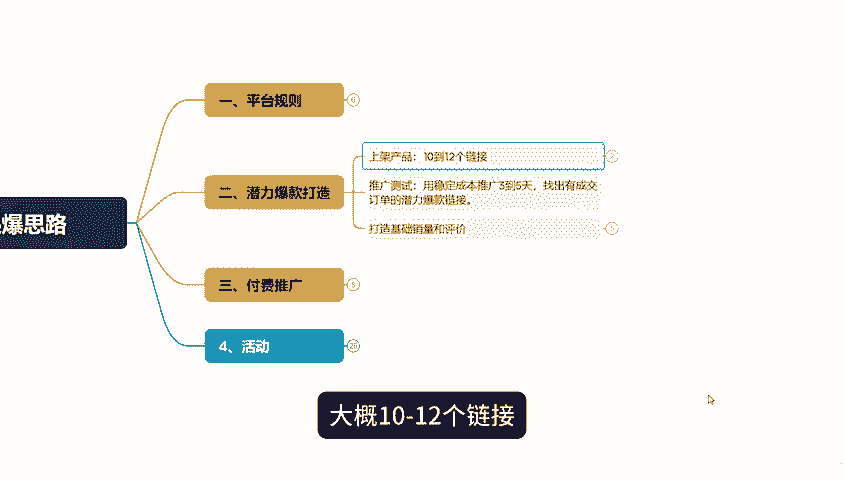
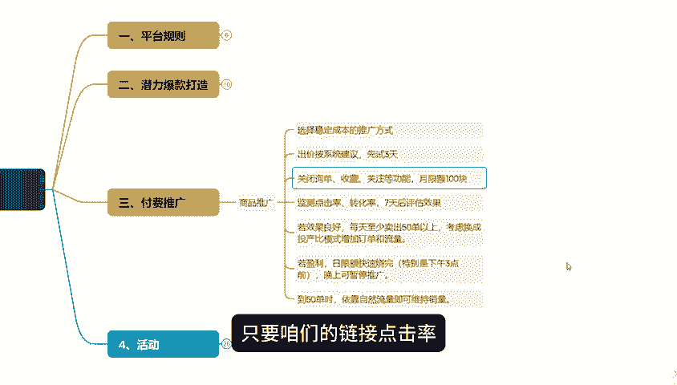
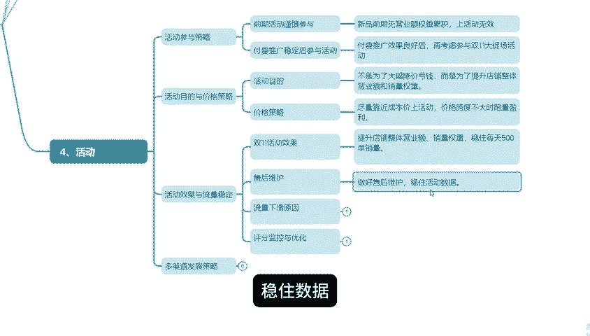

# 【拼多多运营】拼多多双十一临近，店铺还做不起来没有流量？掌握这套玩法快速起店，80%自然流！ - P1 - 拼多多运营实操流程 - BV139C2YvE6h

各位拼多多生朋友大家好，双十一大促不到一个月了，好多拼多多新手卖家开店之后一头雾水，不知道怎么开始。有的人试了很多方法，店铺还是没啥起色。其实啊真的是因为大家对拼多多运营方式不了解。

我呢就把拼多多双十一活动报名的思路整理一下。想要在这次双十一活动中脱颖而出的，可以试试这个方法，要是看完还有不太明白的，我这还有所有内部的拼多多运营实操资料。评论区就能领。

先说第一个保贝平台规则，客服这块很重要，直接影响转化率，不管是买东西前还是买完东西后的服务，都得在3分钟之内回复，这样转化率回头率才高，发货也得快，最好是在24小时之内发出去，发出去之后还得盯着物流。

不然很可能会认为是虚假发货。

店铺评分也很重要，包括服务体验分、DSR评分、退货率、物流异常率这些。要是店铺评分太低了，比同行还低，那店铺权重就可能降低，流量就少了，订单也就少了。

第二个，潜力爆款打造要打造两个有潜力的爆款，咱们得得先上架链接，大概10到12个链接。如果如果是非标准化的商品，比如衣服、箱包、蓝牙耳机等这些可以多上几个链接，但保持风格统一，价格都统一。

如果是标准化的商品。

比如食品、美妆、百货这些也可以多上几个链接。不过商品可以一样，按每个链接的标题主图SKU价格这些都得有所不同。上完链接之后，先别急着做其他的，直接把这些全部都放到商品推广里。

用稳定的成本跑个3到5天，看看哪个链接能跑出来成交订单。只有平台觉得咱们这链接不错，才会给曝光。有了曝光才会有订单和流量。

这样咱们前期做的基础销量和评价才不会白做，不会浪费时间和精力。找到潜力爆款链接后，咱们就做这个链接的基础销量评价。销量做到一万，不会改销量的，可以找我评价嘛资源做好100条好的评价。

然后优化主推款的基础DSR评分和店铺评分30天内达到50条有效评价有优质资源的直接找资源，没有的上多都进保障，成本几百到1000左右，店铺的DSR评分也就显示出来了。新店铺的第一层级不容易出单。

所以得拍个大单，把店铺层绩提到3到4级不就有了基础权重，但记住啊共有层级没DSR评分也是不行的，得把链接的流量天花板也提上来。

第31个付费推广，咱们得先打开商品推广，选个稳定成本的推广方式，出价就按照系统出价来，先开个三天试试。这时要咨询收藏，关注日前先关了月限额设个100块，只要咱们的链接点击率转化率没有问题，等个7天。

前面的步骤都做对了，每天至少能卖个53以上，这时候你就可以看看数据，考虑要不要换成投产比模式，多拉拉订单和流量，要是盈利了，日限额很快就会烧完，特别是下午3点之前烧完的那晚上就别开车了。到53的时候。

下午和晚上就靠免费流量就行。自然流量至少能出5。

第四1个活动，目的提醒刚开店的朋友们，前期别瞎上活动，新品前期没有营业额，权重积累，上活动也没用，等付费推广没问题，再去报双十一大促场的活动。

报活动的目的不是让咱们大幅降价亏钱，就是降价能多出单，但价格一降下来，转化就差了，流量也接不住，所以尽量靠近成本加上活动就好了。活动流量大，价格跨度不大的时候跑量才能盈利。

双十一活动得把店铺整体营业额销量权重都拉上，这样才能稳定每500单的销量还有维护也得做好稳住数据，很多人活动数据大起大落，要稳住流量才能赚钱。

流量下滑主要是店铺评分DSR源评分或者是消费者服务体验分落后了。这时候流量和订单就会下滑，所以起每看商品的DSR评分或者是消费者服务体验让他们下下了就赶紧优化只要这里能稳住流量和订单就能一直稳多弄点链接。

多点发展，靠一个爆款链接多给自己留下后路一个链接没了，从中再来，又浪费时间，还给同行超越你的机会，店铺起来了就得赶紧开下一个同时运营多家店铺不断。

信这样才能健康稳定，不会中断的循环下去。一个链接死了，还下一一个店铺挂了，还有下一个这在拼多这个平台，咱们就能一直活下去。好了，今天的分享就到这里了。要是看完还不会操作的。

我可以给你一些免费的运营建议指导和店铺整断。我还整理了拼多玩法文档有新店快速起店上活动系列玩法高客单加高牟利产品打法。低客单家自然流起爆玩法以及店铺成熟后的十几种玩法等等放在下方评论区了可以自行领取。

最后别忘了一键三连支持一下。

