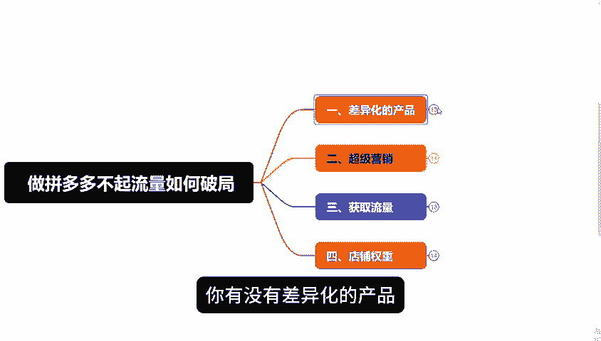
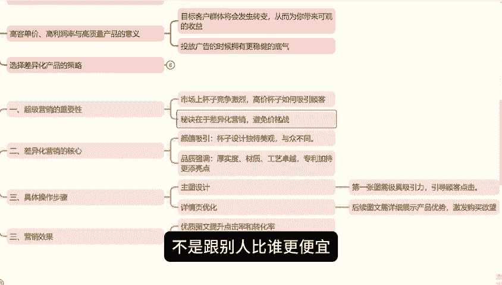
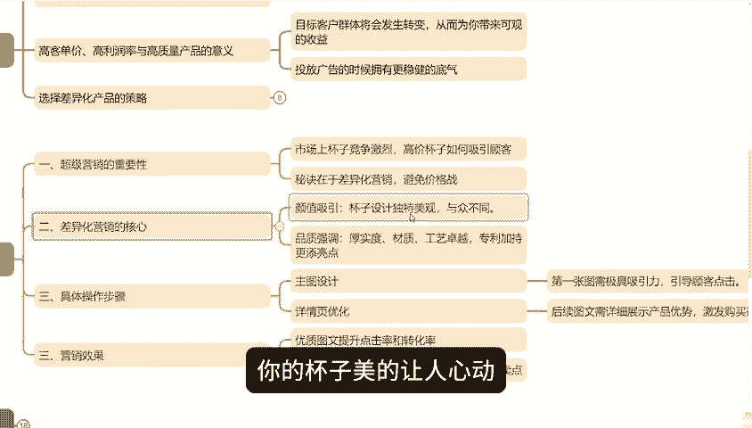
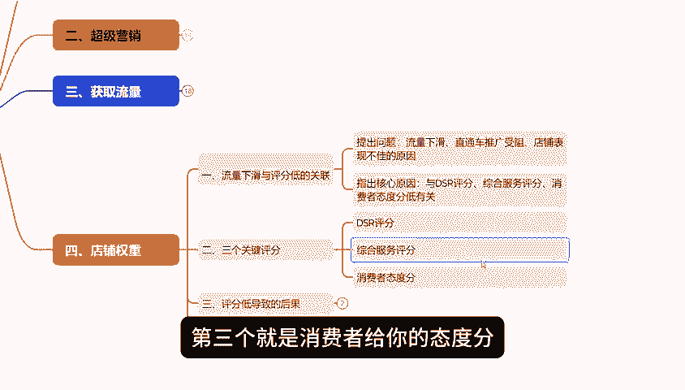

# 【拼多多运营】拼多多新手开店做不起流量如何破局，掌握这四点，流量订单源源不断！！ - P1 - 拼多多运营实操流程 - BV17UxjevEa3

各位拼多多商家朋友大家好。最近啊有一些粉丝朋友问我，他的店铺就是做不起流量，没有转换，问我应该怎么办？这些视频我就给大家好好讲一讲，如何提升流量促进转化，主要有4个点，这四个点，每一点都是关联性的。

只要你去做了，做拼多多其实就没有你想象的那么复杂。同时我也为大家准备了与视频配套的文档学习资料放在了下方的评论区，大家可以结合视频和文档一起学习，效果肯定更加好。我们现在看第一点，你有没有差异化的产品。

在拼多多平台上的盈利关键不是单纯依赖低价或者是频繁参与活动。这种思路直接可以抛弃了。原因在于，尽管某些产品能销量百万，但是缺乏高客单价就很难实现盈利。但整个行业陷入价格战的时候。

你单单以低价去吸引客户这种玩法其实对任何一方都是不利的自我伤害也是对市场平台及消费者的一种不负责任，构成了一种恶性循环。

解决这个问题的关键在于，聚焦于高客单价、高利润的商品。只要成功实现。这三点，高客单价、高利润以及高质量的产品，你的目标客户群体将会发生转化，从而给你带来可观的收益。同时这也为你在投放广告的时候。

拥有更稳健的底气。那么具体该选择哪些产品呢？思考一下你周围是否具有高价值的本地普特产商品，或者是那些个性化定制，小工厂或者是手工作坊精心打造的产品，这些往往是大型商家所忽视或者是难以接触的领域。

这正是你的机会。一旦你拥有了这些独特资源，再通过精细化差异化策略加以包装和推广，那么你就迈出了成功的第一步。第二点，超级营销想象一下市场上杯子满天飞，你也买杯子，但价格比别人高。

怎么让顾客心甘情愿为你的产品买单了秘诀就在营销，不是跟别人比谁更便宜9。91个那种套路咱们不玩，你得玩点不一样的。比如说颜值，你的杯子的美的让人心动跟市面上那些大。

重点完全不是一个水平，而且你还要强调它的厚实度、材质工艺，甚至是如果有专利，那就更牛了，这就是差异化营销，你得和别人不一样，才能让你的产品脱颖而出卖出高价。具体操作嘛就得在主图和详情页上下功夫了。

在拼多多淘宝这些平台，说白了就是卖图片，图文得做到吸引人一点。第一张图得让人一眼就想点进来，后面的主图和详情页也要让人看了之后就觉得非常心痛，想买这两点做到了点击率和转化率自然就不用愁了。

因为大部分的时候，顾客买不买，就看这两下子了。所以你把差异化搞好了，你的产品自然就与众不同了。你去看那些平台上，好多和别人不一样的产品价格也不低，但照要卖的好，这就是因为人家脱离到价格站。

找到自己的独特优势，你也这么干，点击转化都不是问题。

第三点就是搞流量，让更多人看到你的商品方法其实挺直接的，用推广就行。这里有个小窍门，就是设置日限额和调整头像。为啥要设置日限额呢？经过螺旋增长没有，就像是爬楼梯。

一天比一天高，你的销售额也得这么晚，每天比前一天多那么一丢丢，在开始推广的时候，你的转化率和点击率可能还不稳定。这个时候就紧盯着他们让他们一天天往上找，等涨到顶了，拼的就是销售额了，就像参加马拉松。

你和同组的选手点击率转化率优为价值这些最后看的还是销售额这个总成绩，所以啊你的产品的给力主图和详情页的吸引人，这是基础。然后定价活动套餐这些也得搭配好，让顾客觉得划算，这些都做好了流量自然就来了。

设置线额的时候就像爬阶梯一样，第一天100第二天200第三天300这样慢慢往上加销售额上去了，流量也就跟着涨。等后期投产比能调了再慢慢优化，赚钱变得更加容易。记住啊调投产比也是讲究的。

前一周先比急时动弹，让数据自己慢慢跑一周之后每天试着调高那么一点点比0。10。3效果怎么样。如果说数据开始下滑，那就别调等过几天。

总之啊，这套玩法玩赚了，你流量就赚了，赚钱也就不是什么难事了。在多多上说到底还是得靠量，你得先卖个几百单上千单出来，然后再谈赚钱的事儿。如果这些利润再高，售价再高，那么这些东西就都搞定了。

第四步啊真的是超级重要的一步，但大家老是容易忽略的一点。

我得强调一下，你们得多看几遍，为啥流量会突然下滑，为啥直通就就开不动呢？

为啥有的店铺整体表现变暗了，记住这往往跟三个评分低有关。第一个DSR评分低的可不行。第二个综合服务评分也得保持高水平。第三个就是消费者给你的态度分，就直接影响你的口碑这三个评分要是都低了。

那么你的流量就会像漏水的水桶哗哗往下掉广告费蹭蹭的往上涨，来个流量质量也差，所以啊维护这些数据可是关键的，你得搞清楚这三个评分到底是干啥的，然后使浑身解数去提升他们，有时候为了评分不降。

自己吃点小亏也是值得的。你知道吗？那些电商大佬最后拼的都实行评分。么今天的分享就在这里结束了，最后啊我还整理了非常多的拼多多干货，其中就有包括了新手的一些运营思路。

开车玩法活动洗牌玩法免费流量玩法都打包成了一份文档需要的呢可以在下方评论区自行领取，同啊也不要忘记一键三连支持一下。

