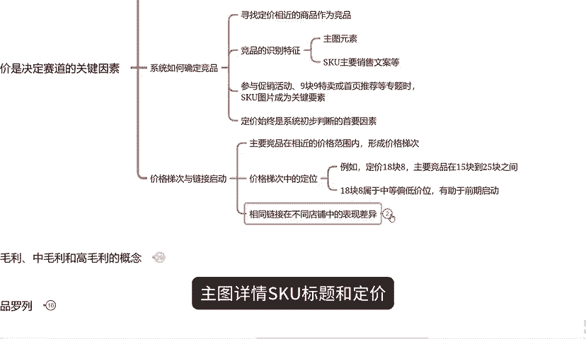
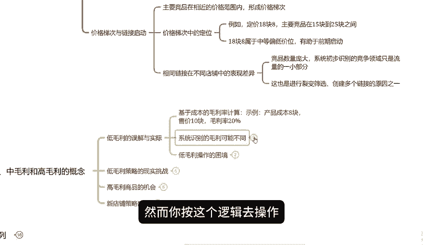

# 【拼多多运营】拼多多新手开店怎么设定合理的价格，掌握这核心三点，轻松找准自己定价！ - P1 - 拼多多运营实操流程 - BV1JZ23YdEqc

各位拼多多商的朋友大家好。今天这期视频咱们讲一下如何正确进行定价。尽管这是一个基础话题，但定价确实是在建立链接的首要且关键步骤。要是随便定价，即使直通车开的再好，链接也难以成功。因为首要定位必须精准。

我从三个方面详细分析一下定价。

虽然需要一些时间，但听完之后你就会清晰的了解如何定价。首先，定价是决定赛道的关键因素。当链接被系统抓取后，会根据定价匹配的相关竞品，竞争自定的竞争赛道。在这个赛道中。

你与同行的直通车出价产品定价等表现的越好，赛道就越宽广，单量越大，投入场出比也就越高。纺织。

则可能表现的越来越差，甚至失去流量。系统如何确定你的竞品呢？主要是基于定价寻找定价相近的商品。这些竞品通过主图元素SKU主要销售文案等特征来识别。如果你参与到促销活动9。

9特卖或者首页推荐的图片也会成为识别的一个关键要素，但无论如何定价始终是系统初步判断的首要因素，并不是说你定价18。8就一定不与48。8的商品竞争。你的主要竞品一定在相近的价格范围内。

比如15块到25块之间，这个范围被成为价格梯次在这个价格梯次中18。8属于中等偏低价位系统未进入深度匹配助于你前期更容易启动，有人可能会发现完全相同的链接主图详情S标题和定价在不同的店铺表现中大不一样。

有的店能成功启动，有的却不行，这是因为竞品数量庞大，每个链即便完全相同。系统初步识别的竞争赛道也只是流量的一小。

这也就是为什么我们进行裂变筛选，创建多个链接的原因之一。第二点要讨论的是关于毛利中毛利和高毛利的概念。有人可能会这样认为，如果产品成本是8块钱，售价10块，那么毛利就是2块钱，毛利20%。

这似乎属于低毛利。然你按这个逻辑去操作，可能发现连付费推广都难以维持。更不用说自然流量了。这就因为你所谓的毛利率是基于你的成本推算出来的，而系统识别的毛利则可能完全不同。例如你的产品成本8块，加上3。

5的快递费，而同行可能因为货贷便宜，成本只有5块，加上15的快递费，他们的总成本就比你低，你算出来毛利率是20%而他们可能是50%。在这样的情况下，你所谓的低毛利对于他们来说可能是高毛利。

如果你想通过低毛利来获取自然流量。那么你的定价可能需要低到一个令人难以置信的程度，甚至可能是低到你的成本。

这显然是不现实的，因此，很多商家不得不去选择强化其他方面的竞争力。因为他们无法在低毛利或者是中毛利的环境中生存。然而尽管低毛利是9011月份的主旋律。

但是我们仍然可以发现很多高毛利商品，这些商品并不通过对比价格来吸引客户，他们是通过提高推广曝光占比来降低话费，他们的转化率并没有降低。而推广曝光率占比变高，导致整体花费变低。

因此在9011月份高毛利商品也是有机会的。但是起新链接做高毛利，确实比平时难。所以我建议大家特别是新店铺在前期可以先用中断的毛利率和同行竞品进行比较。确保自己的定价在合理范围内，然而，通过一些策略。

如果在28天以内累计销售额达到500单以上来增加链接的权重，这样后续在做推广就会容易很多。第三点，竞品罗列，竞品罗列意味着我们需要去筛选并列出同行的竞品，当然竞品数量庞大，无法全部罗列。

但也不能因为懒惰去忽视这一步骤，仅仅依靠榜单是不够的，榜单上的商品无论是销量利益还是最后一名与我们的实际情况可能并无直接关联，他们能达到的销量和价格，可能基于不同的运营策略和前期投。

这是我们无法准确了解的。因此我们不能仅仅因为在他们榜单上就认为他们的定价和策略更适合我们，我们应该关注与自己定位相似的竞品。比如我们的目标是每天200单。

那么我们就应该去找每天相量在一两百到两三百之间的一个链接。这才是我们的目标竞品，通过查看这些竞品的定价和策略，我们可以更好制定的自己的定价策略。此外。

我们还可以把目标竞品的链接拉到商品详情页下方查看一下四场品，也就是竞品的竞品。这样通过几个目标竞品，我们就可以罗列出多个与我们定位相似的竞品，形成一个竞品列表。

通过观察这些竞品的定价策略，我们可以了解到当前价格第一次里面有多少竞品选择了高毛利，有多少竞品选择了中毛利，还有多少精品选择了低毛利。这样我们在制定自己的定价策略时，才能更加准确。

避免因为定价失败而导致店铺无法做起来。

那么okK今天的分享就到这里结束了。最后啊我还整理了非常多的拼多多干货，其中就包括了新手的一些运营思路啊，开车玩法啊、活动洗牌玩法，还有免费流量玩法等等，都到保存了一份文档。

有需要的呢可以在下方评论区自询领取，同时也不要忘记一键三连支持一下。

