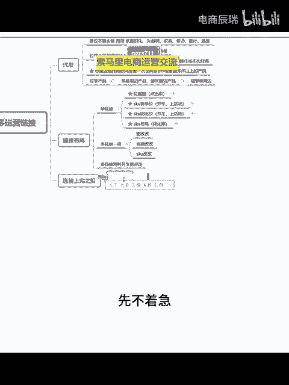
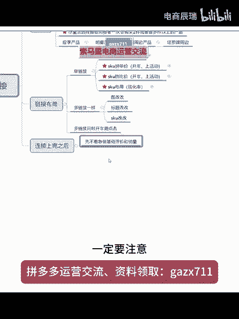
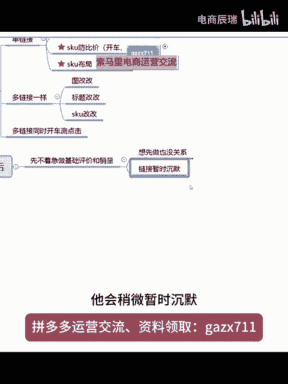
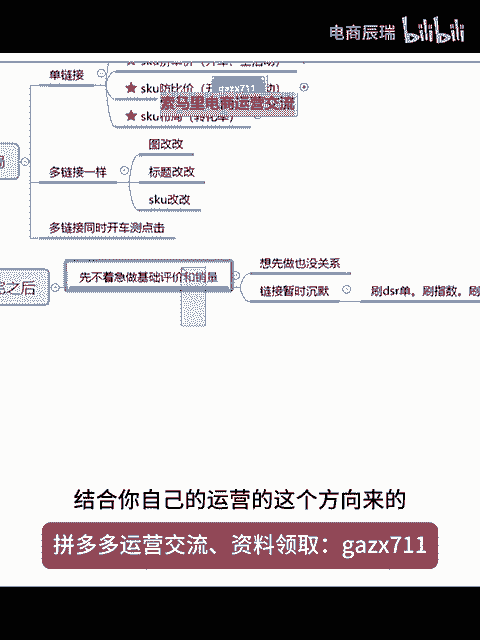
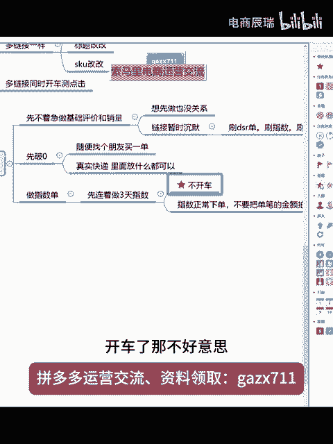
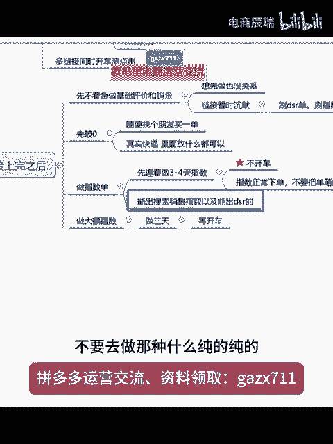
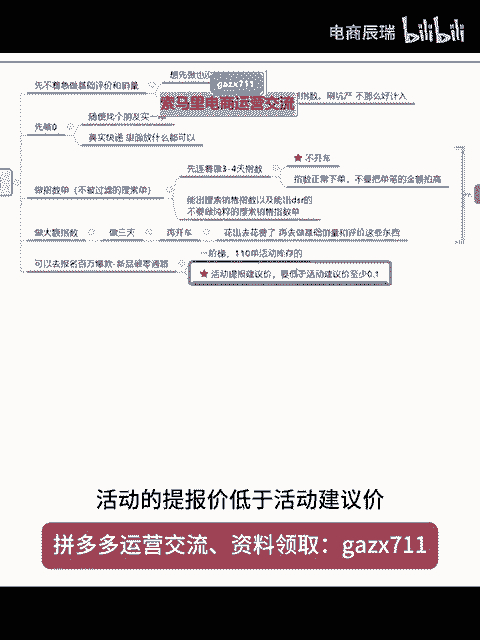
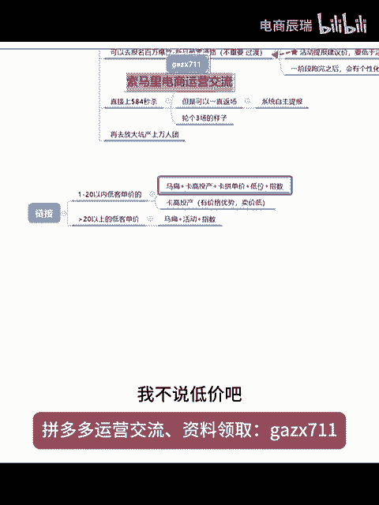

# 【拼多多运营】新手做店铺上完链接后30天的正确操作流程（保姆级教学） - P1 - 电商辰瑞 - BV16v2HYHEPL

上完之后。先干嘛呢？先不着急。

做基础评价。和销量啊一定要注意先注意这个东西。但是如果说你想先做也没关系，知道吗？

也没关系啊，那么我在这个电话，为什么说跟你们讲，先不着急做基础评价和这个销量，而且放到后面去做呢？因为这个东西它会让你的链接就是相当于干嘛呢？有暂时。

沉默你可以这么去理解，明白吗？就链接它会稍微站着沉默。什么叫沉默呢？就是说你去刷什么刷DSR单呢，包括刷指数啊，以及你去刷坑闪，他可能就是。

不那么好进入嗯。

明白吗？他没有那么好进入。😡，所以说先不要着急做技术评价和销量。你如果说你是那种产品，就是价格有绝对性优势的，然后你又玩了麻扁，你又卡了高头产啊，那你可以先做直接做了就去开车，那也没关系。😡。

这个东西是他是看你产品来的，结合你自己的运营的这个方向来的。好吧，那么一般干嘛呢？先先破单？

就是所就是所谓的先破林，又不先破弹这个东西就随便随便找个朋友。买一单就完事了。然后完事之后呢，你就发个那种什么发个真实的快递啊，里面放什么都可以。

放什么都可以，然后这个时候就干嘛呢？这个时候你们想啊。

就几种吧，就是如果说你们做指数流的。指数瘤。也不说做指数流打法的吧，就反正。可以先做指数，做指数。知道吗？做指数就是前面的记住这个时间段它很重要，就大概就是先先连着。

做3天。指数记住，这个期间不开车。

知道吗？

记住他是不开车的，而且这个指数。正常下单。知道吗？不要不要把单笔的金额。拍高就你客单价。

是多少？你就是多少。😡，就完事儿了。😡，知道吧？不要去拍到什么四五百五六百知道吗？很容易把你链接给砸掉，然后以经不要开车，就先做指数的前期，你们可以先理解吧，就是先做指数单。😡。

反正先不要去开车啊，记住。

先不要去开车，这个是很重要的重点。开车了，那不好意思，你后面你这个链接可能就炸不动了，就推不动。

知道吗？做指数单先不开车。知道吧？先做3天3到4天都可以。

3到4天都可以，知道吧？然后再去干嘛呢？哎，继续，然后这个时候再做做大额。

指数明白吗？做大额指数的话，能做3天。做三天。再开车。搞明白没有？就这个流程。

这个就是做指数，你们要去注意到的。对买手号有要求肯定有要求啊。啊，就进入这个指数单，你要做的是哪种的啊，就是那种人。

就是能出搜索销售指数。

然后以及能出跌啥的。能出DSR的啊，不要去做那种什么纯的纯的。

不要做纯粹的。

搜索销售。怎说的啊就就就去搜索单好吧，我不说这么复杂，就是不被过滤的。😡。

搜索的。

不配过滤的搜索的。一单怎么够啊？😡。

12单以内。能做到12单的就做到12单。知道吗？这个东西反正它是越多越好好，但是由于现在方案上面的局限呢，就很多链接你超过不了12单，超过12单呢，他可能说它的指数他就都不计入了。

知道吧？反正就这个重点就是说先不开车，你做指数的时候先不开车。

然后呢，前期先不着急干这个事情，你可以开车之后。嗯，花出去钱呢。花费了。再去做基础销量和评价这些东西知道吗？

然后在这个过程当中，你做指数的过程当中，你是积累了坑产的，对不对？

积累了哎。积累了坑产。好，那么这个坑产呢，你是不是可干嘛可以做什么呢？可以去报名什么呢？报名百万爆款。

懂吗？百万爆款那个什么新品破林。

通路啊，110就是一阶E阶梯。

呃，E阶梯那个110单。活动库存的。知道吗？去报啊，但是活动的。

提报的建议价要低于活动建议价。至少0。1知道吗？

记住啊，这个的话也比较重要啊，不然的话呢，你的百万爆款。不好锅。

嗯，知道吗？你大鹅不就是多见嘛，还能怎么讲呢？😡。

就多见啊，把金额拍高一点。一单一件拍高一点。

不就是大鹅吗？😡，对不对啊，你们不要去纠结这种什么大额指数单怎么去做，直接去找资源做就好了。😡。

知道吗？这种能花钱找人解决的地方，直接花钱找人去做。知不知道？因为这个东西它很重要的。

你们想就是起链接起的比较稳，这个东西很重要的，知道吗？

嗯。

是这句话，自己记住，活动的提报价低于活动建议价，反正至少一毛。

你跑百万破零通路。知道吗？百万破林通路这个一阶段他跑完。

呃，一阶段。一呃一阶段啊。跑完之后会有那个返场。觉是个性化。返首页4。0啊，以前拼多多是3。0。

他现在变成4。0的。没有直播回放，没点关注的，点个关注，没有直播回放的知道吧？我直播一般都不管回放的。

开车啊，你这不逻辑上面的这个东西在这里吗？再开车。😡。

做技术评价，你做了指数，你就有坑产，坑产是不是就可以让你去跑百万了嘛？对不对？我靠，饭是不是做出来，是不是要喂到你们嘴里去啊？铁子。😡。

那太远了。积累了坑产之后，你就再去上嘛，对不对？上百万嘛。

什么没看到。这看不清啊。

知道吗？再去上百万。百万上完之后就是干嘛呢？这个就是这个东西。

他不重要。他是过度用的。过度用的就是既然A你坑产已经做了，你能上个百万，你就去上。

知道吗？那百万上完之后，或者是说你不上百万，直接去上，直接上什么的？上584秒杀也可以。584的那个秒杀啊，584秒杀的话呢，现在流量不大。

流量不大，A，但是他可以一直返厂了。嗯，而且这个返厂呢是自主系统。

自主。提报。

懂吗？然后你584的话呢，你大概的话呢，轮个。能个什么三场。三场的样子。

然后你再去。再去放大坑产。上万人团知道吗？

基本上你们一个链接就这么去推就好了。但是你要结合什么呢？就是能麻扁的就麻扁。

记住这个东西啊，这个东西只是说你前期一个链接。😡。

就是一个步骤，就前前后后就也就大概是七八天的样子。你要去干嘛？

知道吧？就按照这个步骤来走就可以了。但是一定要记住。

嗯。你们听东西，听玩法，不要只听一半，知道吧？什么是DSR？DSR的话呢，它其实叫做什么呢？叫做商品的品质，你的服务体系，包括你的物流体系。这这三个东西呢统称为叫做DSR评分。知道吗？

这个就叫做动态评分，动态评分它就叫做DSR。但是拼多多这个平台呢。他不抓补单，他只会过滤。那么你像很多补的订单平台，它是给你过滤的。那么能够进入到DSR，能够计入到这个DSR的有效评价里面去的。

它就是没有被过滤的。所以说在拼多多里面更多的会说是做DSR单，知道吧？它其实就是没有被过滤的真实订单。

嗯。截个图你也看不起看不全了，我放小你看不全了。

地球上面等会发给你们吧。你们自己要下个思维导图啊。

嗯，你们反正记住记住几个点，就这一个是什么呢？它是适合绝大部分品，你在东西都做好了之后。

可以这个思路去来，知道吗？但是你不要去忘记侧重点了，这什么呢？第一课单价的。

还是我说的那句话。低客单价的。就是那种很低客单价的，你可以理解啊，就比如说。就是1到20以内。低客单价的就干嘛？

马扁。加什么呢？哎，麻扁加高头产。高头产。投产家。低价加。指数知道吗？就结合这4个。那如果说你客单价啊稍微高一点点，就是大于。20以上。以上的。一颗单价。就干嘛呢？就能麻扁的就是麻扁。😡，结合什么呢？

就如果说有价格优势啊，就记住这个卡高投产。就一定要结合。就是有价格优势，你就去考。😡，就是你有价格优势卖价。第，你就去卡勾的上。如果说你没有卖卖家优势，哪怕是你客单就很低，但是你没有半毛钱的价格优势。

你也不要去卡勾的上。😡。

知道吗？卡高投产它只针对于你有价格优势的。懂了吗？那肯定对买手号是有要求的嘛，你这不废话嘛，对不对？😡，嗯。😊，这个问题我已经上回直么不解答过你了吗？低客单价利润低利润的，你做不做房比价都无所谓啊。

知道吗？记住啊。麻扁加什么呢？加那个一般是加活动。加指数。啊，这个里面还有加个点。加卡。嗯，知道吧？就低客单价，然后又有价格优势的，就码扁加高投产，加卡拼单价，加低价加指数的玩法。我不说低价吧。

就是低利润吧。

低利润。懂了吗？低利润啊，如果说你没有价格优势，那这个东西你就玩不了。

懂了没有？没有价格优势，你就卡不了高度上啊。😡，卡过程怎么卡，就是你就是你在发布链接的时候呢，先先比如说发到其他类目里面去，比如说发布到那种钢丝绳类目里面去。就比如说你先呃发布一个钢丝绳类目的产品。

然后呢，图片也上钢丝绳。啊，然后的话呢标题你就写个钢丝绳，然后测试测试就可以了。然后SKU名称不写，把拼单价呢，哎你给他拉到三四千四五千都可以，然后提交发布你的链接，再把直通车给它开上啊。

目标投产比是高目标投产比是高之后呢，完是再再给他暂停暂停推广，暂停推广之后呢，再再来修改你自己的链接，明白吗？这就卡扣就行啊。记住，反正没有价格优势。一卡高的产就没有用。法而你直通车。它会跑不动，好吧。

然后大于20块钱以上低客单价的就是怎么讲呢？就是呃稍微有一点点价格优势的啊，就是这里面也分为有没有价格优势嘛，就反正你们记住一个点。有价格优势。你就卡拼单价啊，有价格优势，你就卡高度产这种客单价比较高。

你干嘛呢？马扁加活动加指数就可以了。然后呢也可以加高头。嗯，高多产高度产还是那个点，看你有没有这个价格优势嘛。

对不对？然后其他类目的话呢，其他的呃你像没有办法啊。

呃，玩马扁的。麻扁的就是那种稍微比较。高客单价的。高科的这一点。然后的话呢，又是那种比较大的标品，没有办法去玩这种。呃，麻扁的，并且客单价比较高的那基本上就你就干嘛呢？基本上就是正常投产，然后加什么呢？

加活动配车。配车，然后基本上加指数。就这一些。主流的，你们反正遇到什么产品，主流的玩法就是这几类嘛。就借住你。嗯，这个是适合绝大部分的。知道吧？你们说玩法，其实市面上你能够去理解认知到的就这些。

然后再结合这样的一个操作逻辑。

知道吗？然后像活动里面一般来说，你们去跑活动，常玩的也就是什么呢？也就是前期些这个呃这个大促大促的话呢，就是那个全品类。

搜索。专区这个的话呢，它是计入历史成交呃，最低价。

知道吧？记入历史成交最低价呃，但是你可以如果说你做好了防比价的话呢，你可以报那个他还有不是还有个那个大促7折吗？

7折啊，然后限量100件的那个活动，这个活动的价格。比其他大促价格低啊，那么你的链接。就是显示。7折。大促的价格，这个7折大促的话呢，它就不计入历史成交最低价。

嗯，成交。最低价。所以在你们去玩大促的时候，你7折大促的那个价格可以低于其他那个什么全品类搜索推荐专区的那个大促价格啊，这样的话呢你就不会有那个不会计入什么历史成现最低价了。明白吗？知道吧？

活动就那个百万报管。然后加那个584万的团去轮下来就好了。然后平时就链接上活动之后，你就稳稳平分。

稳评分。

嗯。找嘛问片分就行。

就稳住你的DSR评分，然后包括还有一些你的那个消费者服务体验分，还有领航面分活动就一个一个轮下来。基本上的话呢就是那个呃秒杀秒杀频道的话呢，就是从那个百万爆款。

百万爆款，然后呢到584的秒杀，然后再到万人团，然后这样去循环返场，知道吗？循环。返厂。

返厂啊，但这些东西很重要啊，好吧，基本上你们玩流程，这个流程框架清楚了吗？

