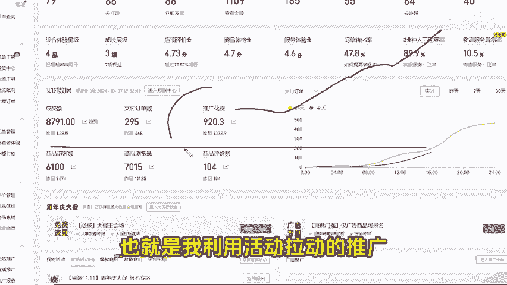

# 【拼多多运营】隐藏活动玩法，高投产利用隐藏活动拉动拼多多付费推广，拼多多防比价方法技巧，拼多多基础教学 - P1 - 老头电商-干货分享 - BV14F12Y8Emw

🎼上一期我们找到了拼多多的隐藏活动，对不对？通过隐藏活动呢，我也分享一个利用活动拉动推广的玩法。当前店铺也就是我利用活动拉动的推广。同时投枕能够稳定在7。5%以上，单量稳定的情况下。

我们还能同时有稳定的利润。废话不多说，我们直接看怎么去玩。首先要知道这个玩法也不是什么产品都可以去做的。前提是你的产品要有25%的利润才行。当然达到了也不要太开心哦，玩法是有一定难点的。

所以说找到合适自己的运营方法才是最好的。我也整理了其了最新的运营玩法以及运营的拆解步骤，需要的扣456。接着我们首先去准备一个新链接，或者说店铺里面比较干净的老链接也是可以的。同时商家链接的时候。

先去开个能够稳定在7。5的投产。如果说老链接能够稳定高头产也是可以的，就不用去卡了。接着我们再把链接的基础内功搭建一下。第一个就是销量和评价了。销量。

🎼这我们前期可以刷个1000以上就可以了，评价最好是有20到50个左右的真实评价，这些都是可以找亲戚朋友去拍单做的。然后我们再去主图和标题这一块，我们都是要去借鉴同行的，说白了也就是抄。

但是注意顺序是要做变更的。接着我们重要的就是SKU防比价这一块了。第一个预览图这边啊，我们可以设计为拼图的方式，拼图中必须要包括产品的主体，同时也不要为了做仿比价啊，做一些与产品无关的东西。

第二个就是SKU名称要把量词换成中文。也就是像数字十斤，那我们就可以换成大写的时，对不对？做好了这些，我们再去报名一个外场的活动，加上22660这个限时秒杀的隐藏活动。不知道怎么报名隐藏活动的。

可以看我上一期视频，有详细的讲解，报好了秒杀活动就能生效。如果说是因为价格被驳回了，那我们就要去重新领券，最后我们再去开车，只要开稳定投产直接。

🎼挂机3天时间就好了，能够稳定下来就没有什么问题。接着最后面就是我们有注意的事项了。这个玩法主要难点呢就是防比价，但是也不要为了仿比价。我们去做宫格图和SKU名称的时候，做些与产品无关的东西。

接着我们也要每天去看一下我们的秒杀活动价格是不是失效了。分别在上午的10点半和下午的4点半去看一下。还有就是每天可以上3条秒杀链接，不要多了，也不要少了。好了，学会了就赶紧去操作吧，学习更多运营知识。

可以关注哦。

