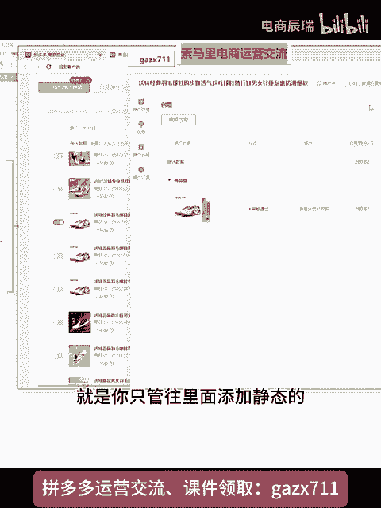
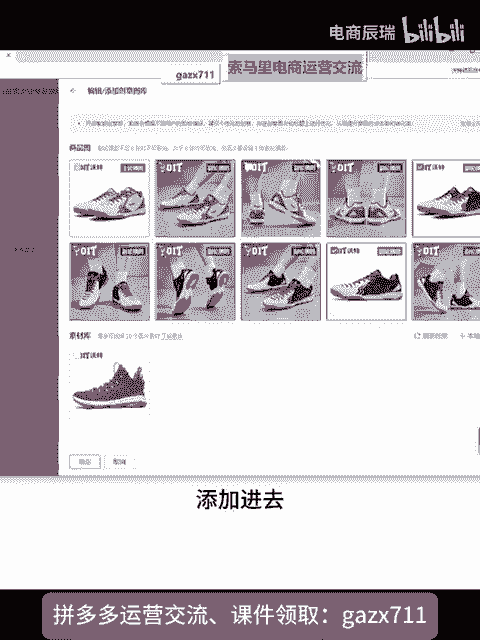

# 【拼多多运营】黑五产品要怎么做？适用所有黑五产品的错切类目玩法详细教学 - P1 - 电商辰瑞 - BV1h9mjYZE4W

从这个点吧，这个做黑5的说花钱。总花不出去，没消耗这个地方就所有的产品它都是一样的啊。首先我打一个比方。就是因为既然你做的是黑五类，对不对？那是不是说明一个点？毛利很高。这句话没有错吧。

很多做黑五类的产品，它的毛利率基本上100%、200%甚至300%的。他都有。然后呢，大家放的类幕。啊，也都是黑五类。正常类目里面的什么意思呢？就比如说你是卖的一些滋补养生的，那么你放的是保健品类目的。

滋补养生啊养生嘛啊你放的是是属于。啊，保健品类目那比如说像那些卖啥的，卖情趣用品的。放的就是什么？成人类目里面的。对不对？那这里面它就会有一个点，因为大家的毛利都很高。

然后大家也都是放到这些正常的类幕里面去的，所以就会出现一个情况。因为大家毛利高，所以所以大家投产。都干嘛？都开的很多。一个很简单一例比方，如果说大部分农行甚至是投产比1。61。71。81。9。

它就能够保本了。所以说大家的投产比都开的很低。假设如果说大部分的三级。嗯，第3集。此类目大部分商家他们的实际。投产基本都是在假设在1。6。到差不多2。5左右。我假设你开的一个目标。投产比。你开三。

这个时候你的计划它有竞争优势吗？你告诉我有没有竞争优势。那我问你，你目标投两比是3。你的计划他跑出去，他能给你烧动吗？铁子。😡，啊，你看着投产品1。8。好，你的。嗯，1。8很低了。对不对？

在这个地方为什么说还是很还是说烧不动？因为首先这是第一个。关键点。那既然你开1。8，那可能说你的毛利率，你的毛利基本上在300%。所以说你才敢开。一。半。是不是？😡，因为你知道你的毛利高。

所以在这个地方有就有一个点，就是平台。😡，他知道。你产品的。成本。成本高低，很多的商家他都在里面刷单，他都在错签类幕。所以说你一本正经的去做黑我，你的车带来的结果，他只会烧不动。所以说你真的想去解决。

关于黑5类去烧车的，你只能够你解决几个点，解决哪几个点呢？就是错切。拖欠类目。黑5类的错切类目它是很重要的。以及包括什么呢？包括做指数的。还有什么？还有包括去卡车图。

因为首先错切类目它会带来一系列的严连锁反应。就可能说啊啊你错切到那个类目里面去之后，你的车图。车图。过不了事。这个时候你要提升什么呢？车图它的一个过审的一个技巧，你们去解决这一个点就好了。就是错切类目。

比如说你像现在黑5类一般来说就是错切到什么类目里面去呢？这个快手用户你做的是。或者是什么黑5啊，投产开1。8的这个帖子啊，其他问题其他有问题你们自己提啊，然后等会儿再给你们讲啊，就是。大致的一些产品。

你们应该怎么去打OTC的吗？药品。啊，药品放的美妆。能开车，你的车。放的美妆。车的那个创意是能过的吗？你真实烧出来只有1。4。然后你告诉我，你现在一天能烧多少啊，可以过烧1000。

烧1000一天能烧1000，但是就是投产比太低了。对不对？投胎比实际上只有1。4左右，那就当中就是一个点，你去看你的每笔成交花费你是否稳定，你去看你的点击率，包括你的点击转化率。高不高？

然后你错切类目之后，你过车图的审核跟你产品的相关性高不高？你像你做药品，就是相当于错切类目，直接去开静态创意就可以了，不要去开那个智能创意，知道吗？因为智能创你是开的动态创意还是开的那个静态创意？

反正你们明白这几个点，就是黑5类，你要去解决关于他烧车的一问题，包括你实际投产比跟不上的一个问题。你实际投产比你烧出去只有1点，你开的是1。8，但是他开的1。你的实际投产只能开个1。4。

就说明当中有一个点的问题。什么问题呢？就是很多同行都放到那个类目里面去了。你那个美妆一看就是抄级通行放的吧。什么稳定成本和全利？我说的是你计划里面的那个你开的是智能创意还是静态创意，知道吗？

我说的是这个点的问题，创意。😡，就是你们的那个。计划里面他不是有那个那个什么。他不是有那个创创意的那个动态静态吗？

嗯。这个玩意儿。创意里面。

跑的是静态的还是跑的是动态的？

知道吗？你像你关于你做的是药品，然后你实际上你开的是1。8的特条比已经开的很低了。但是你跑出去只能够跑1。4，然后呢。

知道吧？就很多。跟你卖的同行，他已经错些到。这个类目了，所以说你。你的产品像平台信其实知道，你的产品收出去之后，他绝对没有什么竞争力。然后包括你的客单价的一个高低，就是你该整防比价的时候。

这个时候你可以整一整。因为你错期内目，你的投类比只能跑1。41。4就说明一为什么点呢？平台他知道你的产品实际成本是多少。而且你如果说你纯粹你只跑动态创意的话呢。

就说白了就是你的轮播图里面都有你产品的主体，就是这种啊产品，你的链接里的。轮波图全是你。产品的主体。这个时候平台系统他知道你卖的是啥。他也知道你的成本是多少。工行的成本是多少？所以说他给了你投产不高。

你要去错切美妆，然后你卖的是药品的话呢，你可以去尝试一个东西，就是只跑静态创意动态创意，让他去驳回就完事了。知道吗？然后在你的轮播图里面放你美妆本身这个类目的产品，我不知道你放的是美妆哪个类目的产品。

能听明白我讲的吗？你错放的这个类目里面，你就放那一个类目的产品，你烧车只烧静态创意，让动态创意去驳回。烧车。烧车啊。紫烧。静态创意。让什么让动态。创意去。我回。然后你链接里面的轮播图。不上你产品的。

主体。知道吧？呃，不是不是错切类目的话，差不多，错切类目其实就是放到一些呃跟你那些产品有一点点相关性啊，但是说可能说相关就是带有一点点相关性的。比如说像那种保鲜膜，对不对？

给它放到保鲜膜套照啊啊那些里面去，或者是说放到一些那种什么家居用品里面去，就是带那种比如说卖那种收纳盒，然后送保鲜膜的，给它切到这种类目里面去，什么是静态，什么是动态。我刚不是给你们看了吗？

就是在你们的计划里面。他不是会有一个这个智能创意吗？看到吗？😡，能看清吧。智能创意他就是属于。动态创意。那么这个动态创意它是根据什么？根据你的轮播图，以及根据你的SKU图来生成的，来进行投放的。

能明白吗？然后静态创意就是你只管往里面。

添加静泰的就在这个位置。添加静态创意，在你的那个静态创意图库里面。

添加进去就相当于这种就是放静态里面去。

然后动态让他驳回就行了。

动态让他驳回。啊，这这个的话先就先跟你们讲那么多吧，好吧，再给你们讲一讲就是逻辑上的点吧，能理解吗？玩黑五的。你要面临几个点的问题。一定要搞明白。就首先第一，你正常放在。你的内目里面去。

大家的毛利都很高。所以说大家开的投产比都很低。那么你去跑的话呢，你的实际投产比它肯定不高，并且你的直通车它都不一定能稍动。那么黑五你要去玩，你就冒着一种风险去玩，就是错切类目。知道吗？错切类目。

如果说你们那些管控比较严的，像什么药品类目的药品类目的话，你就得去卡图片，就是让系统驳回你的动态创意。动态创意里面不上你产品。只推静态创意。知道吗？然后就配合做指数单。就可以了，就这个逻辑去操作。

然后你直通车只要能烧动，你哪怕是1。5的投产品保本，让它能烧到二轮投产比，你一天烧个10020000，你就有利润。支补品的话，支补品你这个要看一些相关的。因为支补品的话呢，他有的要上传一些那个呃。

比如说要上传一些那个执照之类的，不是说执照，就是那些执行编号什么的。知道吧？你像滋补品的话呢，滋补品它能够错切的类目不多，你只能够去切到就是跟你这个产品临近相关的一些类目里面去。你像现在很多黑狐类的话。

基本上都是切到那个美妆里面去的。节油怎么玩？好，这个时候我再跟你们讲讲，就是成人用品的话，现在也很多都是签美妆类目，成人用品切美妆。知道吗？这个叫什么奥莱折扣店的，我靠，今天有多少做黑5的？

成人用品成人用品的话就反正去切美妆。千美妆。然后去切到一些那种男士用品里面去。就你们首先你们去错切类目，里们还想一个点，就是啊哪个类目里面，比如说你卖的是成人用品，成人用品的话，你可以往什么呢？

你可以往一些男士的男士的一些其他用品里面去切。比如说像一些什么呃男士的一些染染发膏啊，染发剂啊，呃发型定型喷雾啊，你可以切到这些类目里面去。什么指数单指数单，就是就是通过关键词做出来的那个有效成交。😡。

知道吗？嗯，童话盗图这个我不是给你们讲过吗？被同行盗图的话，你自己去申诉啊。我之前都给你们发过那个软件的。

哪个是指数单啊？呃指数单在你们店铺的那个流量数据里面。流量数据做黑五类的，它尤其这个指数单它很重要啊，流量数据里面。呃，流量数据当中呢，它有一个这个搜索流量，看到吗？搜索流量里面呢。

它会有一个整体的搜索销售指数。就这个东西。找吗。嗯，就做这个。呃，讲一下，就是为什么说今年。

基本上都是去做指数单，而没有说什么去用那种DSR单啊去炸流之类的。首先一个点就是在因为拼多多这个平台它是不抓补单，但是它会过滤。你像以前就是去年就今年以前就去年以前做黑5类的，他只要管一个点。

就是只要链接里面能出DSR。你开车它就会有，他就能烧得动。但是就是因为平台他为了打击黑五类，然后呢，DSR的权重它就变得不高了。DSR它就现在它就相当于基础评价一样的。

而且并且它是为了就是你们去报活动达到的一个门槛。但是它实际上它现在并没有什么太多的一个权重。所以说做指数单就什么呢？关键词下的那个有效成交知道吧？指数这个东西。嗯他他作为的一个作用呢。

他只是作为一个辅助作用。他不是说你指数单刷完，你的车一定能开动。你们首先要解决几个点的问题，评论积极率。这个的话你就只能够去搞那个好评返现了。知道吗？好评返现就是在店铺后台开通那个好评有礼就就可以了。

知道吗？🤧Yeah。开通好兵有礼就行了。跟你讲啊，就为什么说指数单，你们总是会走进一个误区啊，我不知道你们做拼多多多久了，可能说你们在各大的一些平台，快手也好，某音也好啊。

各种地方就是看人家一些那种做啊拼多多运营的那种视频啊，都教你们要去做指数单。就为什么说你们有的人他刷进去之后，就指数单，你们可能觉得他的目的就是为了让为了让你直通车骚动。对不对？

但是为什么说你们很多的那种链接。就是他刷指数单进去之后，他为什么直通车他一样的烧不动呢？你们首先要解决一个点的问题，首先要知道什么是指数单。指数单他是因为什么呢？他是从。嗯，关键词。下。搜索到的找到。

你的产品。嗯，并且。并且成交了的。成交了的没有被平台过滤的。平台过滤这时候你就可以，它就会记入指数，你也可以理解为它就是指数单。那么其实。关键词下去做成交。他其实你们可以理解为他就是为了去做关键词的。

关键词的。产出啊，你们都知道所有的电商平台它都是什么，它都是。赛马机制的什么叫做赛马机制呢？赛马机制就是说啊。再什么呢？一个关键词。关键词下。问某个时间段。时间段。谁的产出高？谁的排名？就会靠前啊，对。

和逃是差不多一个意思。就这句话能理解吗？就是在某个关键词下，某个时间段内谁的产出高，谁的排名打错了啊，这里。谁的排名他就会靠前。那我问你们一个问题，像这个高遥远，你如果说你做的是大类目，假设打个比方。

你玩的是你卖的是牙刷。😡，或者是卖的是棉签啊，卖的是食品，这种类目它是不是很大。这种类目它本身它更多的是什么？它更多的是。嗯或找人。或找人什么叫做货找人呢？就比如说你今天要买买棉签。

这个时候更多的是平台把这个流量推荐给你，而不是说你人为的去找到这个棉签，并且去下单。即便是找到了。😡。

那么你觉得在整个拼多多的排名下。

就比如就拿棉签为例啊。我就比如说收棉签。排名靠前的。人家的产出高不高，你们觉得。他们的真实销量，他们的真实评价高不高？那凭什么你一个新链接，你就做了点指数单，凭什么他就能够让你排名靠前呢？高遥远。

你回答我这个问题。就是在这种关键词下，尤其是这种比较大的关键词，人家自然留，我们不算直通车的，人家自然留的排名，人家的权重已经很高了。你作为一个新链接。是不是？你鸟你你是一把鸟枪。

你能够跟人家大炮去比吗？那你刷了一点指数单之后。😡，你觉得你的排名可能会上升吗？排没不上升，你的直通车他能花钱出去吗？亲爱的。能不能？很显然，他是不能的。指数单。

他确实它的作用是为了直通车能够更好去烧动。它的木作用，他就是为了去撬车，但是有一个前提条件。就是你这个类目的类目大不大，包括你做指数单的一个高与低多与少的一个问题。你如果说你们一天做的个一两单指数单。

你觉得你能撬动排名吗？你撬不动。😡，是不是？我就算你撬不动排名，如果说你们的图片做的傻不拉登，傻不拉登的，点击没什么点击，价格没有什么价格优势，直通车能给你烧出去吗？😡，你如果说你是个大类目。

你有很大的价格优势。然后呢，你的图片啊，你又做了一些麻扁，你加了一点麻扁词汇。😡，啊，什么什么买一送一等等这样子的马丙词汇，你的点击率。😡，不高。那你就指数单它能撬动吗？😡。

除非你的点击率和转化率它很高，指数单它就很好承接。所以记住你们不要去陷入这个指数单的一个。里面来了。知道吗？没有价格优势，包括大类目的。你们就去玩什么，前期你可以做指数单，但是你可以更多的去通过什么呢？

活动去配合这种车。

